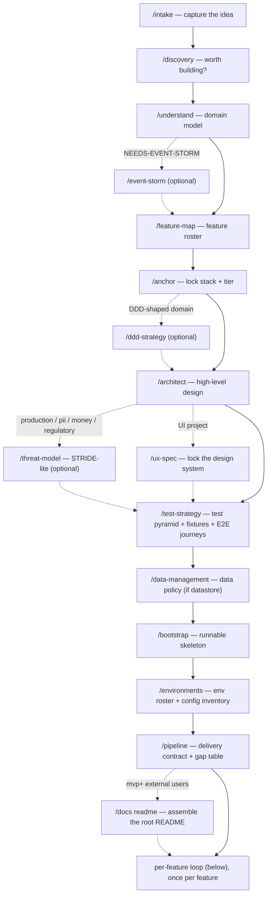
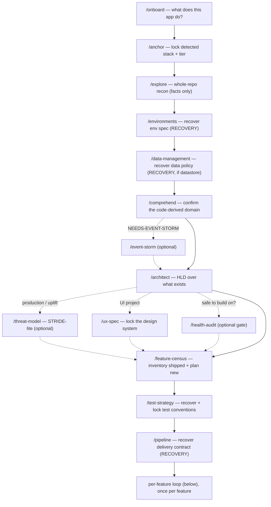
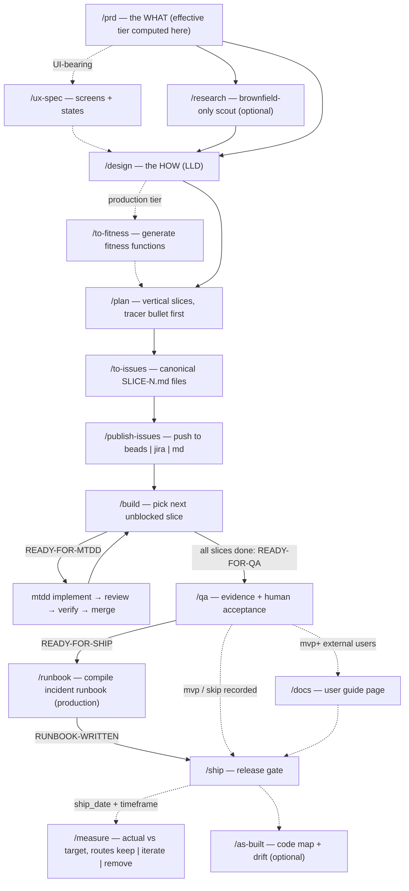

# The skills suite — an AI-assisted SDLC chain

A set of Claude Code skills that take a project from *"I have an idea"* (or *"I
inherited this repo"*) all the way to *shipped* — and, when a feature has run its
course, through */sunset*'s `deprecated → removed` tail — one gated stage at a time. Every
stage is a slash command (`/intake`, `/prd`, `/build`, …) that reads the artifacts
the previous stage wrote, interviews the human in plain English where judgment is
needed, writes its own structured artifact, and ends with a **verdict token** naming
the next skill — so the chain routes itself without ever running a skill for you.

> **Just want to drive it?** [`QUICKSTART.md`](QUICKSTART.md) is the short
> command-order guide; this file is the full reference.

> **Looking for the TDD execution loop?** The `mtdd-*` skills are a **separate,
> portable bundle** that drops into any git repo on its own (no chain required).
> They are documented in [`README-mtdd.md`](README-mtdd.md); this file only shows
> where they plug into the chain.

---

## Core concepts (shared by every skill)

| Concept | Meaning |
|---|---|
| **Two folders, two registers** | `.ai/` is the machine-facing source of truth (structured YAML/tables, no diagrams). `.human/` is the plain-English mirror a person reads (prose + validated Mermaid). Humans never parse `.ai/`; agents never scrape `.human/`. Mirrors are *derived* from `.ai/` — if they disagree, `.ai/` wins. |
| **Advisory gates** | Gated skills run the full analysis and issue an honest verdict (`PROCEED / KILL`, `READY-FOR-X / BLOCKED-ON-Y`). The user may override a negative verdict **on the record** (`verdict_overridden: true` + reason) — gates never block silently and never water down. |
| **The tier dial** | Every project is `prototype`, `mvp`, or `production`. `/intake` predicts it, `/anchor` locks it, `/promote` is the only skill that advances it. Every downstream skill scales its depth, questions, and line caps to the tier. Uplift signals (money, PII, SLA, regulatory, external users) bump it. |
| **Verdict tokens route the chain** | Each skill ends with exactly one token naming the next skill (`READY-FOR-DESIGN → /design`). The execute seam relay: `READY-FOR-ISSUES → READY-TO-PUBLISH → READY-FOR-BUILD → READY-FOR-MTDD → READY-FOR-QA → READY-FOR-SHIP`. |
| **Slug discipline** | `/intake` (or `/onboard`) mints one kebab-case slug for the idea; every later artifact reuses it. Feature slugs are minted by `/feature-map` / `/feature-census` and nest under `.ai/specs/<feature>/`. |
| **Plain-English interviews** | One question at a time, always with a proposed answer, no jargon unless the user used it first, adapted to the detected `technical_user` level. The jargon lives in the `.ai/` artifact, never in the question. |
| **Progress tracker** | `.ai/progress-tracker.md` is the append-only session log: every skill reads the top 5 entries at start and appends one on a success verdict. |
| **Validated diagrams** | Every `.human` diagram is generated through the `mermaid` skill so broken syntax never ships. |

The full contracts live in [`_shared/conventions.md`](_shared/conventions.md)
(folder model, gates, tier dial, tracker), [`_shared/ai-schema.md`](_shared/ai-schema.md)
(artifact schemas), and [`_shared/downstream-integration.md`](_shared/downstream-integration.md)
(the build log + integration contract for authoring new chain skills).

---

## Workflow 1 — Greenfield (a new idea)

You arrive with an idea and no code. The chain defines the idea, locks the
foundation, then enters the per-feature loop.



| Stage | Skill | What it does | Writes |
|---|---|---|---|
| 1 | **`intake`** | Plain-English front door for a **new** idea. One friendly conversation (quietly wearing PM/Architect/UX/Engineer hats), detects the user's technical level, predicts the tier, mints the slug. | `.human/intake/idea.md` + `.ai/intake.md` |
| 2 | **`discovery`** | Pressure-tests whether the idea is worth building: JTBD interview, a falsifiable kill criterion, a numeric success metric, scope (v0.1 / deferred-with-dates / never). Sub-agents research competitors/feasibility. Verdict: `PROCEED / INVESTIGATE / KILL`. | `.ai/discovery/<slug>.md` + human summary |
| 3 | **`understand`** | Models the **WHAT**, never the HOW: glossary, entities, domain invariants, key journeys, boundaries, open assumptions. Grills one term at a time until pinned down. | `.ai/understanding/<slug>.md` + **`.ai/context.md`** (the shared glossary every later skill reads) + human summary |
| 3b | **`event-storm`** *(optional)* | Tactical modeling session for event-heavy domains `/understand` couldn't capture in prose: past-tense events, commands, aggregates, policies, read models. Most projects skip it. | `.ai/architecture/domain-model.md` + human diagram |
| 4 | **`feature-map`** | Decomposes the validated idea into a prioritized roster of **atomic vertical features** (user-visible capabilities, never technical layers), each traced to a journey. Tier-capped; forces a real 1–N priority. | `.ai/features.md` + human dashboard |
| 5 | **`anchor`** | **Locks the foundation** — stack, `project_tier`, lifecycle stage, approved-dependency allowlist, incl. the repo-level `release_policy` (versioning, tag pattern, branching model, P0 hotfix path) — the highest-fan-out artifact in the chain. Accepts "I don't know" with tentative defaults; never re-asks what intake already answered. | `.ai/anchor.md` + human mirror; seeds tracker + `CLAUDE.md` |
| 5b | **`ddd-strategy`** *(optional)* | DDD strategic pre-phase for multi-context domains: subdomain classification (core/supporting/generic), bounded-context map, integration patterns (ACL, OHS, Conformist, …). Non-DDD projects skip it. | `.ai/architecture/strategic-design.md` + human context map |
| 6 | **`architect`** | One-time **high-level design**: architecture style, verb-noun components (Entity-Trap names rejected), dependency-edge table, ADRs, (production) characteristics + risk storming. Structure in `.ai/`; every C4 diagram rendered into `.human/` only. At mvp+, when any component exposes HTTP/RPC endpoints, also emits `.ai/architecture/api-governance.md` — the one-page cross-feature API conventions (error envelope, pagination, auth, naming, versioning) every per-feature design contract conforms to. | `.ai/architecture.md` or `.ai/architecture/` bundle + human C4 |
| 6b | **`threat-model`** *(production tier or pii/money/regulatory/external-dependants uplift)* | STRIDE-lite pass over the locked architecture: trust boundaries derived from the dependency-edge table, assets named, every credible threat scored 1–9 (same scale as risk storming) with a mitigation status. Unmitigated high scores become **routed candidates** — draft invariants for `/architect`, draft Unwanted-EARS clauses for `/prd` — which `/to-fitness` later mechanizes. Refreshed at `/promote` and after architecture changes. | `.ai/architecture/threat-model.md` + human boundary diagram |
| 6c | **`ux-spec`** *(project scope — UI projects only)* | Interviews the user and **locks the design system** — navigation model, layout grid, component inventory, design tokens (role names, not pixels), interaction-state conventions, copy/tone rules, accessibility baseline (WCAG AA explicit at production) — so an implementing agent never invents the UI. | `.ai/design-system.md` + human nav map |
| 7 | **`test-strategy`** | **Locks the project test contract** — test pyramid, fixture/factory conventions + the one canonical way a test obtains each entity, seed data, test-db approach, and the cross-feature E2E journey suite mapped from understanding's journeys. Run once; every red-first slice and `/qa` regression cites it. Prototype may skip on the record. | `.ai/test-strategy.md` + human mirror (mvp+) |
| 7b | **`data-management`** *(skip if no datastore)* | Locks the project **data policy**: migration tool/dir/naming, the every-migration-ships-a-down reversibility rule, schema-vs-data-migration split, ordering + review rules; production adds backup/restore, per-entity retention + PII lifecycle, and the expand-migrate-contract zero-downtime rule. Policy only — never writes or runs a migration. | `.ai/data-management.md` (+ human mirror at production) |
| 8 | **`bootstrap`** | Greenfield-only ordered checklist that turns the locked stack + architecture into a **runnable skeleton** (scaffold, Docker, CI, env, dev scripts) — every tool/version grounded live via Context7 so no phantom packages. Generator, not executor. | `.ai/bootstrap.md` |
| 9 | **`environments`** | Locks the **environment spec**: the env roster (deploy + smoke per env), the config/env-var inventory (names + where each is SET — **never values**), secrets policy, config conventions, flags, IaC. Optional at prototype; re-run whenever a slice adds config. | `.ai/environments.md` + human mirror (mvp+) |
| 9b | **`pipeline`** | Locks the **delivery contract**: the tier-gated quality-gate matrix (pre-merge / post-merge / release), deploy-vs-release stance per env, branch protection, rollback mechanism, supply-chain controls (secrets scanning → dep audit → SBOM/provenance by tier), dep-update automation, and the **gap table** vs the CI that actually exists. Contract only — gap closure routes as ordinary slices; re-run after `/promote` or `/to-fitness`. | `.ai/pipeline.md` + human mirror (mvp+) |
| 9c | **`docs`** *(`/docs readme` — mvp+ with external users)* | Assembles the root `README.md` from the skeleton's dev scripts plus environments and test-strategy facts — marker-owned sections only; hand-written content is never touched. | root `README.md` |
| 10 | → | **Per-feature loop** (below), once per feature off the roster. | |

---

## Workflow 2 — Brownfield (an existing codebase)

You arrive with a repo. The chain captures the product knowledge only the human
has, recovers the domain **from the code**, then funnels into the *same*
artifacts — so the per-feature loop downstream is identical. Three skills are
brownfield **twins** of greenfield stages; they write the same files.



| Stage | Skill | Twin of | What it does | Writes |
|---|---|---|---|---|
| 1 | **`onboard`** | `intake` | Plain-English front door for an **existing** codebase. Captures the one thing the code can't tell you — what the app is for and who uses it. Light manifest peek only (no crawling); routes to `/anchor`, skipping `/discovery` (the app *is* the validation). | `.human/intake/idea.md` + `.ai/intake.md` (`project_type: brownfield`) |
| 2 | **`anchor`** | — | Same skill as greenfield, brownfield mode: **scans the repo first**, proposes the detected stack as defaults, seeds `approved_dependencies` from the real direct deps. | `.ai/anchor.md` |
| 3 | **`explore`** | — | Whole-repo reconnaissance via an `Explore` sub-agent (parent stays lean, ≤5 file reads). Produces a **facts-only**, `file:line`-cited map: repo shape, components, domain language + code-enforced invariants, decisions already made, mystery zones. No recommendations, ever. | `.ai/recon.md` |
| 3b | **`environments`** | — | RECOVERY mode: scans `.env.example`, CI files, IaC, docker-compose, and config modules; proposes the **detected** env roster + config inventory with `file:line` citations (never invents), and the user confirms. Records secret names + stores only — never values. | `.ai/environments.md` + human mirror (mvp+) |
| 3c | **`data-management`** *(skip if no datastore)* | — | Same skill, **recovery mode**: detects the existing migration tool, directory, naming pattern, seed scripts, and backup wiring with `file:line` citations, confirms with the human, never invents. | `.ai/data-management.md` |
| 4 | **`comprehend`** | `understand` | Domain **recovery**: confirms and corrects recon's code-derived draft with the human instead of modeling from scratch. Signature move: triages each code-enforced rule into *real domain invariant* vs *implementation detail* vs *unenforced gap*. | same `.ai/understanding/<slug>.md` + `.ai/context.md` as `/understand` |
| 5 | **`architect`** | — | Same HLD skill, now over what exists (consumes recon sections A/B/D). | `.ai/architecture.md` or `.ai/architecture/` bundle |
| 5b | **`threat-model`** *(production tier or uplift)* | — | Same skill as greenfield: design-level STRIDE-lite over the recovered architecture; `/health-audit`'s security lens finds code-level flaws, this asks who attacks the design and routes the defenses upstream. | `.ai/architecture/threat-model.md` |
| 5c | **`health-audit`** *(optional gate)* | — | The brownfield rule: *before building, is anything critical broken?* Fans out read-only sub-agents across up to six lenses (bugs, security, architecture, tech debt incl. DDD smells, perf, UX), adversarially verifies every P0/P1, publishes findings to the tracker, and ends with a human-approved `SAFE-TO-PROCEED / FIX-CRITICAL-FIRST / ARCHITECTURE-BLOCKS-FEATURE` gate. | `.ai/health-report.md` + human gate summary |
| 6 | **`feature-census`** | `feature-map` | Inventories the features **already shipping** (`status: shipped`, traced to real components — never invented) and captures the new work the user wants (`status: planned`, prioritized). | same `.ai/features.md` as `/feature-map` |
| 6b | **`test-strategy`** | — | Same skill, brownfield mode: **recovers** the repo's existing test conventions (framework, fixture patterns, test-db setup, seeds) from recon + disk and confirms them with `file:line` citations instead of inventing; anonymization/synthesis data rule is mandatory under a PII uplift. | `.ai/test-strategy.md` + human mirror (mvp+) |
| 6c | **`pipeline`** | — | RECOVERY mode, after the suites are locked: scans CI workflow files, dep-update configs, release/deploy configs, and scanning/signing wiring; proposes the **detected** gate matrix + deploy wiring with `file:line` citations, confirms with the human, never invents. Missing mandatory-for-tier controls land in the gap table, routed as slices. | `.ai/pipeline.md` + human mirror (mvp+) |
| 7 | → | | **Per-feature loop** (below) — identical from here on. | |

---

## The per-feature loop (shared by both workflows)

Runs **once per feature** off the `.ai/features.md` roster. Spec → slices →
tickets → build → gate → ship. All per-feature artifacts nest under
`.ai/specs/<feature>/`.

At **prototype** tier the first three stages may take the express lane:
`/quick-spec` runs the prd → design → plan interviews as one conversation and
writes the same three artifacts — any uplift signal bounces it to the full chain.



| Skill | What it does | Verdict on success |
|---|---|---|
| **`prd`** | The per-feature **WHAT** — the contract `/design`, `/plan`, `/to-fitness`, and `/qa` all read. Computes the effective tier as `max(project_tier, feature_uplift)`. Prototype = one-pager; production = EARS clauses + strict SMART + invariant defenses. Implementation-agnostic. | `READY-FOR-DESIGN` |
| **`ux-spec`** *(feature scope — UI-bearing features only)* | The **UX/UI contract** between the WHAT and the HOW: screen list (purpose, key elements, data shown, all four interaction states, verbatim validation/error copy), user flows with unhappy paths, design-system component usage, a11y notes. Non-UI surfaces (backend, pipeline, CLI, infra) skip with `SKIPPED-NO-UI`. `/design`'s file layout must cover every screen it lists. | `READY-FOR-DESIGN` |
| **`research`** *(optional, brownfield only)* | Per-feature scout — an `Explore` sub-agent maps the code the feature touches: existing tooling, comparable patterns, conventions, prior art, library *options* (not decisions), and ≤5 open questions `/design` must close. Facts-only, `file:line`-cited. Greenfield short-circuits straight to `/design`. | `READY-FOR-DESIGN` |
| **`design`** | The per-feature **HOW** (LLD): modules, file layout, schema deltas, API contracts, call flow, test plan, per-feature ADRs. Inherits tier/stack/architecture — never re-decides them; refuses orphan features that map to no component. **Governs every new dependency** against `anchor.approved_dependencies` (slopsquatting fingerprint → refuse). Always writes a `.human` mirror with the sequence diagram. | `READY-FOR-PLAN` |
| **`to-fitness`** *(production tier only)* | Pure code generator: mechanizes architecture invariants + characteristics (project scope) and PRD NFRs + Unwanted-EARS defenses (feature scope) into one runnable, CI-executable assertion file per rule under `fitness/`, each citing its source `file:line` with red-first discipline (`FAILS WHEN:`). | `READY-FOR-PLAN` |
| **`plan`** | Decomposes the design into **vertical, dependency-ordered, independently-mergeable slices** — Slice 1 is always the tracer bullet (thinnest real end-to-end path). Each slice = one PR, with mechanical acceptance (tests + NFR target + named fitness fn at production) and a trace to the PRD. | `READY-FOR-ISSUES` |
| **`quick-spec`** *(prototype tier only)* | The **express lane**: one sitting runs the prototype columns of `/prd → /design → /plan` and writes the same three artifacts (plus design's `.human` mirror) — downstream readers can't tell the difference. The effective-tier gate is non-overridable in-skill: any uplift signal bounces to the full chain (`NEEDS-FULL-CHAIN → /prd`); a partial spec trio routes back to its source skill (`RESUME-FULL-CHAIN`). | `READY-FOR-ISSUES` |
| **`to-issues`** | The planning→execution seam, content half: converts each plan slice into one **canonical, tracker-agnostic** `issues/SLICE-N.md` work contract (AFK/HITL classification, tests-or-skip, category, traceability). Files only, no tracker writes. Flips the feature `planned → building`. | `READY-TO-PUBLISH` |
| **`publish-issues`** | The seam's side-effecting half: a **pure idempotent adapter** that pushes the SLICE files to **one** backend per run (`--backend=beads\|jira\|md`), writes the `backend_refs` back, and flips `open → published`. Beads = the machine build queue; Jira/md = the human projections. | `READY-FOR-BUILD` |
| **`build`** | The execute-phase **queue-brain + router**: reads the canonical slices + live backend state, done-detects across beads/jira/md, dependency-gates, and picks the next unblocked slice. Read-and-route only — never writes code, never mutates the frozen canonical files. | `READY-FOR-MTDD` (next slice) / `READY-FOR-QA` (feature done) |
| **`mtdd-*`** | The execution loop each slice runs through: `mtdd-implement → mtdd-review → mtdd-verify → mtdd-merge` (or `mtdd-cycle` to auto-chain the first three). **Documented separately in [`README-mtdd.md`](README-mtdd.md)** — it's a portable bundle that also runs without the chain. | — |
| **`qa`** | The **feature-boundary quality gate**: tier-aware evidence pass (slice closure, PRD coverage, full regression run, security + a11y at production, fitness functions, invariants, spec drift), delegating runs to built-ins (`/verify`, `/run`, `/security-review`) with manual fallback. A human runs the acceptance + exploratory script and signs; only then `building → qa-approved`. | `READY-FOR-SHIP` |
| **`runbook`** | Compiles the operational knowledge already in the specs — design failure modes + alert thresholds, environments' smoke commands, data-management's migration reversibility, open threats, accepted QA warnings — into `.ai/runbooks/<feature>.md` **plus the mandatory `.human/runbooks/<feature>.md` prose runbook a human follows mid-incident** (alert fired → check → mitigate → roll back → escalate). Compiles and confirms, never invents; gaps become loud Open questions. Expected at production (`/ship`'s checklist cites it); `/diagnose` reads it FIRST during an incident. | `RUNBOOK-WRITTEN` |
| **`docs`** *(mvp+ with external users; post-`/qa`, pre-`/ship`)* | **End-user documentation assembler**: writes `docs/<feature>.md` (user guide from PRD stories + ux screens + `.human` mirrors), `docs/api.md` (rendered from design's API-contract tables — a contract gap bounces to `/design`, never invented), and the root `README.md` (greenfield: right after `/bootstrap`). Refreshes only marker-owned sections; every page footer cites its sources. | `DOCS-WRITTEN` / `DOCS-UPDATED` |
| **`ship`** | Lean **continuous-delivery release gate** — the terminal step. Assembles release notes, walks the tier-aware checklist, honors `anchor.release_policy` (version bump + tag as human steps; hotfix backfill verification), hands the actual deploy to CI/CD or the human (**never deploys, pushes, or tags itself**), runs post-deploy smoke, and on an explicit human go flips `qa-approved → shipped`. Retirement later is `/sunset` (`shipped → deprecated → removed`). | `SHIPPED` |
| **`measure`** *(post-ship, after the metric timeframe)* | The chain's **feedback loop closer**: records the feature's ACTUAL metric value against the PRD's target — the human supplies the number from where they track it (never estimated; a miss is written as a miss) — and routes the consequence: keep, iterate (`/feature-map` / `/prd` update), or remove (`/sunset`). Writes the append-only `outcome.md` time series. | `METRIC-MET` / `METRIC-MISSED` / `METRIC-PARTIAL` |
| **`as-built`** *(optional, post-build)* | Read-only per-feature **code map at HEAD**: module/import map + main-flow trace from the real slice manifests, plus a **drift table** comparing the actual call chain against `design.md`'s planned sequence diagram. Origin-agnostic; commit-pinned. | `AS-BUILT-WRITTEN[-WITH-DRIFT]` |

---

## Cross-cutting skills (run any time, outside the chain)

### Lifecycle

| Skill | What it does |
|---|---|
| **`promote`** | The **only** skill that advances the project lifecycle (`prototype → mvp → production`). Advisory, human-approved, recorded gate: shows real evidence (feature statuses, qa-reports, open tentative fields), bumps `lifecycle_stage` + `project_tier` in lockstep, single-step forward only, then routes to the rigor skills the new stage requires. |
| **`runbook --slo`** *(production tier)* | Project scope of `/runbook`: interviews and locks `.ai/slo.md` — per-characteristic SLI/SLO/error budget/paging threshold (seeded from `/architect`'s characteristics + PRD NFR ceilings, never invented) plus the SEV1/2/3 severity ladder, mirrored to `.human/summaries/slo.md` with a validated severity-ladder diagram. `/promote`'s to-production gate cites it (locked or recorded skip). |
| **`measure`** *(bare, project mode)* | The **project-level reckoning** that settles the bet `/discovery` opened: collects project-metric actuals, evaluates every kill criterion honestly (advisory — kill / pivot via `/discovery` / override on the record), and maintains the `.ai/outcomes.md` roster + append-only decision log. The only skill that runs after `shipped`. |
| **`sunset`** | Extends the feature lifecycle past `shipped`: **`shipped → deprecated → removed`**, human-gated at both flips like `/ship`. Blocks on live dependants, plans the window/comms/flag-off/data handling (citing `/data-management` retention rules) into `.ai/specs/<feature>/sunset.md`, then **routes** the removal as build work — it never deletes code, flags, or data itself. The destination of `/measure`'s `decision: remove`. |

### Defect & quality triad

| Skill | What it does |
|---|---|
| **`diagnose`** | Disciplined **root-cause analysis** for hard bugs, flaky tests, and perf regressions: reproduce → hypothesise → instrument → fix-with-regression-test. Near-zero preconditions (just a symptom + a repo). Fixes trivial local bugs inline; hands larger ones forward as a repro-bearing task. The defect entry point — reached standalone or routed from `/qa`, `/health-audit`, `/as-built`, or the build loop. |
| **`triage`** | The **non-chain inbox**: classifies issues that did *not* come through the chain (human-filed bugs/requests, `/health-audit` findings) into category, P0–P3 priority, and a routing state. Recommends; the maintainer decides. Detects and skips chain-origin tickets; routes bugs to `/diagnose` and ready work into the build path. |
| **`improve-codebase-architecture`** | Brownfield **friction analyzer + refactor designer**: finds shallow modules, tangled seams, and poor testability, ranks deepening opportunities, designs the chosen refactor, and hands it forward as a buildable slice/task. Proposal-only — never writes the refactored code. Closes `/diagnose`'s `NO-SEAM` and `/health-audit`'s `ARCHITECTURE-BLOCKS-FEATURE` loops. |

### Reporting & guidance (read-only)

The first three read the shared `dashboard/state.json` spine, generated by
[`_build_share/project-state.py`](_build_share/project-state.py).

| Skill | What it does |
|---|---|
| **`status`** | Project-state reporter. `/status` = roster across every feature; `/status FEATURE` = per-slice deep-dive; `--html` writes the self-contained `dashboard/index.html`; `--write` persists a per-feature report. Never mutates anything. |
| **`next`** | Boundary-aware *"what do I do next"*: walks foundation → per-feature → per-slice to find exactly where the project sits, asks 3–5 questions citing this project's real artifact names, then commits to **one** slash command (+ one alternative). `--resume` prepends a staleness-aware recap after a break. Never invokes the recommendation — you type it. |
| **`coherence-check`** | Read-only **contradiction audit** across `.ai/**`: cross-references artifacts pair-by-pair (discovery↔understanding, anchor↔architecture, prd↔design, …) and flags stale name references. Every finding needs two `path:line` citations; output is stdout only. |
| **`critic`** | Clean-context **single-artifact review gate**: a fresh-context subagent grades one `.ai` artifact against its contract (schema + effective tier + direct upstreams) — bloat and gaps weigh the same; only `blocker` findings flip the verdict. `CRITIC-PASS` / `CRITIC-REVISE → /source-skill` (the source skill's update mode fixes; critic never edits). `--verify` fact-checks externally-falsifiable claims (Context7 for libraries, web for market/security). Two rounds max, then the human decides. Depth twin of `coherence-check`'s breadth. |

### Utilities

| Skill | What it does |
|---|---|
| **`mermaid`** | Generates and **validates** Mermaid diagrams (`scripts/validate_mermaid.py`) so broken syntax never ships. Every `.human` diagram in the suite goes through it. |
| **`write-a-skill`** | Authors, reviews, and refactors skills themselves — frontmatter rules, progressive disclosure, trigger tests, and the `validate_frontmatter.py` mechanical gate. The house style every skill here follows. |
| **`docs`** | Faithful end-user docs assembler — `README.md` + `docs/` pages from existing spec artifacts, never inventing claims. `/docs readme` after `/bootstrap`; `/docs <feature>` between `/qa` and `/ship`; `/docs api` whenever design contracts exist. Generation markers keep hand-written content safe on refresh. |
| **`handoff-session`** | Compacts the current conversation into a handoff document a fresh agent can resume from. |

---

## The MTDD bundle (portable — see its own readme)

`mtdd-init` · `mtdd-implement` · `mtdd-review` · `mtdd-verify` · `mtdd-merge` ·
`mtdd-cycle` — the human-in-the-loop TDD execution loop (red → green → refactor,
structured commits, a hard git-log TDD-order gate, fresh sub-agent per phase in
cycle mode). It is deliberately decoupled: **free-form task files are the portable
core**, and beads / canonical chain tickets are opt-in adapters — so the same six
skills serve as this chain's execute phase *and* as a standalone drop-in for any
other repo. Full docs, quickstart, and the gate-hook design:
**[`README-mtdd.md`](README-mtdd.md)**.

---

## Session-start orientation (optional hook)

Sessions otherwise start blind until you type `/status` or `/next`. The suite
ships a read-only SessionStart hook — `_build_share/hooks/inject-state.sh` —
that prints a short orientation block (≤12 lines) straight into the session
context: active branch, any in-flight MTDD cycle, the branch's spec folder,
in-flight/planned features, the newest progress-tracker breadcrumb with its
`Next:` line, and the locked tier. It is fail-open: missing artifacts print
nothing, it never writes, and it always exits 0 (a non-zero SessionStart hook
would block the session). `/status` remains the deep on-demand view and
`/next` the recommender — this hook only covers "where was I?" for free.

## Path guard (optional hook)

A sibling PreToolUse hook — `_build_share/hooks/guard-paths.sh` — turns three
prose invariants into mechanical permission decisions on `Edit`/`Write`:
secrets and lockfiles (`.env*` except the `.env.example`-style templates,
`*.pem`/`*.key`/`secrets/`, and `package-lock.json`/`pnpm-lock.yaml`/
`yarn.lock`/`Cargo.lock`/`poetry.lock`/`uv.lock`) are **denied** with the
correct alternative named; edits to the discipline gates/hooks under
`_build_share/`, the seeded verifier subagent (`.claude/agents/verifier.md`),
and frozen canonical `SLICE-N.md` files (frontmatter
`status: published` or `removed`) **escalate to you** for approval, because
legitimate-but-rare writers exist (`/publish-issues` write-back, `/to-issues`
re-slice, maintaining the skill set itself). It is advisory — it matches
`Edit|Write`, not `Bash`; hard boundaries belong in permission settings. Like
the orientation hook it is fail-open: malformed input or unreadable files
allow silently.

Enable either or both per project by adding to the project's
`.claude/settings.json` (Claude Code asks you to approve the hooks on first
use):

```json
{
  "hooks": {
    "SessionStart": [
      { "matcher": "startup", "hooks": [{ "type": "command", "command": "sh .claude/skills/_build_share/hooks/inject-state.sh" }] },
      { "matcher": "resume",  "hooks": [{ "type": "command", "command": "sh .claude/skills/_build_share/hooks/inject-state.sh" }] },
      { "matcher": "clear",   "hooks": [{ "type": "command", "command": "sh .claude/skills/_build_share/hooks/inject-state.sh" }] }
    ],
    "PreToolUse": [
      { "matcher": "Edit|Write", "hooks": [{ "type": "command", "command": "sh .claude/skills/_build_share/hooks/guard-paths.sh" }] }
    ]
  }
}
```

---

## Independent verifier (subagent)

Grading used to run in the same context that wrote the code — verdicts could be
steered by the conversation, and the no-edit rule was prose. The suite now ships
a **read-only verifier subagent** (`_build_share/agents/verifier.md`, seeded to
`.claude/agents/verifier.md` by `/mtdd-init --write`): a fresh-context grader
whose `tools:` allowlist (Read, Grep, Glob, Bash) is enforced by the harness, so
it mechanically cannot edit code, weaken a test, or fix-and-pass. `mtdd-review`,
`mtdd-verify`, and `/qa`'s mechanical evidence checks delegate their grading to
it; it returns per-criterion evidence and the launching skill maps that onto its
existing verdicts — the human gates and routing are unchanged. Unseeded, the
skills fall back to in-context grading and say so. (Bash could still mutate;
that residual rule stays prose — the honest boundary, as with the path guard.)

---

## Layout

```
.claude/skills/
├── README.md                 ← this file (suite overview)
├── QUICKSTART.md             ← the short command-order guide
├── README-mtdd.md            ← the portable MTDD bundle (copy this with mtdd-*)
├── _shared/                  ← chain contracts: conventions.md · ai-schema.md · downstream-integration.md
├── _build_share/             ← MTDD rule packs, POSIX gates + hooks + agents, task sources, project-state.py
├── <skill-name>/SKILL.md     ← one folder per skill (+ optional references/, scripts/)
└── …
```

Two shared folders, two audiences: **`_shared/`** holds the SDLC-chain contracts
(folder model, artifact schemas); **`_build_share/`** holds what the MTDD bundle
and the reporting skills need at runtime (style packs, shell gates, the state
generator) — it must travel beside the `mtdd-*` folders when you graft the bundle
into another repo.
