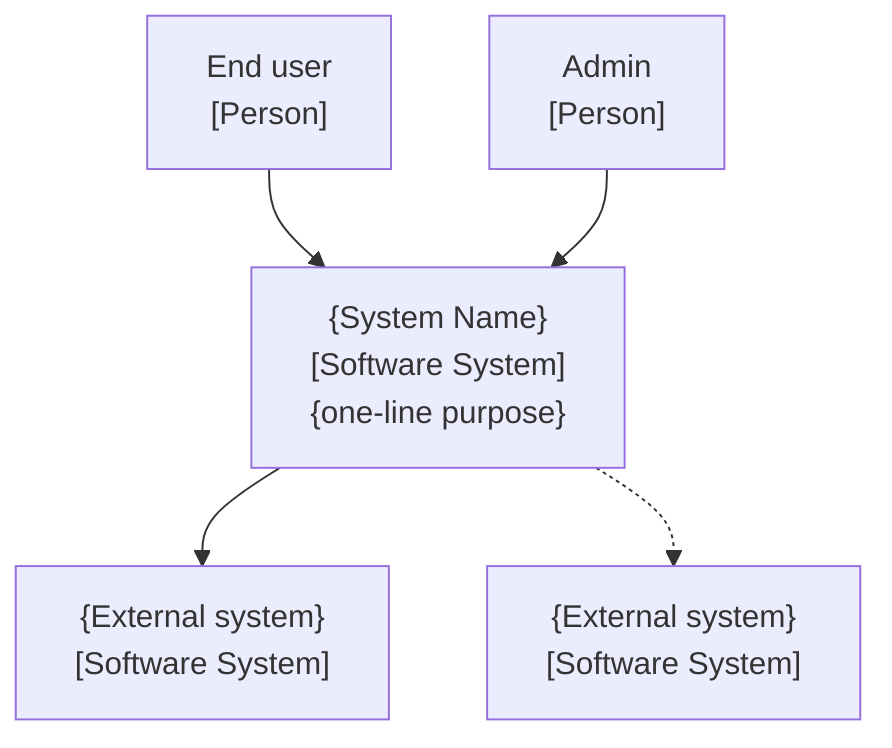
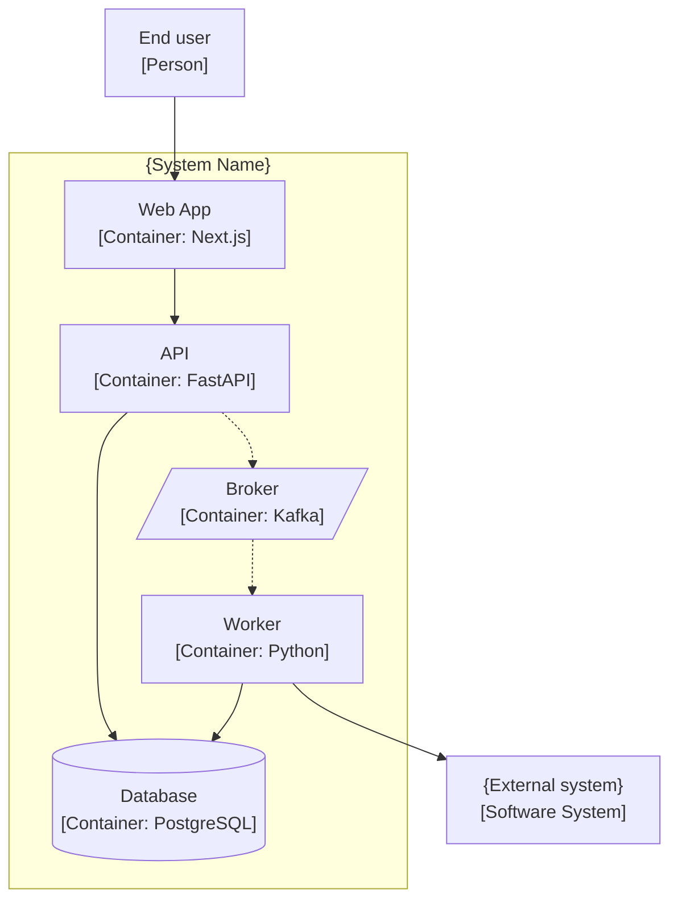
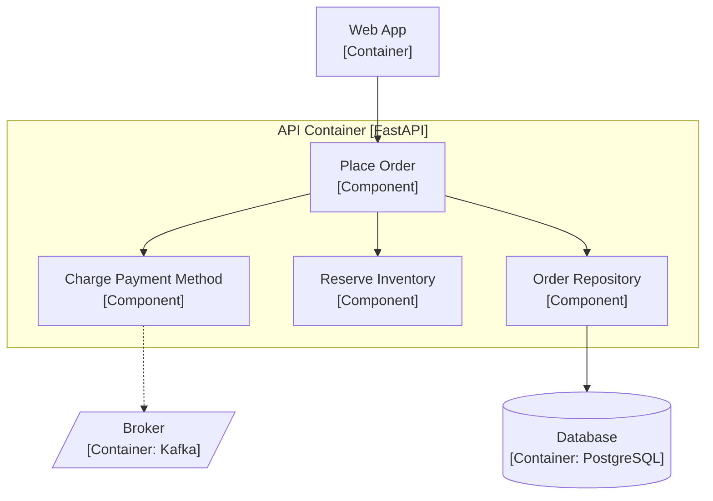

# C4 skeletons for the `.human` mirror

Source: *Fundamentals of Software Architecture 2e* ch23. **These diagrams live ONLY in `.human/summaries/architecture(.md|/)`** — never in `.ai/`. Generate every one via the [mermaid skill](../../mermaid/SKILL.md): hand it the intent + the `.ai` dependency-edge data; it returns a fenced ```mermaid block that has passed `validate_mermaid.py`. The `02-components.md` dependency table is the source; these are its rendering.

## Conventions (every C4 level)

- **Solid line = synchronous** call · **dotted line = asynchronous** (event, message, fire-and-forget).
- **Anchor every sub-view in its parent** (representational consistency): a Container diagram corresponds to the single system box in the Context diagram; a Component diagram corresponds to one container box.
- Label arrows with the interaction (`"places order"`, `"emits OrderPlaced"`, `"REST/HTTPS"`).
- Verb-noun component labels — same [naming rules](naming.md) as the `.ai` table.
- Avoid the pitfalls: decorative layers, color-only encoding (color is a hint, not a key), ambiguous shapes without a key, skipping the anchor view.

## Tier → which levels

| Tier | Diagrams (in `.human`) |
| :-- | :-- |
| prototype | one Container-level diagram |
| mvp | Context + Container |
| production | Context + Container + Component per significant container (≥3 components) |

## Level 1 — System Context



## Level 2 — Container



Cylinders = databases; angled shapes = brokers/queues. The outer `subgraph sys` must match the system box in the Context diagram.

## Level 3 — Component (production, per significant container)



## Walkthrough prose (accompanies the diagrams)

Each `.human` diagram gets a short plain-English caption: what each box is responsible for, what the solid vs dotted lines mean for the reader, and an anchor sentence back to the parent view. Lead the file with the verdict in one plain sentence (per `conventions.md` § Human summaries), then the diagram(s), then 3–6 jargon-free bullets, then a link to the `.ai/architecture` structure.

## File placement

- prototype / mvp → all diagrams in the single `.human/summaries/architecture.md`.
- production → `.human/summaries/architecture/context.md`, `/container.md`, `/component.md` (one component page per significant container).
