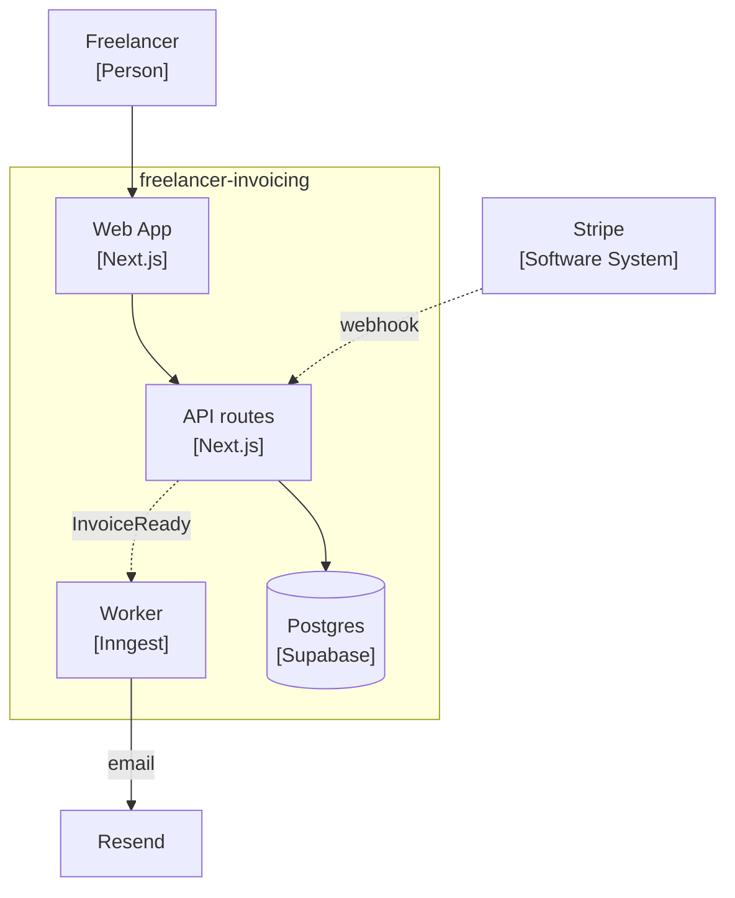

# /architect examples — good vs bad + worked artifacts

## Shape examples

**Component name** — Bad: `UserService`, `OrderManager`, `PaymentHandler` (Entity Trap) · `AuthSystem`, `BillingModule` (noun-only). Good: `AuthenticateUser`, `PlaceOrder`, `ChargePaymentMethod` (verb-noun).

**Role statement** — Bad: *"Manages order-related stuff."* (vague) · *"Handles orders and notifies users and updates inventory."* (4 responsibilities via `and`). Good: *"Accepts a validated cart and emits `OrderPlaced`. Does NOT charge payment (that's `ChargePaymentMethod`)."*

**ADR Decision** — Bad: *"We considered Postgres and MySQL. Postgres is good."* · *"We should probably use Postgres."* (not commanding). Good: *"**We will use Postgres 16 as the primary database**, with drizzle-orm for the type-safe data layer."*

**Characteristic** — Bad: *"The system should be fast."* (not measurable) · *"Good UX."* (domain, not architectural). Good: *"**Deployability** — ≥3 deploys/week, <5min mean lead time, measured via CI timestamps. Drives the monorepo + single-deployment-unit choice."*

---

## Worked `.ai` artifact — `02-components.md` (the dependency table is the source of truth)

```markdown
# Components — freelancer-invoicing
> [Fundamentals ch08] Verb-noun names. mvp: 5–8 components.

## Components
| Component | Role (one sentence, no `and`/`also`) | Maps to feature(s) |
| :-- | :-- | :-- |
| `AuthenticateUser` | Verifies request identity at the entry boundary. | session-timer, invoice-send |
| `CreateInvoice` | Builds a draft invoice from a logged time range. | invoice-send |
| `SendInvoice` | Renders + dispatches an invoice via the email provider. | invoice-send |
| `RecordPayment` | Marks an invoice paid from a Stripe webhook. | payment-track |

## Dependency edges (sync = call, async = event)
| from | to | kind | via |
| :-- | :-- | :-- | :-- |
| AuthenticateUser | CreateInvoice | sync | HTTP |
| CreateInvoice | SendInvoice | async | emits InvoiceReady |
| Stripe (external) | RecordPayment | async | webhook |

## Feature trace
| Feature | Owning component(s) |
| :-- | :-- |
| invoice-send | CreateInvoice, SendInvoice |
| payment-track | RecordPayment |

## Invariants
1. PII (client email) never leaves the database — no plaintext PII in logs.
2. Auth happens at the boundary (`AuthenticateUser`), never inside business components.
3. An invoice, once sent, is immutable — corrections are new invoices.
```

Note: **no diagram here.** The Container/Component C4 is rendered from this edge table into `.human`.

---

## Worked `.human` mirror — `.human/summaries/architecture.md` (mvp)

```markdown
# Architecture — freelancer-invoicing

**In one line:** a modular monolith on Next.js + Supabase; invoices send asynchronously so
the user never waits on email delivery.

<!-- C4 Container diagram, generated via the mermaid skill from 02-components.md edges -->


**Why this shape:**
- Solo dev, 4 features in scope → one deployable, not microservices.
- Email send is the one async seam (solid = waits, dotted = doesn't).
- Stripe talks back via webhook, not a call we block on.
- Client PII stays in Postgres — never in logs.

→ Structure (components, edges, ADRs): `.ai/architecture/`.
```
