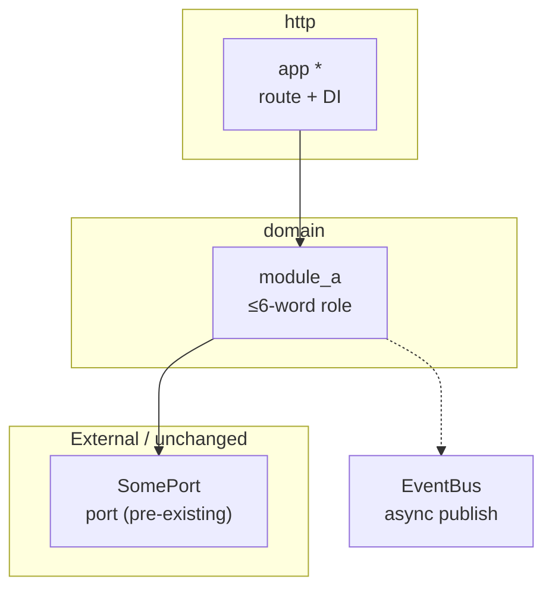
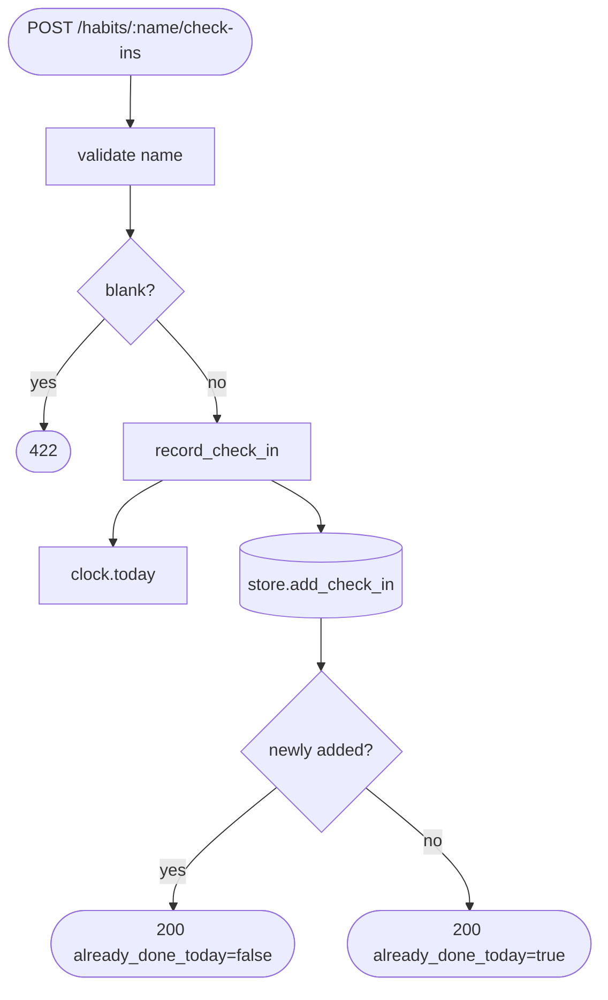

# Diagramming reference — as-built

How to mechanically extract edges from code, derive the entry point, build the two diagrams in house style, and diff against `design.md`. Consulted during Phases 2–5. **Never invent an edge you can't trace to source.**

The structured outputs (module table, import-edge list, main-flow step list, drift table) go in the **`.ai`** record. The two **Mermaid diagrams** are built from that structured data and go in the **`.human`** mirror, each generated through the **mermaid skill** so it's validated. No Mermaid in `.ai`.

## Mermaid house style

Matches `/architect`'s C4 convention so as-built diagrams read like the rest of the chain:

- **Solid edge (`-->`) = synchronous** call/import. **Dotted edge (`-.->`) = asynchronous** (awaited background task, queue/event publish, fire-and-forget, scheduled).
- Default to **solid** unless the code shows a real async boundary (a job enqueue, an event-bus publish, a detached task). When in doubt, solid + a note.
- Must render in GitHub / GitLab / PR previews. No experimental syntax, no HTML beyond ` `.
- Keep labels ≤6 words. The table beside the diagram carries detail.

## Import grammar by language

Read `anchor.language` (from `.ai/anchor.md`), then extract module dependencies with the matching grammar. An **edge** is "this manifest file depends on module X."

| Language | Statements that create an edge | Notes |
|---|---|---|
| Python | `import x`, `import x.y as z`, `from x.y import a` | Resolve `from .ports import …` relative to the file's package. Map dotted path → module node. |
| TypeScript / JavaScript | `import … from 'x'`, `import('x')` (dynamic → **dotted**), `require('x')`, `export … from 'x'` | Dynamic `import()` and lazy loaders are async boundaries → dotted. |
| Java | `import com.acme.x.Y;` | Same-package classes have no explicit import — detect by referenced type if the file is short; else note the omission. |
| C# | `using Acme.X;`, `global using …` | `using` statements (not `using` resource blocks). |
| Go | `import ( "acme/x" )` | Map package path → node; the last path segment is the package name. |

**Edge resolution rules:**
- Only keep edges whose target is **project-internal** (resolves inside the repo's source tree). Drop stdlib / third-party / framework imports — note once under `## Notes & omissions` that external deps were excluded.
- Target resolves to a **manifest file** → primary node. Target resolves to a **project file NOT in the manifest** (a pre-existing port/adapter) → boundary node in the `External / unchanged` subgraph.
- **async classification**: mark an edge dotted only on concrete evidence — `await asyncio.create_task`, `.enqueue(`, `publish(`, `await import(`, a message-broker client call, a `@background`/`BackgroundTasks` hand-off. A plain `await some_func()` on an in-process call is still **synchronous** control flow → solid.

## Module/import block diagram (Phase 5 → `.human`)

Build from the Phase-2 module table + import-edge list. Generate via the mermaid skill:

- One node per manifest file. Label = module name + role. **`new` files**: plain. **`modified` files**: trailing `*`.
- Subgraph per layer if the paths reveal layers (`domain/`, `http/`, `ports/`, `adapters/`, `cli/`, `web/`). Else one flat graph.
- `External / unchanged` subgraph holds project-internal boundary nodes only.

## Main-flow flowchart (Phase 5 → `.human`)

Build from the Phase-3 step list. **Deriving the entry point:**
1. If `design.md` has a `sequenceDiagram`: entry = the actor's first message target (e.g., `Maya->>API: POST …` → that route on `API`).
2. Else: the public surface declared in the **lowest-numbered non-removed slice** (the tracer bullet) — its route, command, or exported handler.

**Tracing:** open the entry function and follow real calls **through manifest files only**. Stop at boundary nodes — represent a pre-existing port/adapter as a terminal step, don't recurse. One node per hop, in execution order. Decision diamonds **only** for branches that exist in the code (validation → error code, idempotent no-op, guard rejects).

Keep it to the one flow. If a feature genuinely has two co-equal entry points (rare), pick the tracer-bullet one and note the other under `## Notes & omissions` — do **not** draw a second flowchart.

## Drift diff (Phase 4 → `.ai` table)

Goal: compare the **intended** flow (`design.md` `sequenceDiagram`) against the **as-built** call chain (Phase 3).

1. **Parse the design sequence**: extract ordered messages `A ->>/->> B: msg`. Each is an intended hop `(from, to, message)`.
2. **Normalize names before comparing** — design uses role names (`RecordCheckIn`, `Clock`, `Store`); code uses concrete identifiers (`record_check_in`, `SystemClock`, `SqliteCheckInStore`). Match on role, not spelling.
3. **Classify each hop:**

| Class | Meaning | Counts toward N? |
|---|---|---|
| `match` | same role pair, same order | no |
| `rename` | same role, concrete name differs (port → adapter) | no (note it, low severity) |
| `extra` | hop in code, no design counterpart | **yes** |
| `missing` | hop in design, absent in code | **yes** |
| `reordered` | same hops, different sequence | **yes** |

4. `N` = count of `extra` + `missing` + `reordered`. A `rename`-only diff is **not** drift.
5. One table row per hop. If `design.md` has no `sequenceDiagram` (prototype tier or absent) → drift section is `N/A`, `N = 0`.

**Why renames aren't drift:** `/design`'s sequence diagram names *roles* (ports, domain operations) by design — a ports-and-adapters layout means the concrete adapter (`SqliteCheckInStore`) realizing a port (`CheckInStore`) is expected, not a divergence. Only structural differences (a hop that exists/doesn't, or runs in a different order) signal the code and the intent actually disagree.
