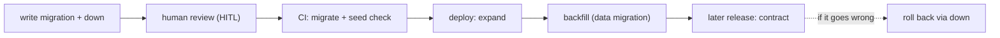

# `.ai/data-management.md` — template + retention-table shape

Assemble the artifact from this skeleton. Fill only what the tier requires
(`[M+]` = mvp and up, `[Pr]` = production only). Hard line caps: 90 / 185 / 250.
Brownfield: every recovered fact keeps its `file:line` citation in Notes.

## File template

```markdown
---
slug: <project-slug>
stage: data-management
status: draft | complete
tier: prototype | mvp | production         # INHERITED from anchor.project_tier — never recomputed
project_type: greenfield | brownfield
verdict: DATA-MANAGEMENT-LOCKED | SKIPPED-NO-DATASTORE | SKIPPED-PROTOTYPE | BLOCKED-ON-ARCHITECT | BLOCKED-ON-ANCHOR
verdict_overridden: false
db: <from anchor, e.g. postgres>            # INHERITED — /anchor owns the choice
migration_tool: <e.g. "prisma migrate" | "alembic" | "golang-migrate">
migrations_dir: <path, e.g. prisma/migrations/>
naming: <pattern, e.g. "YYYYMMDDHHMMSS_verb_noun" | "tool-generated timestamp + slug">
reversibility: down-required | argued-irreversible-allowed
ordering: timestamps | sequential-ids
retention_entity_count: <N>                 # [Pr] rows in the retention table; 0 below production
backup_last_tested: YYYY-MM-DD | never | n-a   # [Pr]
production_seeds: none | <path>
dep_adds: []                                # migration tooling not in anchor.approved_dependencies — flagged for anchor, never silently added
source_anchor: .ai/anchor.md
source_architecture: .ai/architecture.md     # or .ai/architecture/index.md (bundle)
source_recon: .ai/recon.md                   # brownfield; or: none
source_test_strategy: .ai/test-strategy.md   # or: none
source_context: .ai/context.md               # or: none
human_summary: .human/summaries/data-management.md   # present ONLY when written (production)
consumed_by: [design, to-issues, ship]
created: YYYY-MM-DD
---

# Data management — <project-slug>

> Tier: `<tier>` · Updated YYYY-MM-DD · Policy only — migrations are written and run in the build phase.

## Migration policy
- tool: <tool + version family>            # governed vs anchor.approved_dependencies; new → dep_adds
- directory: <path>
- naming: <exact filename pattern + one example, e.g. 20260610091500_add_invoice_status.sql>
- reversibility: every schema migration ships a down/rollback, OR carries
  `-- IRREVERSIBLE: <argued reason>` in the file header AND a line in this section
  naming the migration + why (e.g. "destructive contract step after the expand window").
- schema_vs_data: data migrations (backfills, transforms) are separate files in
  <path>, idempotent and replayable; never embedded in a schema migration.
- ordering: <timestamps | sequential ids> · merge_conflict_policy: <e.g. "rebase
  regenerates the timestamp; CI fails on out-of-order migrations">
- review_rule: <who/what gates a migration before merge — e.g. "any slice whose
  files touch the migrations dir is HITL (/to-issues); a human reviews the down
  path before merge">

## Seed data                      # [M+]
- dev_test_seeds: see `.ai/test-strategy.md § Seed data`   # ONE line — never duplicated here
- production_seeds: none | <what (lookup tables, default rows) · where the seed
  lives · when it runs, e.g. "after migrations on deploy; idempotent">

## Backup & restore               # [Pr]
- what: <e.g. full Postgres dump + WAL>
- frequency: <e.g. daily 03:00 UTC, 30-day retention>
- where: <e.g. provider snapshots + offsite bucket NAME — location, never credentials>
- restore_procedure: <runbook path or pointer, e.g. docs/runbooks/restore.md>
- last_tested: YYYY-MM-DD | never        # never → Open question, not silence

## Retention & PII lifecycle      # [Pr] — MANDATORY when pii or regulatory in anchor.uplift_signals
| entity | retention | deletion_mechanism | legal_basis_note |
| :-- | :-- | :-- | :-- |
| <Entity from .ai/context.md> | <e.g. 7y after account closure> | <e.g. nightly purge job | hard delete on request> | <user's recorded decision — confirm with legal counsel> |

- export_and_erasure: <how a user's data is exported / erased on request — the
  mechanism or an Open question; the user's decision, flagged for legal review>

## Zero-downtime rule             # [Pr]
- breaking schema changes follow expand → migrate → contract: add the new shape,
  backfill via a data migration, contract (drop the old shape) only in a later
  release once no running code reads it. Never a destructive change in one step.

## Open questions
- <unknown the scan/interview couldn't settle — e.g. "backups: no wiring found in
  CI or IaC; do any exist?" | "retention for AuditLog undecided — pending legal">

## Notes
- <provenance: brownfield citations summary (tool — alembic.ini:1; naming —
  migrations/versions/…), or "greenfield: proposed from anchor.db + framework default">
- <dep_adds rationale, if any>

## Verdict
**<VERDICT>** — <one-line rationale>. <override note if any>
```

## Prototype minimal shape (≤90 lines, only if the user insists past the skip)

Frontmatter + `## Migration policy` reduced to tool · directory · naming ·
reversibility, plus Open questions and Verdict. No seed section, no backup,
no retention, no zero-downtime, no `.human` mirror.

## Retention-table authoring rules

- One row per entity holding user or regulated data — walk `.ai/context.md`'s
  `## Entities` and ask per entity; entities with no stored personal/regulated data
  may be grouped in a single "no PII" line instead of rows.
- `retention` is a period + trigger ("2y after last activity"), never "forever"
  without an argued reason, never an adjective.
- `deletion_mechanism` names a real mechanism (job, cascade, manual runbook) or an
  Open question — not "TBD".
- `legal_basis_note` is the **user's recorded decision** with the standing flag
  "confirm with legal counsel" — the skill proposes common practice as a draft only
  and never interprets law.

## `.human/summaries/data-management.md` shape (production only)

- One plain sentence: *"Here is how this project's data changes shape, gets backed
  up, and gets deleted."*
- 3–6 jargon-free bullets: how database changes happen (and that every change has
  an undo) · who checks a change before it lands · how backups work and when the
  restore was last rehearsed · how long each kind of data is kept and how it's
  deleted · the no-downtime rule for risky changes.
- ONE validated Mermaid diagram via the **mermaid skill** — the migration lifecycle, e.g.:



- Link back to `.ai/data-management.md`.
