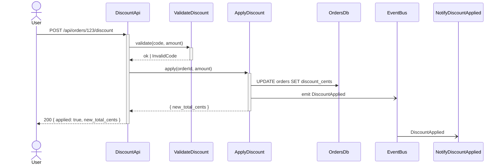

# Call-flow step list → `.human` sequence diagram

For `/design` Phase 7 (the `.ai` call-flow step list) and Phase 10 (rendering the `.human` mirror). The rule is the same one that governs every `.ai`/`.human` split: **the structure lives in `.ai/`, the diagram is its rendering in `.human/`.**

## In `.ai/specs/<feature>/design.md` — a structured step list, NOT a diagram

The call flow is a **numbered step list** — one row per message, each naming the source, the target, the message, and whether the hop is async. No Mermaid in `.ai/`. This list is the single source of truth the `.human` `sequenceDiagram` is mechanically rendered from.

```markdown
## Call flow — apply discount

| # | from | to | message | sync/async |
| :-- | :-- | :-- | :-- | :-- |
| 1 | User | DiscountApi | POST /api/orders/123/discount | sync |
| 2 | DiscountApi | ValidateDiscount | validate(code, amount) | sync |
| 3 | ValidateDiscount | DiscountApi | ok \| InvalidCode | sync |
| 4 | DiscountApi | ApplyDiscount | apply(orderId, amount) | sync |
| 5 | ApplyDiscount | OrdersDb | UPDATE orders SET discount_cents | sync |
| 6 | ApplyDiscount | EventBus | emit DiscountApplied | async |
| 7 | ApplyDiscount | DiscountApi | { new_total_cents } | sync |
| 8 | DiscountApi | User | 200 { applied: true, new_total_cents } | sync |
| 9 | EventBus | NotifyDiscountApplied | DiscountApplied | async |
```

- **Actors and components** are named exactly as they appear in the module table + `02-components.md`.
- **One flow** at prototype/mvp; production may carry a second list only if the feature has 2+ genuinely critical flows.
- Mark every **async** hop — it drives the dotted/`-)` arrow in the render and the failure-mode reasoning in the rest of Phase 7.
- A purely additive feature (a new validation rule, no flow) may have no call flow — say so explicitly rather than inventing one.

## In `.human/specs/<feature>/design.md` — the rendered `sequenceDiagram`

Phase 10 hands the step list to the [mermaid skill](../../mermaid/SKILL.md), which returns a **validated** fenced block. Never hand-author the diagram; regenerate it from the `.ai` list if the list changes (`.ai` wins).

Skeleton the render follows:



**Line conventions** (match architect's C4 convention so the whole repo reads consistently):

- `->>` solid arrow = a **sync** call; `-)` = an **async** message (matches the `async` rows in the step list).
- `-->>` dashed = a return / response.
- `+`/`-` activation bars on a lifeline that does real work and returns.
- Lifelines = the actors and components from the step list, in first-appearance order.

## The mirror is more than the diagram

The `.human` mirror also carries the **plain-English walkthrough** — 3–6 jargon-free sentences narrating the flow ("the user taps Bill now; we check the code is valid, write the discount, and email a receipt in the background"), the design's one-line intent, and a link back to the `.ai` file. Lead with the walkthrough; the diagram supports it. Keep it lossy — an abstract, never a reformat of the whole `.ai` design.
