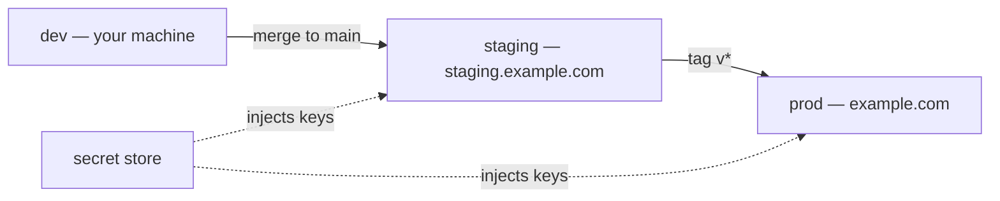

# `.ai/environments.md` — template + table shapes

Assemble the artifact from this skeleton. Fill only what the tier requires
(`[M+]` = mvp and up, `[Pr]` = production only). Hard line caps: 90 / 185 / 250.
**Never a secret value anywhere in this file** — names, types, and storage
locations only.

## File template

```markdown
---
slug: <project-slug>
stage: environments
status: draft | complete
tier: prototype | mvp | production         # INHERITED from anchor.project_tier — never recomputed
project_type: greenfield | brownfield
verdict: ENVIRONMENTS-LOCKED | SKIPPED-PROTOTYPE | BLOCKED-ON-ANCHOR | BLOCKED-ON-BOOTSTRAP
verdict_overridden: false
environments: [dev, staging, prod]          # the real roster, whatever it is
env_count: <N>
config_var_count: <N>
secret_count: <N>                            # rows with secret: yes
secrets_store: <store name(s), e.g. "GitHub Actions secrets + Fly.io secrets">
flag_system: none | <system, e.g. "LaunchDarkly" | "env-var flags APP_FF_*">
iac_path: none | <path, e.g. infra/>
source_anchor: .ai/anchor.md
source_bootstrap: .ai/bootstrap.md           # greenfield; or: none
source_recon: .ai/recon.md                   # brownfield; or: none
human_summary: .human/summaries/environments.md   # present ONLY when written (mvp+)
consumed_by: [design, to-issues, ship]
created: YYYY-MM-DD
---

# Environments — <project-slug>

> Tier: `<tier>` · Updated YYYY-MM-DD · Names and storage locations only — NEVER values.

## Environment roster
| env | purpose | url_host | deploy_mechanism | smoke_command |
| :-- | :-- | :-- | :-- | :-- |
| dev | local development | http://localhost:3000 | `pnpm dev` | `pnpm smoke` [Pr per env] |
| staging | pre-prod verification [M+] | https://staging.example.com | merge to `main` → `.github/workflows/deploy.yml` | `pnpm smoke --env staging` |
| prod | live users | https://example.com | tag `v*` → same workflow, prod job | `pnpm smoke --env prod` |

<!-- deploy_mechanism: an exact command OR a CI trigger ("merge to main runs deploy.yml").
     smoke_command: prod required at mvp+; every env at production. "none" is allowed but flagged. -->

## Config inventory
| name | purpose | type | secret | required_in | set_in |
| :-- | :-- | :-- | :-- | :-- | :-- |
| DATABASE_URL | primary DB connection | url | yes | all | dev: .env (gitignored) · staging/prod: Fly.io secrets |
| APP_BASE_URL | absolute-URL generation | url | no | all | dev: .env.example default · staging/prod: CI env |
| STRIPE_SECRET_KEY | payments API | string | yes | staging, prod | CI secret store |
| APP_FF_NEW_CHECKOUT | feature flag | bool | no | all | .env / CI env |

<!-- type: string | url | int | bool | json | enum.   secret: yes | no.
     required_in: env names or "all".   set_in: WHERE the value lives per env — never the value. -->

## Secrets policy
- store: <the store(s) per env — e.g. dev: gitignored .env · CI: GitHub Actions secrets · runtime: Fly.io secrets>
- never_in_repo: .env is gitignored; .env.example carries names + placeholder text only; no value in any .ai/.human file or commit.
- rotation: <[Pr] what rotates, cadence/trigger, who owns it — e.g. "DB + Stripe keys on offboarding or suspected exposure; owner: maintainer">
- on_pasted_secret: refused at the interview; the value belongs in the named store; rotate anything pasted into chat.

## Config conventions            # [M+]
- naming: <pattern, e.g. APP_* prefix, SCREAMING_SNAKE_CASE>
- new_config_goes: <the one code location, e.g. src/config.ts — add the var there + .env.example + this file>
- validation_at_boot: <expectation, e.g. "config module throws on missing required var (zod schema)" | "none yet — gap">

## Feature flags                 # if any; else "flag_system: none — section omitted"
- system: <where flags live>
- naming: <pattern>
- lifecycle: <created → rolled out → removed; who flips exposure (ties to /ship's "shipped ≠ exposed" note)>

## IaC                           # [Pr]
- path: <e.g. infra/ | none>
- apply: <mechanism, e.g. "terraform apply via CI on infra/** merge; never by hand">

## Open questions
- <unknown the scan/interview couldn't settle — e.g. "where do prod secrets actually live? Citation not found.">

## Notes
- <provenance: brownfield citations summary, or "seeded from .ai/bootstrap.md steps 4+7">

## Verdict
**<VERDICT>** — <one-line rationale>. <override note if any>
```

## Prototype one-pager shape (≤90 lines)

Single `dev` row in the roster (plus prod if it genuinely exists), the core config
vars only, a one-line secrets policy (`never_in_repo` + where the one real secret
lives), no conventions/flags/IaC sections, no `.human` mirror.

## `.human/summaries/environments.md` shape (mvp+)

- One plain sentence: *"Here are the project's environments and where every setting lives."*
- 3–6 jargon-free bullets: the envs and what each is for · how code gets to each ·
  where secret things are kept (and the never-in-the-code rule) · what to do when a
  new setting is added (re-run `/environments`).
- ONE validated Mermaid diagram via the **mermaid skill** — the promotion flow, e.g.:



- Link back to `.ai/environments.md`.
