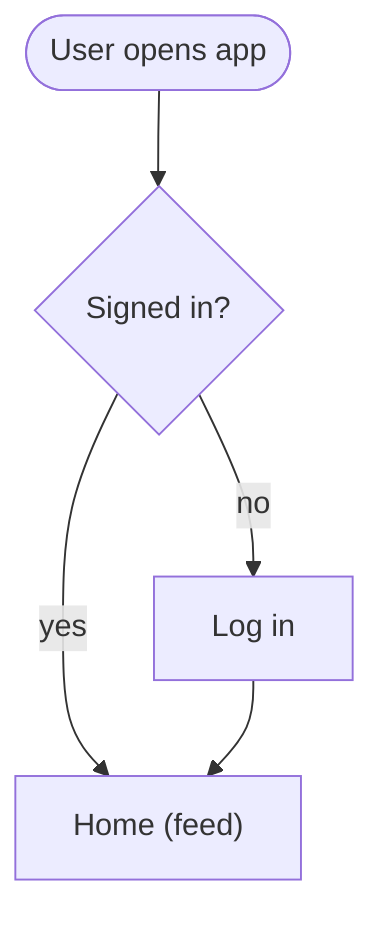
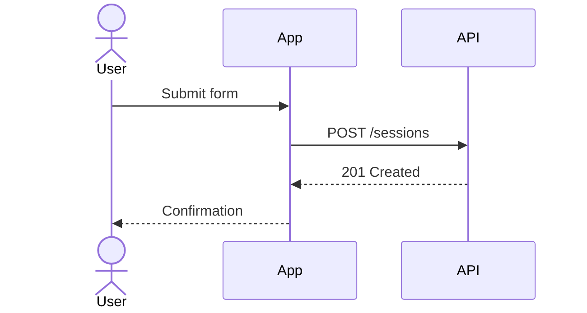
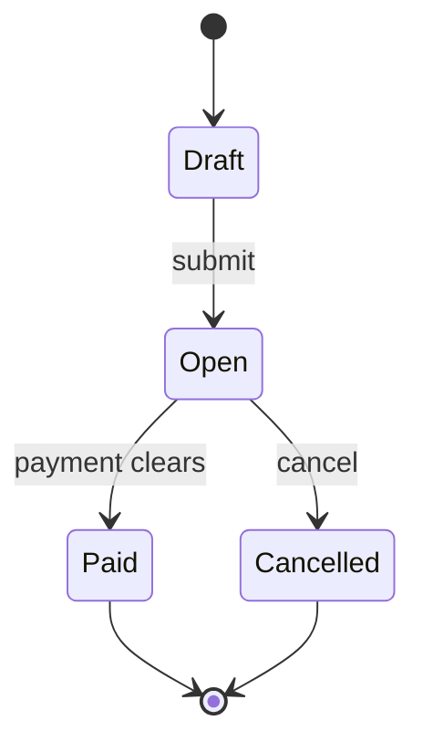
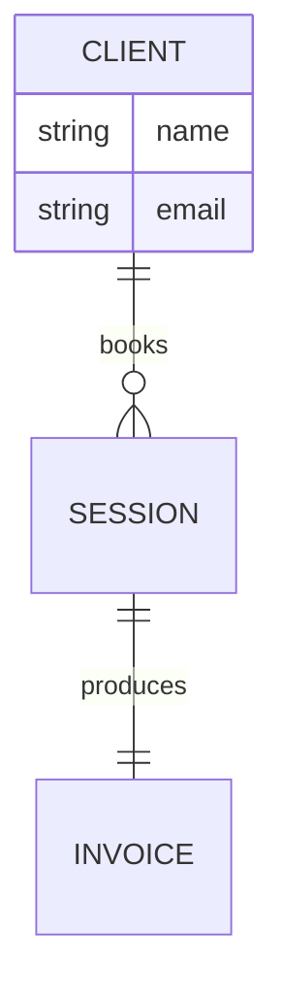
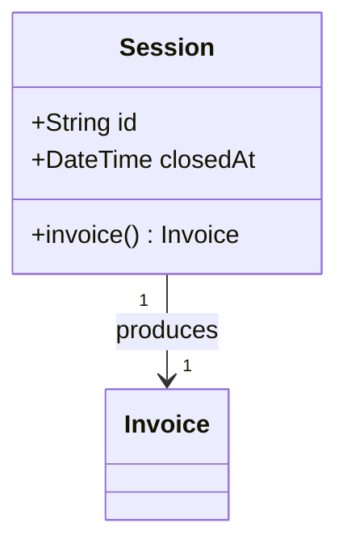
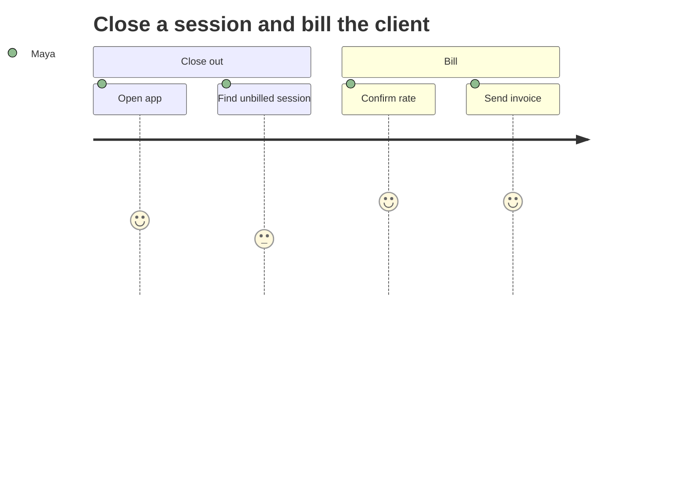
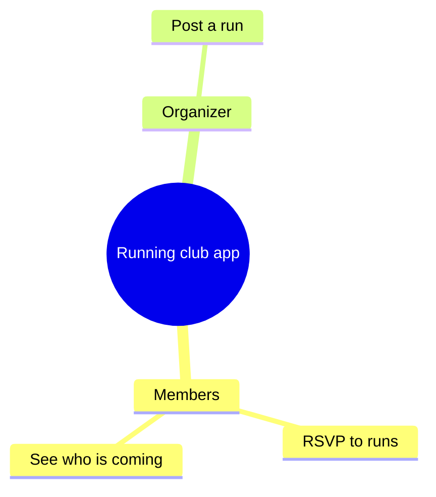
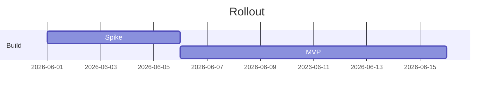
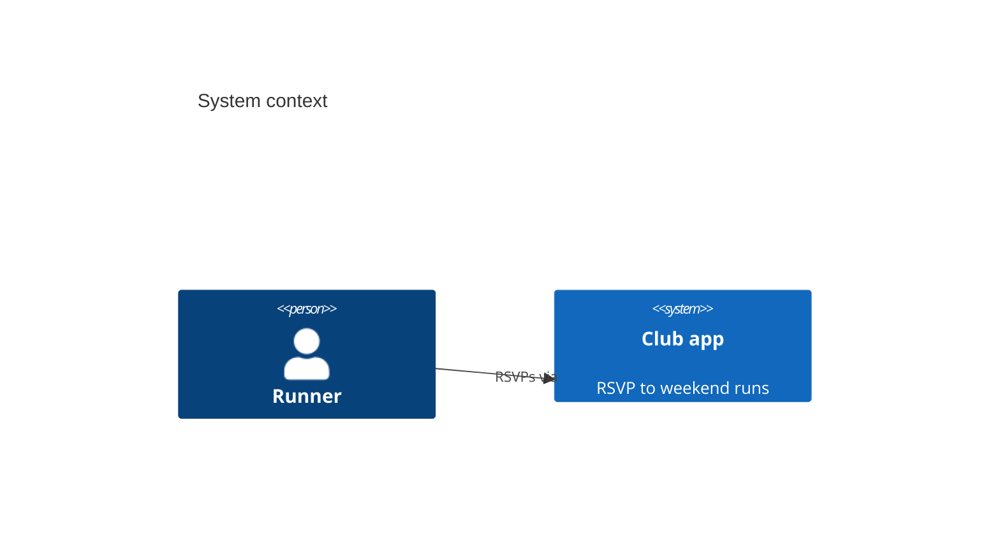

# Mermaid syntax gotchas & per-type cheat-sheets

The validator catches errors; this file helps you avoid them in the first place and fix them fast.

## The failures that cause ~90% of parse errors

| Symptom | Cause | Fix |
| :--- | :--- | :--- |
| `Parse error ... Expecting 'SQE'/'PE'/'DIAMOND_STOP'` | Special char in a node label | Quote the whole label: `A["Order (paid)"]` |
| Diagram truncates / subgraph swallows nodes | Node id literally `end` | Rename: `done`, `finish`, `end_` |
| Edge label fails | Unquoted `:`, `|`, `#` in label | `A -->|"rate: hourly"| B` |
| `Lexical error` near a word | Reserved-ish token (`graph`, `subgraph`, `class`, `click`, `style`, `linkStyle`) used as an id | Rename the node |
| Class diagram method fails | Unescaped generics `List<Order>` | Use `List~Order~` (Mermaid generic syntax) |
| Nothing renders, no error | Missing diagram-type header line | First non-comment line must be `flowchart TD`, `sequenceDiagram`, etc. |
| Newline inside a label | Literal line break in `[...]` | Use ` `: `A["line one line two"]` |

**Golden rule:** if a label contains any of `( ) [ ] { } : ; / # " ' < >` or starts with a digit, wrap it in double quotes. When in doubt, quote it.

## Characters that must be escaped inside quoted labels

- `"` inside a quoted label → use `#quot;` or `&quot;`
- `<` / `>` → use `&lt;` / `&gt;` (or ` ` for an intentional line break)
- A literal `#` at the start → quote the label

## Per-type cheat-sheets (each validated)

### Flowchart

- Directions: `TD`/`TB` (top-down), `LR` (left-right), `BT`, `RL`.
- Shapes: `[rect]`, `(round)`, `([stadium])`, `{diamond}`, `[[subroutine]]`, `[(database)]`, `((circle))`.
- Subgraphs: `subgraph title ... end` — never name a node `end`.

### Sequence

- Arrows: `->>` (solid call), `-->>` (dashed return), `-x` (lost), `-)` (async).
- `activate`/`deactivate` or `+`/`-` for activation bars. `Note over A,B: text`.

### State (lifecycle / status machine — ideal for `.human` summaries of invariants)

- Use `stateDiagram-v2` (not `stateDiagram`). `[*]` is the start/end pseudo-state.

### Entity-relationship (good for `.human` mirror of an `.ai` entity model)

- Cardinality: `||` exactly one, `o{` zero-or-many, `|{` one-or-many.

### Class

- Generics use tildes: `List~Session~`. Visibility: `+ - # ~`.

### User journey (great for a plain-English journey summary)

- Scores are 1–5 (sentiment). Each task: `Task name: score: Actor`.

### Mindmap (idea / scope breakdown — good for an idea-on-a-page in `.human/intake`)

- Indentation defines hierarchy. Root shape `((text))`. Keep labels short.

### Gantt

### C4 context

## Picking the right diagram for an artifact

| You want to show… | Use |
| :--- | :--- |
| How a user gets a job done, step by step | `journey` or `flowchart LR` |
| What states a thing moves through (lifecycle, invariants) | `stateDiagram-v2` |
| The domain entities and how they relate | `erDiagram` |
| Who talks to whom and in what order | `sequenceDiagram` |
| The shape/scope of an idea at a glance | `mindmap` |
| System boundaries and external actors | `C4Context` |

Validate after writing. Always.
