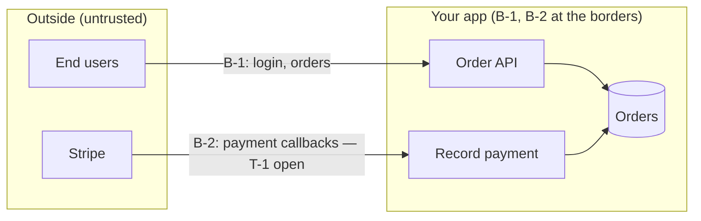

# threat-model artifact skeletons

Full `.ai/architecture/threat-model.md` shape, the lite-pass cut, and the `.human` mirror.
Schema source of truth: `_shared/ai-schema.md`. Line caps: full ≤250 · lite ≤90.

## `.ai/architecture/threat-model.md` — full

```markdown
---
slug: <project-slug>
stage: threat-model
status: draft | complete
tier: prototype | mvp | production       # INHERITED from anchor.project_tier — never recomputed
mode: full | lite                         # lite = user insisted past SKIPPED-TIER
boundary_count: <N>
asset_count: <N>
threat_count: <N>
open_count: <N>                           # threats with status: open
accepted_count: <N>                       # threats with status: accepted
routed_invariants: <N>                    # RC entries of kind: invariant
routed_unwanted: <N>                      # RC entries of kind: unwanted-ears
scored_against:                           # staleness snapshot — diff vs architecture on every run
  components: [<verb-noun>, <verb-noun>]
  edges: ["<from> -> <to>", "<from> -> <to>"]
verdict: THREAT-MODEL-LOCKED | THREAT-MODEL-LOCKED-WITH-OPEN-THREATS | SKIPPED-TIER | NEEDS-ARCHITECTURE-UPDATE | BLOCKED-ON-ARCHITECT | BLOCKED-ON-ANCHOR
verdict_overridden: false
sources: [.ai/architecture, .ai/anchor.md, .ai/environments.md, .ai/context.md, .ai/understanding/<slug>.md, .ai/features.md]
human_summary: .human/summaries/threat-model.md
consumed_by: [prd, architect, qa, promote]
created: YYYY-MM-DD
updated: YYYY-MM-DD
---

# Threat model — <slug>

> 1–9 scoring (impact × likelihood), same scale as 03-risk-storming.md. ≥6 ⇒ mitigated, accepted-with-reason, or routed.

## Trust boundaries
| id | boundary | crosses | entry points | inside / outside |
| :-- | :-- | :-- | :-- | :-- |
| B-1 | browser ↔ api | network | UI, public API | SubmitOrder, AuthenticateUser / end users |
| B-2 | api ↔ stripe callbacks | network+org | webhook | RecordPayment / Stripe + anyone with the URL |

## Assets
| asset | lives in | why attacked |
| :-- | :-- | :-- |
| session tokens | browser storage, api | full account takeover |
| payment records | db (RecordPayment) | money path — alter or replay |

## Threat register

### T-1 · S · B-2 · webhook replay forges a paid order
- actor: anyone holding a captured webhook URL/payload
- scenario: replays a payment-success notification; nothing verifies the signature, so an unpaid order is marked paid
- impact: 3 · likelihood: 3 · score: 9
- status: open                            # or: mitigated-by: <named invariant | security_gate entry | EARS U-id | environments control>
                                          # or: accepted — <user's recorded reason> (date)
- cross-ref: R-02                          # only if 03-risk-storming.md overlaps

### T-2 · I · B-1 · enumerable order IDs leak other users' PII
- actor: any authenticated user
- scenario: increments the order ID in the URL; the read path checks login but not ownership
- impact: 3 · likelihood: 2 · score: 6
- status: mitigated-by: invariant "Every order read is scoped to the requesting account"

## Routed candidates

### RC-1 · invariant · from T-1 · → /architect · status: proposed
> Every inbound third-party callback is signature-verified before any state change.

### RC-2 · unwanted-ears · from T-1 · → /prd checkout · status: proposed
> If a payment notification arrives whose signature does not verify, then the system shall reject it, leave the order state unchanged, and log the attempt.

## Out of scope
- <surface or threat> — <one-line reason / user's recorded decision; regulatory calls flagged "needs human review">

## Verdict
**<VERDICT>** — <one-line rationale; on -WITH-OPEN-THREATS name every open T-N + score>. <override note if any>
```

### Block rules
- **T-N ids are stable** across refreshes; never renumber. A threat eliminated by an architecture change keeps its id with a one-line `retired:` note.
- **`accepted` entries survive refresh** — re-confirm, never silently drop the recorded reason.
- **`status: adopted`** on an RC only when the target artifact verifiably contains the rule (the invariant text in `02-components.md § Invariants` / the U-clause in the feature's `prd.md`).
- One `cross-ref:` line max per threat; don't restate risk-storming content.

## Lite pass (`mode: lite`, ≤90 lines)

Same frontmatter + section order, cut down: 2–3 boundaries · top assets only · **≤10
threats** (highest scores) · routed candidates for any ≥6 `open` threat (the signature move
survives) · `## Out of scope` as one line per dropped surface · verdict.

## `.human/summaries/threat-model.md` — derived mirror

Lead with one plain sentence (the verdict), then 3–6 jargon-free bullets (who can attack what,
what's already covered, what was accepted and why, what got routed where), ONE Mermaid
boundary/data-flow flowchart, and a link back to the `.ai` register. The diagram is generated
via the **mermaid skill** (validated before it ships) FROM the boundary table + edges —
boundaries as subgraphs, arrows as data flows, threats as edge labels where they fit:



Never hand-author the mirror; regenerate it from the `.ai` file on every run. `.ai` wins on
disagreement.
