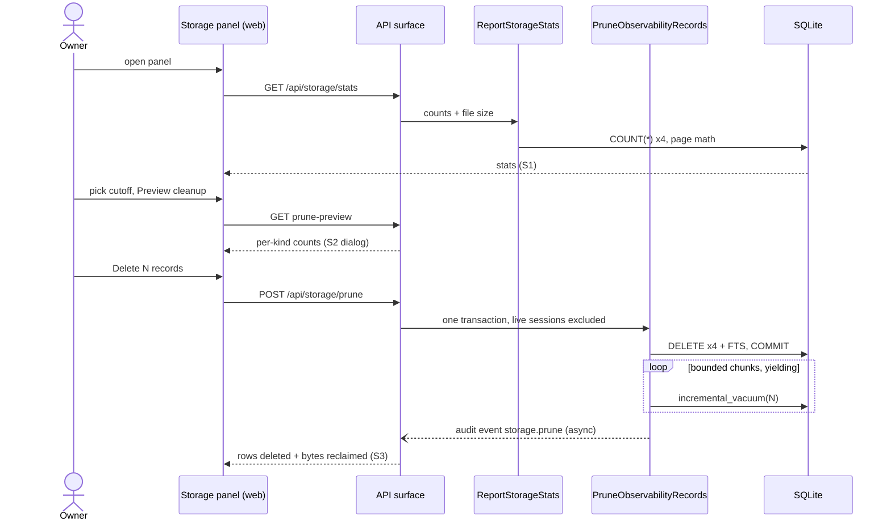

# How the cleanup will be built — the walkthrough

Two small server modules (one that *answers* — counts and file size — and one that *acts* — the careful delete), a Storage panel with its confirm dialog in the web app, and three API routes wiring them together. No new libraries anywhere.

The one genuinely tricky decision: **giving disk space back without freezing the app**. The database library is synchronous — compacting a big file in one go would freeze every live terminal for seconds and silently lose hook events. So the design converts the database once (at boot, before anything is running) to a mode that lets space be reclaimed **in small chunks between other work** — the terminals never stutter, and the space really is returned. If anything fails mid-delete, the whole delete is rolled back — which is what lets the UI promise "nothing was deleted, the database is unchanged" and mean it.

Live sessions are protected at the query level: the delete simply cannot match records belonging to a running session, whatever cutoff you pick. And the cleanup writes its own audit-trail entry — the numbers in that entry are exactly how we'll measure the feature's success later.

Machine contract: [.ai/specs/observability-data-pruning/design.md](../../../.ai/specs/observability-data-pruning/design.md) · the vacuum decision: [ADR-0001](../../../.ai/specs/observability-data-pruning/adr/0001-chunked-incremental-vacuum.md)
