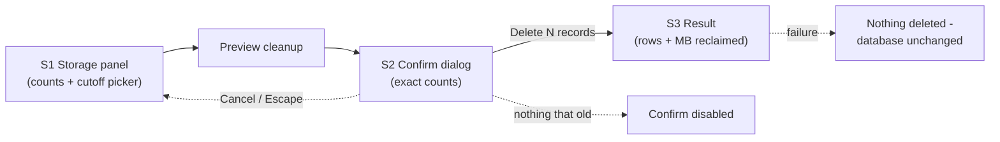

# Cleanup UI — how it will feel

Three moments: a **Storage panel** that shows what's piled up (how many records of each kind, how big the database file is), a **confirmation dialog** that tells you in plain numbers exactly what a cleanup would delete — with two promises in writing: live sessions are never touched, and old transcript copies will drop out of search — and a **result line** that proves it worked: records deleted, megabytes given back, before → after file size. If anything fails midway, the copy says it straight: *"Cleanup failed — nothing was deleted. The database is unchanged."*

Machine contract: [.ai/specs/observability-data-pruning/ux.md](../../../.ai/specs/observability-data-pruning/ux.md)

*(Note: no project design system doc exists — the spec leans on the app's shipped MUI conventions; flagged for the owner.)*
