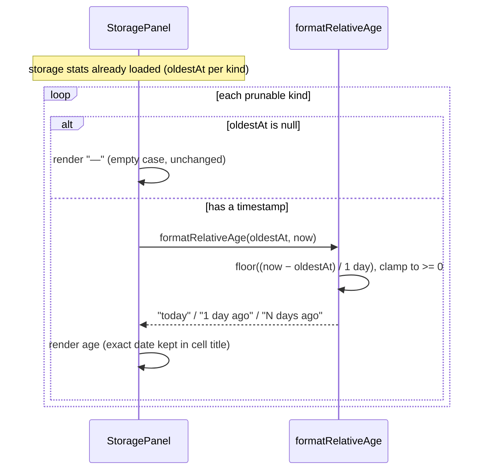

# How we'll show the oldest-record age — in plain words

**Verdict: READY-FOR-PLAN.**

**The shape of it:** one tiny pure function and one small change to the Storage panel. No database work, no new server endpoint — the panel already loads each pile's oldest timestamp; we're just turning that timestamp into "how long ago" before it's shown.

**The function** (`formatRelativeAge`) lives next to the other little Storage formatters we already have. Give it a date and "now", it hands back `today`, `1 day ago`, or `63 days ago` — always whole days, never a negative number even if a clock is skewed.

**The panel change:** in the Oldest column, show that age instead of the raw date. The exact date isn't lost — it sits in the cell's hover tooltip, so you can still see `2026-04-12` if you want the precise timestamp.

**Why a separate function:** the rule (whole days, plural/singular, never-negative) has real edge cases, so it gets its own unit tests. The panel wiring is just "call it and render the string."

**What we deliberately decided against:** rolling very old data up to months/years. Days match how you actually choose a cutoff (7/30/90), and "3 months — is that more than 90 days?" would just bring the mental math back.

## How a row gets drawn

Machine contract: [.ai/specs/oldest-record-age/design.md](../../../.ai/specs/oldest-record-age/design.md)

*(Autonomous dogfood note: derived from the call-flow step list in the machine design; diagram validated via the mermaid skill.)*
