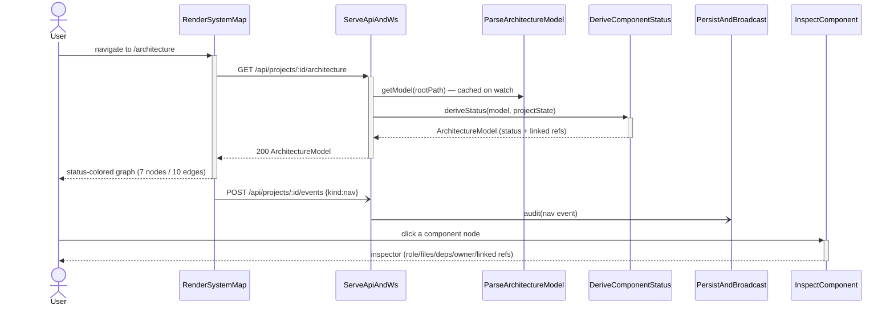
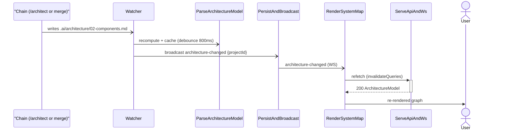

# Design (plain English) — System Map

**In one line:** a new **Architecture** tab that draws your project's real components as a
status-colored map, lets you click any box to see what it is and what work it links to, and keeps
itself fresh — built by *reading* the architecture you already maintain, never copying it.

This is the human-friendly view. The precise contract lives in
[`.ai/specs/system-map/design.md`](../../../.ai/specs/system-map/design.md) — if the two ever
disagree, that file wins.

## How it's built (the shape)

- **No new component, no new dependency.** The work spreads across four pieces you already have —
  the server *state* engine reads and watches the model, the *API/WebSocket* serves it, the *web*
  app draws the tab, and the *shared types* package gets the new graph shapes. The graph is drawn
  with React Flow (already used by the Pipeline page) and MUI — so it matches the rest of the app.
- **It derives, it doesn't duplicate.** The server *parses* your existing
  `.ai/architecture/02-components.md` (the 7 components + 10 connections) into a structured model,
  then *colors* each box by reading real project state — never a stored copy that can go stale.
  Boxes with no resolvable work fall back to "as-built" rather than faking progress.
- **LikeC4 — looked at it, deferred it (for now).** LikeC4 is the purpose-built tool and is more
  capable than expected, but for this first slice it brings a second styling system and a
  compile step we don't need. We draw it ourselves now and shape the model on LikeC4's convention,
  so adopting it later (for the C4 view + drift detection) is a swap, not a rewrite. Recorded in
  `adr/0001`.
- **It measures whether you actually use it.** Opening the tab records a lightweight "nav" event
  (best-effort — it never blocks the page). Combined with which sessions edited a file, that tells
  us in 14 days whether the map earns its place.

## What happens when you open the tab

You open **Architecture**; the app asks the server for the model, the server hands back the
components already colored by status, and the graph draws. Opening the tab quietly records that you
visited it. Click any box and a side panel shows its role, files, dependencies, owner, and the
feature/slices/issues it links to.

## What keeps it fresh (the "living" part)

When the chain regenerates the architecture (after `/architect` or a slice merge), the server's
existing file-watcher notices, re-parses the model, and pings the open tab over the WebSocket; the
tab refetches and redraws — no manual refresh, within about two seconds.

## What's deliberately left for later

Drift detection (does the code match the diagram?) is the headline *next* step — the model is
designed to reserve room for it, but slice 1 stays thin: parse → serve → draw the colored graph.
The extra views (agent activity, data flow, dependency analysis, deployment) and the cross-project
portfolio are their own future features. See
[`.ai/specs/system-map/vision.md`](../../../.ai/specs/system-map/vision.md) for the full roadmap.

→ Next chain step: **`/plan system-map`** — cut this into mergeable slices (tracer first).
