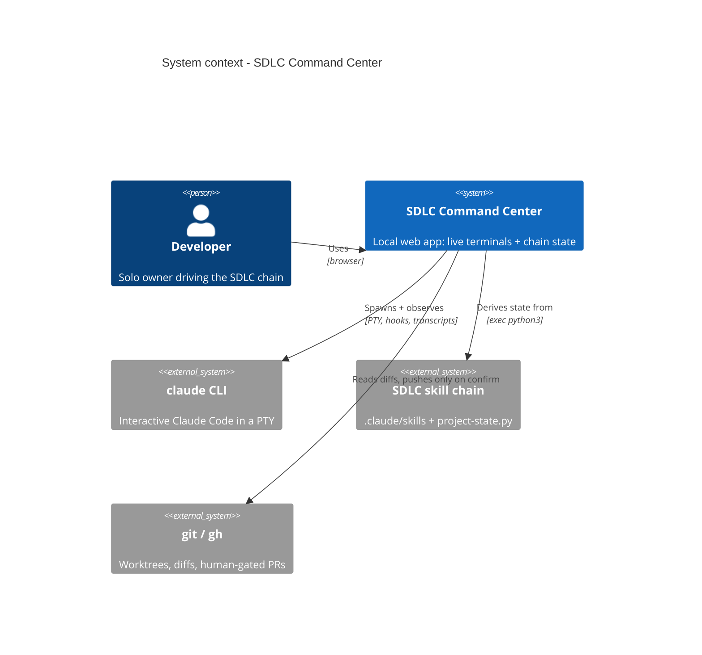
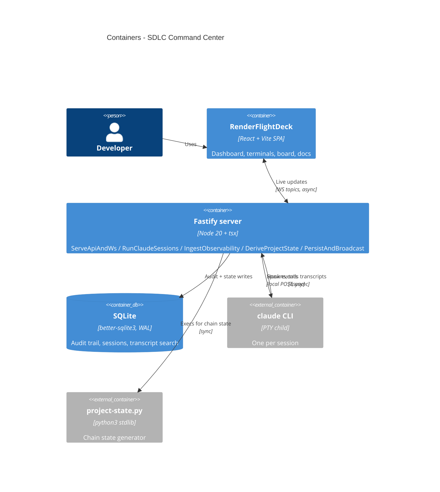

# Architecture — the shape of the Command Center

One local process does everything: a Fastify server that spawns real Claude terminals, ingests every observable event onto an internal event bus, persists it to SQLite, and fans it out live to the React dashboard over a single WebSocket. The architecture was **recovered from the code as it stands** — this is the as-is picture, not a redesign.

**The big picture:**

**Inside the box:**

**Walkthrough, in one breath:** you click launch in the browser → the server spawns `claude` in a PTY (worktree-isolated if asked) → everything the session does — hook events, transcript lines, token usage — flows through one event bus into SQLite and out to your screen live → when a skill ends with a verdict, the board lights up the next step → work leaves the machine only when you explicitly confirm a PR.

**What we serve well (the top 3):** observability (losing events defeats the product), recoverability (crash mid-session, resume where you left off), responsiveness (a laggy terminal is no terminal).

**Decisions on record:** the existing `docs/adr/0001–0003` (PTY over headless, reuse the chain's state generator, local-first SQLite) plus four newly recovered ones — the monolith + event bus itself (0004), loopback-as-security-boundary (0005), the single multiplexed WebSocket (0006), and shared types consumed as raw source (0007).

Machine source of truth: [.ai/architecture/](../../.ai/architecture/index.md) — components and the dependency-edge table live in `02-components.md`; API conventions in `api-governance.md`.

*(Autonomous dogfood note: as-is recovery confirmed against recon citations, not a live read-back.)*
