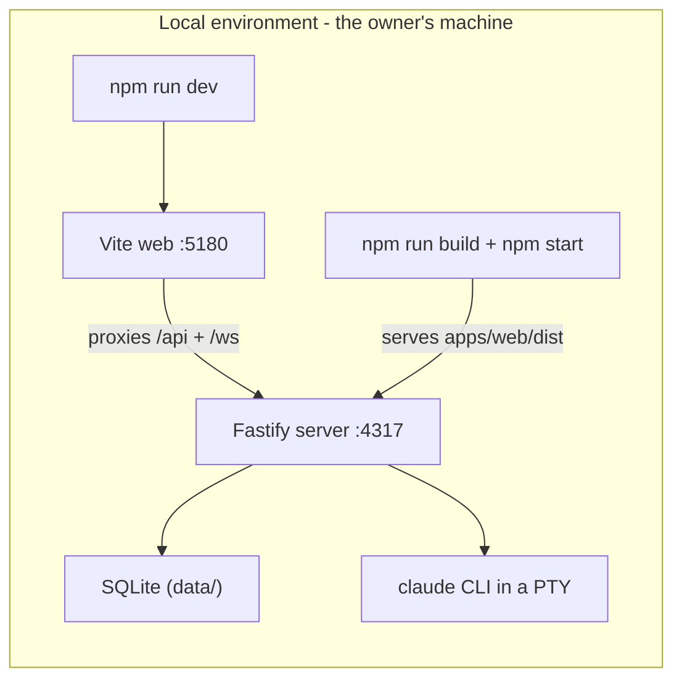

# Environments — where everything runs and where every setting lives

This app has exactly one environment: your own machine. Everything below was detected from the repo and cited — nothing invented.

- **One environment, two ways to run it:** `npm run dev` (web page on 5180, talking to the server on 4317) for daily work, or `npm run build && npm start` (server alone on 4317 serving the built page) — same machine, same data either way.
- **Eleven settings, all optional:** every one has a sensible built-in default (`SDLC_PORT`, `SDLC_HOST`, where the data folder lives, which `claude` and `python3` to use, log level, and the opt-in tracing switches). You only ever set them in your shell.
- **Zero secrets:** the app holds no API keys or passwords — the Claude CLI brings its own login. If a secret ever appears, it goes in your shell or an untracked `.env` (already gitignored), never the repo.
- **No deploy pipeline, no feature flags, no infra config** — by design, for a local-first tool.
- **Quick health check:** `curl -s http://127.0.0.1:4317/api/health`

Machine source of truth: [.ai/environments.md](../../.ai/environments.md). Re-run `/environments` whenever a change adds a setting.

*(Autonomous dogfood note: the row-by-row confirmation was auto-accepted; every row carries a file:line citation in the machine file.)*
