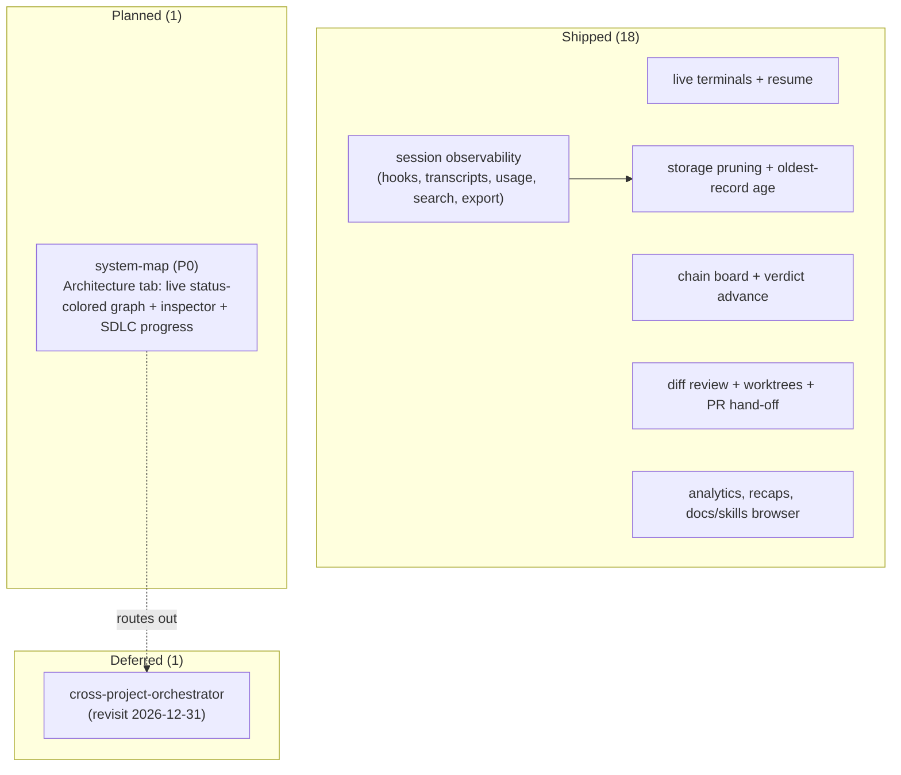

# Features — what the app does today, and what's next

**Verdict: READY-FOR-PRD** — the inventory is cataloged (18 shipped capabilities) and one new feature, `system-map`, is registered and queued to build next.

**What already ships:** the full mission-control loop — live Claude terminals with resume, complete session observability (hooks, transcripts, chat view, token/cost telemetry, subagent trees, recaps, search, export), the chain board that advances on verdicts, diff review, worktree isolation, human-gated PR hand-off, analytics, the docs/skills browser, and (most recently) age-based storage pruning with oldest-record ages. All three roadmap tiers landed by 2026-06-12.

**What's next (the build queue):**
1. **system-map (P0)** — a new **Architecture** tab that renders the project's *real* components and how they connect as a live, status-colored graph (sourced from `.ai/architecture/`), with a component inspector (role, inputs/outputs, files, owner, the feature + slices + issues each box maps to) and an SDLC-progress view over the existing chain stages. It already has a full spec (PRD → design → plan → ADR), so its next step is `/to-issues`, not another round of design. It's the first slice of a longer "living software digital twin" vision.

**What got cut, and why:**
- The **cross-project orchestrator** (the per-project conductor / run-on-confirm + multi-session fleet) is **deferred to 2026-12-31** — it's a separate feature, deliberately out of `system-map`'s scope so the first slice stays a *renderer*, not an automation engine.
- The **portfolio / multi-project switcher** is also routed out to its own future feature (no date yet).
- Inside `system-map` itself: code↔model **drift detection** and the extra graph views (Agent-Activity, Data-Flow, Dependency-Matrix) are fast-follows — the schema reserves them, but v1 ships the declared-model renderer only.

Machine source of truth: [.ai/features.md](../../.ai/features.md).

*(`system-map` is a `beyond_roster` registration: it was specified end-to-end during the v2 prototype exploration before it had a roster row. It traces to three shipped components — `DeriveProjectState`, `RenderFlightDeck`, `ShareDomainModel` — and a new journey, `orient-on-system-shape`, that should be folded into `understanding.md` on the next pass.)*
