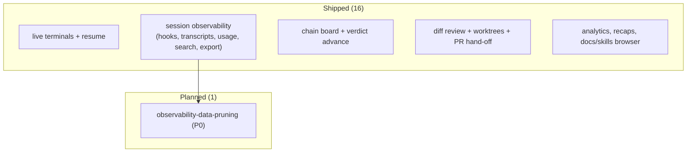

# Features — what the app does today, and what's next

**Verdict: READY-FOR-PRD** — the inventory is cataloged (16 shipped capabilities) and one new feature is queued.

**What already ships:** the full mission-control loop — live Claude terminals with resume, complete session observability (hooks, transcripts, chat view, token/cost telemetry, subagent trees, recaps, search, export), the chain board that advances on verdicts, diff review, worktree isolation, human-gated PR hand-off, analytics, and the docs/skills browser. All three roadmap tiers landed by 2026-06-12.

**What's next (the build queue):**
1. **observability-data-pruning (P0)** — the watching-everything design means the local database only ever grows: every hook event, usage sample, and transcript copy is kept forever. This adds an age-based cleanup you control from the UI — the retention lifecycle the data policy flagged as missing.

Machine source of truth: [.ai/features.md](../../.ai/features.md).

*(Autonomous dogfood note: the inventory was confirmed against recon citations and the built-roadmap record; the new planned feature was chosen from this run's own findings, not a live interview.)*
