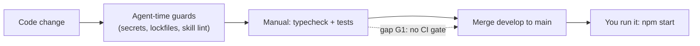

# Pipeline — what stands between a code change and you

Honest answer: today, mostly your own discipline. There is no CI — checks run when you run them. The two things that *are* mechanically enforced happen at agent-time: secrets and lockfiles can't be edited by an agent (the path guard), and skill edits get linted.

- **Runs today, manually:** `npm run typecheck` and `npm test` (157+ tests) — nothing forces them before a merge.
- **Enforced automatically:** secrets never enter git (gitignore + the path-guard hook), lockfiles stay tool-managed.
- **The three gaps against the mvp bar** (your call — route as work or waive on the record): no pre-merge test gate (G1), no dependency-update automation (G2), branch protection unverifiable from this machine (G3).
- **Deploy & rollback:** there's nothing to deploy to — you run it locally; rollback is `git revert` + restart, and the local database is rebuildable.

Machine source of truth: [.ai/pipeline.md](../../.ai/pipeline.md).

*(Autonomous dogfood note: all three gaps left `open` rather than waived — waiving is yours to do, on the record.)*
