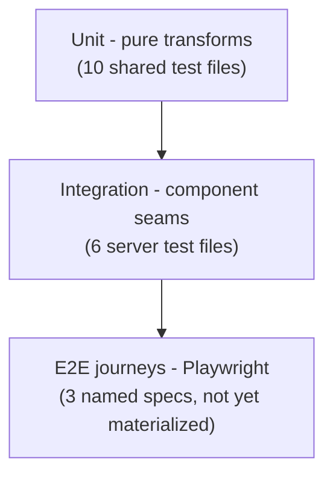

# Test strategy — how tests get data and how journeys stay covered

The repo already had good testing instincts; this locks them in writing: fast unit tests on the pure logic, integration tests wherever components touch, and one named (future) browser test per user journey.

- **What exists today:** 16 vitest files — the shared package's pure transforms are the heavily-tested core; six server suites cover the risky seams (permission flags, hook settings, docs path-escapes, search).
- **How a test gets example data:** little `make<Entity>(overrides)` builder functions — the pattern the repo already uses. One builder per entity, promoted to a shared spot the second time anyone needs it.
- **Databases in tests:** every db-touching test gets its own throwaway folder (fresh SQLite via `SDLC_DATA_DIR`) — never your real data. And tests never spawn the real `claude`/`python3`/`gh`.
- **Browser journeys:** the three core journeys each have a named Playwright spec file reserved; the tool itself isn't installed yet — adopting it is an ordinary slice the next time a feature touches a journey. Until then, journey coverage is a manual click-through.
- **No web component tests yet** — acknowledged gap; the vitest config grows a `web` project the day the first one exists.

Machine source of truth: [.ai/test-strategy.md](../../.ai/test-strategy.md).

*(Autonomous dogfood note: recovered conventions confirmed against citations, not a live read-back.)*
