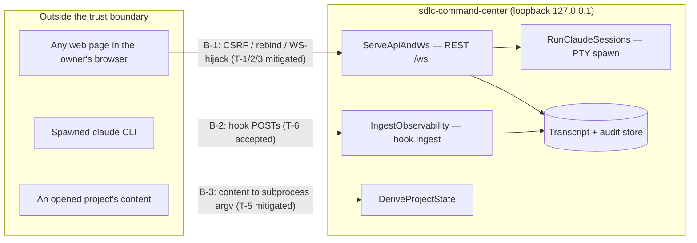

# Threat model — sdlc-command-center (plain-English mirror)

**Bottom line: the dashboard is safe to keep running locally — the one real risk
class (a hostile web page in your browser hijacking the loopback server) was found
by the security review and is now fixed and verified.**

- **Who can attack it:** not someone on the network — the server only listens on
  your own machine. The real attacker is **a malicious web page open in your
  browser** while the dashboard is running, plus, to a lesser degree, **a hostile
  repo you open** in the tool.
- **What was dangerous (now fixed):** a bad web page could quietly tell the
  dashboard to start a Claude session with permissions skipped — i.e. run commands
  on your machine — or open a hidden socket to read your terminals and type into
  them. The "it only listens on localhost" assumption did **not** stop this.
- **What's now in place:** the server refuses any request that comes from a page
  that isn't the dashboard itself, or that's addressed to anything other than your
  local machine; the live socket refuses foreign pages the same way; and session
  "resume" ids are checked so they can't be used to read stray files. Verified on a
  running server.
- **What was already safe:** the places where the app shells out to `git`, `bd`,
  `python`, and `claude` were checked and found solid — a hostile repo can't sneak
  an extra command-line flag in.
- **What we accepted:** another program already running on your machine could post
  fake telemetry events — low impact, and the endpoint has to stay open for
  Claude's own hooks. Recorded, not fixed.

Full register (boundaries, scores, routed fixes): [`.ai/architecture/threat-model.md`](../../.ai/architecture/threat-model.md).
