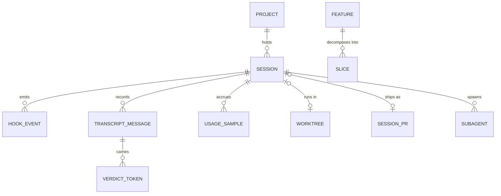
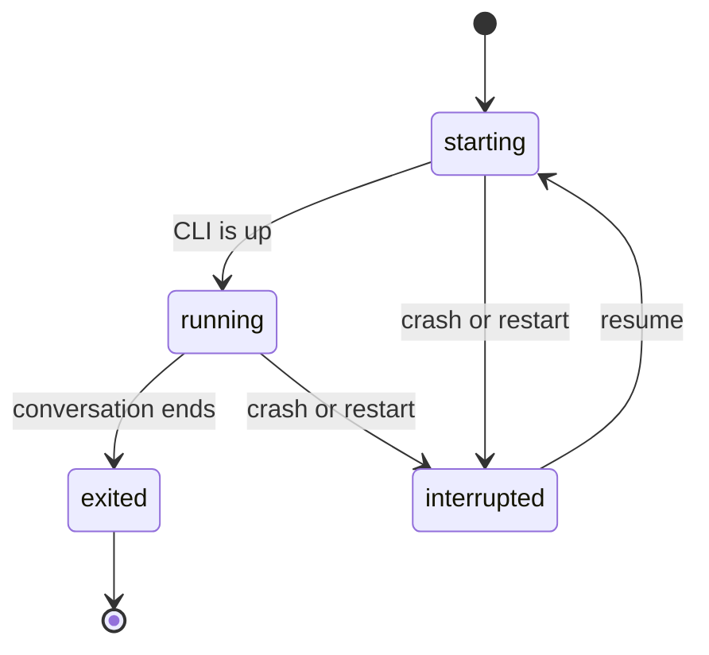
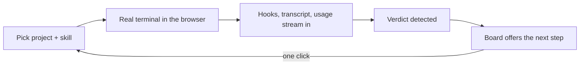

# Understanding — what the Command Center is, in plain words

One developer's mission control for AI-assisted building: it runs real Claude terminals in the browser, watches everything they do (hooks, transcripts, token usage), and turns the SDLC chain's verdicts into a board you advance one approved click at a time.

**The rules that always hold** (the code defends every one of these):
- Watching never interferes — observability can't slow down or break a session.
- Nothing is ever lost to a crash — interrupted sessions resume exactly where they stopped.
- The pipeline never lies — an unrecognized verdict advances nothing.
- Work leaves your machine only through your explicit yes (PR creation is gated, never forced).
- The app never gets confused by watching itself (its own output is excluded from its watchers).

**How the pieces relate:**

**A session's life:**

**The main loop you live in:**

**Still open** (recorded as testable assumptions in the machine file): whether the app's two hook systems compose cleanly when it manages its own repo; how far self-hosting is meant to go; and whether the two undocumented permission modes are meant for the UI.

**Resolved 2026-06-20:** the PTY-only billing premise was re-checked — Anthropic *paused* the separate Agent SDK billing change on 2026-06-15, the day it was due to take effect, so it is not in force (a deferred risk, not a live one). The interactive-PTY decision now rests on its durable benefits. See ADR-0001's "Update — 2026-06-20".

Machine sources of truth: [.ai/understanding/sdlc-command-center.md](../../.ai/understanding/sdlc-command-center.md) · [.ai/context.md](../../.ai/context.md)

*(Autonomous dogfood note: confirmations came from the project's own records — ADRs, README, handoffs — not a live interview.)*
