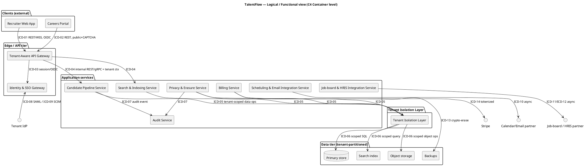

# TalentFlow — Phase 04 Architecture & Design

Turns the SRR-baselined requirements ([`../Phase_02_Requirements/SysRS.md`](../Phase_02_Requirements/SysRS.md)) and the Phase 01 problem-space ([`../Phase_01_Concept/Concept.md`](../Phase_01_Concept/Concept.md)) into an agreed, view-based **architecture description** (ISO/IEC/IEEE 42010:2022), freezes every component seam in an **Interface Control Document (ICD)**, and justifies the technology stack. Exit gate: **PDR** (Conventions §3), which sets the **allocated baseline** (architecture + requirement-to-block allocation + ICD draft).

This document conforms to [`../../../05_Conventions.md`](../../../05_Conventions.md) for all IDs, gates, baselines, T/I/A/D methods, S1–S4 severity, status strings (§6), PlantUML conventions (§7), and standard citations (§9) — it cites that contract, never redefines it.

> **Phase 03 note.** The MBSE model (`Phase_03_Modeling/`) is not yet drawn. Architecture blocks below reuse the **intended top-level blocks named in SysRS §12.1** as their authoritative names; each is tagged `TODO: add to BDD` so Phase 03 can backfill the BDD/IBD without renaming. No phantom blocks are introduced — every block here either appears in SysRS §12.1 or is marked as a new block owing a BDD entry.

---

## 1. Scope & context

TalentFlow is a **cloud-native, multi-tenant B2B SaaS Applicant Tracking System** (SysRS §2): recruiter web app + public careers portal at the edge, a set of tenant-aware application services, an Identity & SSO Gateway, a Tenant Isolation Layer enforcing tenant-scoped authorization on every data path, and a tenant-partitioned data tier (primary store, search index, object storage, backups). It operates **multi-tenant shared with logical isolation** — a tenant's users only ever transit, read, and write that tenant's data.

This phase decides **which blocks exist, how they relate, and the rules that guide them** (architecture), and freezes the **seams between independently developed/owned components** (ICD). How any single block is implemented internally is detailed design and is deferred. The five strategic decisions that set isolation depth, erasure strategy, availability topology, identity build-vs-buy, and search platform (SysRS §12.2: `DM-01..05` / `DEC-01..05`) are **named here and owned by Phase 05** — this phase records them as `DEC-*` candidates with the constraints the architecture imposes.

Boundary conditions inherited from Concept §3 and SysRS §8 (must not be violated by any view below): cloud-only, no on-premise/self-hosted (`REQ-C-01`); payment confined to tokenized Stripe, SAQ-A (`REQ-C-02`); GDPR/CCPA processor obligations under a DPA (`REQ-D-01`); SOC 2 Type II + ISO/IEC 27001:2022 control program (`REQ-D-02`).

---

## 2. Architecture principles

Stable rules every later decision (Phase 05 trade-offs, Phase 06 integration, detailed design) is checked against. Each has a rationale and a derived design guideline.

| # | Principle | Rationale | Derived design guideline |
|---|---|---|---|
| **AP-01** | **Tenant isolation is the prime directive — deny by default, scope by tenant on every path.** | Cross-tenant leakage is the catastrophic trust + legal failure (`RSK-01`, `MOE-02` target 0). A single un-scoped query is a breach. | Every data-access call carries an authenticated tenant context; the Tenant Isolation Layer is in the path of **all** reads/writes — no service queries the data tier directly. Satisfies `REQ-SEC-01`. |
| **AP-02** | **Privacy by design — PII is tracked, minimised, and erasable end-to-end.** | GDPR/CCPA processor duty; erasure must reach the search index, object store, and backups, not just the primary row (`RSK-02`, `REQ-SEC-08`). | Every store that can hold PII registers with the Privacy & Erasure Service and exposes a cascade-erase hook; backups use per-tenant/per-subject keys so crypto-erase is possible. |
| **AP-03** | **Zero-trust across every boundary — authenticate and authorize service-to-service, not just user-to-edge.** | A flat internal network turns one compromised service into a tenant-wide breach; ISO 27001 / NIST SP 800-53 AC/SC controls. | mTLS + short-lived workload identity between services; no implicit trust by network location; secrets from a managed vault, never in images. |
| **AP-04** | **Standards-based, versioned interfaces only.** | Identity, billing, and integration partners are external and long-lived (`REQ-INT-*`); ad-hoc seams rot and break recruiter workflows (`RSK-04`). | Every external seam uses a named standard (SAML/SCIM/OIDC/OpenAPI) and a versioning rule; internal seams use OpenAPI 3.1 / Protobuf with semver + backward compatibility. |
| **AP-05** | **Degrade gracefully — protect the core pipeline; queue the rest.** | A calendar/email/job-board outage must not block stage transitions (`SCN-04`, `REQ-U-03`, `REQ-INT-04`). | Non-critical integrations are asynchronous (queue + retry, idempotent); the core read/write path has no synchronous dependency on a third-party API. |
| **AP-06** | **Fail-safe data integrity — when in doubt, go read-only, never lose a write.** | The Read-Only/Safe mode (SysRS §9) exists to protect candidate data during incidents. | Writes are transactional and idempotent; the platform can flip to Read-Only/Safe per tenant or globally without data loss; RTO ≤ 15 min / RPO ≤ 5 min (`REQ-O-02`). |
| **AP-07** | **Reuse before buy, buy before build — especially identity and payments.** | Hand-rolled SAML/SCIM or PAN handling is pure liability with no differentiation (`REQ-INT-03`/`C-02`, `DEC-04`). | Default to managed/commodity services for identity brokering, payments, KMS, queues; build only the differentiators (isolation, privacy, pipeline UX). |
| **AP-08** | **Observable and auditable by construction — every PII access is logged tamper-evidently.** | SOC 2 / GDPR Art. 30 evidence and `MOE-06` audit readiness depend on it (`REQ-SEC-04`, `REQ-D-02`). | All services emit structured, tenant-tagged logs/metrics/traces; PII-access events flow to the append-only Audit Service synchronously with the access. |
| **AP-09** | **Elastic and cost-bounded per tenant — no noisy neighbours.** | One tenant's load must not push another's p95 past target (`REQ-P-04`, `RSK-03`). | Per-tenant rate limits and resource quotas at the gateway and data tier; horizontal, stateless application services behind autoscaling. |
| **AP-10** | **Accessible by default.** | Recruiters and candidates with disabilities are first-class users (`REQ-U-02`, `SN-12`). | WCAG 2.2 AA is a definition-of-done gate on every UI component, not a later retrofit. |

> Principle conflicts surfaced: **AP-05 (degrade) ↔ AP-08 (audit synchronously)** — resolved by routing audit writes through a durable, low-latency append path that is itself part of the core (never a best-effort third party), so audit completeness is preserved even in Degraded mode. **AP-02 (erasure) ↔ AP-08 (retain audit)** — resolved per SysRS §13: erase candidate **PII** while lawfully retaining non-PII audit **metadata** (`REQ-SEC-08` vs `REQ-SEC-04`).

---

## 3. Stakeholders & concerns

Reuses `STK-01..09` from Concept §2. Each concern is phrased as a question this architecture must answer, tied to a REQ/MOE, and framed by the viewpoint (§5) that produces the answering view.

| STK | Stakeholder | Architecture concern (question) | Linked REQ / MOE | Framed by viewpoint → view |
|---|---|---|---|---|
| **STK-01** | Recruiter | Will the pipeline stay fast and never lose my work, even when an integration is down? | `REQ-F-01`, `REQ-P-01/02`, `REQ-U-03` / `MOE-01` | Logical; Operational/Behavioural (Degraded) |
| **STK-02** | Hiring Manager | Can I see the right candidate and capture a scorecard quickly and fairly? | `REQ-F-03` / `MOE-01` | Logical |
| **STK-03** | Candidate (data subject) | Is my PII isolated, minimised, and truly erasable on request? | `REQ-SEC-08`, `REQ-SEC-06/07`, `REQ-U-02` / `MOE-03` | Information/Data; Security/Trust-boundary |
| **STK-04** | Customer Admin | Is my tenant's data isolated, and does sign-in/provisioning flow through my IdP? | `REQ-SEC-01`, `REQ-INT-01/02`, `REQ-SEC-02` / `MOE-02` | Security/Trust-boundary; Logical |
| **STK-05** | Security & Privacy Officer | Is the attack surface acceptable, is data encrypted with per-tenant keys, and is erasure provable for audit? | `REQ-SEC-01/03/04/08`, `REQ-D-01/02` / `MOE-02/03/06` | Security/Trust-boundary; Information/Data |
| **STK-06** | Product / Business Owner | Does the stack scale with tenants at bounded cost and short time-to-value? | `REQ-P-03`, `REQ-INT-02` / `MOE-05/07` | Deployment; Technology |
| **STK-07** | SRE / Platform | Will it hit 99.9% with AZ-failover, contain blast radius, and avoid noisy-neighbour collapse? | `REQ-O-01/02/03`, `REQ-P-03/04` / `MOE-04/05` | Deployment; Operational/Behavioural |
| **STK-08** | Integration Partner | Are the external seams stable, authenticated, rate-aware, and fail-safe? | `REQ-INT-04`, `REQ-F-05/06/07/08` | Logical; Security/Trust-boundary (external seams) |
| **STK-09** | Regulator / Auditor | Can lawful processing, access logging, and erasure be evidenced on demand? | `REQ-SEC-04`, `REQ-D-01/02` / `MOE-06` | Information/Data; Security/Trust-boundary |

**Concern coverage check (PDR criterion):** every concern above is addressed by at least one view in §5. No orphan concerns.

---

## 4. Frameworks used (complementary, not single-select)

Per the Phase 04 framework decision aid, four frameworks are layered, each answering a different question:

- **C4 model** answers *what is the software structure?* — it is the primary lens for §5's Logical (Container/Component) and Deployment views, and it pairs cleanly with the PlantUML convention (Conventions §7). TalentFlow is software-dominant, so C4 carries most of the descriptive weight.
- **arc42** answers *how do we structure the architecture document?* — this combined document follows the arc42 spine (context → constraints → solution strategy/principles → building blocks → runtime/deployment → cross-cutting concepts → decisions → risks), mapped onto the 42010 skeleton.
- **TOGAF ADM** is the **governing process**: this phase is ADM Phase **C (Application/Data Architecture)** and **D (Technology Architecture)**, with **Requirements Management at the centre** tying back to the SRR-baselined SysRS. Phase 05 (trade-offs) plays the ADM "decision/governance" role; Phase 06 plays ADM **F/G (Migration/Implementation Governance)**.
- **AWS Well-Architected** is used as a **review checklist** for the cloud tier (security, reliability, performance-efficiency, cost-optimisation, operational-excellence pillars) against `REQ-O-*`/`REQ-P-*` — it does not structure the document, it audits the deployment view.

Zachman and NIST EA are **not** instantiated: a single-product multi-tenant SaaS does not need Zachman's 6×6 enterprise coverage taxonomy or NIST EA's federal-program layering. Recorded as "tailored out: single-product scope; C4 + arc42 give sufficient coverage."

---

## 5. Viewpoints & views

Five viewpoints are instantiated because §3 concerns demand them: **Logical/Functional**, **Physical/Deployment**, **Security/Trust-boundary**, **Information/Data**, and **Operational/Behavioural**. (Technology concerns are answered by §9 Tech-Stack Rationale rather than a separate diagram.) Each view answers named concerns; PlantUML sources are named `Architecture_<viewpoint>.puml` and are `TODO:` to render in Phase 03 alongside the BDD/IBD.

### 5.1 Logical / Functional view → `Architecture_Logical.puml`

**Addresses concerns of:** STK-01, STK-02, STK-04, STK-08. **Answers:** *which services exist and how does a request flow?*

The system decomposes into the SysRS §12.1 blocks, grouped into four logical layers. Every request enters through the **Tenant-Aware API Gateway** (new block — `TODO: add to BDD`), is authenticated against the **Identity & SSO Gateway**, and **all data access is mediated by the Tenant Isolation Layer** — application services never reach the data tier directly (AP-01).



**Block roster (all from SysRS §12.1 unless flagged new):** Recruiter Web App, Careers Portal, Identity & SSO Gateway, Tenant Isolation Layer, Candidate Pipeline Service, Search & Indexing Service, Scheduling & Email Integration Service, Job-board & HRIS Integration Service, Privacy & Erasure Service, Audit Service, Billing Service; plus **Tenant-Aware API Gateway** (new — `TODO: add to BDD`) and the data-tier elements (Primary store, Search index, Object storage, Backups — `TODO: add to BDD as data-tier blocks`).

### 5.2 Physical / Deployment view → `Architecture_Deployment.puml`

**Addresses concerns of:** STK-06, STK-07. **Answers:** *will it hit 99.9% with AZ-failover, contain blast radius, and scale at bounded cost?*

Blocks are placed in zones; **trust boundaries are drawn as `package`s** (these seed §6 / the Security thread). Topology is **multi-AZ within a region, with active-passive cross-region failover** as the candidate satisfying `REQ-O-02` (RTO ≤ 15 min / RPO ≤ 5 min) — the active-active vs active-passive choice is `DEC-03` (owned by Phase 05; the architecture only requires that whatever is chosen meets `REQ-O-01/02`).

```plantuml
@startuml talentflow_Architecture_Deployment
title TalentFlow — Physical / Deployment view (multi-AZ, active-passive DR)
package "Clients (untrusted)" {
  [Recruiter browser]
  [Candidate device]
}
package "Edge (trust boundary: public)" {
  [CDN / WAF]
  [Tenant-Aware API Gateway]
}
package "Cloud — Region A (trust boundary: backend, AZ-redundant)" {
  [Identity & SSO Gateway]
  [Tenant Isolation Layer]
  [Application services (stateless, autoscaled)]
  [Message queue]
  database "Primary store (multi-AZ, per-tenant keys)"
  [Search index]  [Object storage]  [KMS / Vault]  [Audit store (append-only)]
}
package "Cloud — Region B (trust boundary: DR, warm standby)" {
  database "Primary store replica"
  [Object storage replica] [Backups (per-tenant key)]
}
package "External (trust boundary: third-party)" {
  [Tenant IdP] [Calendar/Email] [Job-board] [HRIS] [Stripe]
}
[Recruiter browser] --> [CDN / WAF] : "TLS 1.2+"
[Candidate device] --> [CDN / WAF] : "TLS 1.2+"
[CDN / WAF] --> [Tenant-Aware API Gateway]
[Tenant-Aware API Gateway] --> [Application services (stateless, autoscaled)] : "mTLS"
"Primary store (multi-AZ, per-tenant keys)" --> "Primary store replica" : "async replication (RPO ≤ 5 min)"
@enduml
```

**Well-Architected check (pillars vs REQ):** Reliability — multi-AZ + DR replica meets `REQ-O-01/02`; Performance — stateless autoscaled services + per-tenant quotas meet `REQ-P-03/04`; Security — per-tenant KMS keys, WAF, mTLS meet `REQ-SEC-03`; Cost — autoscaling + per-tenant quotas bound `MOE-05` cost-per-tenant; Operational excellence — zero-downtime staged deploys meet `REQ-O-03`.

### 5.3 Security / Trust-boundary view → `Architecture_Security.puml`

**Addresses concerns of:** STK-03, STK-04, STK-05, STK-08, STK-09. **Answers:** *is the attack surface acceptable; is cross-tenant access impossible; is data encrypted per-tenant?*

Four trust boundaries: **public** (untrusted clients → edge), **backend** (edge → internal services), **data** (services → data tier, mediated by the Tenant Isolation Layer), and **third-party** (internal → external partners). Every boundary-crossing seam in the ICD (§7) carries an auth mechanism and is handed to the Security thread as a threat (`THR-*`, `TODO:` to enumerate via STRIDE in the Security thread).

```plantuml
@startuml talentflow_Architecture_Security
title TalentFlow — Security / Trust-boundary view
package "Untrusted" { [Recruiter browser] [Candidate device] [Attacker] }
package "Boundary: PUBLIC" { [CDN/WAF] [API Gateway] }
package "Boundary: BACKEND (zero-trust, mTLS)" {
  [Identity & SSO Gateway] [Application services] [Tenant Isolation Layer]
}
package "Boundary: DATA (tenant-scoped, per-tenant keys)" {
  database "Primary store" [Search index] [Object storage] [Audit store] [KMS]
}
package "Boundary: THIRD-PARTY" { [Tenant IdP] [Stripe] [Calendar/Email/Job-board/HRIS] }
[Attacker] ..> [CDN/WAF] : "blocked: WAF, rate-limit, CAPTCHA"
[API Gateway] --> [Identity & SSO Gateway] : "OIDC session  (THR: token replay)"
[Application services] --> [Tenant Isolation Layer] : "tenant ctx propagated  (THR: ctx forgery)"
[Tenant Isolation Layer] --> "Primary store" : "scoped queries only  (THR: cross-tenant read)"
@enduml
```

Candidate threats seeded for the Security thread (each `→ THR-TBD`): cross-tenant read/write via missing scope (→ `REQ-SEC-01`, `RSK-01`); tenant-context forgery between services (→ AP-03); SAML assertion replay / audience confusion (→ `REQ-INT-01`); erasure bypass leaving PII in index/backups (→ `REQ-SEC-08`, `RSK-02`); audit-log tampering (→ `REQ-SEC-04`).

### 5.4 Information / Data view → `Architecture_Information.puml`

**Addresses concerns of:** STK-03, STK-05, STK-09. **Answers:** *where does PII live, how is it isolated and keyed, and how is it erased and evidenced?*

Every datum is **tenant-partitioned and classified**. PII (candidate profile, attachments, communications) is registered with the Privacy & Erasure Service so a single erasure request (`SCN-03`, `REQ-SEC-08`) cascades across **primary store → search index → object storage → backups**. At-rest encryption uses **per-tenant KMS keys** (`REQ-SEC-03`), which makes per-tenant **crypto-erase** the mechanism for the backup tier (`DEC-02`, owned by Phase 05). Audit metadata is non-PII and retained lawfully even after PII erasure (AP-02/AP-08 conflict resolution).

| Data class | Stores | Isolation | Encryption | Erasure path | REQ |
|---|---|---|---|---|---|
| Candidate PII (profile, attachments, comms) | Primary store, Object storage, Search index, Backups | tenant_id partition + per-tenant key | AES-256 at rest, per-tenant key | cascade delete + crypto-erase ≤ 30 d | `REQ-SEC-03/07/08`, `REQ-O-04` |
| Tenant config (SSO, roles, integrations) | Primary store | tenant partition | per-tenant key | on offboarding (`SCN-05`) | `REQ-SEC-02`, `REQ-C-01` |
| Audit metadata (actor, tenant, action, ts) | Audit store (append-only) | tenant-tagged | tamper-evident | retained (non-PII) | `REQ-SEC-04`, `REQ-D-02` |
| Billing tokens (no PAN) | Billing Service / Stripe | tenant-scoped customer ref | Stripe-tokenized | with tenant offboarding | `REQ-INT-03`, `REQ-C-02` |

### 5.5 Operational / Behavioural view → `Architecture_Operational.puml`

**Addresses concerns of:** STK-01, STK-07. **Answers:** *what happens when a dependency or zone degrades?*

Implements the SysRS §9 modes (Nominal / Degraded / Read-Only-Safe / Maintenance / Offboarding-EOL). Health checks drive **Nominal ⇄ Degraded** automatically: when a non-critical integration (calendar/email/job-board/HRIS) fails, its work **queues and retries** (AP-05, `REQ-INT-04`) while core pipeline read/write continues; the affected workflow surfaces the degraded state (`REQ-U-03`). On an AZ failure, traffic shifts within-region; on a region failure, active-passive failover engages (`REQ-O-02`). A severe data-integrity incident flips the tenant or platform to **Read-Only/Safe** (AP-06) until sign-off. This view pairs with the Phase 03 State Machine and Activity diagrams (`TODO: cross-link when drawn`).

---

## 6. Requirement-to-block allocation (the allocated baseline)

Every functional/performance/interface/security/operational REQ lands on ≥ 1 block; every block carries ≥ 1 REQ. No orphan blocks, no unallocated REQs (PDR criterion). Blocks reuse SysRS §12.1 names; `†` marks a block owing a BDD entry (`TODO: add to BDD`).

| Block | Allocated REQs | Satisfies SN |
|---|---|---|
| **Recruiter Web App** | `REQ-U-01`, `REQ-U-03` | SN-01 |
| **Careers Portal** | `REQ-F-04`, `REQ-U-02` | SN-01, SN-12 |
| **Tenant-Aware API Gateway †** | `REQ-P-04`, `REQ-O-01`, `REQ-INT-04` (rate-limit/fail-safe), `REQ-SEC-05` (MFA enforce) | SN-06, SN-07, SN-08 |
| **Identity & SSO Gateway** | `REQ-INT-01`, `REQ-INT-02`, `REQ-SEC-05` | SN-03, SN-08 |
| **Tenant Isolation Layer** | `REQ-SEC-01`, `REQ-SEC-03`, `REQ-C-01`, `REQ-P-04` | SN-04, SN-07 |
| **Candidate Pipeline Service** | `REQ-F-01`, `REQ-F-03`, `REQ-P-02` | SN-01, SN-02 |
| **Search & Indexing Service** | `REQ-F-02`, `REQ-P-01` | SN-01, SN-07 |
| **Scheduling & Email Integration Service** | `REQ-F-05`, `REQ-F-06`, `REQ-INT-04` | SN-09 |
| **Job-board & HRIS Integration Service** | `REQ-F-07`, `REQ-F-08`, `REQ-INT-04` | SN-09 |
| **Privacy & Erasure Service** | `REQ-SEC-06`, `REQ-SEC-07`, `REQ-SEC-08`, `REQ-O-04`, `REQ-D-01` | SN-05 |
| **Audit Service** | `REQ-SEC-04`, `REQ-D-02` | SN-10 |
| **Billing Service** | `REQ-INT-03`, `REQ-C-02` | SN-11 |
| **Data tier (Primary/Index/Object/Backups) †** | `REQ-SEC-03`, `REQ-O-02` (replication), `REQ-O-04` | SN-04, SN-05, SN-06 |
| **Platform / SRE (cross-cutting, deployment) †** | `REQ-O-01`, `REQ-O-02`, `REQ-O-03`, `REQ-P-03` | SN-06, SN-07 |

**Allocation completeness:** all 35 SysRS REQs are covered. Cross-cutting REQs (`REQ-O-01/02/03`, `REQ-P-03`) are allocated to the Platform/SRE deployment concern (§5.2) plus the gateway; `REQ-D-01/02` allocated to Privacy & Erasure and Audit respectively.

---

## 7. Interface Control Document (ICD) — Draft

> **Status: Draft** at PDR (part of the allocated baseline). The ICD is **frozen → `Baseline (CDR-approved YYYY-MM-DD)`** in Phase 06 as part of the product baseline (Conventions §3). Change control thereafter via `CR-<nn>` (Phase 09).

### 7.1 Scope

This ICD defines every **seam where two independently developed/owned components meet** — i.e. each cross-boundary edge in §5.1/§5.2. Internal couplings inside a single block belong to the IBD (Phase 03), not here. It is the contract used by integration testing in Phase 06.

### 7.2 Interface inventory

| ICD-ID | Sender → Receiver | Layer | Standard / format | Direction | Rate | Security | Failure mode | Trust-boundary? | Linked REQ |
|---|---|---|---|---|---|---|---|---|---|
| **ICD-01** | Recruiter Web App → API Gateway | Application | REST + WSS, OpenAPI 3.1 / JSON | Bi | event-driven; ≤ 60 req/min/user | OIDC bearer (OAuth 2.0), TLS 1.2+ | 401/429 w/ Retry-After; reconnect WSS | Y (public) | `REQ-U-01`, `REQ-P-01`, `REQ-INT-04` |
| **ICD-02** | Careers Portal → API Gateway | Application | REST, OpenAPI 3.1 / JSON | In | event-driven, public | Public + CAPTCHA + WAF, TLS 1.2+ | reject + retry; idempotent submit | Y (public) | `REQ-F-04`, `REQ-U-02` |
| **ICD-03** | API Gateway → Identity & SSO Gateway | Application | OIDC / session introspection, JSON | Bi | per request | mTLS (backend), signed session | fail-closed (deny on IdP error) | Y (backend) | `REQ-INT-01`, `REQ-SEC-05` |
| **ICD-04** | API Gateway → Application services | Application | internal REST/gRPC, OpenAPI 3.1 / Protobuf | Bi | event-driven | mTLS + propagated tenant ctx | timeout/retry; circuit-breaker | Y (backend) | `REQ-F-01/02`, `REQ-P-01/02` |
| **ICD-05** | Application services → Tenant Isolation Layer | Application | internal gRPC, Protobuf (tenant ctx mandatory) | Bi | per data op | mTLS; signed tenant context | deny if ctx absent/invalid | Y (backend→data) | `REQ-SEC-01`, `REQ-P-04` |
| **ICD-06** | Tenant Isolation Layer → Data tier | Network/App | scoped SQL / index query / object ops, TLS | Bi | per data op | TLS + per-tenant KMS key, row-level scope | fail-closed; no unscoped query | Y (data) | `REQ-SEC-01`, `REQ-SEC-03`, `REQ-P-01` |
| **ICD-07** | Services → Audit Service | Application | append-only event, JSON Schema | Out | per PII access (synchronous) | mTLS; tamper-evident (hash chain) | block access if audit write fails | Y (backend) | `REQ-SEC-04`, `REQ-D-02` |
| **ICD-08** | Tenant IdP → Identity & SSO Gateway | Application | **SAML 2.0** assertion (HTTP-POST binding) | In | per sign-in | XML-Sig; signature/audience/time validation | reject invalid assertion (`REQ-INT-01`) | Y (third-party) | `REQ-INT-01` |
| **ICD-09** | Tenant IdP → Identity & SSO Gateway | Application | **SCIM 2.0** (RFC 7644), REST/JSON | In | event/periodic; propagate ≤ 60 s | OAuth 2.0 bearer, TLS 1.2+ | retry; reconcile on drift | Y (third-party) | `REQ-INT-02` |
| **ICD-10** | Scheduling & Email Service → Calendar/Email partner | Application | partner REST API (Google/Microsoft Graph) / OpenAPI / JSON | Bi | async, queued | OAuth 2.0, TLS 1.2+ | queue + retry; degrade (`REQ-U-03`) | Y (third-party) | `REQ-F-05/06`, `REQ-INT-04` |
| **ICD-11** | Job-board Service → Job-board partner | Application | partner REST API / JSON | Out | async, queued | OAuth 2.0 / API key, TLS 1.2+ | queue + retry; record posting ref | Y (third-party) | `REQ-F-07`, `REQ-INT-04` |
| **ICD-12** | HRIS Service → Tenant HRIS | Application | partner REST API / JSON (agreed field set) | Out | event (on hire), queued | OAuth 2.0 / mTLS, TLS 1.2+ | confirm receipt; retry; no cross-tenant | Y (third-party) | `REQ-F-08`, `REQ-INT-04` |
| **ICD-13** | Privacy & Erasure Service → Backups | Application | crypto-erase command (per-tenant/per-subject key destroy) | Out | on erasure / offboarding | mTLS; KMS key-destroy | re-issue until proof; audit | Y (data) | `REQ-SEC-08`, `REQ-O-04` |
| **ICD-14** | Billing Service → Stripe | Application | Stripe REST API / JSON, tokenized (SAQ-A) | Bi | event-driven | API key (server-side), TLS 1.2+, no PAN | retry; webhook reconcile | Y (third-party) | `REQ-INT-03`, `REQ-C-02` |

**`REQ-INT-*` coverage:** `REQ-INT-01`→ICD-08; `REQ-INT-02`→ICD-09; `REQ-INT-03`→ICD-14; `REQ-INT-04`→ICD-10/11/12 (and rate-limit/fail-safe on ICD-01). Every external dependency in Concept §3 / SysRS §6 has an ICD row.

### 7.3 Detailed interface specs (load-bearing seams)

#### ICD-05 — Application services ↔ Tenant Isolation Layer (the isolation seam)

| Attribute | Value |
|---|---|
| Transport | internal gRPC over mTLS (backend trust boundary) |
| Message set | `Read(tenant_ctx, query)`, `Write(tenant_ctx, mutation)`, `Cascade(tenant_ctx, subject_id)` — **tenant context is a mandatory, signed field on every call** |
| Auth | mTLS workload identity + signed tenant context (issued by Identity & SSO Gateway at session start; not forgeable by a calling service) |
| Format | Protobuf; `tenant_ctx` absent or failing signature → request denied before any data access |
| Cadence | per data operation (synchronous, in-request) |
| Latency budget | contributes to `REQ-P-01` (read p95 ≤ 400 ms) / `REQ-P-02` (write p95 ≤ 600 ms); TIL overhead budget **TODO: split p95 budget across gateway/TIL/data tier in Phase 06** |
| Failure mode | **fail-closed** — any ambiguity in tenant scope denies the operation (AP-01); never widen scope |
| Versioning | Protobuf field-additive, semver; breaking change → new method, capability-negotiated |
| Crosses trust boundary | Y → `THR-TBD` (tenant-context forgery / cross-tenant scope) |
| Linked REQs | `REQ-SEC-01`, `REQ-P-04`, `REQ-C-01` |

#### ICD-08 — Tenant IdP ↔ Identity & SSO Gateway (SAML SSO)

| Attribute | Value |
|---|---|
| Transport | HTTPS (TLS 1.2+), HTTP-POST binding |
| Standard | **SAML 2.0** assertion; per-tenant SP metadata; signed assertions |
| Auth / validation | XML-Signature verification; **signature, audience (`Audience`), and time (`NotBefore`/`NotOnOrAfter`) validation — reject on any failure** (`REQ-INT-01`) |
| Format | SAML XML; attribute mapping to tenant role model |
| Cadence | per interactive sign-in |
| Latency budget | not user-perf-critical (sign-in); **TODO: no `REQ-P-*` covers SSO latency — confirm acceptable in Phase 06, do not invent** |
| Failure mode | reject invalid/expired assertion; no fallback to local password (fail-closed) |
| Versioning | SAML 2.0 fixed; per-tenant metadata refresh |
| Crosses trust boundary | Y → `THR-TBD` (assertion replay / audience confusion) |
| Linked REQs | `REQ-INT-01`, `REQ-SEC-05` |

#### ICD-13 — Privacy & Erasure Service ↔ Backups (cascade crypto-erase)

| Attribute | Value |
|---|---|
| Transport | internal, mTLS; KMS key-destroy operation |
| Message set | `CryptoErase(tenant_ctx, subject_id | tenant_id)` → destroys the per-tenant/per-subject key so backup ciphertext is irrecoverable |
| Auth | mTLS + authorized erasure request (verified subject identity per `SCN-03`) |
| Format | command + completion proof (audit record) |
| Cadence | on authorized erasure (`SCN-03`) or tenant offboarding (`SCN-05`) |
| Latency budget | **≤ 30 days** end-to-end across all stores (`REQ-SEC-08`, `TPM-04` threshold = legal limit) |
| Failure mode | re-issue until cryptographic proof of completion; failure raises an incident, never silently closes |
| Versioning | n/a (internal command) |
| Crosses trust boundary | Y (data) → `THR-TBD` (erasure bypass leaving recoverable PII, `RSK-02`) |
| Linked REQs | `REQ-SEC-08`, `REQ-O-04`; depends on `DEC-02` (Phase 05 erasure strategy) |

### 7.4 Cross-cutting interface concerns

- **Security / trust boundaries (§5.3):** every ICD row flagged `Y` crosses a boundary and is handed to the Security thread as a `THR-TBD` for STRIDE analysis (`TODO:` enumerate in `cross-cutting/Threat_Model.md`). Auth mechanism named on every row (PDR criterion).
- **Observability:** all internal seams (ICD-04..07) emit tenant-tagged traces; PII-access seams (ICD-06, ICD-07) are mandatory audit points (AP-08).
- **Error handling / degradation:** third-party seams (ICD-10..12, ICD-14) are asynchronous queue-and-retry (AP-05, `REQ-INT-04`); core seams (ICD-04..07) are synchronous fail-closed.
- **Safety:** none — TalentFlow has no safety thread (SysRS §8: Safety class tailored out). No ICD row is safety-relevant.

### 7.5 Change control

ICD frozen at **CDR** (Phase 06); thereafter any change to a message set, schema, auth mechanism, or standard requires a `CR-<nn>` (Phase 09). Each ICD-ID gets a row in the Phase 02 traceability matrix linking satisfying block(s) and verifying `TC-VER-*` (Phase 07).

---

## 8. Architecture decisions (candidates handed to Phase 05)

Architecture-class decisions (they change which blocks exist or how they connect) recorded as `DEC-*` candidates; the weighted decision matrices `DM-*` are owned by Phase 05 (SysRS §12.2). The architecture imposes the constraint each decision must satisfy:

| DEC candidate | Decision | Architecture constraint it must satisfy |
|---|---|---|
| **DEC-01 / DM-01** | Tenant isolation model (shared-schema+RLS vs schema-per-tenant vs DB-per-tenant) | must satisfy AP-01 + `REQ-SEC-01` (zero cross-tenant) at `REQ-P-01` latency and bounded `MOE-05` cost |
| **DEC-02 / DM-02** | Erasure across backups (hard-delete-rewrite vs per-tenant/per-subject crypto-erase) | must satisfy `REQ-SEC-08` ≤ 30 d with auditable proof (ICD-13); per-tenant keys (AP-02) favour crypto-erase |
| **DEC-03 / DM-03** | Multi-region topology (active-active vs active-passive) | must satisfy `REQ-O-01` (99.9%) + `REQ-O-02` (RTO ≤ 15 / RPO ≤ 5) |
| **DEC-04 / DM-04** | Identity build-vs-buy (managed IdP broker vs in-house SAML/SCIM) | AP-07 (reuse before build); must satisfy `REQ-INT-01/02` (ICD-08/09) |
| **DEC-05 / DM-05** | Search/indexing platform with strict tenant partitioning | must satisfy `REQ-F-02` + `REQ-P-01` (p95 ≤ 400 ms) under AP-01 |

---

## 9. Tech-Stack Rationale

For each tier: **Choice · Alternatives considered (≥ 2) · Why this (REQ/principle/constraint)**. Choices respect mandated-tech constraints `REQ-C-01/02`, `REQ-D-01/02`. Where a choice is genuinely a Phase 05 trade (e.g. search platform, isolation model), the entry names the candidate and defers the binding decision to its `DEC-*`.

| Tier | Choice (candidate) | Alternatives considered (≥ 2) | Why this (link REQ / principle / constraint) |
|---|---|---|---|
| **Cloud platform** | Single major hyperscaler, multi-AZ + multi-region (AWS-class) | Multi-cloud; single-AZ | Multi-AZ + DR replica meets `REQ-O-01/02`; cloud-only mandated by `REQ-C-01`. Multi-cloud rejected — see §9.1. |
| **Backend services** | Go (typed, GC-predictable, strong gRPC/HTTP) | Java/Spring; Node/TypeScript | Stateless horizontal scale + predictable p95 for `REQ-P-01/02/03` (AP-09); strong mTLS/gRPC ecosystem for AP-03. Team-skill `TODO: confirm in Phase 00`. |
| **Primary datastore** | Managed PostgreSQL, multi-AZ, per-tenant KMS keys | MySQL; a NoSQL document store | Relational integrity + **row-level security** is the strongest substrate for `REQ-SEC-01` isolation (DEC-01); per-tenant key separation `REQ-SEC-03`; mature PITR for `REQ-O-02` RPO. |
| **Search / index** | Candidate per `DEC-05` (OpenSearch/Elasticsearch-class with per-tenant index/routing) | DB full-text search; a hosted search SaaS | Must hold `REQ-P-01` p95 ≤ 400 ms with strict tenant partitioning (`REQ-F-02`, AP-01). Binding decision deferred to `DEC-05`. |
| **Object storage** | Managed object store, per-tenant prefix + per-tenant key | Store blobs in Postgres; self-managed storage | Scales attachment volume cheaply; per-tenant key enables crypto-erase (ICD-13, `REQ-SEC-08`). |
| **Async / queue** | Managed message queue (at-least-once, idempotent consumers) | Synchronous calls; cron polling | Required for AP-05 degrade-gracefully and `REQ-INT-04` queue-and-retry on partner outage (ICD-10/11/12). |
| **Identity** | Managed IdP broker (SAML/SCIM/OIDC) per `DEC-04` | In-house SAML/SCIM stack; password auth | AP-07 reuse-before-build; satisfies `REQ-INT-01/02` (ICD-08/09) without owning SAML XML-Sig risk. |
| **Payments** | Stripe, tokenized (server-side) | Self-hosted PAN handling; alternate PSP | `REQ-INT-03` / `REQ-C-02` keep PCI scope at **SAQ-A** — no PAN in TalentFlow (ICD-14). |
| **Web / client** | Component framework meeting WCAG 2.2 AA, SSR-capable | Server-rendered templates only; native desktop | `REQ-U-01` task-time + `REQ-U-02` accessibility (AP-10); careers portal needs public SSR/SEO. |
| **API contracts** | OpenAPI 3.1 (REST/WSS) + Protobuf/gRPC (internal) | GraphQL; bespoke JSON-over-HTTP | AP-04 standards-based, versioned seams; named-standard ICD rows (no "JSON over HTTP"). |
| **Crypto / keys** | Managed KMS, per-tenant keys; mTLS workload identity | Application-managed keys; shared key | `REQ-SEC-03` per-tenant separation enables crypto-erase; AP-03 zero-trust mTLS. |
| **Observability / audit** | Structured logs/metrics/traces + append-only, hash-chained audit store | Logs only; audit rows in primary DB | `REQ-SEC-04` tamper-evidence + `REQ-D-02`/`MOE-06` audit readiness (AP-08); ICD-07 synchronous audit. |
| **Infra delivery** | IaC + staged, health-gated deploys with auto-rollback | Manual deploys; big-bang releases | `REQ-O-03` zero-downtime + auto-rollback; reproducible config for SOC 2 (`REQ-D-02`). |

### 9.1 What we are NOT using and why

- **Not multi-cloud / cloud-agnostic abstraction** — adds large operational + isolation-verification surface with no `REQ-*` driver; `REQ-O-01/02` are met by single-cloud multi-AZ + DR. Multi-cloud would dilute the per-tenant KMS/RLS isolation story (AP-01) for marginal availability gain.
- **Not on-premise / self-hosted edition** — explicitly **out of scope** and forbidden by `REQ-C-01` (cloud-only). Self-hosting would fragment the isolation and audit controls SOC 2/`REQ-D-02` depend on.
- **Not in-house SAML/SCIM implementation** — violates AP-07 (reuse-before-build); hand-rolled XML-Signature validation is a high-liability attack surface (assertion replay/audience confusion, `REQ-INT-01`). Use a managed broker (`DEC-04`).
- **Not direct PAN / card handling** — would explode PCI scope beyond SAQ-A, breaching `REQ-C-02`. Stripe tokenization keeps no PAN in TalentFlow (ICD-14).
- **Not a single shared encryption key across tenants** — would make per-tenant crypto-erase impossible and weaken `REQ-SEC-03`/`REQ-SEC-08`; per-tenant KMS keys are mandatory (AP-02).
- **Not best-effort / fire-and-forget audit logging** — `REQ-SEC-04` requires tamper-evident completeness and AP-08 makes audit synchronous with PII access (ICD-07); a lossy log fails `MOE-06` and SOC 2.
- **Not synchronous coupling to third-party integration APIs on the core path** — would let a calendar/email/job-board outage block stage transitions, violating AP-05, `REQ-U-03`, and `REQ-INT-04`. Integrations are async queue-and-retry (ICD-10/11/12).
- **Not client-side / browser-held tenant scoping** — tenant authorization must be server-enforced by the Tenant Isolation Layer on every path (AP-01, `REQ-SEC-01`); trusting a client-supplied tenant id is exactly the cross-tenant defect `RSK-01` warns against.
- **Not AI/ML candidate ranking in v1** — out of scope (Concept §3) and would trigger EEOC/bias-audit + DPIA obligations (`RSK-06`); gated through a fairness/DPIA review before any commitment.

---

## 10. Open risks / TODOs (PDR inputs)

| Item | Status for PDR |
|---|---|
| `RSK-01` Tenant-isolation defect (High) | **Mitigated by design** — AP-01 + Tenant Isolation Layer on every path (ICD-05/06), fail-closed; isolation tests owed in CI (Phase 06). Isolation **model** binding is `DEC-01` (Phase 05). Acceptable for PDR with `DEC-01` as a named entry condition. |
| `RSK-02` Incomplete erasure (Critical) | **Addressed by design** — cascade across all stores + per-tenant crypto-erase (ICD-13, §5.4), `REQ-SEC-08` ≤ 30 d, `TPM-04`. DPIA + `DEC-02` owed before GA. **Critical band — carry as explicit PDR action**, not a blocker, since the design path exists. |
| `RSK-03` SLO miss under load (High) | Per-tenant quotas (AP-09, `REQ-P-04`) + autoscaling + DR topology; load profile (`REQ-P-03`, `MOP-06`, `TPM-03`) is **TODO** (Phase 06). |
| `RSK-04` Integration breakage (High) | AP-05 async degrade + contract tests (Phase 06); ICD-10/11/12 fail-safe. |
| `THR-*` threat enumeration | **TODO** — run STRIDE per §5.3 trust boundary into `cross-cutting/Threat_Model.md`; every `Y` ICD row needs a `THR-NN`. |
| BDD/IBD backfill | **TODO** — Phase 03 must add the `†` blocks (API Gateway, Data tier, Platform/SRE) and draw the five `Architecture_*.puml` views; names are frozen here. |
| Latency budget split | **TODO** — apportion `REQ-P-01/02` p95 across gateway/TIL/data tier in Phase 06 (ICD-05). |
| SSO latency REQ | **TODO** — no `REQ-P-*` covers SAML sign-in latency (ICD-08); confirm acceptable or add a REQ in Phase 02. |

---

## 11. PDR exit-gate check

Clears **PDR** (sets the allocated baseline) when:

- [x] **42010 description complete** — every §3 concern addressed by ≥ 1 view (§5).
- [x] **Architecture principles** stated (AP-01..10), each with rationale + derived guideline (§2).
- [x] **Frameworks** chosen and complementary roles justified (§4: C4 + arc42 + TOGAF ADM + Well-Architected; Zachman/NIST tailored out).
- [x] **Every named block** (SysRS §12.1) appears in the Logical/Deployment views; new blocks flagged `† TODO: add to BDD`.
- [x] **Allocation matrix complete** (§6) — every REQ allocated; no orphan blocks.
- [x] **Every `REQ-INT-*`** and every external dependency has an ICD entry (§7.2).
- [x] **Every ICD row** names a standard, an auth mechanism, a rate, a failure mode, and a REQ link; latency budgets sourced from `REQ-P-*` or marked `TODO:`; trust-boundary flag set (safety flag = none — tailored out).
- [x] **ICD status = `Draft`** (frozen at CDR, Phase 06).
- [x] **Tech_Stack_Rationale** references ≥ 1 REQ/principle per choice; "NOT using" list has 9 specific rejections (§9.1).
- [x] **Trust boundaries drawn** (§5.3); each crossing seam handed to the Security thread as `THR-TBD`.
- [ ] **No open `RSK-*` High/Critical blocking PDR** — `RSK-01` (High) and `RSK-02` (Critical) are **addressed by design** but carry named PDR actions (`DEC-01`, `DEC-02`/DPIA). **TODO: review-board sign-off** that these are actions-not-blockers.

**PDR recommendation:** **Proceed-with-actions** — set the allocated baseline, carrying as explicit actions into Phase 05/06: (1) bind `DEC-01..05`; (2) DPIA + `DEC-02` for erasure; (3) STRIDE → `THR-*`; (4) BDD/IBD backfill of the three `†` blocks and the five `Architecture_*.puml` views; (5) load profile + latency-budget split. Recommend **`se-phase-05-tradeoff`** to make every framework/stack/interface/isolation decision auditable via weighted decision matrices (and a COCOMO II estimate).
