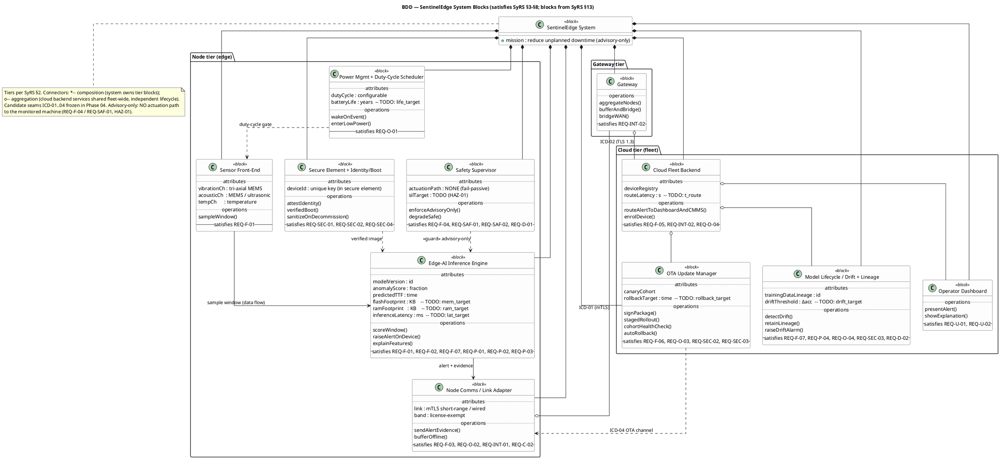
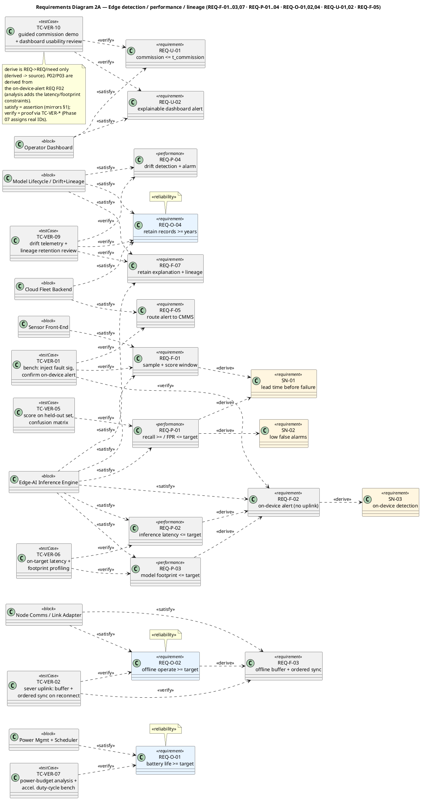
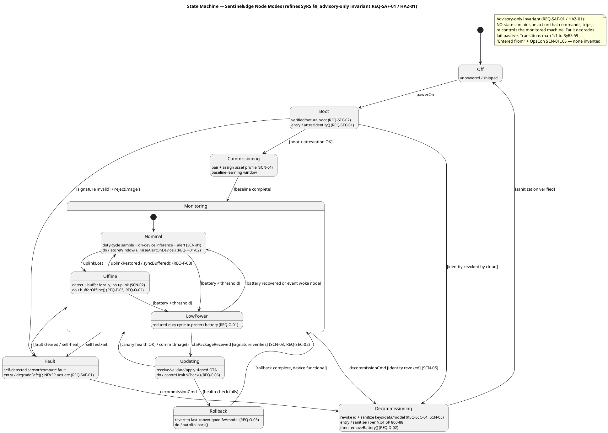
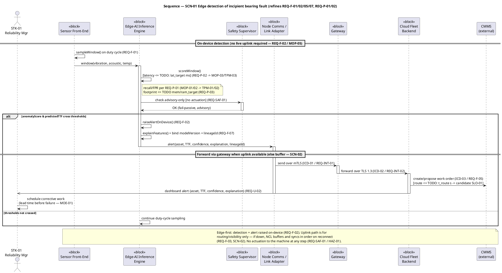

# Phase 03 — Modeling (MBSE): SentinelEdge

This is the SysML single source of truth for SentinelEdge, built **from the baselined SyRS** (`../Phase_02_Requirements/SysRS.md`) and the Concept package (`../Phase_01_Concept/Concept.md`). It conforms to the identifiers, gates, T/I/A/D methods, severities, and the SysML notation contract in `../../05_Conventions.md` (per Conventions §7 for diagrams, §2 for IDs, §8 for the traceability spine). It **cites** those conventions; it never forks them.

This deliverable carries the four model views that exercise the spine for the worked example — a **Block Definition Diagram** (system blocks), a **Requirements Diagram** (satisfy / verify / derive / refine / containment on real `REQ-*` IDs), a **State Machine** (the SyRS §9 modes), and one **Sequence** for the key scenario (`SCN-01`, edge detection of an incipient bearing fault) — plus the **coverage note** that turns the pictures into a model: every `REQ-*` is *satisfied* by ≥1 block and *verified* by ≥1 test case (`TC-VER-*`).

> **Scope of this file vs. the full working set.** The canonical 7-of-9 working set (per Conventions §7: Use Case · BDD · IBD · State Machine · Activity · Sequence · Requirements) is the full Phase-03 output. This worked-example deliverable embeds the **four highest-signal views** as PlantUML code blocks in one Markdown file; the remaining three (Use Case, IBD, Activity) are forward markers — `TODO: author Use_Case_Diagram.puml, IBD_EdgeAINode.puml, Activity_SCN-01.puml`. State "7 of 9" so SysML readers cross-referencing the standard aren't confused.

**Render:** copy any block below into a `.puml` file and run `plantuml *.puml`, or use the VS Code PlantUML extension.

---

## 0. Inputs reused (no re-elicitation)

Per the stage skill, prior-phase facts are reused, never re-asked:

- **REQs (30):** `REQ-F-01..07`, `REQ-U-01/02`, `REQ-P-01..04`, `REQ-INT-01/02`, `REQ-O-01..04`, `REQ-SEC-01..04`, `REQ-C-01/02`, `REQ-D-01..03`, `REQ-SAF-01/02` — from SyRS §3–§8.
- **Intended top-level blocks:** SyRS §13 ("Design preview"). Modelled here as the BDD; allocated for real in Phase 04.
- **Modes & States (10):** Off · Boot · Commissioning · Monitoring (Nominal) · Monitoring (Offline) · Low-Power Conserve · Updating · Rollback · Fault · Decommissioning — SyRS §9.
- **Key scenario:** `SCN-01` (nominal edge detection of an incipient bearing fault) — Concept §7.
- **Cross-cutting anchors:** `HAZ-01` (advisory-only/fail-passive hazard, Safety/RAMS thread) and the strategic decisions `DEC-01..05` named in SyRS §13 (made in Phase 05). Where a model element implies a frozen seam, it is tagged with a candidate interface ID `ICD-01..04` resolved in Phase 04, and any model-surfaced design metric is tagged with a candidate `SLO-*` for Phase 10.

---

## 1. Block Definition Diagram (BDD) — system blocks

Decomposes SentinelEdge into the ten intended blocks of SyRS §13, grouped by the three tiers of SyRS §2 (Node · Gateway · Cloud). Connectors are chosen deliberately (Conventions §7; stage-skill Decision points): `*--` **composition** (part cannot exist without the whole, whole owns its lifecycle), `o--` **aggregation** (open diamond — a *shared* part with an independent lifecycle, e.g. a cloud service used by the whole fleet). Each block is stereotyped `<<block>>`; satisfied `REQ-*` are noted in each block body (the formal satisfy links are asserted in §2).

Candidate interface seams (resolved in Phase 04 ICD): `ICD-01` node↔gateway (mTLS short-range/wired), `ICD-02` gateway↔cloud (TLS 1.3), `ICD-03` cloud↔CMMS, `ICD-04` OTA channel.

> **REQ-C-01** (BOM cost ceiling) is a *cross-cutting design constraint* on the **whole Node tier**, not a behaviour of one block; it is satisfied collectively by SFE+EAI+PWR+SEC+NCL platform choices (decided in `DEC-01/DEC-03`). It is listed in the coverage matrix (§5) against the Node tier so it is not an orphan. **REQ-D-03** (EMC/radio conformity) is satisfied jointly by `NCL` (node radio) and `GW` (gateway radio) — both are emitters.

---

## 2. Requirements Diagram — satisfy / verify / derive / refine / containment

Every `REQ-*` appears, typed by its class → SysML subtype map (stage skill Deliverables table: `F`→functional, `U`→usability, `P`→performance, `O`→generic+«reliability», `SEC`→generic+«securityControl», `INT`→interface, `C`→designConstraint, `D`→designConstraint+«domain», `SAF`→generic+«safety»). Relationships use the Conventions §7 vocabulary with the correct directions:

- **derive** (`REQ→REQ` only, derived→source): used for the genuine analytical derivation — e.g. the on-device latency/footprint REQs are *derived from* the edge-detection need REQ.
- **containment** (parent ⬦— child): the compound OTA requirement `REQ-F-06` ("update **and/or** model, staged rollout **and** automatic rollback") decomposed into its reliability sub-requirement `REQ-O-03`.
- **refine** (model element ↔ REQ): the State Machine and the `SCN-01` Sequence below *refine* the behavioural REQs.
- **satisfy** (block→REQ): asserted (not proof) — mirrors §1.
- **verify** (TC→REQ): `TC-VER-*` placeholders; real IDs assigned in Phase 07 (these mirror the SyRS §11 seeds).

To stay readable (per the "split if unreadable" rule), the diagram is split into **2A — Edge-detection & performance thread** (the RSK-01/02/05 quadrilemma) and **2B — OTA · security · safety · interface · domain thread**. Together they cover all 30 REQs.

### 2A — Edge-detection, performance & lineage thread

### 2B — OTA · security · safety · interface · constraint · domain thread

```plantuml
@startuml SentinelEdge_Requirements_2B
title Requirements Diagram 2B — OTA / security / safety / interface / constraint / domain
left to right direction
skinparam wrapWidth 220

' ---- compound REQ + containment ----
class "REQ-F-06\nsigned OTA (fw and/or model),\nstaged rollout + auto rollback" as F06 <<requirement>>
class "REQ-O-03\nrollback to known-good\n<= rollback_target" as O03 <<requirement>> #E8F4FF
note top of O03 : «reliability»
F06 *-- O03 : <<containment>>

' ---- security (generic + securityControl) ----
class "REQ-SEC-01\nunique device identity\n(secure element, attested)" as S01 <<requirement>>
class "REQ-SEC-02\nverified/secure boot;\nreject unsigned images" as S02 <<requirement>>
class "REQ-SEC-03\nSBOM (SPDX/CycloneDX)\n+ build provenance" as S03 <<requirement>>
class "REQ-SEC-04\nrevoke id + sanitize\nper NIST SP 800-88" as S04 <<requirement>>
note top of S01 : «securityControl»
note top of S02 : «securityControl»
note top of S03 : «securityControl»
note top of S04 : «securityControl»

' ---- safety (generic + safety) + domain ----
class "REQ-F-04\nadvisory-only, no\nmachine command interface" as F04 <<requirement>>
class "REQ-SAF-01\nno actuation path;\nfail-passive" as SAF1 <<requirement>>
class "REQ-SAF-02\nmount/service clear of\nrotating parts; LOTO-compatible" as SAF2 <<requirement>>
class "REQ-D-01\nIEC 61508 SIL\n(TODO from HAZ-01)" as D01 <<requirement>>
class "REQ-D-02\nRoHS/WEEE + battery\ntransport/disposal" as D02 <<requirement>>
class "REQ-D-03\nEMC/radio (CE/FCC)" as D03 <<requirement>>
note top of F04 : «safety»
note top of SAF1 : «safety»
note top of SAF2 : «safety»
note top of D01 : «domain» design constraint (IEC 61508)
note top of D02 : «domain» design constraint (RoHS/WEEE)
note top of D03 : «domain» design constraint (EMC/radio)

' ---- interface + constraint ----
class "REQ-INT-01\nnode<->gateway mTLS,\npublished schema" as I01 <<requirement>>
class "REQ-INT-02\ngateway<->cloud TLS 1.3\n+ CMMS interface" as I02 <<requirement>>
class "REQ-C-01\nBOM cost <= ceiling\n(Node tier)" as C01 <<requirement>>
class "REQ-C-02\nlicense-exempt radio,\nno site licence" as C02 <<requirement>>
note top of I01 : interface requirement
note top of I02 : interface requirement
note top of C01 : design constraint
note top of C02 : design constraint

' ---- HAZ link (Safety/RAMS thread) ----
class "HAZ-01\nmisuse of prediction\nto actuate machine" as HAZ1 <<requirement>> #FFE0E0
SAF1 ..> HAZ1 : <<derive>>
SAF2 ..> HAZ1 : <<derive>>
D01  ..> HAZ1 : <<derive>>
F04  ..> SAF1 : <<derive>>

' ---- blocks (satisfy) ----
class "OTA Update Manager" as OTA <<block>>
class "Secure Element + Identity/Boot" as SE <<block>>
class "Model Lifecycle / Drift+Lineage" as MLC <<block>>
class "Safety Supervisor" as SAFB <<block>>
class "Node Comms / Link Adapter" as NCL <<block>>
class "Gateway" as GW <<block>>
class "Cloud Fleet Backend" as CLD <<block>>
class "Node tier (SFE+EAI+PWR+SE+NCL)" as NODET <<block>>

OTA  ..> F06 : <<satisfy>>
OTA  ..> O03 : <<satisfy>>
OTA  ..> S02 : <<satisfy>>
OTA  ..> S03 : <<satisfy>>
SE   ..> S01 : <<satisfy>>
SE   ..> S02 : <<satisfy>>
SE   ..> S04 : <<satisfy>>
MLC  ..> S03 : <<satisfy>>
MLC  ..> D02 : <<satisfy>>
SAFB ..> F04 : <<satisfy>>
SAFB ..> SAF1 : <<satisfy>>
SAFB ..> SAF2 : <<satisfy>>
SAFB ..> D01 : <<satisfy>>
NCL  ..> I01 : <<satisfy>>
NCL  ..> C02 : <<satisfy>>
NCL  ..> D03 : <<satisfy>>
GW   ..> I02 : <<satisfy>>
GW   ..> D03 : <<satisfy>>
CLD  ..> I02 : <<satisfy>>
NODET ..> C01 : <<satisfy>>

' ---- verify (placeholders, mirror SyRS §11) ----
class "TC-VER-03\ndesign inspection + FMEA:\nno actuation path" as TC03 <<testCase>>
class "TC-VER-04\nOTA canary rollout +\nforced-failure rollback (HIL)" as TC04 <<testCase>>
class "TC-VER-08\nidentity attest; signed-boot\nnegative test; SBOM review;\nsanitization verification" as TC08 <<testCase>>
class "TC-VER-11\nIEC 61508 safety-case\ninspection; HIL + LOTO review" as TC11 <<testCase>>
class "TC-VER-12\nICD conformance: mTLS / TLS1.3\nschema + CMMS endpoint test" as TC12 <<testCase>>
class "TC-VER-13\nEMC/radio + license-exempt\nband conformity (lab)" as TC13 <<testCase>>
class "TC-VER-14\nRoHS/WEEE + BOM-cost\nconformity inspection" as TC14 <<testCase>>

TC03 ..> F04 : <<verify>>
TC03 ..> SAF1 : <<verify>>
TC04 ..> F06 : <<verify>>
TC04 ..> O03 : <<verify>>
TC08 ..> S01 : <<verify>>
TC08 ..> S02 : <<verify>>
TC08 ..> S03 : <<verify>>
TC08 ..> S04 : <<verify>>
TC11 ..> D01 : <<verify>>
TC11 ..> SAF1 : <<verify>>
TC11 ..> SAF2 : <<verify>>
TC12 ..> I01 : <<verify>>
TC12 ..> I02 : <<verify>>
TC13 ..> C02 : <<verify>>
TC13 ..> D03 : <<verify>>
TC14 ..> D02 : <<verify>>
TC14 ..> C01 : <<verify>>

note bottom
  REQ-F-06 *contains* its reliability sub-REQ REQ-O-03 (compound -> child).
  Safety REQs derive from HAZ-01 (Safety/RAMS thread). Every leaf REQ has >=1 satisfy
  and >=1 verify -> see coverage note §5.
end note
@enduml
```

---

## 3. State Machine — SentinelEdge node modes (SyRS §9)

Encodes the ten SyRS §9 modes with `event [guard] / action` transitions. **No transition is invented** — each maps to a SyRS mode "Entered from" entry or an OpsCon scenario (`SCN-01..05`). A `Fault` transition can fire from *any* operational state (composite `Operational` history + a global guard), and `Decommissioning` is reachable from Monitoring or Fault (SyRS §9). The advisory-only invariant (`REQ-SAF-01` / `HAZ-01`) is rendered as a state-wide note: **no state has an actuation action**.

> **Coverage of §9 modes:** Off, Boot, Commissioning, Monitoring{Nominal, Offline, LowPower}, Updating, Rollback, Fault, Decommissioning — all 10 present. `Monitoring (Nominal)` / `(Offline)` / `Low-Power Conserve` are modelled as a composite `Monitoring` state with three substates (the SyRS lists them as peers re-entered from Monitoring). No SyRS mode is missing; no transition exists that the SyRS/OpsCon does not justify.

---

## 4. Sequence — SCN-01 nominal edge detection of an incipient bearing fault

The key scenario (Concept §7, `SCN-01`). Lifelines are the actors/blocks from the BDD. Synchronous calls are solid arrows (blocking), asynchronous notifications are open arrows. Performance budgets from the `REQ-P-*` / `REQ-F-*` REQs are annotated inline (they feed `MOP-03/05` → `TPM-03`, and route-time feeds a candidate `SLO-01`). The whole detect-and-alert path completes **on-device** with no live uplink (the edge-first invariant, `REQ-F-02` / `MOP-05`).

---

## 5. Coverage note (the MBSE analytical layer)

This is what makes the four views a *model* and not four pictures. Per the stage skill and the Model-Coverage gate (Conventions §3): **every `REQ-*` must be satisfied by ≥1 block and verified by ≥1 test case**, with no un-explained orphans and no wrong-direction derive.

### 5.1 Coverage metrics (timestamped — append a row per re-run)

| Date | % REQ satisfied | % REQ verified | # orphan REQ | # orphan blocks | # wrong-direction derive |
|------|-----------------|----------------|--------------|-----------------|--------------------------|
| 2026-06-26 | 100% (30/30) | 100% (30/30) | 0 | 0 | 0 |

### 5.2 Satisfy matrix (REQ × block) + negative space

| REQ | Satisfied by block(s) | Orphan? |
|---|---|---|
| REQ-F-01 | Sensor Front-End, Edge-AI Inference Engine | No |
| REQ-F-02 | Edge-AI Inference Engine | No |
| REQ-F-03 | Node Comms / Link Adapter | No |
| REQ-F-04 | Safety Supervisor | No |
| REQ-F-05 | Cloud Fleet Backend | No |
| REQ-F-06 | OTA Update Manager | No |
| REQ-F-07 | Edge-AI Inference Engine, Model Lifecycle / Drift+Lineage | No |
| REQ-U-01 | Operator Dashboard (guided commissioning flow) | No |
| REQ-U-02 | Operator Dashboard | No |
| REQ-P-01 | Edge-AI Inference Engine | No |
| REQ-P-02 | Edge-AI Inference Engine | No |
| REQ-P-03 | Edge-AI Inference Engine | No |
| REQ-P-04 | Model Lifecycle / Drift+Lineage | No |
| REQ-INT-01 | Node Comms / Link Adapter | No |
| REQ-INT-02 | Gateway, Cloud Fleet Backend | No |
| REQ-O-01 | Power Mgmt + Duty-Cycle Scheduler | No |
| REQ-O-02 | Node Comms / Link Adapter | No |
| REQ-O-03 | OTA Update Manager | No |
| REQ-O-04 | Model Lifecycle / Drift+Lineage, Cloud Fleet Backend | No |
| REQ-SEC-01 | Secure Element + Identity/Boot | No |
| REQ-SEC-02 | Secure Element + Identity/Boot, OTA Update Manager | No |
| REQ-SEC-03 | OTA Update Manager, Model Lifecycle / Drift+Lineage | No |
| REQ-SEC-04 | Secure Element + Identity/Boot | No |
| REQ-C-01 | Node tier (SFE+EAI+PWR+SE+NCL) — cross-cutting BOM constraint | No |
| REQ-C-02 | Node Comms / Link Adapter | No |
| REQ-D-01 | Safety Supervisor | No |
| REQ-D-02 | Model Lifecycle / Drift+Lineage (lineage/conformity record), Decommissioning state | No |
| REQ-D-03 | Node Comms / Link Adapter, Gateway | No |
| REQ-SAF-01 | Safety Supervisor | No |
| REQ-SAF-02 | Safety Supervisor | No |

**Negative space (satisfy):** none. All 30 REQs satisfied by ≥1 block.

### 5.3 Verify matrix (REQ × TC-VER) + negative space

`TC-VER-*` are placeholders mirroring the SyRS §11 verification seeds; Phase 07 assigns the authoritative IDs and methods (T/I/A/D per Conventions §4).

| REQ | Verified by (TC-VER-* — seed method) | Orphan? |
|---|---|---|
| REQ-F-01 | TC-VER-01 (T) | No |
| REQ-F-02 | TC-VER-01 (T) | No |
| REQ-F-03 | TC-VER-02 (T) | No |
| REQ-F-04 | TC-VER-03 (I/A) | No |
| REQ-F-05 | TC-VER-01 (T) | No |
| REQ-F-06 | TC-VER-04 (T) | No |
| REQ-F-07 | TC-VER-09 (I/T) | No |
| REQ-U-01 | TC-VER-10 (D) | No |
| REQ-U-02 | TC-VER-10 (I) | No |
| REQ-P-01 | TC-VER-05 (T/A) | No |
| REQ-P-02 | TC-VER-06 (T/A) | No |
| REQ-P-03 | TC-VER-06 (A/T) | No |
| REQ-P-04 | TC-VER-09 (T/A) | No |
| REQ-INT-01 | TC-VER-12 (I/T) | No |
| REQ-INT-02 | TC-VER-12 (I/T) | No |
| REQ-O-01 | TC-VER-07 (A/T) | No |
| REQ-O-02 | TC-VER-02 (T) | No |
| REQ-O-03 | TC-VER-04 (T) | No |
| REQ-O-04 | TC-VER-09 (I) | No |
| REQ-SEC-01 | TC-VER-08 (T/I) | No |
| REQ-SEC-02 | TC-VER-08 (T) | No |
| REQ-SEC-03 | TC-VER-08 (I) | No |
| REQ-SEC-04 | TC-VER-08 (T/I) | No |
| REQ-C-01 | TC-VER-14 (A) | No |
| REQ-C-02 | TC-VER-13 (A/I) | No |
| REQ-D-01 | TC-VER-11 (I/A) | No |
| REQ-D-02 | TC-VER-14 (I) | No |
| REQ-D-03 | TC-VER-13 (T/I) | No |
| REQ-SAF-01 | TC-VER-03, TC-VER-11 (I/A) | No |
| REQ-SAF-02 | TC-VER-11 (I/D) | No |

**Negative space (verify):** none. All 30 REQs verified by ≥1 test case / I-A-D activity.

### 5.4 Derive-direction check (empty-column rule)

derives are `REQ→REQ`/`REQ→SN`/`REQ→HAZ` only, pointing **derived (lower) → source (higher)**. A top-level/need-class node must have an **empty "Derives From the model"** (it is the source); a leaf system REQ must have an **empty "Derives"** (nothing derives from it).

| REQ | Derived From (this REQ ← source) | Derives (← from this REQ) | Wrong-direction? |
|---|---|---|---|
| SN-01/02/03 (need, top of thread) | — (empty: needs are the source) | F01, F02, P01 | No |
| HAZ-01 (hazard source) | — (empty: hazard is the source) | SAF1, SAF2, D01 | No |
| REQ-F-01 | SN-01 | — | No |
| REQ-F-02 | SN-03 | REQ-P-02, REQ-P-03 | No |
| REQ-F-03 | (leaf) | REQ-O-02 | No |
| REQ-F-04 | (leaf) | REQ-SAF-01 | No |
| REQ-P-01 | SN-01, SN-02 | — (leaf) | No |
| REQ-P-02 | REQ-F-02 | — (leaf) | No |
| REQ-P-03 | REQ-F-02 | — (leaf) | No |
| REQ-O-02 | REQ-F-03 | — (leaf) | No |
| REQ-SAF-01 | REQ-F-04, HAZ-01 | — (leaf) | No |
| REQ-SAF-02 | HAZ-01 | — (leaf) | No |
| REQ-D-01 | HAZ-01 | — (leaf) | No |
| REQ-O-03 | (contained in REQ-F-06 — containment, not derive) | — | No |
| all other REQs | trace to ≥1 SN (SyRS §12) — no analytical derive | — | No |

**Result:** no wrong-direction derive; `REQ-F-06 → REQ-O-03` is correctly modelled as **containment** (compound REQ decomposed), not derive (stage-skill "containment vs derive" rule).

### 5.5 Orphan-block list (blocks satisfying no REQ)

| Block | Satisfies ≥1 REQ? | Note |
|---|---|---|
| Sensor Front-End | Yes (F01) | — |
| Edge-AI Inference Engine | Yes (F01/F02/F07/P01/P02/P03) | — |
| Power Mgmt + Duty-Cycle Scheduler | Yes (O01) | — |
| Secure Element + Identity/Boot | Yes (SEC01/02/04) | — |
| Node Comms / Link Adapter | Yes (F03/O02/INT01/C02/D03) | — |
| Safety Supervisor | Yes (F04/SAF01/SAF02/D01) | — |
| Gateway | Yes (INT02/D03) | — |
| Cloud Fleet Backend | Yes (F05/INT02/O04) | — |
| OTA Update Manager | Yes (F06/O03/SEC02/SEC03) | — |
| Model Lifecycle / Drift+Lineage | Yes (F07/P04/O04/SEC03/D02) | — |
| Operator Dashboard | Yes (U01/U02) | — |

**No orphan blocks** — no gold-plating; every block earns its place against ≥1 REQ.

### 5.6 Open TODOs (owed satisfiers / verifiers / transitions / numbers)

- `TODO`: author the remaining 3-of-7 diagrams as standalone `.puml` — `Use_Case_Diagram.puml`, `IBD_EdgeAINode.puml`, `Activity_SCN-01.puml` (this file covers BDD + Requirements + State Machine + Sequence).
- `TODO`: all `REQ-*` thresholds remain named placeholders inherited from the SyRS (`lat_target`, `mem_target`, `ram_target`, `recall_target`, `fpr_target`, `life_target`, `rollback_target`, `drift_target`, `t_route`, `t_commission`, `SIL_target`) — pilot-measured, never invented.
- `TODO`: Phase 07 replaces `TC-VER-01..14` placeholders with authoritative IDs + methods; this model's verify links migrate 1:1.
- `TODO`: confirm candidate interface IDs `ICD-01..04` and the candidate `SLO-01` (alert route time) when Phase 04 / Phase 10 are authored.
- No owed transitions: the State Machine covers all 10 SyRS §9 modes with no invented transitions.

### 5.7 Model status & configuration

- **Status:** `Draft` — built on the SyRS at `Status: Draft` (not yet SRR-baselined). Per the stage-skill graceful-fallback, re-verify coverage after SRR baselines the requirements.
- **Configuration:** this `Models.md` (and the `.puml` blocks it contains) is a versioned CI for Config Mgmt (Phase 09); it baselines at the **Model Coverage gate** and changes thereafter only via a `CR-*` (Conventions §6).

---

## 6. Model Coverage gate

Gate: **Model Coverage** (Conventions §3, between SRR and PDR). Exit checklist:

- [x] BDD with system blocks (3 tiers, 11 blocks, deliberate `*--` / `o--` connectors) — §1.
- [x] Requirements Diagram exercising satisfy / verify / derive / refine / containment on real `REQ-*` IDs (split 2A/2B for readability) — §2.
- [x] State Machine covering all 10 SyRS §9 modes, **no invented transitions** — §3.
- [x] Sequence for the key scenario `SCN-01` with `REQ-P-*`/`REQ-F-*` budgets annotated — §4.
- [x] **Every `REQ-*` satisfied by ≥1 block** (30/30) — §5.2.
- [x] **Every `REQ-*` verified by ≥1 `TC-VER-*`** (30/30) — §5.3.
- [x] Derive-direction clean; no wrong-direction; `REQ-F-06→REQ-O-03` is containment — §5.4.
- [x] No orphan blocks — §5.5.
- [x] Coverage metrics timestamped — §5.1.
- [ ] 3 remaining diagrams (Use Case · IBD · Activity) authored — `TODO` (§5.6); "7 of 9" stated.
- [ ] Model-Coverage board sign-off — `TODO` (depends on SyRS SRR baseline).

**Handoff:** blocks + implied port seams (`ICD-01..04`) → `se-phase-04-architecture` to freeze the ICD and write the Architecture Description (PDR); decisions `DEC-01..05` (SyRS §13) made in Phase 05; `TC-VER-*` placeholders resolved in Phase 07.

---

*Self-check: `Models.md` references all 30 SyRS `REQ-*` IDs (REQ-F-01..07, REQ-U-01/02, REQ-P-01..04, REQ-INT-01/02, REQ-O-01..04, REQ-SEC-01..04, REQ-C-01/02, REQ-D-01..03, REQ-SAF-01/02), 100% satisfied + verified, 0 orphans.*
