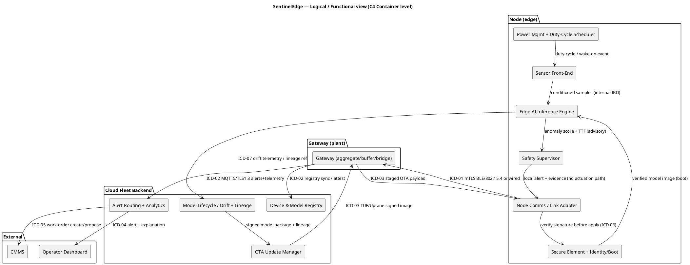

# SentinelEdge — Phase 04 Architecture & Design

Turns the SRR-baselined requirements ([`../Phase_02_Requirements/SysRS.md`](../Phase_02_Requirements/SysRS.md)) and the Phase 01 problem-space ([`../Phase_01_Concept/Concept.md`](../Phase_01_Concept/Concept.md)) into an agreed, view-based **architecture description** (ISO/IEC/IEEE 42010:2022), freezes every component seam in an **Interface Control Document (ICD)**, and justifies the technology stack. Exit gate: **PDR** (Conventions §3), which sets the **allocated baseline** (architecture + requirement-to-block allocation + ICD draft).

This document conforms to [`../../../05_Conventions.md`](../../../05_Conventions.md) for all IDs, gates, baselines, T/I/A/D methods, S1–S4 severity, status strings (§6), PlantUML conventions (§7), and standard citations (§9) — it cites that contract, never redefines it.

> **Phase 03 note.** The MBSE model (`Phase_03_Modeling/`) is not yet drawn. Architecture blocks below reuse the **intended top-level blocks named in SysRS §13** as their authoritative names; each is tagged `TODO: add to BDD` so Phase 03 can backfill the BDD/IBD without renaming. No phantom blocks are introduced — every block here either appears in SysRS §13 or is marked as a new block owing a BDD entry. The architecture is the single source of truth for **block↔block seams**; the embedded AI model is treated as a **first-class engineered block** with its own allocation, ICD seam, and trust handling (README intent).

---

## 1. Scope & context

SentinelEdge is an **industrial predictive-maintenance IoT system** built as **three tiers** (SysRS §2): a **sensor node** at the edge (tri-axial vibration + acoustic + temperature sensing, an MCU/NPU running the **embedded on-device AI model**, power management, a secure element, and a short-range/wired link), a **local gateway** (aggregation, buffering, WAN bridge), and a **cloud fleet-management + analytics backend** (device & model registry, analytics, alert routing, CMMS integration, signed OTA pipeline with governed rollback). It operates **edge-first**: detect-and-warn runs on-device and does **not** require a live uplink (`SCN-02`, `REQ-F-02`, `REQ-O-02`); connectivity carries fleet management, OTA, and analytics — never the core detection function.

This phase decides **which blocks exist, how they relate, and the rules that guide them** (architecture), and freezes the **seams between independently developed/owned components** (ICD). How any single block is implemented internally (e.g. the model's feature extractor, the duty-cycle algorithm) is detailed design and is deferred. The five strategic decisions that set node compute platform, embedded-model family, power/link strategy, OTA-governance architecture, and safety partitioning (SysRS §13: `DM-01..05` / `DEC-01..05`) are **named here and owned by Phase 05** — this phase records them as `DEC-*` candidates with the constraints the architecture imposes.

Boundary conditions inherited from Concept §3 and SysRS §8 (must not be violated by any view below): SentinelEdge is **advisory-only — no actuation path to the monitored machine** (`REQ-F-04`, `REQ-SAF-01`, fail-passive, `HAZ-01`); functional safety to the IEC 61508 SIL from hazard analysis (`REQ-D-01`, `TODO: SIL_target`); license-exempt radio only, no site radio licence (`REQ-C-02`); EMC/radio conformity for target markets (`REQ-D-03`); BOM cost ceiling per unit (`REQ-C-01`, `TODO: bom_ceiling`); RoHS/WEEE + battery transport/disposal (`REQ-D-02`); security baseline ISO/IEC 27001:2022 / NIST SP 800-53 Rev. 5 / NIST SP 800-160, signed images + SBOM (`REQ-SEC-01..04`).

---

## 2. Architecture principles

Stable rules every later decision (Phase 05 trade-offs, Phase 06 integration, detailed design) is checked against. Each has a rationale and a derived design guideline. These are the yardstick for Phase 05.

| # | Principle | Rationale | Derived design guideline |
|---|---|---|---|
| **AP-01** | **Edge-first / degrade gracefully — the detect-and-warn function must run on-device with no live uplink.** | Connectivity is intermittent-by-design in-plant (Concept §7, `SCN-02`); a cloud round-trip cannot gate an alert (`SN-03`, `MOE-04` ≈ 100%). | Inference, thresholding, and local alerting live entirely on the node; the node buffers alerts + evidence offline and syncs in time order on reconnect. Satisfies `REQ-F-02`, `REQ-F-03`, `REQ-O-02`. |
| **AP-02** | **Advisory-only / fail-passive — SentinelEdge never has a path to command the machine; any fault leaves machine control untouched.** | The catastrophic hazard is a prediction (mis)used to actuate rotating machinery (`HAZ-01`, `RSK-04`, `MOE-07` target **zero**). | No block exposes an actuation/trip output; the Safety Supervisor enforces fail-passive on any fault; isolate from the machine's PLC/SIS (read-only/advisory). Satisfies `REQ-F-04`, `REQ-SAF-01`, `REQ-D-01`. |
| **AP-03** | **The embedded AI model is a governed, first-class component — versioned, signed, lineage-tracked, and reversible.** | A bad model is as dangerous to trust as bad firmware; drift degrades silently (`RSK-03`, `RSK-06`). | Model packages are signed, carry an SBOM + training-data lineage id, deploy via canary, and roll back to last-known-good on a failed health check. Satisfies `REQ-F-06`, `REQ-F-07`, `REQ-O-03`, `REQ-P-04`. |
| **AP-04** | **Zero-trust across every boundary — authenticate device, gateway, and image; never trust by network location.** | A spoofed device or unsigned OTA injects malicious firmware/model (`RSK-06`); OT/Security require no new attack surface (STK-04). | Per-device secure-element identity + attestation; verified/secure boot rejecting unsigned/tampered images; mutually-authenticated, encrypted links on every seam. Satisfies `REQ-SEC-01`, `REQ-SEC-02`, `REQ-INT-01`, `REQ-INT-02`. |
| **AP-05** | **Power is a first-class budget — every design choice is checked against multi-year battery life.** | Battery shortfall under real duty cycle + harsh temperature is a top risk (`RSK-05`, `MOE-05`, `TPM-04`). | Aggressive duty-cycling, wake-on-event sensing, low-power conserve mode; compute/RAM/footprint kept within the inference power envelope; no always-on radio. Satisfies `REQ-O-01`, `REQ-P-02`, `REQ-P-03`. |
| **AP-06** | **Trust the alert — tune for precision and make every prediction explainable and traceable.** | Alert fatigue kills adoption (`RSK-02`, `MOE-02`); auditability is required (`SN-09`, STK-09). | Confidence-gated alerting, per-asset baselining; each alert retains contributing features + model version + lineage id (heavy lineage cloud-side, node keeps a reference). Satisfies `REQ-P-01`, `REQ-F-07`, `REQ-O-04`. |
| **AP-07** | **Standards-based, versioned interfaces only — every external seam names a standard and a versioning rule.** | Long-lived fielded fleet + OT integration partners; ad-hoc seams rot and break commissioning/OTA (`REQ-INT-*`). | Each seam uses a named standard (MQTT 5 / TLS 1.3 / BLE 5.x / TUF-Uptane / SPDX-CycloneDX / OpenAPI 3.1) with semver / capability negotiation; published message schema for alerts, evidence, telemetry, OTA. Satisfies `REQ-INT-01`, `REQ-INT-02`. |
| **AP-08** | **Secure by lifecycle — identity, supply chain, and disposal are designed in, not bolted on.** | Supply-chain provenance (SBOM) and unrecoverable decommissioning are explicit needs (`SN-07`, `SN-12`). | Every released image ships an SBOM traceable to build provenance; decommissioning revokes identity and crypto-erases keys/data/model per NIST SP 800-88 Rev. 1. Satisfies `REQ-SEC-03`, `REQ-SEC-04`, `REQ-D-02`. |
| **AP-09** | **Fleet-safe change — no single update may brick a node or persist a regression.** | A degraded/wrong update across the fleet is a high-impact failure (`SN-10`, `RSK-03/06`). | Staged per-cohort rollout with automatic, bounded rollback; A/B image slots so a node always has a known-good fallback. Satisfies `REQ-F-06`, `REQ-O-03`. |
| **AP-10** | **Safe & quick to service on live machinery — installation and battery service never require contact with rotating parts.** | Technicians install/service on or near operating machinery (`SN-08`, STK-02; `HAZ-01`). | Guided commissioning flow; mounting + service procedure compatible with the host machine's lockout/tagout (LOTO). Satisfies `REQ-U-01`, `REQ-SAF-02`. |

> Principle conflicts surfaced (carried as tracked trades, not silently resolved): **AP-06 (accuracy/precision) ↔ AP-05 (power) ↔ memory budget** — the accuracy↔footprint↔battery *quadrilemma* (SysRS §15) is **not** auto-resolved; it is tracked as `TPM-01/03/04/05` and bound by `DEC-01`/`DEC-02` (carries `RSK-01`/`RSK-05`). **AP-04 (signed/attested everything) ↔ AP-10 (quick install)** — security is High and wins; UX is mitigated by the guided commissioning flow (`REQ-U-01`), not by weakening attestation. **AP-06 (retain explanation/lineage) ↔ node memory/cost** (`REQ-C-01`) — heavy lineage stored cloud-side; the node retains only a reference (SysRS §15).

---

## 3. Stakeholders & concerns

Reuses `STK-01..09` from Concept §2. Each concern is phrased as a question this architecture must answer, tied to a REQ/MOE, and framed by the viewpoint (§5) that produces the answering view.

| STK | Stakeholder | Architecture concern (question) | Linked REQ / MOE | Framed by viewpoint → view |
|---|---|---|---|---|
| **STK-01** | Plant Reliability / Maintenance Mgr | Will it give true early warning with few false alarms, fitting my CMMS workflow? | `REQ-F-01/02/05`, `REQ-P-01` / `MOE-01/02/03` | Logical; Operational/Behavioural |
| **STK-02** | Maintenance Technician | Can I mount, pair, and commission a node quickly and safely on live machinery, and swap batteries? | `REQ-U-01`, `REQ-SAF-02`, `REQ-O-01` / `MOE-05` | Operational/Behavioural; Deployment |
| **STK-03** | Machine / Process Operator | Will it avoid nuisance trips and never interrupt production? | `REQ-F-04`, `REQ-P-01`, `REQ-SAF-01` / `MOE-02/07` | Security/Safety; Operational/Behavioural |
| **STK-04** | OT / Plant IT & Security | Are devices identity-bound, updates signed, links segmented — no new attack surface? | `REQ-SEC-01/02/03`, `REQ-INT-01/02`, `REQ-C-02` / `MOE-06` | Security/Trust-boundary; Deployment |
| **STK-05** | Fleet / Data Science Team | Can I update the model OTA, detect drift, and roll back a bad model across the fleet? | `REQ-F-06`, `REQ-P-04`, `REQ-O-03`, `REQ-F-07` / `MOE-06` | Logical; Operational/Behavioural |
| **STK-06** | EHS / Safety Officer | Is there provably no unsafe actuation path, with an IEC 61508 safety case? | `REQ-F-04`, `REQ-SAF-01/02`, `REQ-D-01` / `MOE-07` | Security/Safety; Operational/Behavioural |
| **STK-07** | Sustainability / Compliance Officer | Are batteries, e-waste, and end-of-life data handled compliantly and irrecoverably? | `REQ-SEC-04`, `REQ-D-02`, `REQ-O-04` | Information/Data; Operational/Behavioural |
| **STK-08** | Product / Commercial Owner (CPO) | Does the node hit the BOM ceiling and the fleet scale at bounded cloud cost? | `REQ-C-01`, `REQ-INT-02` / `MOE-05` | Deployment; Technology |
| **STK-09** | Regulators / Certification Bodies | Can functional-safety, EMC/radio, battery/RoHS, and prediction lineage be evidenced? | `REQ-D-01/02/03`, `REQ-F-07`, `REQ-O-04` | Security/Safety; Information/Data |

**Concern coverage check (PDR criterion):** every concern above is addressed by at least one view in §5. No orphan concerns.

---

## 4. Frameworks used (complementary, not single-select)

Per the Phase 04 framework decision aid, four frameworks are layered, each answering a different question:

- **C4 model** answers *what is the software/firmware structure?* — the primary lens for §5's Logical (Container/Component) and Deployment views, pairing cleanly with the PlantUML convention (Conventions §7). SentinelEdge spans firmware + edge-AI + cloud, so C4 carries the descriptive weight for the software/firmware portions.
- **arc42** answers *how do we structure the architecture document?* — this combined document follows the arc42 spine (context → constraints → solution strategy/principles → building blocks → runtime/deployment → cross-cutting concepts → decisions → risks), mapped onto the 42010 skeleton.
- **TOGAF ADM** is the **governing process**: this phase is ADM Phase **C (Application/Data Architecture)** and **D (Technology Architecture)**, with **Requirements Management at the centre** tying back to the SRR-baselined SysRS. Phase 05 (trade-offs) plays the ADM decision/governance role; Phase 06 plays ADM **F/G (Migration/Implementation Governance)** when the ICD freezes at CDR.
- **Cloud Well-Architected** is used as a **review checklist** for the cloud tier (security, reliability, performance-efficiency, cost-optimisation, operational-excellence, sustainability pillars) against `REQ-O-*`/`REQ-P-*`/`REQ-D-02` — it audits the deployment view, it does not structure the document.

**FFBD / Operational view note:** because SentinelEdge is **modes-rich and safety-relevant** (SysRS §9: Boot → Commissioning → Monitoring(Nominal/Offline) → Low-Power → Updating → Rollback → Fault → Decommissioning), the Operational/Behavioural view (§5.5) uses function-flow sequencing and will pair with the Phase 03 State Machine + Activity diagrams.

Zachman and NIST EA are **not** instantiated: a single-product device-plus-cloud system does not need Zachman's 6×6 enterprise coverage taxonomy or NIST EA's federal-program layering. Recorded as "tailored out: single-product scope; C4 + arc42 give sufficient coverage." The **IEC 61508 safety lifecycle** governs the Safety Supervisor + advisory-only thread in parallel (the §5.4 view feeds the Safety/RAMS thread and `HAZ-01`).

---

## 5. Viewpoints & views

Five viewpoints are instantiated because §3 concerns demand them: **Logical/Functional**, **Physical/Deployment**, **Security/Trust-boundary (incl. Safety)**, **Information/Data**, and **Operational/Behavioural**. (Technology concerns are answered by §9 Tech-Stack Rationale rather than a separate diagram.) Each view answers named concerns; PlantUML sources are named `Architecture_<viewpoint>.puml` and are `TODO:` to render in Phase 03 alongside the BDD/IBD.

### 5.1 Logical / Functional view → `Architecture_Logical.puml`

**Addresses concerns of:** STK-01, STK-02, STK-05, STK-09. **Answers:** *which blocks exist and how does a detection flow, an OTA, and an alert move through the three tiers?*

The system decomposes into the SysRS §13 blocks, grouped into the three tiers. On the node, the **Sensor Front-End** feeds the **Edge-AI Inference Engine**; threshold crossings raise an alert **locally** (AP-01) which the **Node Comms / Link Adapter** forwards via the **Gateway** to the **Cloud Fleet Backend**. The **Safety Supervisor** sits across the node enforcing advisory-only/fail-passive (AP-02). OTA flows downward: **OTA Update Manager** (cloud) → gateway → node, with the **Secure Element + Identity/Boot** verifying every image (AP-04) and the **Model Lifecycle / Drift + Lineage** block governing the model package (AP-03).



**Block roster (all from SysRS §13):** Sensor Front-End, Edge-AI Inference Engine, Power Management + Duty-Cycle Scheduler, Secure Element + Identity/Boot, Node Comms / Link Adapter, Gateway, Cloud Fleet Backend (Device & Model Registry, Alert Routing + Analytics), OTA Update Manager, Model Lifecycle / Drift + Lineage, Safety Supervisor; plus external **CMMS** and **Operator Dashboard** (external systems, not SentinelEdge blocks — seams only). All node/gateway/cloud blocks are named in SysRS §13; `TODO: add to BDD` for each in Phase 03 (no renaming).

### 5.2 Physical / Deployment view → `Architecture_Deployment.puml`

**Addresses concerns of:** STK-02, STK-04, STK-08. **Answers:** *where does each block physically run, what powers it, and what is the radio/network reach at bounded cost?*

Blocks are placed in zones; **trust boundaries are drawn as `package`s** (these seed §5.3 / the Security thread). The node is **battery-powered or wired** (`DEC-03`), mounted **clear of rotating parts** on or near the asset (AP-10, `REQ-SAF-02`); the node↔gateway link is **short-range license-exempt or wired** (`REQ-C-02`), and the **gateway owns the WAN uplink** (Concept §3 — node has no cellular WAN). The cloud is vendor-managed (initial release; on-prem variant is `TODO: deployment variant` per Concept §3).

```plantuml
@startuml sentineledge_Architecture_Deployment
title SentinelEdge — Physical / Deployment view (edge-first, advisory-only)
package "Monitored asset (external — read-only/advisory)" {
  [Rotating machine + its PLC/SIS]
}
package "Field — Node (trust boundary: device, battery/wired)" {
  [MCU/NPU + Edge-AI model]
  [MEMS vibration / acoustic / temp]
  [Secure element]
  [Radio / wired link]
}
package "Plant — Gateway (trust boundary: gateway)" {
  [Gateway (aggregate/buffer)]
  [WAN uplink]
}
package "Cloud (trust boundary: backend, vendor-managed)" {
  [Device & Model Registry]
  [Alert Routing + Analytics]
  [OTA Update Manager + signing PKI]
  [Model Lifecycle / Drift + Lineage store]
}
package "External (trust boundary: third-party)" {
  [CMMS] [Operator Dashboard]
}
[MEMS vibration / acoustic / temp] ..> [MCU/NPU + Edge-AI model] : "sense only"
[MCU/NPU + Edge-AI model] ..> [Rotating machine + its PLC/SIS] : "NO actuation path (advisory-only, AP-02)"
[Radio / wired link] --> [Gateway (aggregate/buffer)] : "ICD-01 mTLS, license-exempt/wired"
[Gateway (aggregate/buffer)] --> [Alert Routing + Analytics] : "ICD-02 MQTT5 / TLS 1.3"
[OTA Update Manager + signing PKI] --> [Gateway (aggregate/buffer)] : "ICD-03 TUF/Uptane signed"
[Alert Routing + Analytics] --> [CMMS] : "ICD-05"
@enduml
```

**Well-Architected check (pillars vs REQ):** Reliability — offline buffering + ordered sync meet `REQ-O-02`/`REQ-F-03`; node A/B slots + bounded rollback meet `REQ-O-03`. Performance — on-device inference within `REQ-P-02` latency / `REQ-P-03` footprint. Security — secure element + verified boot + mTLS meet `REQ-SEC-01/02`, `REQ-INT-01/02`. Cost — BOM ceiling `REQ-C-01`; vendor-managed cloud bounds OPEX (`MOE-05`/CPO `STK-08`). Sustainability — RoHS/WEEE + battery disposal route (`REQ-D-02`).

### 5.3 Security / Trust-boundary view (incl. Safety) → `Architecture_Security.puml`

**Addresses concerns of:** STK-03, STK-04, STK-06, STK-09. **Answers:** *is the attack surface acceptable, is every image/device trusted, and is there provably no unsafe actuation path?*

Four trust boundaries: **device** (node internals + secure element), **gateway** (plant aggregation), **backend** (vendor cloud), and **third-party** (CMMS/dashboard). A fifth, **safety-relevant** boundary is the **advisory-only barrier** to the monitored machine — modelled explicitly because the dominant hazard is crossing it (`HAZ-01`, AP-02). Every boundary-crossing seam in the ICD (§7) carries an auth mechanism and is handed to the Security thread as a threat (`THR-*`, `TODO:` to enumerate via STRIDE in `cross-cutting/Threat_Model.md`); the advisory barrier is handed to the Safety/RAMS thread (`HAZ-01`).

```plantuml
@startuml sentineledge_Architecture_Security
title SentinelEdge — Security / Trust-boundary view (+ advisory-only safety barrier)
package "Untrusted / physical" { [Attacker] [Tampered node / spoofed device] [Unsigned image] }
package "Boundary: DEVICE (secure element, verified boot)" {
  [Edge-AI Inference Engine] [Secure Element + Identity/Boot] [Safety Supervisor]
}
package "Boundary: GATEWAY (mTLS, plant segment)" { [Gateway] }
package "Boundary: BACKEND (signing PKI, registry)" {
  [OTA Update Manager] [Device & Model Registry] [Model Lifecycle / Lineage]
}
package "Boundary: THIRD-PARTY" { [CMMS] [Operator Dashboard] }
package "SAFETY BARRIER (advisory-only, fail-passive)" { [Rotating machine PLC/SIS] }

[Unsigned image] ..> [Secure Element + Identity/Boot] : "rejected: verified boot (THR: unsigned/tampered image)"
[Tampered node / spoofed device] ..> [Gateway] : "blocked: per-device identity + attestation (THR: spoof)"
[Gateway] --> [OTA Update Manager] : "mTLS, signed images  (THR: OTA MITM/downgrade)"
[Edge-AI Inference Engine] --> [Gateway] : "alert+evidence, mTLS  (THR: alert forgery/replay)"
[Safety Supervisor] ..> [Rotating machine PLC/SIS] : "NO write/command path — advisory-only (HAZ-01)"
@enduml
```

Candidate threats seeded for the Security thread (each `→ THR-TBD`): unsigned/tampered firmware or model image accepted (→ `REQ-SEC-02`, `RSK-06`); spoofed/cloned device identity enrols (→ `REQ-SEC-01`, `RSK-06`); OTA man-in-the-middle / version-rollback (downgrade) attack (→ `REQ-F-06`, `REQ-O-03`, AP-09); alert/telemetry forgery or replay on the node↔gateway↔cloud path (→ `REQ-INT-01/02`); recoverable keys/data on a retired or stolen node (→ `REQ-SEC-04`, `RSK-07`). Candidate hazard handed to the Safety thread: prediction (mis)used to actuate the machine / loss-of-advisory misread as a safe state (→ `HAZ-01`, `RSK-04`, `REQ-SAF-01`).

### 5.4 Information / Data view → `Architecture_Information.puml`

**Addresses concerns of:** STK-05, STK-07, STK-09. **Answers:** *what data exists, where does it live across the three tiers, and how is it retained, traced, and irrecoverably erased at end of life?*

The dominant data classes are **raw/feature sensor data**, **model packages + lineage**, **alert records + explanations**, and **device identity/keys**. The accuracy↔footprint↔battery trade (AP-05/AP-06) forces a **node-light, cloud-heavy** split: the node holds only the current signed model, a bounded local alert/evidence buffer, and a **lineage reference** (not the full lineage), while the cloud holds the registry, the lineage store, and long-retention alert records (`REQ-O-04`). Decommissioning crypto-erases node-side keys/data/model and revokes identity (AP-08, `REQ-SEC-04`).

| Data class | Stores (tier) | Retention / lineage | Protection | Erasure path | REQ |
|---|---|---|---|---|---|
| Raw + feature sensor data | Node (transient buffer), Gateway (transient) | bounded local buffer (offline window); not long-retained on node | encrypted at rest on node; mTLS in transit | overwritten on sync / wiped at EOL | `REQ-F-01`, `REQ-F-03`, `REQ-SEC-04` |
| Alert record + explanation + lineage **ref** | Node (buffer, ref only), Cloud (full, long-retention) | cloud-retained ≥ `TODO: retention_target` yrs; node keeps reference | signed; tamper-evident store cloud-side | node ref wiped at EOL; cloud per policy | `REQ-F-07`, `REQ-O-04` |
| Embedded model package + SBOM + training-data lineage | Cloud (registry + lineage store), Node (current signed image only) | every release versioned, signed, lineage-tracked | signature-verified; SBOM (SPDX/CycloneDX) | superseded-on-OTA; node image wiped at EOL | `REQ-F-06`, `REQ-F-07`, `REQ-SEC-02/03`, `REQ-P-04` |
| Device identity + keys | Node (secure element), Cloud (registry record) | provisioned at manufacture; attested at enrol | private keys in secure element; never exported | **revoke + crypto-erase per NIST SP 800-88** | `REQ-SEC-01`, `REQ-SEC-04` |

### 5.5 Operational / Behavioural view → `Architecture_Operational.puml`

**Addresses concerns of:** STK-01, STK-02, STK-05, STK-06. **Answers:** *how does the node behave across its modes, especially offline, updating, and fault?*

Implements the SysRS §9 modes (Off → Boot → Commissioning → Monitoring(Nominal) ⇄ Monitoring(Offline) ⇄ Low-Power Conserve → Updating → Rollback → Fault → Decommissioning). Health and connectivity drive the transitions: loss of uplink moves **Nominal → Offline** where the node keeps detecting and **buffers alerts/evidence**, syncing in time order on reconnect (AP-01, `SCN-02`, `REQ-F-03`, `REQ-O-02`); low battery enters **Low-Power Conserve** with a reduced duty cycle (AP-05, `REQ-O-01`). An OTA enters **Updating** with a canary health check; a failed check triggers automatic, bounded **Rollback** to the last-known-good image (AP-09, `SCN-03`, `REQ-O-03`). Any self-detected sensor/compute fault enters **Fault** which **degrades safely and never actuates** (AP-02, `REQ-SAF-01`). End-of-life enters **Decommissioning** (revoke + crypto-erase, `SCN-05`, `REQ-SEC-04`). This view pairs with the Phase 03 State Machine and Activity diagrams (`TODO: cross-link when drawn`).

---

## 6. Requirement-to-block allocation (the allocated baseline)

Every functional/performance/interface/security/operational/safety REQ lands on ≥ 1 block; every block carries ≥ 1 REQ. No orphan blocks, no unallocated REQs (PDR criterion). Blocks reuse SysRS §13 names; all owe a Phase 03 BDD entry (`TODO: add to BDD`).

| Block | Allocated REQs | Satisfies SN |
|---|---|---|
| **Sensor Front-End** | `REQ-F-01` | SN-01, SN-03 |
| **Edge-AI Inference Engine** | `REQ-F-01`, `REQ-F-02`, `REQ-P-01`, `REQ-P-02`, `REQ-P-03` | SN-01, SN-02, SN-03 |
| **Power Mgmt + Duty-Cycle Scheduler** | `REQ-O-01`, `REQ-P-02` (duty/clock), `REQ-O-02` (offline endurance) | SN-05, SN-03 |
| **Secure Element + Identity/Boot** | `REQ-SEC-01`, `REQ-SEC-02`, `REQ-SEC-04` | SN-07, SN-10, SN-12 |
| **Node Comms / Link Adapter** | `REQ-F-03` (buffer/sync), `REQ-INT-01`, `REQ-C-02`, `REQ-D-03`, `REQ-O-02` | SN-03, SN-07 |
| **Gateway** | `REQ-INT-01`, `REQ-INT-02`, `REQ-F-03` (relay) | SN-03, SN-07, SN-11 |
| **Cloud Fleet Backend — Device & Model Registry** | `REQ-SEC-01` (enrol/attest), `REQ-F-06` (target cohort), `REQ-O-04` | SN-04, SN-07, SN-09 |
| **Cloud Fleet Backend — Alert Routing + Analytics** | `REQ-F-05`, `REQ-INT-02`, `REQ-U-02` | SN-11, SN-09 |
| **OTA Update Manager** | `REQ-F-06`, `REQ-O-03`, `REQ-SEC-02` (signed images), `REQ-SEC-03` (SBOM ship) | SN-04, SN-10 |
| **Model Lifecycle / Drift + Lineage** | `REQ-F-07`, `REQ-P-04`, `REQ-O-04`, `REQ-SEC-03` | SN-09 |
| **Safety Supervisor** | `REQ-F-04`, `REQ-SAF-01`, `REQ-SAF-02`, `REQ-D-01` | SN-06, SN-08 |
| **Commissioning flow (handheld/mobile) †** | `REQ-U-01`, `REQ-SAF-02` | SN-08 |
| **Disposal / Decommissioning procedure †** | `REQ-SEC-04`, `REQ-D-02` | SN-12 |

`†` two procedure-level blocks not separately named in SysRS §13 (the commissioning UX and the disposal procedure) — `TODO: add to BDD` as Phase 03 building blocks; they realise `REQ-U-01`/`REQ-SAF-02` and `REQ-SEC-04`/`REQ-D-02` respectively rather than leaving those REQs orphaned.

**Allocation completeness:** all **30** SysRS REQs are covered (F-01..07, U-01..02, P-01..04, INT-01..02, O-01..04, SEC-01..04, C-01..02, D-01..03, SAF-01..02). `REQ-C-01` (BOM ceiling) is a cross-cutting constraint checked against the **node** blocks (Sensor Front-End + MCU/NPU + Secure Element) and the Deployment view §5.2 rather than a single block; `REQ-U-02` (dashboard comprehension) lands on Alert Routing + Analytics. No orphan blocks; no unallocated REQs.

---

## 7. Interface Control Document (ICD) — Draft

> **Status: Draft** at PDR (part of the allocated baseline). The ICD is **frozen → `Baseline (CDR-approved YYYY-MM-DD)`** in Phase 06 as part of the product baseline (Conventions §3). Change control thereafter via `CR-<nn>` (Phase 09).

### 7.1 Scope

This ICD defines every **seam where two independently developed/owned components meet** — i.e. each cross-boundary edge in §5.1/§5.2. Internal couplings inside a single block (e.g. Sensor Front-End → Inference Engine sample handoff, Power scheduler → sensor wake) belong to the IBD (Phase 03), not here. It is the contract used by integration testing in Phase 06 and frozen at CDR.

### 7.2 Interface inventory

| ICD-ID | Sender → Receiver | Layer | Standard / format | Direction | Rate | Security | Failure mode | Trust-boundary? | Safety? | Linked REQ |
|---|---|---|---|---|---|---|---|---|---|---|
| **ICD-01** | Node Comms → Gateway | Protocol/Physical | BLE 5.x or IEEE 802.15.4 (or wired), published msg schema (CBOR/Protobuf) | Bi | event-driven; duty-cycle wake | **mTLS** (DTLS 1.3 / TLS 1.3), secure-element keys | offline buffer + ordered resync on reconnect | Y (device→gateway) | N | `REQ-INT-01`, `REQ-SEC-01`, `REQ-C-02`, `REQ-D-03` |
| **ICD-02** | Gateway → Cloud (Alert/Telemetry/Registry) | Application | **MQTT 5.0 over TLS 1.3**, JSON Schema / Protobuf payloads | Bi | alerts event-driven; telemetry/heartbeat periodic | TLS 1.3 + device/gateway cert (mutual) | store-and-forward buffer; QoS-1 retry | Y (gateway→backend) | N | `REQ-INT-02`, `REQ-F-03`, `REQ-O-04` |
| **ICD-03** | OTA Update Manager → Node (via Gateway) | Application | **TUF / Uptane** signed image manifest over TLS 1.3; A/B slot payload | Out (down) | on release; staged per cohort | image signature (Ed25519) + role metadata; anti-rollback | canary health check → automatic bounded rollback | Y (backend→device) | N | `REQ-F-06`, `REQ-O-03`, `REQ-SEC-02` |
| **ICD-04** | Alert Routing + Analytics → Operator Dashboard | Application | REST/WSS, OpenAPI 3.1 / JSON | Out | event-driven + live | OAuth 2.x bearer, TLS 1.3 | reconnect; alerts retained server-side | Y (third-party) | N | `REQ-U-02`, `REQ-F-05` |
| **ICD-05** | Alert Routing + Analytics → CMMS | Application | CMMS REST API / JSON (agreed work-order field set) | Out | event (on alert) | OAuth 2.x / API key, TLS 1.3 | queue + retry; idempotent work-order; confirm ref | Y (third-party) | N | `REQ-F-05`, `REQ-INT-02` |
| **ICD-06** | Node Comms → Secure Element + Boot | Internal/cross-trust | local verify-before-apply (signature check), no network | In | on OTA apply / boot | secure-element verified boot; reject unsigned/tampered | refuse to apply; remain on known-good slot | Y (device, sign-gate) | N | `REQ-SEC-02`, `REQ-O-03` |
| **ICD-07** | Edge-AI Inference Engine → Model Lifecycle (drift/lineage) | Application | drift telemetry + lineage-ref record, JSON Schema (over ICD-02 path) | Out | periodic / on threshold | TLS 1.3 (rides MQTT5) | buffer offline; drift alarm raised cloud-side | Y (device→backend) | N | `REQ-P-04`, `REQ-F-07`, `REQ-O-04` |
| **ICD-08** | Secure Element → Device & Model Registry | Application | device attestation (X.509 / DICE-class), over ICD-02 path | Out | at enrolment + periodic | per-device key, secure-element attestation | reject enrolment on attestation fail (fail-closed) | Y (device→backend) | N | `REQ-SEC-01`, `REQ-F-06` |
| **ICD-09** | OTA Update Manager → SBOM / Build provenance store | Application | **SPDX / CycloneDX** SBOM attached to each signed image | Out | per release | signed manifest; provenance trace | release blocked if SBOM/provenance missing | Y (backend) | N | `REQ-SEC-03` |
| **ICD-10** | Decommissioning procedure → Secure Element + Registry | Internal + Application | crypto-erase command + identity revocation (NIST SP 800-88) | Bi | at end-of-life (`SCN-05`) | authorized erase; mTLS for revoke | re-issue until proof; audit record; raise incident on failure | Y (device + backend) | N | `REQ-SEC-04`, `REQ-D-02` |
| **ICD-11** | Sensor Front-End → Edge-AI Inference Engine | Internal (node) | conditioned/ADC sample stream (in-MCU) | In | per evaluation window | on-die; no external exposure | sensor-fault flag → degrade safely (Fault mode) | N (intra-node) | **Y → HAZ-01** | `REQ-F-01`, `REQ-SAF-01` |

> **ICD-11 note.** This is the **safety-relevant** sensing path inside the node. It is normally an IBD-internal coupling, but it is listed here because a sensor/compute fault on it must drive the Safety Supervisor's fail-passive behaviour (`REQ-SAF-01`, `HAZ-01`) — the only **Safety = Y** seam. There is **no ICD row to the monitored machine**: the advisory-only barrier (§5.3) is the deliberate *absence* of an actuation interface (AP-02, `REQ-F-04`, `REQ-SAF-01`), recorded here so PDR can confirm the non-interface.

**`REQ-INT-*` / external-dependency coverage:** `REQ-INT-01` → ICD-01; `REQ-INT-02` → ICD-02 (+ ICD-05 CMMS, ICD-04 dashboard). Every external dependency in Concept §3 / SysRS §6 (gateway, CMMS, dashboard, signing PKI, SBOM tooling) has an ICD row. The **non-interface** to the machine PLC/SIS is recorded above as an explicit absence.

### 7.3 Detailed interface specs (load-bearing seams)

#### ICD-01 — Node Comms ↔ Gateway (the edge link)

| Attribute | Value |
|---|---|
| Physical / Transport | short-range **BLE 5.x** or **IEEE 802.15.4** (license-exempt, `REQ-C-02`), or wired option (`DEC-03`); gateway owns the WAN uplink |
| Subprotocol / message set | published schema for `Alert`, `Evidence`, `Telemetry`, `OtaChunk`, `Attest` (CBOR/Protobuf) |
| Auth | **mTLS** (DTLS 1.3 over BLE / TLS 1.3 wired) with keys held in the node secure element (`REQ-SEC-01`) |
| Message format | versioned binary schema (CBOR/Protobuf), capability-negotiated |
| Cadence | event-driven on detection; periodic heartbeat/telemetry on the duty cycle (AP-05) |
| Latency budget | **not on the detection critical path** — alerting is on-device (AP-01, `REQ-F-02`); link latency only affects sync. **TODO: no `REQ-P-*` sets a node↔gateway link latency — confirm acceptable in Phase 06, do not invent** |
| Failure mode | uplink loss → node buffers alerts+evidence locally (`REQ-O-02`) and **resyncs in chronological order** within `REQ-F-03` `TODO: t_sync` of reconnection |
| Versioning | schema semver + capability negotiation at pairing (`REQ-INT-01`) |
| Crosses trust boundary | Y (device→gateway) → `THR-TBD` (alert/telemetry forgery or replay) |
| Safety-relevant | N |
| Linked REQs | `REQ-INT-01`, `REQ-SEC-01`, `REQ-F-03`, `REQ-C-02`, `REQ-D-03`, `REQ-O-02` |

#### ICD-03 — OTA Update Manager ↔ Node (signed firmware/model OTA with rollback)

| Attribute | Value |
|---|---|
| Transport | over ICD-02 (gateway) then ICD-01 (node); image staged to an inactive **A/B slot** |
| Standard | **TUF / Uptane** signed manifest (role-separated metadata) over TLS 1.3; per-image **Ed25519** signature; **anti-rollback** counter |
| Auth / validation | secure-element **verified boot** rejects unsigned/tampered images (ICD-06, `REQ-SEC-02`); cohort targeted via registry (ICD-08) |
| Message format | TUF metadata + image chunks; each release carries an **SBOM** (ICD-09, `REQ-SEC-03`) |
| Cadence | on approved release; **staged per cohort** (canary → fleet) per `SCN-03` |
| Latency budget | rollout window + **rollback within `REQ-O-03` `TODO: rollback_target`** of a failed cohort health check (no node left non-functional) |
| Failure mode | failed canary health check → **automatic bounded rollback** to last-known-good slot (AP-09, `REQ-O-03`); never persist a regression, never brick |
| Versioning | model + firmware semver; anti-rollback prevents downgrade attacks |
| Crosses trust boundary | Y (backend→device) → `THR-TBD` (OTA MITM / version-rollback / unsigned image) |
| Safety-relevant | N (advisory-only; an OTA cannot create an actuation path — AP-02) |
| Linked REQs | `REQ-F-06`, `REQ-O-03`, `REQ-SEC-02`, `REQ-SEC-03` (SBOM via ICD-09) |

#### ICD-10 — Decommissioning ↔ Secure Element + Registry (revoke + crypto-erase)

| Attribute | Value |
|---|---|
| Transport | local secure-erase command on the node + mTLS identity-revocation to the cloud registry |
| Message set | `Revoke(device_id)` (cloud) + `CryptoErase(keys, buffered data, on-device model)` (node) per **NIST SP 800-88 Rev. 1** |
| Auth | authorized erasure request; mTLS for the cloud-side revoke (`REQ-SEC-04`) |
| Format | command + completion proof (audit record retained `REQ-O-04`) |
| Cadence | at end-of-life / asset retirement (`SCN-05`) |
| Latency budget | not perf-critical; **TODO: no `REQ-P-*` covers EOL sanitization time — confirm acceptable, do not invent** |
| Failure mode | re-issue until **cryptographic proof of completion**; failure raises an incident, never silently closes (data must be unrecoverable) |
| Versioning | n/a (lifecycle command) |
| Crosses trust boundary | Y (device + backend) → `THR-TBD` (recoverable keys/data on retired/stolen node, `RSK-07`) |
| Safety-relevant | N |
| Linked REQs | `REQ-SEC-04`, `REQ-D-02`, `REQ-O-04` |

### 7.4 Cross-cutting interface concerns

- **Security / trust boundaries (§5.3):** every ICD row flagged `Y` crosses a boundary and is handed to the Security thread as a `THR-TBD` for STRIDE analysis (`TODO:` enumerate in `cross-cutting/Threat_Model.md`). Auth mechanism named on every row (PDR criterion): mTLS/secure-element on the device & gateway seams, signed images (Ed25519 + TUF/Uptane) on OTA, OAuth/API key on the cloud→external seams.
- **Safety:** **ICD-11** is the only safety-relevant seam — a sensor/compute fault must drive fail-passive (`HAZ-01`, `REQ-SAF-01`). The **absence** of any actuation ICD to the machine is itself a PDR-checked design property (AP-02). Both feed the Safety/RAMS thread.
- **Observability / lineage:** drift telemetry + lineage references ride ICD-07; alert records carry the model-version + lineage id (`REQ-F-07`, AP-06).
- **Error handling / degradation:** the **detection path is on-device and never blocks on a seam** (AP-01); cloud→external seams (ICD-04/05) are queue-and-retry/idempotent; OTA (ICD-03) is staged with bounded rollback (AP-09).

### 7.5 Change control

ICD frozen at **CDR** (Phase 06); thereafter any change to a message set, schema, auth mechanism, or named standard requires a `CR-<nn>` (Phase 09). Each ICD-ID gets a row in the Phase 02 traceability matrix linking satisfying block(s) and verifying `TC-VER-*` (Phase 07) — the Phase 02 `TC-VER-TBD` seeds for `REQ-F-06`/`REQ-O-03` (OTA+rollback), `REQ-INT-01/02`, and `REQ-SEC-01..04` resolve onto ICD-01/02/03/08/10.

---

## 8. Architecture decisions (candidates handed to Phase 05)

Architecture-class decisions (they change which blocks exist or how they connect) recorded as `DEC-*` candidates; the weighted decision matrices `DM-*` are owned by Phase 05 (SysRS §13). The architecture imposes the constraint each decision must satisfy:

| DEC candidate | Decision (SysRS §13) | Architecture constraint it must satisfy |
|---|---|---|
| **DEC-01 / DM-01** | Node compute platform & ML runtime (MCU-only vs MCU+NPU; TFLite-Micro vs alternative) | must run inference within `REQ-P-02` latency and `REQ-P-03` flash/RAM footprint **inside** the AP-05 power envelope; drives `RSK-01`/`TPM-03/05` |
| **DEC-02 / DM-02** | Embedded model family (classical signal-feature classifier vs tiny neural net) | must hit `REQ-P-01` recall/FPR (AP-06) at `REQ-P-03` footprint with retained explainability (`REQ-F-07`); the accuracy↔footprint trade; drives `RSK-01`/`TPM-01/02` |
| **DEC-03 / DM-03** | Node power strategy & node↔gateway link (battery chemistry, radio vs wired) | must satisfy `REQ-O-01` battery life (AP-05) and `REQ-C-02` license-exempt link on ICD-01; drives `RSK-05`/`TPM-04` |
| **DEC-04 / DM-04** | OTA + model-governance architecture (signing, canary, rollback, lineage store) | must satisfy `REQ-F-06`/`REQ-O-03` (staged rollout + bounded rollback) and `REQ-SEC-02/03` (signed + SBOM) on ICD-03/06/09 (AP-03/AP-09); drives `RSK-03`/`RSK-06` |
| **DEC-05 / DM-05** | Safety partitioning to guarantee advisory-only/fail-passive per IEC 61508 | must satisfy `REQ-F-04`/`REQ-SAF-01`/`REQ-D-01` (no actuation path, fail-passive at the `TODO: SIL_target`) on the Safety Supervisor + ICD-11 (AP-02); drives `RSK-04`/`HAZ-01` |

---

## 9. Tech-Stack Rationale

For each tier: **Choice · Alternatives considered (≥ 2) · Why this (REQ/principle/constraint)**. Choices respect mandated-tech constraints `REQ-C-01/02`, `REQ-D-01/02/03`. Where a choice is genuinely a Phase 05 trade (node platform, model family, power/link, OTA governance, safety partitioning), the entry names the candidate and defers the binding decision to its `DEC-*`.

| Tier | Choice (candidate) | Alternatives considered (≥ 2) | Why this (link REQ / principle / constraint) |
|---|---|---|---|
| **Node compute** | Cortex-M-class MCU, optionally + NPU per `DEC-01` | application-class Linux SoC; FPGA/DSP | Must run inference within `REQ-P-02` latency / `REQ-P-03` footprint inside the AP-05 power envelope; an app-class SoC blows the battery budget (`REQ-O-01`). Binding via `DEC-01`. |
| **Edge-AI runtime** | TinyML runtime (TFLite-Micro-class) per `DEC-01` | hand-written inference; vendor NN SDK | Quantizable, small-footprint inference for `REQ-P-01/02/03` (AP-06/05); `TODO: confirm against target MCU in Phase 05`. |
| **Embedded model family** | candidate per `DEC-02` (signal-feature classifier vs tiny NN) | always-cloud inference; rule-based thresholds only | Must hold `REQ-P-01` recall/FPR with explainability (`REQ-F-07`) at `REQ-P-03` footprint; cloud inference violates AP-01 edge-first. Binding via `DEC-02`. |
| **Node firmware language** | Rust (control/state) + C (vendor sensor/driver layer) | pure C; C++ | Memory safety on the security-/safety-adjacent paths (AP-02/AP-04); C reused for vendor MEMS drivers. `TODO: confirm toolchain on target MCU`. |
| **Secure element / identity** | dedicated secure element (TPM/SE-class), keys non-exportable | keys in MCU flash; software-only keystore | `REQ-SEC-01/02` per-device identity + verified boot (AP-04); software keys fail attestation and `RSK-06`. |
| **Node↔gateway link** | BLE 5.x or IEEE 802.15.4 (or wired) per `DEC-03` | cellular at the node; proprietary sub-GHz | License-exempt, low-power, short-range (`REQ-C-02`, AP-05); node has no WAN (Concept §3 — gateway owns uplink). Binding via `DEC-03`. |
| **Gateway↔cloud transport** | **MQTT 5.0 over TLS 1.3** | AMQP; raw HTTP polling; CoAP | Lightweight pub/sub with store-and-forward + QoS for intermittent links (`REQ-INT-02`, `REQ-F-03`, AP-07). |
| **OTA / model governance** | **TUF / Uptane** signed images, A/B slots, canary + rollback per `DEC-04` | unsigned blob push; single-slot in-place update | `REQ-F-06`/`REQ-O-03` staged rollout + bounded rollback, `REQ-SEC-02` signed, anti-rollback (AP-03/AP-09); single-slot risks bricking. Binding via `DEC-04`. |
| **Supply-chain / SBOM** | **SPDX or CycloneDX** SBOM per image, signed provenance | no SBOM; ad-hoc dependency list | `REQ-SEC-03` SBOM + build provenance (AP-08); attached on ICD-09. |
| **Cloud backend** | vendor-managed cloud, registry + analytics + signing PKI | self-hosted on-prem (deferred); single-VM | Bounded OPEX + fleet scale (`MOE-05`, STK-08); on-prem variant is `TODO: deployment variant` (Concept §3). |
| **Cloud datastore** | time-series store for telemetry + relational registry + object store for images/lineage | one general DB for all; document store only | Telemetry/drift volume (`REQ-P-04`) + retention (`REQ-O-04`) + image/lineage blobs need fit-for-purpose stores. `TODO: confirm products in Phase 05`. |
| **CMMS / dashboard contracts** | OpenAPI 3.1 (REST/WSS) + agreed CMMS field set | bespoke JSON-over-HTTP; file export | AP-07 standards-based, versioned seams (`REQ-F-05`, `REQ-INT-02`); named-standard ICD rows (no "JSON over HTTP"). |
| **Crypto** | TLS 1.3 / DTLS 1.3 in transit; Ed25519 image signing; AES-class at rest on node | TLS 1.2 only; RSA-only signing; no at-rest encryption | Modern mutual auth + small-signature verify on constrained MCU (`REQ-SEC-01/02`, AP-04); at-rest protects buffered evidence + keys (`REQ-SEC-04`). |
| **Safety partitioning** | Safety Supervisor partition enforcing fail-passive per `DEC-05` (IEC 61508) | trust application firmware to "not actuate"; external watchdog only | `REQ-F-04`/`REQ-SAF-01`/`REQ-D-01` provable no-actuation + fail-passive at `TODO: SIL_target` (AP-02). Binding via `DEC-05`. |

### 9.1 What we are NOT using and why

- **Not cloud / gateway-dependent inference** — would violate AP-01 and `REQ-F-02`/`SN-03`: detection must run on-device with no live uplink (`MOE-04` ≈ 100%). A cloud round-trip cannot gate an alert on an intermittently-connected plant network (`SCN-02`).
- **Not any actuation / machine-control interface** — explicitly forbidden by scope (Concept §3) and `REQ-F-04`/`REQ-SAF-01` (advisory-only, fail-passive). Closing the loop to trip the machine is a separate safety-rated control project; an actuation path is the dominant hazard (`HAZ-01`, `RSK-04`).
- **Not an always-on radio / continuous streaming** — would wreck the multi-year battery budget (`REQ-O-01`, AP-05, `RSK-05`); the node is duty-cycled with wake-on-event sensing and event-driven uplink.
- **Not cellular WAN at the node** — out of scope (Concept §3): node↔gateway is short-range license-exempt (`REQ-C-02`); the **gateway** owns the WAN uplink. Per-node cellular would add cost (`REQ-C-01`), power draw, and radio-licensing/EMC surface (`REQ-D-03`).
- **Not unsigned / single-slot in-place OTA** — violates `REQ-SEC-02` (verified boot) and `REQ-O-03`/AP-09 (bounded rollback, never brick). A single-slot in-place update can brick a node on a bad image; we use signed TUF/Uptane with A/B slots and anti-rollback (ICD-03/06).
- **Not software-held device keys** — keys must live in a secure element and attest (`REQ-SEC-01`, AP-04). Software-only keys fail attestation and enable device spoofing/cloning (`RSK-06`).
- **Not heavy on-node lineage/explanation storage** — would breach the node memory/cost budget (`REQ-C-01`, `REQ-P-03`); heavy lineage is cloud-side and the node keeps only a reference (AP-06, SysRS §15 conflict resolution; satisfies `REQ-F-07` without node bloat).
- **Not TLS 1.2-only or RSA-only crypto** — modern mutual auth (TLS/DTLS 1.3) and small-signature **Ed25519** verify fit the constrained MCU and the `REQ-SEC-02` verified-boot path better; legacy crypto widens attack surface and verify cost (AP-04).
- **Not a release without an SBOM** — `REQ-SEC-03` mandates an SPDX/CycloneDX SBOM + build provenance on every firmware/model image (AP-08); an un-SBOM'd image is blocked at ICD-09.

---

## 10. Open risks / TODOs (PDR inputs)

| Item | Status for PDR |
|---|---|
| `RSK-01` Model accuracy vs node compute/memory budget (Critical) | **Carried as a tracked trade** — `TPM-01/03/05` + `DEC-01`/`DEC-02`; AP-05/AP-06 bound it; early TinyML feasibility spike owed (Concept §9). **Critical band — explicit PDR action, not a silent pass:** pilot-measure accuracy↔footprint before binding `DEC-01/02`. |
| `RSK-02` False-positive rate / alert fatigue (Critical) | **Addressed by design** — confidence-gated alerting + per-asset baselining (AP-06), tracked as `TPM-02`/`MOE-02`; thresholds are `TODO: fpr_target` (Phase 02/pilot). **Critical band — carry as explicit PDR action.** |
| `RSK-03` Silent model drift (High) | Drift telemetry + lineage on ICD-07 → drift alarm (`REQ-P-04`, AP-03); scheduled retraining via OTA (`SCN-03`). `DEC-04` binds governance. |
| `RSK-04` Prediction (mis)used to actuate machine (High) | **Mitigated by design** — advisory-only/fail-passive (AP-02), Safety Supervisor + the deliberate non-interface (§5.3, ICD-11 note); `DEC-05` + IEC 61508 safety case (`REQ-D-01`) owed. Acceptable for PDR with `DEC-05`/`HAZ-01` SIL as a named entry condition. |
| `RSK-05` Battery shortfall under real duty/temperature (High) | Duty-cycling + wake-on-event + low-power mode (AP-05, `REQ-O-01`); `TPM-04`; power-budget analysis + pilot measurement owed; `DEC-03` binds power/link. |
| `RSK-06` Spoofed device / unsigned OTA (High) | **Mitigated by design** — secure-element identity + attestation (ICD-08), verified boot + signed TUF/Uptane images + anti-rollback (ICD-03/06), SBOM (ICD-09); STRIDE → `THR-*` owed. |
| `RSK-07` Recoverable data / improper disposal at EOL (Medium) | Revoke + crypto-erase per NIST SP 800-88 (ICD-10) + RoHS/WEEE route (`REQ-D-02`, `SCN-05`); not PDR-blocking. |
| `THR-*` threat enumeration | **TODO** — run STRIDE per §5.3 trust boundary into `cross-cutting/Threat_Model.md`; every `Y` ICD row needs a `THR-NN`. |
| `HAZ-01` hazard / SIL target | **TODO** — hazard analysis yields the IEC 61508 `TODO: SIL_target` for `REQ-D-01` (`DEC-05`); the advisory-only barrier is the primary mitigation. |
| BDD/IBD backfill | **TODO** — Phase 03 must add the SysRS §13 blocks (+ the two `†` procedure blocks) to the BDD and draw the five `Architecture_*.puml` views; names are frozen here. |
| `TODO` numeric thresholds | latency (`lat_target`), footprint (`mem_target`/`ram_target`), recall/FPR (`recall_target`/`fpr_target`), battery (`life_target`), rollback (`rollback_target`), sync (`t_sync`), retention (`retention_target`), BOM (`bom_ceiling`), SIL (`SIL_target`) remain **pilot-measured `TODO`** in SysRS §10 — **not invented here**. |

---

## 11. PDR exit-gate check

Clears **PDR** (sets the allocated baseline) when:

- [x] **42010 description complete** — every §3 concern addressed by ≥ 1 view (§5).
- [x] **Architecture principles** stated (AP-01..10), each with rationale + derived guideline (§2).
- [x] **Frameworks** chosen and complementary roles justified (§4: C4 + arc42 + TOGAF ADM + Well-Architected; Zachman/NIST tailored out; IEC 61508 safety lifecycle in parallel).
- [x] **Every named block** (SysRS §13) appears in the Logical/Deployment views; new procedure blocks flagged `† TODO: add to BDD`.
- [x] **Allocation matrix complete** (§6) — all 30 REQs allocated; no orphan blocks.
- [x] **Every `REQ-INT-*`** and every external dependency has an ICD entry (§7.2); the machine-actuation **non-interface** recorded explicitly.
- [x] **Every ICD row** names a standard, an auth mechanism, a rate, a failure mode, and a REQ link; latency budgets sourced from `REQ-P-*`/`REQ-O-*` or marked `TODO:`; trust-boundary and safety flags set.
- [x] **ICD status = `Draft`** (frozen at CDR, Phase 06).
- [x] **Tech_Stack_Rationale** references ≥ 1 REQ/principle per choice; "NOT using" list has 9 specific rejections (§9.1).
- [x] **Trust boundaries drawn** (§5.3) incl. the advisory-only **safety barrier**; each crossing seam handed to the Security thread as `THR-TBD`, the barrier to the Safety thread (`HAZ-01`).
- [ ] **No open `RSK-*` High/Critical blocking PDR** — `RSK-01`/`RSK-02` (Critical) and `RSK-04`/`RSK-05`/`RSK-06`/`RSK-03` (High) are **addressed/mitigated by design** but carry named PDR actions (`DEC-01..05`, pilot measurements, STRIDE → `THR-*`, `HAZ-01` SIL). **TODO: review-board sign-off** that these are actions-not-blockers.

**PDR recommendation:** **Proceed-with-actions** — set the allocated baseline, carrying as explicit actions into Phase 05/06: (1) bind `DEC-01..05`; (2) retire the accuracy↔footprint↔battery quadrilemma (`RSK-01/02/05`) by a measured pilot before SRR-to-CDR; (3) STRIDE → `THR-*` and `HAZ-01` SIL via IEC 61508 safety case; (4) BDD/IBD backfill of the SysRS §13 + `†` blocks and the five `Architecture_*.puml` views; (5) resolve the `TODO` numeric thresholds in Phase 02/pilot — never invent. Recommend **`se-phase-05-tradeoff`** to make every framework/stack/interface/safety decision auditable via weighted decision matrices `DM-01..05` (and a COCOMO II estimate for the cloud/firmware effort).
