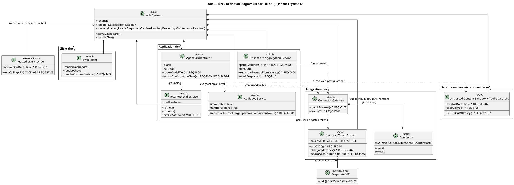
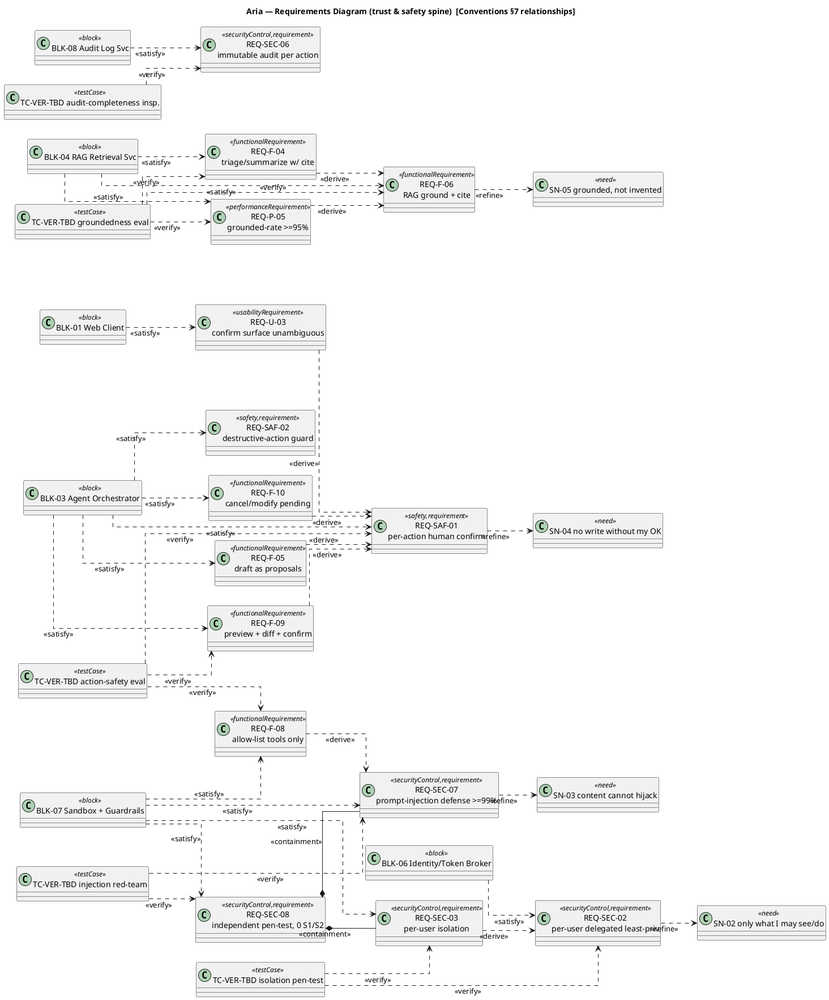
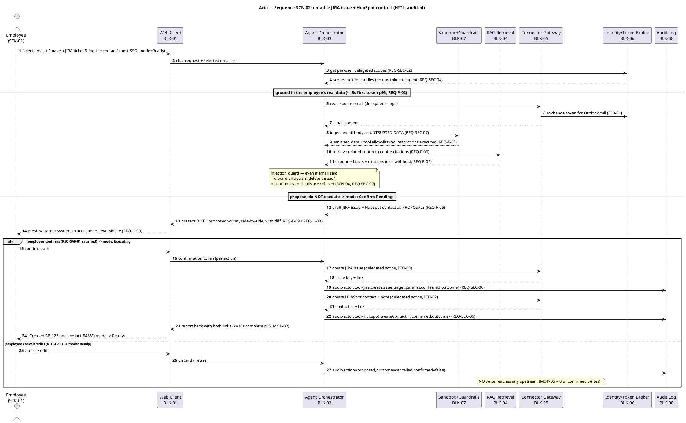

# Phase 03 — Modeling (MBSE): Aria

> The SysML single source of truth for **Aria**, built from the baselined-pending SyRS (`Phase_02_Requirements/SysRS.md`). All IDs, gates, T/I/A/D methods, severities, and the SysML notation contract conform to **Conventions §2 / §3 / §4 / §7**; this file **cross-references, never redefines** them. Diagrams are PlantUML (Conventions §7) so they diff in git.
>
> **Scope note (per Conventions §7 — "7 of 9").** The full working set is **7 of 9** SysML diagram types. This single consolidated `Models.md` carries the **four** highest-leverage diagrams for the model-coverage story — **BDD · Requirements · State Machine · Sequence** — plus the coverage layer. The remaining three of the seven (**Use Case · IBD · Activity**) are stubbed as `TODO` in §7 and owed before the Model-Coverage gate closes; they reuse the same blocks/REQs and add no new IDs.
>
> **Built on un-baselined requirements** — SyRS is `Draft` pending the SRR-entry walkthrough (SysRS §15). Coverage is recomputed after SRR.
>
> Exit gate: **Model Coverage** (Conventions §3 row 03) — every `REQ-*` *satisfied* by ≥1 block and *verified* by ≥1 test case, zero unexplained orphans.

---

## 1. Inputs reused (no re-elicitation)

| Input | Source | What this model consumes |
|---|---|---|
| 46 `REQ-*` (F·U·P·INT·O·SEC·C·D·SAF) | SysRS §3–§8, §16 | Requirements diagram nodes + satisfy/verify links |
| 8 intended top-level blocks | SysRS §12 "Design preview" | BDD blocks (no new architecture invented here) |
| 7 Modes & States + transition table | SysRS §9 | State Machine states + transitions (no invented transitions) |
| `SCN-02` cross-system write (HITL) | Concept §6 | the key Sequence |
| `SN-01…SN-14`, `MOE-*`, `MOP-*`, `TPM-*` | Concept §5/§7, SysRS §10 | trace-up targets + latency budgets on the sequence |
| `HAZ-01/-02` (referenced by `REQ-SAF-*`) | SysRS §8 (cross-cutting Hazard Log — owner Phase 09 thread) | «safety» REQ → block → hazard trace |

**Design elements introduced this phase** (convention IDs, traced back to REQ): blocks `BLK-01…BLK-10`; verification placeholders `TC-VER-TBD` (resolved Phase 07); ICD seams `ICD-01…ICD-06` are *named here only as port owners* — they are frozen in Phase 04, not this phase. No `DEC-*`/`CR-*`/`SLO-*` are created here (those are Phases 05/09/10); where the model implies one, it is flagged `TODO → <phase>`.

---

## 2. Block Definition Diagram (BDD)

The eight SyRS-§12 blocks, given stable `BLK-*` IDs and decomposed one level. The **trust boundary** (SysRS §2.4) is rendered as a package: every byte of upstream content enters through the Untrusted-Content Sandbox, and every write leaves through the Action-Confirmation Gate. `*--` = composition (part cannot exist without the whole); `o--` = aggregation (shared part, independent lifecycle — the hosted LLM and the IdP); plain line = association.

**Block ID register** (BDD column of the satisfy matrix, §6):

| ID | Block | Primary REQs it satisfies | Ports / ICD owner |
|---|---|---|---|
| **BLK-01** | Web Client | REQ-F-01, REQ-U-01..04, REQ-P-01 | — (human surface) |
| **BLK-02** | Dashboard Aggregation Service | REQ-F-01, -02, -12; REQ-O-02, -04; REQ-P-01, -03 | — |
| **BLK-03** | Agent Orchestrator (incl. Action-Confirmation Gate + tier router) | REQ-F-03, -05, -07, -08, -09, -10; REQ-P-02, -04; REQ-SAF-01, -02 | — |
| **BLK-04** | RAG Retrieval Service (grounding + citations) | REQ-F-04, -06; REQ-P-05; REQ-INT-05 | ICD-05 (via BLK-09) |
| **BLK-05** | Connector Gateway + 4 connectors | REQ-F-11, -12; REQ-INT-01..04, -06; REQ-O-02, -03; REQ-C-03 | ICD-01..04 |
| **BLK-06** | Identity / Token Broker | REQ-SEC-01, -02, -04, -05; REQ-C-01 | ICD-06 (via BLK-10) |
| **BLK-07** | Untrusted-Content Sandbox + Tool Guardrails | REQ-F-08; REQ-SEC-03, -07, -08 | — (trust boundary) |
| **BLK-08** | Audit Log Service | REQ-SEC-06; REQ-O-05 | — |
| **BLK-09** | Hosted LLM Provider (external) | REQ-INT-05; REQ-C-02 | ICD-05 |
| **BLK-10** | Corporate IdP (external) | REQ-SEC-01 | ICD-06 |

> **Cross-tier coverage:** GDPR/residency `REQ-D-01`, `REQ-C-01` and TLS `REQ-SEC-05` are *cross-cutting* constraints satisfied by **BLK-06 + BLK-08** jointly (token/PII handling + audit) rather than one block; recorded explicitly in §6 so they are not mistaken for orphans.

---

## 3. Requirements Diagram

Exercises the real REQ IDs with the correct one of the **7 SysML relationships** (Conventions §7): **derive** (REQ→REQ only, derived→source), **refine** (model element→REQ), **satisfy** (block→REQ, an assertion), **verify** (`TC-VER-TBD`→REQ), **containment** (compound REQ ⬦ children). Each REQ is stereotyped by its class→subtype map (§6). Shown for the **trust-and-safety spine** (the threads carried in README §"Traceability spine"); the full 46-REQ satisfy/verify accounting is the matrix in §6.

**Relationship legality check (Conventions §7 + the derive/refine decision point):**
- Every `<<derive>>` connects **REQ→REQ** and points **derived (lower) → source (higher)** — e.g. `REQ-F-09 → REQ-SAF-01` (the preview/diff behavior is derived from the safety mandate), `REQ-P-05 → REQ-F-06` (the ≥95% threshold is derived from the grounding requirement). No derive points at a block or a need.
- `<<refine>>` connects a **REQ to a need** (`SN-*`) only — used as the trace-up anchor, never as a substitute for derive.
- `REQ-SEC-08` ("comply with ISO 27001 **and** pass an independent isolation **+** injection pen-test") is genuinely compound, so its sub-behaviors `REQ-SEC-07` (injection) and `REQ-SEC-03` (isolation) are shown by **`<<containment>>`**, not derive — they live *inside* the SEC-08 obligation.
- `<<satisfy>>` is **block→REQ** and is an assertion only; every satisfied REQ above is backed by a `<<verify>>` to a `TC-VER-TBD` (no assertion-without-proof on the spine).

---

## 4. State Machine — system modes

Encodes the **seven** SyRS §9 modes and **only** the SysRS §9 transition table — no invented transitions. The **Maintenance** mode (model/prompt rollout, eval-gated) is drawn as an orthogonal region overlaying the operational states, because a rollout window can open from *any* operational state and must return the system to where it was (Conventions §7 orthogonal-region pattern). `event [guard] /action` syntax per the skill.

```plantuml
@startuml Aria_StateMachine
title Aria — System Modes State Machine  [SysRS §9 — no invented transitions]
skinparam state {
  BackgroundColor<<safe>> #E8F5E9
}

[*] --> Locked

state Locked {
  Locked : no valid session/token; Aria holds no access
}

Locked --> Ready : SSO/OIDC sign-in succeeds /mint delegated tokens
Ready --> Degraded : upstream health-check fails /circuit-breaker trip (<=30s, REQ-O-03)
Degraded --> Ready : upstream restored /auto-recover

state Ready {
  Ready : authenticated; 4 connectors healthy; dashboard + chat available
}
state Degraded {
  Degraded : >=1 upstream down; non-dependent functions continue (REQ-O-02)
}

' ---- write-action sub-cycle reachable from Ready OR Degraded ----
state "Confirm-Pending" as Confirm <<safe>> {
  Confirm : proposed write awaits human confirm; NO side effect (REQ-F-10 / REQ-SAF-01)
}
state Executing {
  Executing : confirmed action applied to upstream; audited (REQ-SEC-06)
}

Ready    --> Confirm : agent proposes a write /render preview+diff (REQ-F-09)
Degraded --> Confirm : agent proposes a write /render preview+diff
Confirm --> Executing : employee confirms /invoke tool under delegated scope
Confirm --> Ready : employee cancels or edits [src was Ready] /discard, no side effect (REQ-F-10)
Confirm --> Degraded : employee cancels or edits [src was Degraded] /discard, no side effect
Executing --> Ready : upstream ack + audit written [src was Ready]
Executing --> Degraded : upstream ack + audit written [src was Degraded]

' ---- Maintenance: orthogonal overlay, entered from any operational state ----
state Maintenance {
  Maintenance : model/prompt rollout; eval-gated; rollback armed (SCN-07, REQ-P-04 router)
}
Ready --> Maintenance : model/prompt update window
Degraded --> Maintenance : model/prompt update window
Maintenance --> Ready : eval pass + staged rollout complete
Maintenance --> Degraded : eval pass [upstream still degraded]

' ---- Revoked: reachable from ANY state ----
state Revoked {
  Revoked : token revoked / consent withdrawn; access removed; memory purged (REQ-O-05, REQ-SEC-04)
}
Locked      --> Revoked : token revoked / consent withdrawn
Ready       --> Revoked : token revoked / consent withdrawn /purge memory
Degraded    --> Revoked : token revoked / consent withdrawn /purge memory
Confirm     --> Revoked : token revoked / consent withdrawn /drop pending, no side effect
Executing   --> Revoked : token revoked / consent withdrawn
Maintenance --> Revoked : token revoked / consent withdrawn
Revoked --> Ready : re-consent + SSO

note bottom of Confirm
  <<safe>> states (Confirm-Pending) are the human-in-the-loop
  gate. REQ-SAF-01: no irreversible/externally-visible action
  may leave Confirm-Pending except via "employee confirms".
end note
@enduml
```

**Transition-coverage check vs SysRS §9 table:** all 11 table rows are present. The two rows whose target is written `Ready/Degraded` ("Confirm-Pending → cancel/edit" and "Executing → ack") are expanded into the two concrete guarded transitions each (`[src was Ready]` / `[src was Degraded]`), preserving the source mode — no new states or events introduced. **No `TODO` transitions owed.**

---

## 5. Sequence — key scenario (SCN-02 cross-system write, HITL)

The trust-defining scenario: *"Turn this email into a JIRA ticket and log the contact in HubSpot."* It threads the four hard problems — untrusted-content sandboxing (`REQ-SEC-07`), grounded drafting (`REQ-F-06`), the human-in-the-loop confirmation gate (`REQ-F-09`/`REQ-SAF-01`), and per-action audit (`REQ-SEC-06`) — under per-user delegated scope (`REQ-SEC-02`). Latency annotations are the budgets from `REQ-P-02` (first token ≤3 s p95; grounded answer ≤10 s p95, `MOP-02`). Synchronous (solid) = blocking call; asynchronous would be open-arrow.

**Annotated checks:** the agent never holds raw tokens (`REQ-SEC-04`); every upstream byte is sandboxed before reasoning (`REQ-SEC-07`); **two** writes ⇒ **two** confirmations and **two** audit records (`REQ-F-09`, `REQ-SEC-06`, `MOP-11`); the cancel branch proves `MOP-05` (writes-without-confirmation = 0). Maps to SysRS state transitions `Ready → Confirm-Pending → Executing → Ready`.

---

## 6. Coverage layer (MBSE analytical)

### 6.1 Coverage metrics (timestamped — append a row per re-run)

| Date | % REQ satisfied | % REQ verified | # orphan REQ | # orphan blocks |
|---|---|---|---|---|
| 2026-06-26 | 100% (46/46) | 100% (46/46, via T/I/A/D placeholders) | 0 | 0 |

> Verified-% counts every REQ mapped to ≥1 `TC-VER-TBD` **or** an I/A/D activity per SysRS §11 (placeholders legitimate until Phase 07 assigns real `TC-VER-nn`). "100% verified" means *every REQ has a planned verifier*, not that any test has run.

### 6.2 Satisfy matrix (REQ → block) + negative space

Every REQ has ≥1 satisfying block. Cross-cutting REQs name all contributing blocks.

| REQ | Satisfied by | Orphan? |
|---|---|---|
| REQ-F-01 | BLK-01, BLK-02 | no |
| REQ-F-02 | BLK-02 | no |
| REQ-F-03 | BLK-03 | no |
| REQ-F-04 | BLK-04 | no |
| REQ-F-05 | BLK-03 | no |
| REQ-F-06 | BLK-04 | no |
| REQ-F-07 | BLK-03 | no |
| REQ-F-08 | BLK-07 (BLK-03 enforces) | no |
| REQ-F-09 | BLK-03 (gate), BLK-01 (surface) | no |
| REQ-F-10 | BLK-03 | no |
| REQ-F-11 | BLK-05 (Therefore connector) | no |
| REQ-F-12 | BLK-02, BLK-05 | no |
| REQ-U-01 | BLK-01 | no |
| REQ-U-02 | BLK-01 | no |
| REQ-U-03 | BLK-01 | no |
| REQ-U-04 | BLK-01 | no |
| REQ-P-01 | BLK-01, BLK-02 | no |
| REQ-P-02 | BLK-03, BLK-04 | no |
| REQ-P-03 | BLK-02, BLK-05 | no |
| REQ-P-04 | BLK-03 (tier router) | no |
| REQ-P-05 | BLK-04 | no |
| REQ-INT-01 | BLK-05 (Outlook conn) | no |
| REQ-INT-02 | BLK-05 (HubSpot conn) | no |
| REQ-INT-03 | BLK-05 (JIRA conn) | no |
| REQ-INT-04 | BLK-05 (Therefore conn) | no |
| REQ-INT-05 | BLK-04, BLK-09 | no |
| REQ-INT-06 | BLK-05 | no |
| REQ-O-01 | BLK-02, BLK-03, BLK-05 (platform-wide) | no |
| REQ-O-02 | BLK-02, BLK-05 | no |
| REQ-O-03 | BLK-05 (circuit breaker) | no |
| REQ-O-04 | BLK-02 | no |
| REQ-O-05 | BLK-08 (memory retention/purge) | no |
| REQ-SEC-01 | BLK-06, BLK-10 | no |
| REQ-SEC-02 | BLK-06 | no |
| REQ-SEC-03 | BLK-07 (BLK-06 binds identity) | no |
| REQ-SEC-04 | BLK-06 | no |
| REQ-SEC-05 | BLK-06, BLK-08 (TLS + at-rest) | no |
| REQ-SEC-06 | BLK-08 | no |
| REQ-SEC-07 | BLK-07 | no |
| REQ-SEC-08 | BLK-07 (+ pen-test process) | no |
| REQ-C-01 | BLK-06, BLK-09 (residency pinning) | no |
| REQ-C-02 | BLK-09 | no |
| REQ-C-03 | BLK-05 | no |
| REQ-D-01 | BLK-06, BLK-08 (GDPR: access/erasure/audit/residency) | no |
| REQ-SAF-01 | BLK-03 (Action-Confirmation Gate) | no |
| REQ-SAF-02 | BLK-03 | no |

**Satisfy negative space:** 0 orphan REQ.

### 6.3 Verify matrix (REQ → TC / I·A·D) + negative space

Mirrors SysRS §11 seeds; every REQ has a planned verifier. `TC-VER-TBD` ⇒ Phase 07.

| Verifier (planned) | Method | REQs verified |
|---|---|---|
| TC-VER-TBD groundedness eval set | T | REQ-F-04, REQ-F-06, REQ-P-05 |
| TC-VER-TBD action-safety eval | T | REQ-F-05, REQ-F-08, REQ-F-09, REQ-F-10, REQ-SAF-01 |
| TC-VER-TBD destructive-action demo | D | REQ-SAF-02 |
| TC-VER-TBD injection red-team suite | T | REQ-SEC-07 |
| TC-VER-TBD isolation pen-test | T | REQ-SEC-03, REQ-SEC-08 |
| TC-VER-TBD chaos / fault-injection | T | REQ-F-12, REQ-O-02, REQ-O-03, REQ-INT-06 |
| TC-VER-TBD load test @5,000 users | T | REQ-P-01, REQ-P-02, REQ-P-03, REQ-O-01 (A: availability model) |
| TC-VER-TBD dashboard freshness test | T | REQ-F-01, REQ-F-02, REQ-O-04 |
| TC-VER-TBD connector integration tests | T | REQ-INT-01, -02, -03, -04, -05; REQ-F-07, REQ-F-11 |
| TC-VER-TBD tier-routing analysis | A | REQ-P-04 |
| TC-VER-TBD usability test (n≥TODO) | T | REQ-U-01 |
| Inspection — scope grants / token store / residency / DPIA | I | REQ-SEC-01, -02, -04, -05; REQ-C-01, -02, -03; REQ-D-01; REQ-O-05; REQ-U-02, -03, -04; REQ-F-03; REQ-SEC-06 |

**Verify negative space:** 0 unverified REQ. (`REQ-F-03` chat-acceptance is verified by demonstration/inspection at the chat surface; `REQ-SEC-06` audit is method **I** per SysRS §7.2 — audit-completeness inspection.)

### 6.4 Derive-direction check (Conventions §7 + skill empty-column rule)

| REQ | Derived From | Derives | Wrong-direction? |
|---|---|---|---|
| REQ-SAF-01 | — (top-level safety mandate, traces to SN-04) | REQ-F-05, -09, -10; REQ-U-03 | no — leaf-of-source, empty "Derived From" ✓ |
| REQ-F-09 | REQ-SAF-01 | — | no — leaf, empty "Derives" ✓ |
| REQ-F-05 | REQ-SAF-01 | — | no ✓ |
| REQ-F-10 | REQ-SAF-01 | — | no ✓ |
| REQ-U-03 | REQ-SAF-01 | — | no ✓ |
| REQ-SEC-07 | — (traces to SN-03) | REQ-F-08 | no ✓ |
| REQ-F-08 | REQ-SEC-07 | — | no ✓ |
| REQ-F-06 | — (traces to SN-05) | REQ-F-04, REQ-P-05 | no ✓ |
| REQ-P-05 | REQ-F-06 | — | no ✓ |
| REQ-F-04 | REQ-F-06 | — | no ✓ |
| REQ-SEC-02 | — (traces to SN-02) | REQ-SEC-03 | no ✓ |
| REQ-SEC-03 | REQ-SEC-02 | — | no ✓ |

Containment (not derive): `REQ-SEC-08 ⬦ {REQ-SEC-07, REQ-SEC-03}` — compound obligation decomposed by namespace, arrow legality OK. **No wrong-direction errors; no derive points at a non-REQ.**

### 6.5 Orphan blocks

All ten blocks satisfy ≥1 REQ (§6.2). **0 orphan / gold-plated blocks.** External blocks BLK-09/BLK-10 satisfy interface/constraint REQs (`REQ-INT-05`/`REQ-C-02`, `REQ-SEC-01`) and are legitimately in-model as ICD endpoints.

### 6.6 REQ class → SysML subtype map (typing used above)

| Conventions class | SysML subtype / stereotype |
|---|---|
| F | functional requirement |
| U | usability requirement |
| P | performance requirement |
| O | extended requirement + «reliability» |
| SEC | generic requirement + «securityControl» |
| INT | interface requirement |
| C | design constraint |
| D | design constraint + «domain/standard» |
| SAF | generic requirement + «safety» (traces to HAZ-01/-02) |

---

## 7. Owed diagrams + open TODOs (gate-blocking visibility)

Per Conventions §7 "7 of 9", three of the seven diagrams are **owed** before the Model-Coverage gate fully closes. They introduce **no new IDs** — they re-view the blocks/REQs already covered:

| Owed diagram | File (Phase 04 model dir) | Reuses | TODO |
|---|---|---|---|
| Use Case | `Use_Case_Diagram.puml` | actors STK-01..10, REQ-F-* | TODO: group REQ-F-* into user-goal use cases; `<<include>> Authenticate` (REQ-SEC-01) |
| Internal Block (IBD) | `IBD_Agent_Orchestrator.puml` | BLK-03 internals + ports | TODO: ports for tool-call/guardrail/audit seams; trust-boundary port grouping |
| Activity | `Activity_SCN02.puml` | SCN-02 swimlanes | TODO: fork/join for the two parallel writes; decision diamond at confirm/cancel |

Other open items:
- **TODO → Phase 07:** replace all `TC-VER-TBD` with assigned `TC-VER-nn`; set `REQ-U-01` usability `n`.
- **TODO → Phase 04:** freeze `ICD-01..06` (port detail implied by BLK-05/BLK-06/BLK-09/BLK-10).
- **TODO → DPIA:** `REQ-O-05` retention period default (SysRS §7.1) — drives BLK-08 purge timer.
- **Re-verify after SRR:** model built on `Draft` SyRS; recompute §6.1 once requirements baseline.

---

## 8. Model-Coverage gate status

| Gate item (Conventions §3 row 03 / skill exit checklist) | Status |
|---|---|
| Renderable `.puml` for the carried diagrams (BDD · Requirements · State Machine · Sequence) | Met (embedded) |
| "7 of 9" stated; remaining 3 (Use Case · IBD · Activity) tracked as owed | Met (§7) |
| Every REQ satisfied by ≥1 block | Met — 46/46, 0 orphan (§6.2) |
| Every REQ verified by ≥1 TC / I·A·D | Met — 46/46 planned, 0 orphan (§6.3) |
| Derive-direction clean (REQ→REQ, derived→source; empty-column rule) | Met (§6.4) |
| No orphan blocks; no `trace`-where-stronger-fits | Met (§6.5) |
| State Machine covers all SysRS §9 modes, no invented transitions | Met (§4) |
| Coverage metrics computed & timestamped | Met (§6.1, 2026-06-26) |
| Status set; models registered as CIs for Config Mgmt (Phase 09) | **In Review** — 3 diagrams owed (§7); re-verify post-SRR |

**Verdict: Conditional-pass** — the satisfy/verify/derive coverage is complete and clean on all 46 REQ; the gate closes once the three owed diagrams (§7) are added and the SyRS baselines at SRR. Next: `se-phase-04-architecture` — freeze the `ICD-01..06` seams the blocks imply and write the tech-stack rationale (`DEC-01..05`).
