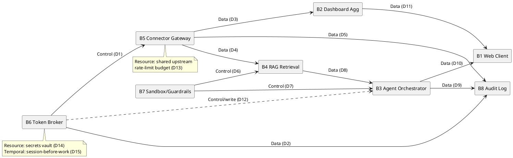

# Phase 06 — Integration Plan: Aria

> Plans how Aria's implemented components are combined and tested into a working whole, ordered so that any break is traceable to the piece just added, and the interfaces are frozen. Exit gate: **CDR** (Conventions §3) — ICDs frozen, **product baseline** set. Conforms in all IDs, gates, methods, and severities to Conventions; cross-references it rather than restating it.
>
> **Source artifacts.** ICD inventory and system blocks are taken from `Phase_02_Requirements/SysRS.md` §6 (ICD-01..06) and §12 (8 blocks, DEC-01..05). The Phase 04 `ICD.md` and Phase 05 `Decision_Register.md` files are **TODO: not yet authored** (Architecture/Trade-off phases pending per README phase index); this plan uses the authoritative ICD/DEC IDs the SysRS already fixes and is the consumer that *requires* those files frozen before CDR can pass (see §9).

---

## 1. Strategy

**Chosen: Incremental + CI/CD** (Conventions §1, Phase 06 default). Add one component-group at a time, end-to-end, automated on every commit against a test+evaluation harness; integrate the most-depended-upon components first so the highest-risk interactions surface while schedule remains to fix them.

| Aspect | Decision | Rationale |
|---|---|---|
| Strategy | Incremental + CI/CD | Easiest fault isolation; matches the Agile + Formal-overlay lifecycle (Concept §4) — every sprint adds a vertical slice but the trust boundaries cannot regress between increments. |
| System class | **Software + agentic; no hardware** | No physical HIL applies. The hardware-equivalent rig is the **AI-Evaluation Rig** (§7): a software-in-the-loop harness that exercises grounding, injection, and action-safety on the *integrated* agent — non-optional, stood up in INC-01, run per increment (mirrors the skill's "HIL in Increment 1" rule for the safety-relevant measurement REQs `REQ-P-05`, `REQ-SEC-07`, `REQ-SAF-01/-02`). |
| Tailored out | Physical HIL rigs | "tailored out: no hardware in scope" (Conventions §1 tailoring note). Replaced by the AI-Evaluation Rig + contract-test mocks. |
| Lifecycle anchor | 2-week sprints, continuous delivery (Concept §4) | Each `INC-NN` duration is anchored to sprint multiples; **TODO: Integration Lead** to bind increment dates to the Phase 01 `Project_Development_Plan.md` schedule once authored. |

Why not the alternatives: **Big Bang** destroys fault isolation across eight blocks and a non-deterministic LLM core (the failure mode we most need to avoid — an injection that "works" with no traceable seam); **Top-Down only** would stub all four connectors and the model, deferring the real injection/isolation surface to the end; **Bottom-Up only** would prove connectors but show the Action-Confirmation Gate and grounding late. Incremental + CI lets us integrate the broker and gateway first (highest dependency weight), then the safety-critical agent/RAG seam, with real eval coverage at each step.

---

## 2. Increment Order — Dependency-Weight Ranking

Out-degree = number of other blocks that depend on this block (it must exist/be healthy for them to function). Blocks are the eight from SysRS §12.

| Block (SysRS §12) | Depends-on-it (out-degree) | Rank | Integrated in |
|---|---|---|---|
| **B6 Identity / Token Broker** (SSO/OIDC, delegated-scope OAuth, encrypted vault) | B5, B2, B4, B8 *(every read/write and audit needs a per-user token)* = 4 | **1** | INC-01 |
| **B5 Connector Gateway + 4 connectors** (circuit breakers) | B2, B4, B8 = 3 | **2** | INC-03 |
| **B7 Untrusted-Content Sandbox + Tool Guardrails** (allow-list, injection defense) | B3, B4 = 2 | **3** | INC-04 |
| **B8 Audit Log Service** (immutable, tamper-evident) | B3, B5 *(both must emit audit)* = 2 | **3** | INC-02 |
| **B3 Agent Orchestrator** (planning, tool-calling, tier router, **Action-Confirmation Gate**) | B1, B2 = 2 | **3** | INC-06 |
| **B4 RAG Retrieval Service** (per-user index, grounding, citation) | B3 = 1 | **6** | INC-05 |
| **B2 Dashboard Aggregation Service** (fan-out, eventual-consistency reconcile) | B1 = 1 | **6** | INC-03 |
| **B1 Web Client** (dashboard + AI chat UI) | 0 *(leaf — nothing depends on it)* | **8** | INC-07 |

**Ordering decisions & constraint-driven overrides:**
- The Identity/Token Broker (B6) is the spine — integrated first. Nothing reads or writes a user's data without a per-user delegated token, so it carries the highest dependency weight and the top isolation risk (RSK-02).
- **Override (constraint-driven):** the **Audit Log Service (B8)** is integrated in **INC-02**, *earlier* than its dependency weight (rank 3) would place it. Reason: REQ-SEC-06 requires "every read-of-record and every write action" to be audited, so audit must be live *before* any connector read (INC-03) or agent write (INC-06) is exercised — otherwise early increments would generate un-audited traffic. Recorded override.
- B2 (Dashboard) and B1 (Web Client) are low-weight leaves but provide the human surface for SCN-01; they are integrated mid/late once the data sources behind them are real.
- The **Agent Orchestrator (B3)** and its **Action-Confirmation Gate** are deliberately integrated *after* the Sandbox/Guardrails (B7, INC-04) and RAG (B4, INC-05) so that by the time the agent can call tools, the injection defense and grounding it depends on are already real and eval-covered — never stubbed when the first live write is attempted.

No dependency cycle detected (B1←B2←B5←B6 is a DAG; B8 is a sink that B3/B5 write to; B7 sits between content ingress and B3/B4).

---

## 3. Increments (INC-NN)

Eight increments, derived from this project's eight blocks and seven scenarios — not a forced count. Each exit criterion is decidable by a CI job or the AI-Evaluation Rig. "Zero S1" uses Conventions §5 severity. TC-VER IDs are resolved in Phase 07 (SysRS §11 seeds them as `TC-VER-TBD`); here they are assigned provisional numbers `TC-VER-01..09` so increments have a concrete pass/fail signal — **Phase 07 is authoritative** and may renumber.

### INC-01 — Identity spine: SSO sign-in + per-user delegated tokens
| Field | Value |
|---|---|
| Goal | An employee signs in via corporate SSO/OIDC and Aria holds **only** that employee's short-lived, encrypted, per-user delegated tokens (no app-only credential). |
| Components added | B6 Identity / Token Broker |
| Entry criteria | B6 built; **ICD-06 (SSO/IdP)** contract agreed + contract tests exist; secrets vault provisioned (DEC-04/DM-04 token-storage decision — **TODO: confirm once Phase 05 authored**). |
| Exit criteria | REQ-SEC-01 (SSO, no local password) verified via `TC-VER-07`; REQ-SEC-04 (encrypted-at-rest, short-lived, rotated, revocable ≤5 min) verified via `TC-VER-07`; REQ-SEC-02 (least-privilege delegated scopes) inspected (I) — pass; **zero S1**. |
| Pass/Fail signal | `TC-VER-07` token-lifecycle suite green (revocation propagates ≤5 min) + scope-grant inspection signed. |
| Duration | 2 sprints (TODO: anchor to Phase 01 schedule). |
| Tools | CI build/unit (GitHub Actions + PyTest), contract test against IdP mock (Schemathesis from OIDC discovery doc), secrets-vault integration test. |

### INC-02 — Audit substrate: immutable, tamper-evident logging
| Field | Value |
|---|---|
| Goal | Every record-access and (later) write emits a complete, append-only, tamper-evident audit entry (actor, ts, tool, target, params, confirmation status, outcome). |
| Components added | B8 Audit Log Service |
| Entry criteria | INC-01 done (audit entries are keyed to the per-user identity from B6); audit schema agreed. |
| Exit criteria | REQ-SEC-06 audit-completeness verified via `TC-VER-08` (I — sample N actions, assert 100% complete entries, MOP-11 = 100%); tamper-evidence (hash-chain / WORM) inspected; **zero S1**. |
| Pass/Fail signal | `TC-VER-08`: audit-completeness = 100% on the sampled action set; tamper test fails any mutated entry. |
| Duration | 1 sprint. |
| Tools | CI unit + integration; append-only store contract test; tamper-injection test in CI. |

### INC-03 — Read fan-out: four connectors + gateway + dashboard aggregation
| Field | Value |
|---|---|
| Goal | The dashboard renders the signed-in employee's real Outlook mail+calendar, JIRA issues, HubSpot contacts/deals, and Therefore documents — read-only, per-user scoped, each panel timestamped (SCN-01). |
| Components added | B5 Connector Gateway + 4 connectors; B2 Dashboard Aggregation Service |
| Entry criteria | INC-01 + INC-02 done; **ICD-01..04 (the four connectors)** contracts agreed + contract tests exist; per-connector rate-limit/backoff config set (REQ-INT-06). |
| Exit criteria | REQ-F-01 (unified view) demonstrated (D); REQ-F-02 (≤60 s staleness + last-refresh ts) verified via `TC-VER-01`; REQ-P-01 (first view ≤3 s p95) verified via `TC-VER-01` (load, MOP-01); REQ-SEC-03 (per-user isolation across all four reads) verified via `TC-VER-03` — **0 cross-user leakage**; every read audited (carry-forward from INC-02); **zero S1**, zero open S2 on isolation. |
| Pass/Fail signal | `TC-VER-03` isolation suite = 0 cross-user reads (MOP-06 = 100%) **and** `TC-VER-01` p95 render ≤3 s. |
| Duration | 3 sprints (four connectors in parallel sub-tasks). |
| Tools | CI per-connector contract tests (Pact/Schemathesis from Graph/HubSpot/JIRA/Therefore API schemas); Testcontainers for the gateway; isolation pen-test harness (multi-tenant fixtures). |

### INC-04 — Trust boundary: untrusted-content sandbox + tool guardrails
| Field | Value |
|---|---|
| Goal | All email/document/CRM content is ingested as **untrusted data, never instructions**, confined to a sandbox; the tool allow-list refuses any out-of-policy tool call and logs it (SCN-04). |
| Components added | B7 Untrusted-Content Sandbox + Tool Guardrails |
| Entry criteria | INC-03 done (real untrusted content now flows from the four connectors); allow-list policy defined per tenant; AI-Evaluation Rig injection suite loaded (§7). |
| Exit criteria | REQ-F-08 (only allow-listed tools; out-of-list refused+logged) verified via `TC-VER-04`; REQ-SEC-07 (injection-defense ≥99% on red-team suite, MOP-12, **TPM-03**) verified via `TC-VER-04` on the AI-Evaluation Rig; refusals audited; **zero S1**. |
| Pass/Fail signal | `TC-VER-04`: injection-neutralization ≥99% (threshold ≥95%) on the red-team suite; 100% of out-of-allow-list calls refused+logged. |
| Duration | 2 sprints. |
| Tools | AI-Evaluation Rig (HIL-equivalent) injection red-team suite; CI gate `eval-injection`; Semgrep/CodeQL SAST on guardrail code. |

### INC-05 — Grounding: RAG retrieval + citation layer
| Field | Value |
|---|---|
| Goal | Substantive answers are grounded in the employee's retrieved data with a citation per asserted fact; ungroundable claims withheld/flagged (SCN-03). |
| Components added | B4 RAG Retrieval Service |
| Entry criteria | INC-03 (data sources real) + INC-04 (retrieved content passes through the sandbox) done; per-user index built; groundedness eval set loaded; **ICD-05 (LLM/model API)** contract agreed (DEC-01/DM-01 model choice + DEC-02/DM-02 RAG architecture — **TODO: confirm once Phase 05 authored**). |
| Exit criteria | REQ-F-06 (RAG grounding + per-fact citation) and REQ-P-05 (grounded-answer rate ≥95%, MOP-04, **TPM-01**) verified via `TC-VER-02` on the AI-Evaluation Rig; per-user index isolation re-checked under `TC-VER-03`; **zero S1**. |
| Pass/Fail signal | `TC-VER-02`: grounded-answer rate ≥95% (threshold ≥90%), fabricated-entity rate = 0 on the eval set. |
| Duration | 3 sprints. |
| Tools | AI-Evaluation Rig groundedness eval set; CI gate `eval-grounding`; ICD-05 mock (recorded model responses) for deterministic CI, real model in nightly. |

### INC-06 — Agent + Action-Confirmation Gate: HITL writes & cross-system workflow
| Field | Value |
|---|---|
| Goal | The agent plans, calls allow-listed tools, and **executes no write without explicit per-action human confirmation**; a cross-system workflow (email→JIRA issue + HubSpot contact) runs as individually-confirmed, audited writes (SCN-02, SCN-03). |
| Components added | B3 Agent Orchestrator (incl. Action-Confirmation Gate + model-tier router) |
| Entry criteria | INC-04 (guardrails) + INC-05 (grounding) done — the agent never reaches a live write before injection defense and grounding are real and eval-passing; **ICD-05** frozen-candidate; write scopes provisioned on B6. |
| Exit criteria | REQ-F-09 + REQ-SAF-01 (preview/diff + explicit confirm; never auto-execute) and REQ-F-05/-F-10 (proposals editable/cancellable, no side effect pre-confirm) verified via `TC-VER-05` — **writes-without-confirmation = 0 (MOP-05)**; REQ-SAF-02 (destructive-action double-confirm + undo ref) verified (D); REQ-F-07 (cross-system workflow, individually confirmed) demonstrated; REQ-P-04 tier-routing (≥90% routine off top tier, MOP-10) analyzed (A); every write audited (REQ-SEC-06); **zero S1**, zero open S2. |
| Pass/Fail signal | `TC-VER-05` action-safety eval: attempt unconfirmed writes ⇒ **0 execute** (MOP-05 = 0); all confirmed writes audited 100%. |
| Duration | 3 sprints. |
| Tools | AI-Evaluation Rig action-safety eval; CI gate `eval-action-safety`; ICD-01..04 write-path contract tests (against connector mocks, then real in nightly). |

### INC-07 — Web Client: full dashboard + chat UX, transparency & confirmation surfaces
| Field | Value |
|---|---|
| Goal | The only human surface is complete: dashboard, chat, the confirmation/diff surface, and the persistent transparency notice — first-time users complete a cross-system task unaided. |
| Components added | B1 Web Client |
| Entry criteria | INC-06 done (the agent/gate the UI fronts is real). |
| Exit criteria | REQ-U-01 (first-task success ≤3 min for ≥90%, MOP-09) verified via `TC-VER-09` (usability test, n≥TODO); REQ-U-03 (confirmation surface unambiguous on target/change/reversibility) inspected (I); REQ-U-04 (persistent transparency notice) inspected (I); REQ-U-02 (WCAG 2.2 AA) inspected (I); **zero S1**. |
| Pass/Fail signal | `TC-VER-09`: ≥90% first-task success (threshold ≥80%); a11y + transparency inspections signed. |
| Duration | 2 sprints. |
| Tools | Playwright E2E; axe-core a11y scan in CI; usability-test protocol (Phase 08 reuses for UAT). |

### INC-08 — Resilience & lifecycle: graceful degradation, eval-gated rollout, offboarding
| Field | Value |
|---|---|
| Goal | A single upstream outage degrades only that source; model/prompt updates are eval-gated with rollback; token revocation removes all access and purges memory (SCN-05, SCN-06, SCN-07). |
| Components added | (no new block) Cross-cutting wiring: circuit breakers (B5), reconciliation (B2), eval-gate release pipeline, revocation/erasure path (B6, B8). |
| Entry criteria | INC-01..07 done (full system integrated end-to-end). |
| Exit criteria | REQ-O-02 (≥99% non-dependent functions under 1-upstream outage, MOP-08) + REQ-O-03 (circuit breaker isolates ≤30 s, auto-recovers) + REQ-F-12 (degraded-state indicator + last-known-good ts) verified via `TC-VER-06` (chaos/fault-injection — drop each upstream); REQ-O-01 (≥99.5% availability, MOP-07, **TPM-02**) analyzed (A); REQ-O-04 (write reflected ≤60 s) tested (T); REQ-O-05 + SCN-06 (memory purge on revocation, erasure SLA) inspected (I); REQ-P-03 (5,000 concurrent at SLA, MOP-03) load-tested (T); **zero S1**, zero open S2/critical RSK. |
| Pass/Fail signal | `TC-VER-06`: with each single upstream down, ≥99% of non-dependent functions remain (MOP-08); breaker trips ≤30 s; revocation purges memory and removes access. |
| Duration | 2 sprints. |
| Tools | Chaos/fault-injection harness (per-connector kill switch); k6 load test at 5,000 users; AI-Evaluation Rig regression gate for the model/prompt rollout (SCN-07); revocation integration test. |

---

## 4. Dependency Map (Data / Control / Temporal / Resource)

Each edge is a *component reliance* (distinct from the interface taxonomy in §5). "A → B" reads "B depends on A."

| # | Edge (A → B, "B depends on A") | Type | Why |
|---|---|---|---|
| D1 | B6 Token Broker → B5 Connector Gateway | **Control** | The broker's per-user token gates whether the gateway may call any upstream at all. |
| D2 | B6 Token Broker → B8 Audit Log | **Data** | Audit entries are keyed to the actor identity B6 resolves. |
| D3 | B5 Connector Gateway → B2 Dashboard Aggregation | **Data** | The dashboard consumes the four sources' data the gateway fetches. |
| D4 | B5 Connector Gateway → B4 RAG Retrieval | **Data** | RAG indexes/retrieves the content the connectors return. |
| D5 | B5 Connector Gateway → B8 Audit Log | **Data** | Every read-of-record emits an audit entry (REQ-SEC-06). |
| D6 | B7 Sandbox/Guardrails → B4 RAG Retrieval | **Control** | Retrieved untrusted content must pass the sandbox before grounding; guardrail state gates ingestion. |
| D7 | B7 Sandbox/Guardrails → B3 Agent Orchestrator | **Control** | The allow-list/guardrail decision gates which tool calls the agent may emit. |
| D8 | B4 RAG Retrieval → B3 Agent Orchestrator | **Data** | The agent grounds its plan/answer on RAG-retrieved, cited evidence. |
| D9 | B3 Agent Orchestrator → B8 Audit Log | **Data** | Every write action emits an audit entry. |
| D10 | B3 Agent Orchestrator → B1 Web Client | **Data** | The UI renders the agent's proposals, diffs, and results. |
| D11 | B2 Dashboard Aggregation → B1 Web Client | **Data** | The UI renders the aggregated dashboard. |
| D12 | B6 Token Broker → B3 Agent Orchestrator (write path) | **Control** | A confirmed write executes under the user's delegated write scope from B6. |
| D13 | B5 connectors ↔ upstream APIs (Graph/HubSpot/JIRA/Therefore) | **Resource** | Connectors share each upstream's finite **rate-limit budget**; backoff coordinates the shared resource (REQ-INT-06, REQ-C-03). |
| D14 | B6 Token Broker ↔ secrets vault | **Resource** | Token store + vault is a shared finite resource (connection pool, KMS quota). |
| D15 | B6 sign-in → all blocks | **Temporal** | A valid session/token must exist (boot order) before any block does per-user work; Locked→Ready transition (SysRS §9) precedes everything. |
| D16 | B8 Audit live → B5/B3 first action | **Temporal** | Audit must be initialised (INC-02) before the first audited read/write (INC-03/-06) — drives the INC-02-before-INC-03 override (§2). |
| D17 | B5 health-check → B2/B1 degraded-state | **Control** | Connector circuit-breaker state controls whether a panel renders live or degraded (SCN-05, REQ-O-03). |

---

## 5. Interfaces & Stubs / Drivers / Mocks Coverage

Every `ICD-NN` from the SysRS §6 inventory (ICD-01..06) appears exactly once. Interface type per Conventions/skill: **HW** (none — software-only), **SW-API** (protocols/APIs/data formats), **HMI** (UI). Placeholder: **stub** (simulates what's *below*), **driver** (simulates what's *above*), **mock** (peer-to-peer). All API mocks are generated from the upstream schema and validated by contract tests in CI (no hand-written drift).

| ICD-NN | Interface type | Seam (A ↔ B) | Source REQ | Placeholder during integration | Tool | Replaced by real in |
|---|---|---|---|---|---|---|
| **ICD-01** | SW-API | B5 Connector ↔ Microsoft Graph (mail + calendar), OAuth2 delegated | REQ-INT-01 | **Mock** — Graph API mock generated from the Graph OpenAPI; contract test on schema + scopes | Schemathesis / Prism + Pact | INC-03 (read); INC-06 (write path) |
| **ICD-02** | SW-API | B5 Connector ↔ HubSpot CRM (contacts, deals, notes), OAuth2 per-user | REQ-INT-02 | **Mock** — HubSpot API mock from its OpenAPI; rate-limit behavior simulated | Prism + Pact | INC-03 (read); INC-06 (write) |
| **ICD-03** | SW-API | B5 Connector ↔ Atlassian JIRA Cloud REST (issues, projects), OAuth 3LO | REQ-INT-03 | **Mock** — JIRA Cloud REST mock from its OpenAPI; 3LO token flow stubbed | Prism + Pact | INC-03 (read); INC-06 (write/transition) |
| **ICD-04** | SW-API | B5 Connector ↔ Therefore DMS (search, retrieve, file), scoped HTTPS | REQ-INT-04 | **Mock** — Therefore API mock; file/search responses recorded; contract test | Prism + Pact (or recorded fixtures if no OpenAPI — **TODO: confirm Therefore schema availability, STK-06**) | INC-03 (read); INC-06 (file) |
| **ICD-05** | SW-API | B3 Agent / B4 RAG ↔ LLM provider tool-calling API | REQ-INT-05 | **Mock** — recorded/deterministic model responses for CI; real model nightly + on the AI-Evaluation Rig | Provider SDK record-replay; deterministic eval fixtures | INC-05 (grounding); INC-06 (agent); real-model gate per SCN-07 |
| **ICD-06** | SW-API | B6 Token Broker ↔ corporate SSO/IdP (OIDC) | REQ-SEC-01, REQ-SEC-04 | **Mock** — IdP mock from the OIDC discovery document; revocation event simulated | Schemathesis from `/.well-known/openid-configuration` | INC-01 |

> **HMI seams** (B1 Web Client dashboard, chat, confirmation/diff surface, transparency notice) are not assigned a separate ICD-NN in the SysRS §6 inventory; they are integrated and verified in **INC-07** against REQ-U-01/-02/-03/-04 via Playwright E2E + axe-core. **TODO: Architecture Lead** — if Phase 04 `ICD.md` adds an explicit HMI ICD row, add it here before CDR.
>
> **No HW interface rows** — Aria has no hardware (tailored out, §1). **No skipped seam:** ICD-01..06 each appear exactly once above.

---

## 6. CI/CD Pipelines (per tier)

Three velocity tiers (no firmware/edge/mobile tiers — software-only). Each references the **canonical CI/CD + static-scan tool table** owned by the Phase 06 skill (Phase 07 cites that table; tool *categories* pinned, specific tool **TODO: Integration Lead** to confirm). Branch model: trunk-based with short-lived PRs (matches CD cadence, Concept §4).

| Tier | Repo / artifact | Ordered stages (gate at each) | Deploy targets | Rollout / rollback |
|---|---|---|---|---|
| **Web Client (B1)** | `aria-web` → container image / static bundle | build → unit (Vitest) → E2E (Playwright) → a11y (axe-core) → SAST (CodeQL) → SCA/SBOM (Trivy + `syft`) → publish | lab → staging → pilot cohort → prod | Blue-green; auto-revert on health-check fail. |
| **Application + Agent (B2,B3,B4,B7,B8)** | `aria-app` → container images | build → unit (PyTest) → integration/contract (Pact/Testcontainers) → **eval gates** (`eval-grounding`, `eval-injection`, `eval-action-safety` on the AI-Evaluation Rig) → SAST (Semgrep/CodeQL) → SCA/SBOM (Snyk/Trivy + `syft`) → load (k6, pre-release) → publish | lab → staging → pilot → prod | **Canary / staged cohort**; auto-rollback on eval-regression or metric regression (SCN-07 eval-gated release; RSK-07 mitigation). |
| **Integration / Identity (B5,B6)** | `aria-connectors`, `aria-identity` → container images | build → unit → connector **contract tests** (Schemathesis/Prism/Pact per ICD-01..06) → isolation test (multi-tenant fixtures) → SAST → SCA/SBOM → publish | lab → staging → pilot → prod | Canary per connector; circuit-breaker fail-safe on rollout; auto-rollback on isolation/contract failure. |

**Static-scan & supply-chain stack (gates every tier, blocks PR on critical findings):**
- **SAST:** Semgrep + CodeQL (block PR on critical) — covers guardrail/injection-defense code especially (REQ-SEC-07).
- **SCA / SBOM:** Snyk or Trivy + Grype, emitting an SBOM via `syft` on every commit (block on critical CVE; feeds the Security thread / supply-chain control, RSK-04, STK-04).
- **Secrets scanning:** gitleaks/Trufflehog in pre-commit + CI (no token/secret committed — protects the token store, REQ-SEC-04).
- **Eval gates (Aria-specific, Application tier):** a release that regresses `eval-grounding` (TPM-01 ≥95%), `eval-injection` (TPM-03 ≥99%), or `eval-action-safety` (MOP-05 = 0) **blocks the release** — this is the mechanized form of SCN-07 and the change-control overlay on model/prompt (Concept §4, RSK-07).

---

## 7. AI-Evaluation Rig (HIL-equivalent — software-only system)

> Physical HIL is **tailored out** (no hardware). For an agentic system the safety-relevant, physical-measurement-equivalent REQs — grounding (`REQ-P-05`), injection defense (`REQ-SEC-07`), and action-safety (`REQ-SAF-01/-02`, `REQ-F-09`) — cannot be proved by inspection of a non-deterministic model; they require **operating the integrated agent against curated stimulus sets and measuring outcomes**. The AI-Evaluation Rig is that harness. Per the skill's "stand up in Increment 1" rule, it is built in **INC-01** and run **per increment** (and per release, SCN-07). It is the single home of the eval sets that the CI eval gates (§6) execute.

### EVAL-RIG-1 — Grounding & action-safety evaluation harness
| Field | Value |
|---|---|
| DUT (device-equiv. under test) | The **integrated** Agent Orchestrator (B3) + RAG (B4) + Sandbox/Guardrails (B7) + Action-Confirmation Gate, with connectors via mock or real per increment. |
| Stimuli | Curated **eval sets**: groundedness set (questions with known-good cited answers), action-safety set (write requests that must be confirmed, never auto-executed), tier-routing set (task-class distribution). |
| Measurement | Grounded-answer rate (MOP-04/TPM-01), fabricated-entity count, writes-executed-without-confirmation (MOP-05 = 0), tasks routed off top tier (MOP-10). |
| Automation | Python eval harness in CI (gates `eval-grounding`, `eval-action-safety`); deterministic ICD-05 record-replay for PR speed, real model nightly. |
| REQs covered | REQ-F-06, REQ-P-05, REQ-F-05/-09/-10, REQ-SAF-01/-02, REQ-P-04. |
| Safety rigor | n-a (no DO-178C/ISO 26262/IEC 62304 obligation — README §"Standards"); rigor anchored to the **AI-action-safety hazard thread (HAZ-01/HAZ-02)** and the eval thresholds, not a functional-safety SIL/ASIL. |
| Target coverage | 100% of the grounding/action-safety physical-measurement-equivalent REQs (REQ-P-05, REQ-SAF-01/-02, REQ-F-09). |

### EVAL-RIG-2 — Prompt-injection red-team & isolation harness
| Field | Value |
|---|---|
| DUT | Integrated Sandbox/Guardrails (B7) + Agent (B3) + Connector Gateway (B5) + Token Broker (B6). |
| Stimuli | Red-team **injection suite** (malicious instructions embedded in email/doc/CRM content — SCN-04); multi-tenant **isolation fixtures** (User A's request must never see/act on User B's data — RSK-02). |
| Measurement | Injection-neutralization % (MOP-12/TPM-03 ≥99%), out-of-allow-list refusals (MOP-06 = 100%), cross-user leakage count (target 0, MOE-04). |
| Automation | CI gate `eval-injection`; isolation test in the Integration/Identity tier pipeline; feeds the independent pre-GA pen-test (REQ-SEC-08). |
| REQs covered | REQ-SEC-07, REQ-SEC-03, REQ-F-08, REQ-SEC-08. |
| Safety rigor | n-a (security thread, not functional-safety); anchored to THR-* threat model + RSK-01/RSK-02. |
| Target coverage | 100% of injection/isolation REQs (REQ-SEC-07, REQ-SEC-03, REQ-F-08). |

---

## 8. Integration Risks & Mitigations

From Concept §8 (RSK-*), scoped to integration. Pre-empts the Boeing-787 big-bang failure mode.

| RSK | Integration-phase manifestation | Mitigation in this plan |
|---|---|---|
| **RSK-01** (injection) | An injection "works" with no traceable seam if the agent is integrated before guardrails. | Guardrails (INC-04) integrated **before** the agent (INC-06); `eval-injection` gate (EVAL-RIG-2) blocks any increment/release below TPM-03 ≥99%. |
| **RSK-02** (cross-user leak) | A connector or RAG index leaks across users during fan-out integration. | Identity spine first (INC-01); isolation test (`TC-VER-03`) is an exit criterion of INC-03 *and* re-checked at INC-05; isolation fixtures in CI. |
| **RSK-03** (hallucination into a write) | Ungrounded draft reaches a write before grounding/HITL are real. | RAG (INC-05) + Action-Confirmation Gate (INC-06) integrated before any live write; `eval-grounding` + `eval-action-safety` gates (EVAL-RIG-1). |
| **RSK-04** (token theft) | Insecure token store wired in early increments. | INC-01 exit requires encrypted-at-rest + rotation + ≤5-min revocation (REQ-SEC-04); secrets-scanning + SCA/SBOM in every pipeline (§6). |
| **RSK-06** (upstream outage cascade) | A flaky upstream during integration cascades into total failure. | Circuit breakers + degradation proven in INC-08 chaos test (`TC-VER-06`); shared rate-limit resource (D13) coordinated by backoff. |
| **RSK-07** (model/prompt drift regresses safety) | A model/prompt change between increments silently regresses an eval. | Eval gates block the release pipeline (§6); SCN-07 staged rollout with rollback armed; change control on model/prompt (Concept §4 Formal overlay). |
| **RSK-INT-01** *(new — integration-specific)* | A connector mock drifts from the real upstream API (Graph/HubSpot/JIRA/Therefore), passing CI but failing in pilot. | All ICD-01..06 mocks **generated from the upstream schema** + contract tests in CI; real-API nightly run; no hand-written mocks (§5). |
| **RSK-INT-02** *(new)* | Therefore API has no published OpenAPI schema, blocking generated contract tests. | **TODO: STK-06** confirm Therefore schema availability; fallback to recorded-fixture contract tests; flagged as a CDR pre-condition (§9). |

---

## 9. CDR Readiness

CDR passes when the **product baseline** is freezable (Conventions §3): all ICDs frozen, eval/HIL-equivalent coverage met, no open S1 / critical RSK / critical HAZ.

### ICDs to freeze at this CDR (each → `Status: Baseline (CDR-approved YYYY-MM-DD)`, Conventions §6)

| ICD-NN | Seam | Freezable when | Status now |
|---|---|---|---|
| ICD-01 | Outlook/Graph connector | Contract + contract tests exist; integrated real in INC-03/-06 | **TODO: Phase 04 `ICD.md` not yet authored — blocks freeze.** |
| ICD-02 | HubSpot connector | as above | **TODO: pending Phase 04 ICD.md** |
| ICD-03 | JIRA connector | as above | **TODO: pending Phase 04 ICD.md** |
| ICD-04 | Therefore connector | + Therefore schema confirmed (RSK-INT-02) | **TODO: pending Phase 04 ICD.md + STK-06** |
| ICD-05 | LLM/model API | DEC-01/DM-01 + DEC-02/DM-02 decided (Phase 05) | **TODO: pending Phase 04 ICD.md + Phase 05 Decision_Register.md** |
| ICD-06 | SSO/IdP | Integrated real in INC-01 | **TODO: pending Phase 04 ICD.md** |

> **CDR-blocking gap (recorded, not waived):** Phase 04 `ICD.md`, Phase 04 `Architecture_Description.md`/`Tech_Stack_Rationale.md`, and Phase 05 `Decision_Register.md` (DEC-01..05/DM-01..05) are **not yet authored** (README phase index: Phases 04–05 = TODO). Per the skill, "if no ICD exists, the gate cannot pass — flag CDR blocked." **CDR is HELD** until those are baselined; this Integration Plan is otherwise complete and is the consumer that requires them.

### Eval (HIL-equivalent) coverage vs target

| Rig | Target | Achieved |
|---|---|---|
| EVAL-RIG-1 (grounding/action-safety) | 100% of REQ-P-05, REQ-SAF-01/-02, REQ-F-09 | **TODO** — measured per increment; reported at CDR. |
| EVAL-RIG-2 (injection/isolation) | 100% of REQ-SEC-07, REQ-SEC-03, REQ-F-08 | **TODO** — measured; reported at CDR. |

### TPM margins at integration (carried from SysRS §10; updated by increment exits)

| TPM | From | Target / Threshold | Gated by increment | Current |
|---|---|---|---|---|
| **TPM-01** | MOP-04 grounded-answer rate | ≥95% / ≥90% | INC-05 (`eval-grounding`) | **TODO** |
| **TPM-02** | MOP-07 availability | ≥99.5% / ≥99.0% | INC-08 (analysis + chaos) | **TODO** |
| **TPM-03** | MOP-12 injection-defense | ≥99% / ≥95% | INC-04 (`eval-injection`) | **TODO** |

### Open risks / hazards gating CDR
- Critical RSK open: **RSK-01** retired only when INC-04 `eval-injection` ≥ TPM-03 threshold; **RSK-02** when INC-03 isolation = 0 leakage. Both are MCR-exit conditions (Concept §10) carried forward — must be **demonstrated**, not asserted, before CDR.
- HAZ-01 / HAZ-02 (wrong/irreversible action) mitigated by REQ-SAF-01/-02 via the Action-Confirmation Gate (INC-06); no open critical hazard permitted at CDR. **TODO:** Hazard_Log.md (cross-cutting) to be linked once authored.

### Sign-off list (CDR)
Integration Lead · AI/ML Engineering Lead (STK-08) · Security & Compliance Officer (STK-04) · IT/Identity Admin (STK-03) · DPO (STK-05) · SRE/On-call (STK-07) · Architecture Lead. **TODO:** record reviewers + date on approval.

---

## 10. Next phase

On CDR approval (after the §9 ICD/DEC blockers clear), proceed to **Phase 07 — Verification** (`se-phase-07-verification`): turn each provisional `TC-VER-01..09` here into the authoritative Verification Matrix, finalize T/I/A/D per REQ, and prove the integrated system meets the SysRS. Phase 07 **references this file's CI/CD + eval-gate stack** rather than re-listing it.
