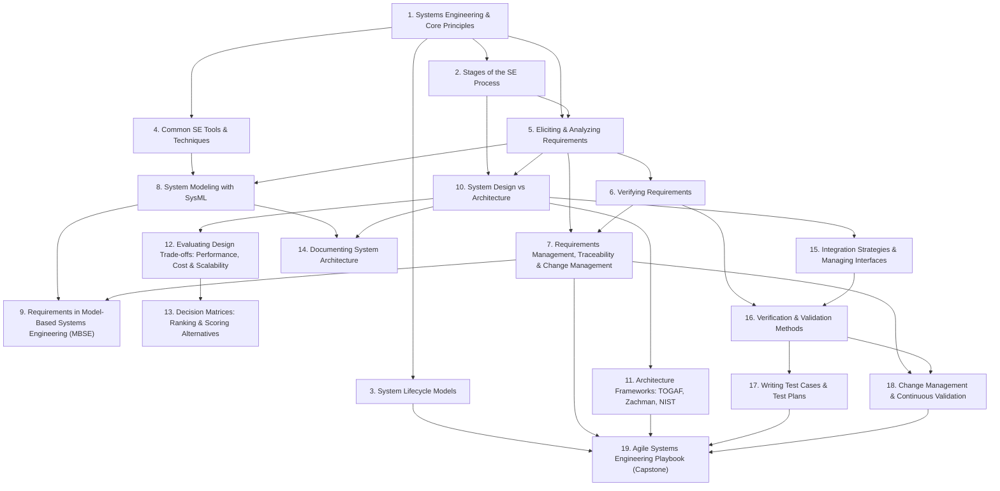

# Learning Roadmap

<!-- build-knowledge-base: the diagram and table below are generated from the plan. Fill the prose sections, then delete their STUB markers. Guide: references/document-templates.md#learning-roadmap -->

## Dependency map

Arrows point from a prerequisite to the topic that depends on it.

## Recommended order

| # | Topic | Domain | Bloom target | Prerequisites |
|---|---|---|---|---|
| 1 | [Systems Engineering & Core Principles](topics/01-se-fundamentals/README.md) | SE Foundations | Understand | — |
| 2 | [Stages of the SE Process](topics/02-se-process-stages/README.md) | SE Foundations | Understand | se-fundamentals |
| 3 | [System Lifecycle Models](topics/03-lifecycle-models/README.md) | SE Foundations | Apply | se-fundamentals |
| 4 | [Common SE Tools & Techniques](topics/04-se-tools-techniques/README.md) | SE Foundations | Understand | se-fundamentals |
| 5 | [Eliciting & Analyzing Requirements](topics/05-requirements-elicitation-analysis/README.md) | Requirements & Modeling | Apply | se-fundamentals, se-process-stages |
| 6 | [Verifying Requirements](topics/06-verifying-requirements/README.md) | Requirements & Modeling | Apply | requirements-elicitation-analysis |
| 7 | [Requirements Management, Traceability & Change Management](topics/07-requirements-management/README.md) | Requirements & Modeling | Apply | requirements-elicitation-analysis, verifying-requirements |
| 8 | [System Modeling with SysML](topics/08-sysml-modeling/README.md) | Requirements & Modeling | Apply | se-tools-techniques, requirements-elicitation-analysis |
| 9 | [Requirements in Model-Based Systems Engineering (MBSE)](topics/09-mbse-requirements/README.md) | Requirements & Modeling | Analyze | sysml-modeling, requirements-management |
| 10 | [System Design vs Architecture](topics/10-design-architecture-fundamentals/README.md) | Design & Architecture | Understand | se-process-stages, requirements-elicitation-analysis |
| 11 | [Architecture Frameworks: TOGAF, Zachman, NIST](topics/11-architecture-frameworks/README.md) | Design & Architecture | Apply | design-architecture-fundamentals |
| 12 | [Evaluating Design Trade-offs: Performance, Cost & Scalability](topics/12-design-tradeoffs/README.md) | Design & Architecture | Analyze | design-architecture-fundamentals |
| 13 | [Decision Matrices: Ranking & Scoring Alternatives](topics/13-decision-matrix/README.md) | Design & Architecture | Apply | design-tradeoffs |
| 14 | [Documenting System Architecture](topics/14-documenting-architecture/README.md) | Design & Architecture | Apply | sysml-modeling, design-architecture-fundamentals |
| 15 | [Integration Strategies & Managing Interfaces](topics/15-integration-strategies/README.md) | Integration, Verification & Validation | Apply | design-architecture-fundamentals |
| 16 | [Verification & Validation Methods](topics/16-verification-validation-methods/README.md) | Integration, Verification & Validation | Apply | verifying-requirements, integration-strategies |
| 17 | [Writing Test Cases & Test Plans](topics/17-test-plans-cases/README.md) | Integration, Verification & Validation | Apply | verification-validation-methods |
| 18 | [Change Management & Continuous Validation](topics/18-change-management-continuous-validation/README.md) | Integration, Verification & Validation | Apply | requirements-management, verification-validation-methods |
| 19 | [Agile Systems Engineering Playbook (Capstone)](topics/19-agile-se-playbook/README.md) | Applied & Integrative | Create | lifecycle-models, requirements-management, architecture-frameworks, test-plans-cases, change-management-continuous-validation |

## How to use this roadmap

Arrows in the diagram point **prerequisite → dependent**: finish the topic an arrow comes *from* before the one it points *to*. Don't skip ahead — a topic assumes its prerequisites are already in your head.

The loop for every topic is the same:

1. Read its `fundamentals.md` **once** — don't re-read it.
2. **Immediately close it and do the `exercises.md`** from memory. Producing answers is what makes the material stick; re-reading only feels productive.
3. Revisit on the widening schedule in [02-spaced-review.md](02-spaced-review.md), each revisit as a closed-book recall.

Notice the **Bloom arc**: early SE-foundations topics target *Understand*; the requirements, design, and V&V topics target *Apply*; MBSE (09) and trade-offs (12) reach *Analyze*; the capstone (19) is *Create* — a build, not a read. Expect the later topics to demand that you *produce and decide*, not just recognize.

If a topic feels impossible, you probably have a shaky prerequisite — drop back to the topic the arrow came from, re-test yourself on it closed-book, then return. A few minutes back-filling a gap saves an hour of confusion.

## Milestones & checkpoints

Four milestones, one per domain (the capstone folds into the last). Each checkpoint is a **closed-book** task — if you can do it from memory, advance; if not, revisit before moving on. "Finished reading" is not a checkpoint.

**Milestone 1 — Foundations (topics 1–4).** You can place any engineering activity in the lifecycle and pick a process model.
- *Checkpoint:* From memory, define systems engineering in one sentence, name the five process stages in order, and choose a lifecycle model for (a) a commercial aircraft and (b) a social-media feature — justifying each.

**Milestone 2 — Requirements & Modeling (topics 5–9).** You can take a vague need to a verifiable, traceable, modeled requirement.
- *Checkpoint:* Take a one-line stakeholder wish, turn it into a SMART requirement, classify it (functional/non-functional/constraint), sketch a SysML requirements diagram linking it to a test case, and state how forward vs bidirectional traceability would handle a change to it.

**Milestone 3 — Design & Architecture (topics 10–14).** You can structure, evaluate, choose, and document a design.
- *Checkpoint:* For a system of your choice, name the architecture-vs-design decisions, map two TOGAF ADM phases to it, run a 3-criterion decision matrix over two alternatives (computing the weighted totals), and outline the BDD + ICD you'd produce.

**Milestone 4 — Integration, V&V & Integration of Everything (topics 15–19).** You can assemble, prove, and evolve a system, and run the whole workflow end-to-end.
- *Checkpoint:* Choose an integration strategy for a system and justify the stubs/drivers; write one SMART-traceable test case and a test-plan skeleton; perform a quick impact analysis on a proposed change; then (capstone) trace one feature through all six Agile-SE phases with consistent IDs.

Tie cadence to your own deadline: if you have *N* weeks, spread the four milestones across the first ~70% and reserve the rest for spaced revisits and the capstone build.
