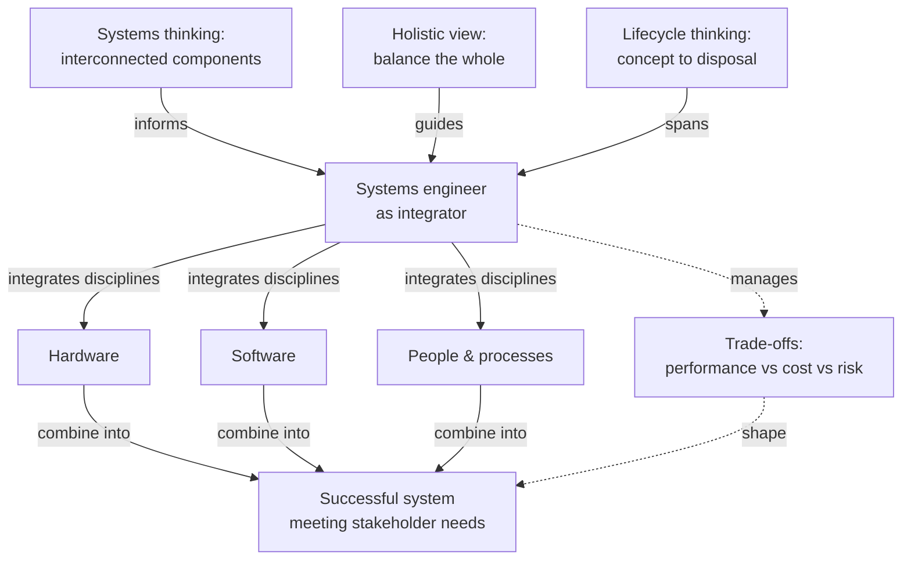

# Systems Engineering & Core Principles — Fundamentals

## Recall first

Attempt these from memory before reading. Answers are at the bottom under **Answers**.

1. In one sentence, what is systems engineering, and what kinds of "parts" does it make work together?
2. Name three lifecycle phases a system passes through that systems engineering covers.
3. What is the difference between *systems thinking* and a *holistic view*?

## Overview

A complex system — a smart traffic network, an autonomous vehicle, a spacecraft — is built by many separate teams and disciplines. Left alone, each team optimises its own part, and the parts fail to fit: interfaces don't line up, the whole misbehaves even when every piece "works" (source: m1-intro). **Systems engineering** is the discipline that prevents this: an *interdisciplinary approach that enables the realization of successful systems by integrating various disciplines and addressing the entire lifecycle of a system* (source: m1-core). The shape of the solution is to treat the system as one interconnected whole, gather what stakeholders actually need, define how the pieces interact, and verify the assembled system against those needs before it ships (source: m1-intro).

## Detailed explanations

### Definition and scope of SE

**Systems engineering** combines engineering, project management, and systems thinking to handle complexity and risk, especially when different components or disciplines must work together (source: m1-intro). Its **scope is vast**, covering physical, software, and organizational systems (source: m1-core). It addresses both **technical and managerial** aspects, ensuring the system satisfies stakeholder needs and operates effectively in its intended environment (source: m1-core).

SE covers the **entire system lifecycle**: requirements analysis; system design and architecture; implementation and integration; verification and validation; operation and maintenance; and retirement or decommissioning (source: m1-intro). (The five formal *process stages* — concept, development, production, operations & maintenance, disposal — are taught in [02-se-process-stages](../02-se-process-stages/fundamentals.md); the *lifecycle models* such as Waterfall and V-Model in [03-lifecycle-models](../03-lifecycle-models/fundamentals.md).)

### Why SE matters — the smart-traffic-light contrast

Predict before reading: a city installs a smart traffic-light system with three independent teams (hardware, software, networking) and no coordination. What goes wrong?

**Without systems engineering**, each team builds its part but they don't align interfaces or test together. The result: emergency-vehicle priority fails, some intersections don't synchronize, and maintenance teams don't know how to troubleshoot the system (source: m1-intro).

**With systems engineering**: stakeholder needs are gathered (city planners, emergency services, drivers, pedestrians); requirements are defined (reduce wait times, allow emergency overrides, real-time monitoring); a system architecture shows how sensors, lights, networks, and control centers interact; interfaces and integration points are clearly defined; verification and validation confirm the system meets requirements before deployment; and maintenance and upgrades are planned from the start (source: m1-intro).

The payoff: SE ensures **the right system is built**, functions **reliably**, **integrates** well with existing systems, and can be **maintained and scaled** over time (source: m1-intro).

### Systems thinking

**Systems thinking** is a fundamental principle of SE: understanding a system as a {{c1::collection of interconnected components}} that work together to achieve a common goal (source: m1-core). It pushes engineers to consider how components interact, how a change in one part affects the whole, and how external factors influence the system (source: m1-core). Example: in a smart-home security system, systems thinking means understanding how sensors, cameras, alarms, and the control unit cooperate to detect and respond to intrusions — and considering external factors like power outages or cyberattacks so the system stays resilient (source: m1-core).

### Holistic view

A **holistic view** emphasizes considering the system *as a whole* rather than focusing solely on individual components (source: m1-core). This ensures trade-offs are balanced, unintended consequences are minimized, and the system functions optimally in its intended environment (source: m1-core). Example: developing a public transportation system holistically means analyzing passenger needs, vehicle design, scheduling, ticketing, and environmental impact together — so the system is efficient *and* accessible, sustainable, and economically viable. Neglecting one aspect (say, user convenience) could cause low adoption and inefficiency (source: m1-core). The holistic view also covers how the system interacts with its environment — e.g. integrating renewable energy into a grid requires understanding generation, storage, distribution, and consumption patterns together (source: m1-core).

### History and evolution

- **World War I:** the concept of SE emerged as organizations tackled complex projects — radar systems, large-scale logistics, and the **Manhattan Project** — and engineers realized that intricate problems required coordination across disciplines and a structured approach to managing complexity (source: m1-core).
- **1950s–1960s:** SE gained prominence in aerospace and defense. **NASA's Apollo program** demanded integrating spacecraft, mission control, and ground support systems, pushing SE methodologies forward, with emphasis on risk management, reliability, and mission success within stringent timelines (source: m1-core).
- **Today:** SE extends to **healthcare** (medical devices, hospital systems) and **transportation** (autonomous vehicles, traffic management). The integration of **artificial intelligence**, **cybersecurity**, and **sustainable practices** shows the discipline still evolving to address modern challenges (source: m1-core).

### Role and importance of systems engineers

Systems engineers act as **integrators**, bringing together expertise from multiple disciplines to achieve system goals (source: m1-core). They bridge gaps between engineering, management, and other stakeholders by fostering collaboration and ensuring alignment with overall objectives — interdisciplinary integration that is essential for managing complexity and achieving system success (source: m1-core). In spacecraft development, for example, they coordinate mechanical engineers (structure, astronaut suits), software engineers (control algorithms), and scientists (mission objectives), keeping all subsystems aligned with the mission's goals (source: m1-core). They also optimize lifecycle costs and sustainability (e.g. weighing upfront cost of energy-efficient systems against long-term savings in a green building) and resolve conflicts and trade-offs — balancing performance and cost when, say, a high-performance material is too expensive, by evaluating alternatives on durability, availability, and lifecycle cost (source: m1-core).

## Concept breakdowns

**Systems thinking vs. holistic view** (the most common confusion). Both treat the system as more than its parts, but they answer different questions.
- *Systems thinking* — definition: understanding a system as interconnected components working toward a common goal (source: m1-core). Why it matters: it surfaces interactions and ripple effects ("change part A → what happens to B and the whole?"). Simplest instance: a smart-home alarm where sensor, control unit, and siren must cooperate (source: m1-core).
- *Holistic view* — definition: considering the system as a whole rather than individual components, so trade-offs are balanced and unintended consequences minimized (source: m1-core). Why it matters: it keeps no single dimension (cost, convenience, sustainability) from being optimized at the expense of overall success. Simplest instance: a transit system judged on passenger needs *and* cost *and* accessibility together (source: m1-core).
- Common confusion: treating them as synonyms. Read systems thinking as the *interaction lens* (how parts connect) and holistic view as the *whole-system lens* (balancing all concerns of the complete system in its environment).

**Interdisciplinary integration.** Definition: integrating various disciplines to realize successful systems (source: m1-core). Why it matters: complex systems span hardware, software, people, and processes that no single discipline can deliver alone (source: m1-intro). Simplest instance: an autonomous vehicle needs sensor/actuator hardware, navigation/control software, and integration to make them function cohesively (source: m1-core). Common confusion: thinking integration is only the final "plug it together" step — in SE it shapes requirements, architecture, and interfaces from the start (source: m1-intro).

**Lifecycle thinking.** Definition: addressing the *entire* lifecycle of a system — conception, design, implementation, operation, maintenance, decommissioning (source: m1-core). Why it matters: decisions early on (e.g. choosing an energy-efficient subsystem) change cost and sustainability over the whole life of the system (source: m1-core). Common confusion: assuming SE ends at delivery — maintenance, scaling, and retirement are in scope (source: m1-intro).

## How it fits together (diagram)

The diagram shows the core principles (systems thinking, holistic view, lifecycle thinking) feeding into the integrator role, which acts on the interconnected components of a system to produce a successful system. It is the spine the prose above follows.

## Real-world use cases & industry applications

- **Autonomous vehicles** — hardware (sensors, actuators), software (navigation, control), and integration ensure everything meets safety, reliability, and performance requirements (source: m1-core).
- **Smart city grid** — SE ensures the system can handle increasing demand, integrate renewable energy, and adapt to future technology (scalability and adaptability) (source: m1-core).
- **Spacecraft development** — systems engineers coordinate mechanical, software, and scientific disciplines so all subsystems align with mission goals (source: m1-core).
- **Healthcare and transportation** — SE supports medical devices and hospital systems, and guides autonomous vehicles and traffic management (source: m1-core).
- **Smart traffic lights** — the canonical with/without-SE contrast for why coordination matters (source: m1-intro).

## Best practices

- **Gather stakeholder needs before defining requirements** — captures what users (planners, emergency services, drivers, pedestrians) actually need, so the right system is built (source: m1-intro).
- **Define interfaces and integration points explicitly** — buys correct cooperation between subsystems and avoids the "each part works, the whole fails" trap (source: m1-intro).
- **Plan maintenance and upgrades from the start** — keeps the system maintainable and scalable over time rather than stranded after delivery (source: m1-intro).
- **Apply a holistic view when making trade-offs** — balances competing concerns so no single dimension wrecks overall success (e.g. ignoring user convenience → low adoption) (source: m1-core).
- **Design for scalability and adaptability** — lets the system absorb growing demand and future technology (the smart-grid example) (source: m1-core).

## Common pitfalls

- **Optimizing parts in isolation.** Each team builds its piece, nobody owns the whole → interfaces clash and integration fails (the no-SE traffic-light outcome). Fix: assign an integrator and define interfaces up front (source: m1-intro).
- **Not testing together.** Subsystems pass individually but were never integrated and tested as a whole → emergency overrides fail. Fix: verification and validation against requirements before deployment (source: m1-intro).
- **Neglecting one stakeholder concern.** Treating cost or convenience as an afterthought → low adoption and inefficiency. Fix: holistic analysis of all concerns together (source: m1-core).
- **Stopping at delivery.** Ignoring operation, maintenance, and disposal → unmaintainable systems. Fix: lifecycle thinking from conception (source: m1-core).
- **Picking the highest-performance option blindly.** A high-performance material may be too expensive. Fix: evaluate alternatives on durability, availability, and lifecycle cost (source: m1-core).

## Frequently asked questions

**How is systems engineering different from traditional engineering?** SE takes a proactive, holistic approach — considering scalability, adaptability, and the whole lifecycle — which differentiates it from traditional engineering disciplines that focus on individual components (source: m1-core).

**When do I need systems engineering?** When a project involves multiple components or disciplines that must work together and complexity/risk must be managed — e.g. a smart traffic-light system spanning hardware, software, and networking teams (source: m1-intro).

**What does a systems engineer actually do day to day?** Acts as an integrator: coordinates across disciplines, fosters communication, aligns subsystems with goals, optimizes lifecycle cost and sustainability, and resolves conflicts and trade-offs (source: m1-core).

**Is SE only for aerospace?** No. It began in aerospace/defense but now spans healthcare, transportation, AI, and more (source: m1-core).

## References & further reading

- Course: *Introduction to Systems Engineering* — Introduction (source: m1-intro) and Systems engineering and core principles (source: m1-core); Lesson review (source: m1-review).
- Master notes, Section 1 (source: master-notes).
- Forward links: process stages → [02-se-process-stages](../02-se-process-stages/fundamentals.md); lifecycle models → [03-lifecycle-models](../03-lifecycle-models/fundamentals.md); tools & techniques → [04-se-tools-techniques](../04-se-tools-techniques/fundamentals.md). Glossary: [references.md#glossary](../../references.md#glossary).

---

## Answers

**Recall 1.** Systems engineering is an interdisciplinary approach to designing, integrating, and managing complex systems across their lifecycle, making the parts — hardware, software, people, and processes — work together to meet requirements and deliver value (source: m1-intro).

**Recall 2.** Any three of: requirements analysis; system design and architecture; implementation and integration; verification and validation; operation and maintenance; retirement/decommissioning (source: m1-intro). (Conception/design/implementation/operation/maintenance/decommissioning per m1-core is also correct.)

**Recall 3.** Systems thinking is the interaction lens — understanding the system as interconnected components and how a change in one affects the whole. The holistic view is the whole-system lens — considering the complete system in its environment so trade-offs are balanced and no single concern dominates (source: m1-core).

---

> Spaced-repetition nudge: review these definitions tomorrow, then in ~3 days, then ~1 week — recall fades fastest in the first 24 hours, so an early second pass pays off the most. [OUTSIDE MATERIAL]
