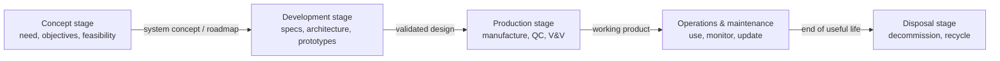

# Stages of the SE Process — Fundamentals

## Recall first

Attempt these from memory before reading. Answers are at the bottom under **Answers**.

1. Name the five stages of the SE process, in order.
2. Which stage produces a *concept of operations*, and which produces a *factory acceptance test*?
3. What happens to a system in the disposal stage — and what is a "graveyard orbit"?

## Overview

Systems engineering is a structured approach to designing, developing, and managing complex systems over their **entire life cycle**, so the system meets user needs, works as intended, and can be built, tested, and maintained efficiently (source: m1-stages). To make that manageable, engineers follow a set of **stages** that guide the system from concept to retirement. There are five: **Concept → Development → Production → Operations & maintenance → Disposal** (source: m1-stages). Each stage answers a different question (Is it worth building? How will it be built? Build it. Run it. Retire it.), and each one's output becomes the next one's input — so the stages form an ordered pipeline rather than a checklist.

Note the boundary: this topic is about *which phases* a system passes through. *How* you sequence and iterate the work across those phases — Waterfall, V-Model, Spiral, Agile — is the job of a **lifecycle model**, covered in [03-lifecycle-models](../03-lifecycle-models/fundamentals.md). Stages = WHAT; models = HOW.

## Detailed explanations

### 1. Concept stage

The **concept stage** is the initial phase, where the foundation of the system is established (source: m1-stages). The work is: identify stakeholder needs, define system objectives, conduct **feasibility studies**, and assess potential risks and constraints. Engineers work *with* stakeholders to clarify requirements and align the system with business, operational, and technical goals.

*Why first:* committing money and engineering to a design only makes sense once you know the need is real, the goals are clear, and the system is actually buildable. The output is a **well-defined system concept** that acts as a roadmap for every later stage (source: m1-stages).

Predict before reading: for a new electric vehicle, what concept-stage work is needed? — market research into consumer needs, regulatory assessments for compliance, and preliminary technical evaluations of battery technology and charging-infrastructure feasibility (source: m1-stages).

### 2. Development stage

The **development stage** translates the conceptual design into detailed system specifications, architecture, and **prototypes** (source: m1-stages). Engineers create system models, select appropriate technologies, and run simulations to test different design configurations. This stage often runs **iterative design cycles**: feedback from testing and stakeholder input drives refinements.

The goal is to *refine* the design and *validate* it against the system's performance requirements before anything is mass-produced (source: m1-stages). In software this means coding, system integration, and unit testing; in aerospace it means detailed blueprints for avionics, propulsion, and aerodynamics, followed by wind-tunnel testing and computer simulations (source: m1-stages).

The {{c1::development}} stage is where iterative design cycles use feedback and stakeholder input to refine the system.

### 3. Production stage

Once the design is validated, the system enters the **production stage**, where it is manufactured, assembled, and integrated into a working product (source: m1-stages). This stage adds quality control, system **verification**, and **validation** testing so the final system meets all specifications and requirements.

*Why it follows development:* you only commit to manufacturing once the design has been proven, because fixing a flaw in a production run is far more expensive than fixing it in a prototype. Examples: medical devices are produced under strict regulatory standards with **factory acceptance testing** and stress tests for reliability; automotive production assembles prototype vehicles, runs crash tests, and evaluates manufacturing efficiency before full-scale production (source: m1-stages).

### 4. Operations and maintenance stage

After deployment, the system enters the **operations and maintenance (O&M) stage**, where it is actively used and monitored for performance (source: m1-stages). Activities: routine maintenance, updates, troubleshooting, and performance optimization. Engineers keep the system meeting user needs while addressing emerging issues and technological advances.

This is usually the *longest* stage in calendar time. The primary goal is long-term functionality, efficiency, and user satisfaction (source: m1-stages). Examples: a satellite communication system has operators continuously monitoring signals, adjusting antennas, and updating onboard software; IT infrastructure gets software patches, cybersecurity updates, and scaling based on demand (source: m1-stages).

### 5. Disposal stage

The final stage is the **disposal stage**, where the system is **decommissioned** and retired (source: m1-stages). The work: assess environmental impacts, safely dismantle components, and ensure proper disposal or recycling of materials. Sustainability, regulatory compliance, and cost-effectiveness all matter when retiring a system.

The disposal stage ensures systems are phased out responsibly while minimizing long-term impacts (source: m1-stages). Examples: nuclear power plants require safe decommissioning, waste management, and radiation containment; consumer-electronics firms run recycling programs to recover valuable materials and reduce waste (source: m1-stages).

## Concept breakdowns

**Feasibility study** — *Definition:* part of the concept stage, the studies conducted to determine whether the system can actually be built and whether it meets the need (source: m1-stages). *Why it matters:* it is the gate that prevents committing budget to an impossible or pointless project. *Simplest instance:* checking whether current battery technology can give an EV the required range (source: m1-stages). *Common confusion:* feasibility (concept stage) asks "*can* and *should* we build this?"; verification/validation (production stage) asks "did we build it *right* and build the *right* thing?".

**Concept of operations (ConOps)** — *Definition:* a document drafted in the concept stage outlining how the system will be used and what benefits it will provide (source: m1-stages). *Why it matters:* it captures the intended use so every later design decision can be checked against it. *Simplest instance:* for a satellite, a statement of how the system will be operated and the benefits it delivers (source: m1-stages). *Common confusion:* a ConOps describes *how the system will be used*, not how it will be *built* — that detail comes in development.

**Prototype / iterative design** — *Definition:* in development, prototypes and test units are built and the design is refined over repeated cycles using feedback (source: m1-stages). *Why it matters:* mistakes caught on a cheap prototype are far cheaper than mistakes caught on a production line or in orbit. *Simplest instance:* a satellite test unit put through thermal-vacuum and vibration testing before the flight unit is made (source: m1-stages). *Common confusion:* prototyping happens in *development*; the qualified, final-version build happens in *production*.

**Graveyard orbit** — *Definition:* a disposal option for a satellite in which, at end of life, it is moved to a "graveyard orbit" (rather than a controlled re-entry to burn up), depending on mission class and orbit (source: m1-stages). *Why it matters:* it is how a space system complies with space-debris mitigation guidelines. *Simplest instance:* boosting an old satellite to a higher unused orbit so it is out of the way (source: m1-stages). *Common confusion:* graveyard orbit and controlled re-entry are two *alternative* disposal methods for the same end-of-life goal, chosen by mission class and orbit (source: m1-stages).

## How it fits together (diagram)

The five stages form a left-to-right flow; each stage's output is the next stage's input.

Read the edges, not just the boxes: the label on each arrow is the *deliverable* that hands control to the next stage (source: m1-stages).

## Real-world use cases & industry applications

- **Electric vehicle** — concept stage: market research, regulatory assessment, battery/charging feasibility (source: m1-stages).
- **Aerospace** — development stage: detailed blueprints for avionics, propulsion, aerodynamics + wind-tunnel and simulation testing (source: m1-stages).
- **Medical devices** — production stage: manufacturing under regulatory standards, factory acceptance testing, stress tests (source: m1-stages).
- **Automotive** — production stage: prototype assembly, crash tests, manufacturing-efficiency evaluation before full-scale production (source: m1-stages).
- **Satellite communications** — O&M stage: continuous signal monitoring, antenna adjustment, onboard software updates (source: m1-stages).
- **IT infrastructure** — O&M stage: software patches, cybersecurity updates, demand-based scaling (source: m1-stages).
- **Nuclear power plants** — disposal stage: safe decommissioning, waste management, radiation containment (source: m1-stages).
- **Consumer electronics** — disposal stage: recycling programs to recover materials and reduce waste (source: m1-stages).

## Best practices

- Pin down stakeholder needs and feasibility in the concept stage — buys you a roadmap that prevents costly redirection later (source: m1-stages).
- Use iterative design cycles with testing feedback in development — buys a design that is refined and validated before the expensive production commitment (source: m1-stages).
- Apply quality control and V&V *throughout* production, not just at the end — buys consistency and reliability in the delivered system (source: m1-stages).
- Plan disposal for sustainability and regulatory compliance — buys responsible retirement and, for space systems, debris-mitigation compliance (source: m1-stages).

## Common pitfalls

- **Skipping the feasibility study** to "save time" in the concept stage. *Fix:* run feasibility before committing design budget; that is the stage's whole point (source: m1-stages).
- **Treating development as the build.** Development produces prototypes and a *validated design*, not the final product — the qualified final version is made in production. *Fix:* keep prototyping in development and final manufacture in production (source: m1-stages).
- **Confusing verification/validation with feasibility.** V&V (production) checks the built system against requirements; feasibility (concept) checks whether to build at all. *Fix:* match the check to the stage (source: m1-stages).
- **Treating disposal as an afterthought.** Disposal needs environmental, regulatory, and cost planning, and for satellites a decided end-of-life method (graveyard orbit or controlled re-entry). *Fix:* design retirement in from the start (source: m1-stages).
- **Confusing stages with models.** Stages are the phases; choosing Waterfall vs Agile vs V-Model is a separate decision about *how* to move through them. *Fix:* see [03-lifecycle-models](../03-lifecycle-models/fundamentals.md) (source: m1-stages, m1-lifecycle).

## Frequently asked questions

**Are the five stages always strictly sequential?** The source lists them as an ordered progression from concept to retirement, and notes that development "often includes iterative design cycles" — so iteration happens *within* stages even though the overall progression is concept-to-disposal (source: m1-stages). How much stages overlap or repeat is decided by the lifecycle model (source: m1-lifecycle).

**What is the difference between the development and production stages?** Development creates and *validates the design* through prototypes, simulation, and testing; production *manufactures the validated design* with quality control and V&V (source: m1-stages).

**Where do verification and validation happen?** V&V testing is part of the production stage (final-system checks against specifications), and V&V is also performed in development on prototypes (e.g. a satellite's thermal-vacuum and vibration testing) (source: m1-stages).

**Why does operations & maintenance matter if the system already works?** Systems must keep meeting user needs over time — routine maintenance, updates, troubleshooting, and optimization preserve long-term functionality, efficiency, and user satisfaction (source: m1-stages).

## References & further reading

- Primary source: `m1-stages` — "Stages of the systems engineering process", covering all five stages and the full satellite worked example.
- Supporting: `master-notes` Section 1 — lesson overview placing the stages "from concept to disposal" within the introduction to systems engineering.
- Neighbour topic: [03-lifecycle-models](../03-lifecycle-models/fundamentals.md) for how the stages are sequenced (Waterfall/V/Spiral/Agile).
- Prerequisite: [01-se-fundamentals](../01-se-fundamentals/fundamentals.md).
- Glossary: [references.md#glossary](../../references.md#glossary).

---

## Answers

1. **Concept → Development → Production → Operations & maintenance → Disposal** (source: m1-stages).
2. The **concept stage** drafts a *concept of operations*; the **production stage** runs *factory acceptance testing* (source: m1-stages).
3. In **disposal**, the system is decommissioned and retired — assessing environmental impact, safely dismantling components, and disposing of or recycling materials (source: m1-stages). A **graveyard orbit** is a satellite end-of-life option in which the satellite is moved to an out-of-the-way orbit (the alternative being a controlled re-entry to burn up), chosen by mission class and orbit, to comply with space-debris mitigation guidelines (source: m1-stages).

> Spaced practice beats cramming: revisit these five stages tomorrow and again in a week — recalling them cold is what moves them into long-term memory. [OUTSIDE MATERIAL]
