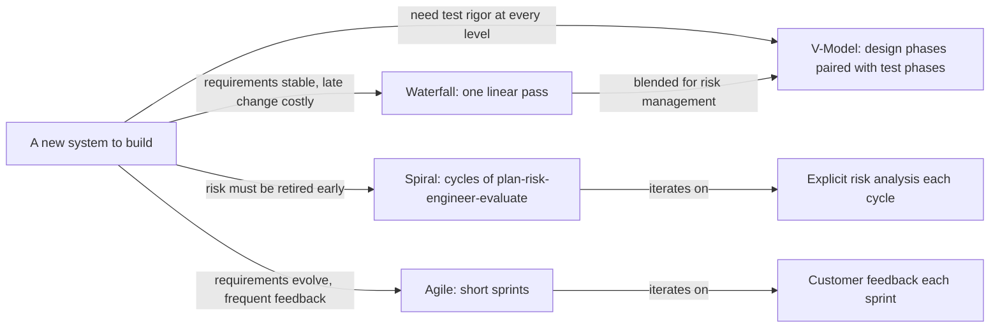

# System Lifecycle Models — Fundamentals

## Recall first

Attempt these from memory before reading (answers at the bottom):

1. In one sentence, what makes the Waterfall model "linear and sequential," and what kind of project does that suit?
2. Why is the V-Model drawn as a "V" rather than a straight line?
3. Who introduced the Spiral model, roughly when, and what one activity does each spiral cycle add that linear models lack?

## Overview

Several system lifecycle models exist, each suited to a different kind of project; choosing one is choosing *how to sequence and iterate the work*, not *what work to do* (source: m1-lifecycle). The four covered here sit on a spectrum from rigidly planned to highly adaptive: **Waterfall** flows once through ordered phases; the **V-Model** keeps that order but pairs each design phase with a matching test phase; the **Spiral model** repeats short risk-driven cycles; and **Agile** repeats even shorter feedback-driven sprints. The mental model: the more your requirements are stable and known up front, the more you can move left-to-right once (Waterfall/V); the more they are uncertain or expected to change, the more you iterate (Spiral/Agile) (source: m1-lifecycle).

## Detailed explanations

### Waterfall model

The **Waterfall model** is one of the earliest and most traditional approaches. It is called "waterfall" because the process flows downward like a waterfall through distinct phases, each leading to the next (source: m1-lifecycle). Its stages are:

1. **Requirements** — gather and document all system requirements before any design or coding begins. *What does the system need to do?*
2. **Design** — plan the architecture and components based on the requirements. *How will it be built?*
3. **Implementation** — write the actual code or build the system parts. *Build it.*
4. **Verification** — combine all components and test the full system against the requirements. *Does it work as expected?*
5. **Deployment** — deliver the system to the customer or end-user. *Put it into use.*
6. **Maintenance** — fix issues, make updates, or adapt the system post-deployment. *Keep it running.*

(source: m1-lifecycle)

It is **linear and sequential** — one phase must finish before the next begins. It **relies on heavy documentation**: each phase produces detailed documents needed by the next. It has **low flexibility**, because going back to change earlier phases once finished is hard, so it is best for projects with **clear and stable requirements** (source: m1-lifecycle). Predict before reading: where would a late change hurt most? In Waterfall, *any design change late in the process can be costly* (source: m1-lifecycle).

### V-Model (verification & validation)

The **V-Model** (Verification & Validation model) is a development process that emphasizes testing at every stage of the lifecycle. It is drawn as a "V": the left side is **decomposition and design**, the right side is **integration and testing**, and **implementation happens at the bottom** of the V (source: m1-lifecycle). The defining idea: {{c1::each development phase on the left has a corresponding testing phase on the right}} (source: m1-lifecycle). The pairings are:

| Left side (design, top→bottom) | Right side (test) |
|---|---|
| Requirements | Acceptance testing — tested against the original requirements |
| System analysis / design | System testing — entire system tested as a whole |
| Software design | Integration testing — interactions between modules tested |
| Module design | Unit testing — each component tested individually |

(source: m1-lifecycle)

This topic *introduces* that pairing; the deeper **methods** behind each test type live in [16-verification-validation-methods](../16-verification-validation-methods/fundamentals.md).

### Spiral model (risk-driven, iterative)

The **Spiral model** was introduced by **Barry Boehm in the 1980s**. Unlike linear models (Waterfall, V-Model), it is **iterative**: the system is developed in cycles, each cycle improving or expanding the system (source: m1-lifecycle). Every cycle (or "spiral") includes **four phases**: **Planning, Risk Analysis, Engineering, and Evaluation**. Each loop yields a more complete version, and the process continues until the final system is ready (source: m1-lifecycle). The distinctive ingredient versus Agile is the explicit, recurring **risk analysis** phase in every cycle (source: m1-lifecycle).

### Agile model and its four values

The **Agile model** is a flexible, iterative approach that emphasizes **collaboration, customer feedback, and rapid delivery**. Instead of a single linear sequence, it makes incremental progress through short cycles called **iterations** or **sprints** (typically 1–4 weeks) until the final deliverable is met (source: m1-lifecycle). Agile rests on four values (source: m1-lifecycle):

- **Individuals and interactions over processes and tools** — communication, collaboration, and adaptability over rigid adherence to a process.
- **Working software over comprehensive documentation** — deliver functional components regularly for early testing and validation by users.
- **Customer collaboration over contract negotiation** — involve stakeholders continuously so the final product meets their needs.
- **Responding to change over following a plan** — welcome change even late in development, adjusting direction based on feedback.

A sprint runs through **Planning → Backlog Refinement → Design & Development → Testing → Review & Retrospective → Delivery/Release**, then the backlog is reprioritized for the next sprint (source: m1-lifecycle). Agile's **continuous-testing** discipline and how change is managed across sprints are owned by [18-change-management-continuous-validation](../18-change-management-continuous-validation/fundamentals.md); the broader Agile-SE practice lives in [19-agile-se-playbook](../19-agile-se-playbook/README.md).

### Choosing a lifecycle model

The source frames model choice by project character (source: m1-lifecycle):

- **Clear, stable requirements; costly late changes; heavy verification needed** → Waterfall, or V-Model when you want test rigor at every stage. Common in aerospace, defense, and infrastructure.
- **High uncertainty or risk that must be retired early** → Spiral, because each cycle starts with risk analysis.
- **Rapidly evolving requirements; frequent user feedback** → Agile, widely adopted in software and product development.

Note that Waterfall is *often blended with iterative models like the V-Model for better risk management* — these are not strictly either/or in practice (source: m1-lifecycle).

## Concept breakdowns

**1. Linear vs iterative.** *Definition:* linear models complete each phase once in order (Waterfall, V); iterative models repeat cycles, each producing a more complete version (Spiral, Agile) (source: m1-lifecycle). *Why it matters:* it determines when you can change your mind cheaply. *Simplest instance:* Waterfall = one pass; Spiral = many passes. *Common confusion:* the V-Model looks iterative because of all the testing, but it is still a single front-to-back pass — the test phases are *planned* against design phases, not *repeated* (source: m1-lifecycle).

**2. The V-Model pairing.** *Definition:* each left-side design phase has a corresponding right-side test phase (module design↔unit testing, software design↔integration testing, system design↔system testing, requirements↔acceptance testing) (source: m1-lifecycle). *Why it matters:* it forces you to plan *how you will verify* a phase at the moment you design it. *Simplest instance:* writing the acceptance test from the user requirements before any code exists. *Common confusion:* thinking testing is one phase at the end (that's Waterfall's view) versus a phase paired to every level (V-Model).

**3. Spiral's risk-analysis phase.** *Definition:* the second of four phases in every cycle, where you ask "what could go wrong?" before engineering (source: m1-lifecycle). *Why it matters:* it retires the scariest unknowns early instead of discovering them at delivery. *Simplest instance:* before building real money transfers, asking "Can we prevent fraud during transfers? What if the server goes down mid-transaction?" (source: m1-lifecycle). *Common confusion:* assuming any iterative model handles risk — Agile iterates on *feedback*; Spiral iterates on *risk* explicitly.

**4. The four Agile values are "over," not "instead of."** *Definition:* each value names two goods and favours the left one (source: m1-lifecycle). *Why it matters:* Agile still produces documentation and follows plans — it just prioritizes working software and responsiveness when they conflict. *Common confusion:* "Agile means no documentation/no plan." The source warns Agile may lead to *less comprehensive documentation*, which is a known challenge, not the goal (source: m1-lifecycle).

## How it fits together (diagram)

The diagram below places the four models on the linear↔iterative spectrum and shows how Waterfall is often blended with the V-Model.

## Real-world use cases & industry applications

- **Waterfall — commercial aircraft.** Engineers follow a strict sequence: define requirements, design components, manufacture, and finally test; late design changes are costly (source: m1-lifecycle). Waterfall is often used in aerospace, defense, and infrastructure where thorough planning and verification are crucial (source: m1-lifecycle).
- **V-Model — smart door lock.** A lock unlockable by phone and keypad, auto-locking after 30 seconds, alerting the owner when tampered, is taken from user requirements through testing with each phase paired to a test phase (source: m1-lifecycle).
- **Spiral — mobile banking app.** Built across spirals: Spiral 1 is a basic prototype (balance view, simple login); Spiral 2 adds real data, transfers, and two-factor authentication, each cycle gated by risk analysis (source: m1-lifecycle).
- **Agile — mobile fitness tracker.** Delivered over Iterations 1–3 (basic functionality → enhanced activity tracking → social/sharing), each sprint a working increment shaped by user feedback (source: m1-lifecycle).

## Best practices

- **Match the model to requirements stability.** Choosing Waterfall when requirements are clear and stable avoids costly late rework; choosing Agile when they evolve keeps the product aligned with customer needs (source: m1-lifecycle).
- **Pair a test phase with each design phase (V-Model).** This catches defects at the level they occur — unit issues in unit testing, interface issues in integration testing — rather than all at the end (source: m1-lifecycle).
- **Front-load risk analysis in iterative work (Spiral).** Asking the risk questions each cycle ("What if the server goes down during a transaction?") prevents expensive surprises later (source: m1-lifecycle).
- **Release frequently in Agile, even to a test environment.** Frequent releases enable real user feedback so the product continuously improves (source: m1-lifecycle).
- **Blend models when it helps.** Waterfall is often combined with the V-Model for better risk management; treat models as a toolkit, not a religion (source: m1-lifecycle).

## Common pitfalls

- **Using Waterfall when requirements are unstable.** Its low flexibility makes going back hard, so a late requirement change is costly — *fix:* if requirements are likely to change, pick Spiral or Agile instead (source: m1-lifecycle).
- **Treating the V-Model's testing as one final stage.** That collapses it back into Waterfall — *fix:* plan unit, integration, system, and acceptance tests against their paired design phases up front (source: m1-lifecycle).
- **Iterating without risk analysis and calling it Spiral.** Skipping the risk phase loses the model's whole point — *fix:* every cycle must run Planning → **Risk Analysis** → Engineering → Evaluation (source: m1-lifecycle).
- **Letting Agile's flexibility become uncontrolled scope creep.** The source warns flexibility "can sometimes lead to uncontrolled changes if not managed properly" — *fix:* disciplined project management and an engaged team; manage change deliberately (see [18-change-management-continuous-validation](../18-change-management-continuous-validation/fundamentals.md)) (source: m1-lifecycle).
- **Under-documenting in Agile and regretting it later.** Agile may produce less comprehensive documentation, a challenge for large teams or long-term maintenance — *fix:* document deliberately where maintenance demands it (source: m1-lifecycle).

## Frequently asked questions

**Is the V-Model just Waterfall with more testing?** Largely yes in *flow* — both are a single linear pass — but the V-Model's contribution is explicitly *pairing* a test phase to each design phase, so verification is planned at every level rather than bolted on at the end (source: m1-lifecycle).

**Spiral vs Agile — both iterate, so what's the difference?** Spiral's cycles are organized around **risk analysis** (four phases: plan, risk, engineer, evaluate), while Agile's short sprints are organized around **customer feedback** and rapid delivery (source: m1-lifecycle).

**Does Agile mean no plan and no documentation?** No. Its values *favour* working software and responding to change, but the source explicitly flags reduced documentation as a managed challenge, not an aim (source: m1-lifecycle).

**Can I mix models?** Yes — Waterfall is often blended with the V-Model for better risk management (source: m1-lifecycle).

## References & further reading

- Primary source: m1-lifecycle — "Introduction to Systems Engineering: System lifecycle models" (Waterfall, V-Model, Spiral, Agile, and worked examples).
- For the test methods the V-Model pairs in: [16-verification-validation-methods](../16-verification-validation-methods/fundamentals.md).
- For managing change and continuous validation across Agile sprints: [18-change-management-continuous-validation](../18-change-management-continuous-validation/fundamentals.md).
- For the broader Agile-SE practice: [19-agile-se-playbook](../19-agile-se-playbook/README.md).
- Glossary terms: [references.md#glossary](../../references.md#glossary).

---

## Answers

**Recall 1.** Waterfall is linear and sequential because one phase must be completed before the next begins, with each phase producing documents the next needs; this suits projects with **clear and stable requirements** (source: m1-lifecycle).

**Recall 2.** It is a "V" because the left side is decomposition/design and the right side is integration/testing, with implementation at the bottom — each left-side design phase pairs with a right-side test phase (source: m1-lifecycle).

**Recall 3.** **Barry Boehm**, in the **1980s**; each spiral cycle adds an explicit **risk analysis** phase (within Planning → Risk Analysis → Engineering → Evaluation) that linear models lack (source: m1-lifecycle).

---

*Forgetting-curve nudge: re-test yourself on the four models and the V-Model pairings tomorrow, then in three days — spaced retrieval beats rereading. [OUTSIDE MATERIAL]*
