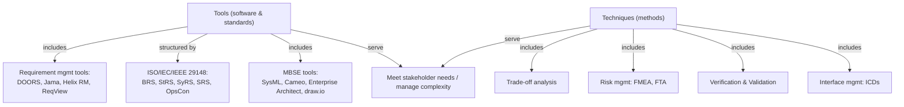

# Common SE Tools & Techniques — Fundamentals

## Recall first

Try these from memory before reading. Answers are at the bottom.

1. Name two requirement-management tools and one thing they all give you (a property they preserve across the lifecycle).
2. What does the ISO/IEC/IEEE 29148 standard provide, and roughly how many document templates does it define?
3. In one sentence each, what is the difference between *verification* and *validation*?

## Overview

A systems engineer working on anything complex cannot hold every requirement, design choice, and interface in their head. The job of the **tools and techniques** in this topic is to externalise that complexity so it can be captured, tracked, traded off, and checked. **Tools** are software (or standards) — requirement managers and MBSE modellers; **techniques** are disciplined methods — trade-off analysis, risk management, verification & validation, and interface management. Together they let engineers break large interdependent systems into manageable parts, define clear requirements, ensure integration across disciplines, and keep traceability through development, so stakeholder needs are met efficiently and reliably even as systems grow in scale and mission-criticality (source: m1-tools).

## Detailed explanations

### Requirement management tools

**Requirement management tools** help engineers capture, analyze, track, and manage requirements throughout the system lifecycle; they ensure **traceability**, reduce inconsistencies, and ease collaboration among stakeholders (source: m1-tools). The four named in the course:

- **IBM Engineering Requirements Management DOORS** — widely used for capturing and managing complex system requirements, ensuring traceability and compliance (source: m1-tools).
- **Jama Connect** — supports team collaboration, requirement traceability, and risk management in system development (source: m1-tools).
- **Helix RM** (formerly Helix ALM) — real-time collaboration, impact analysis, and regulatory-compliance tracking (source: m1-tools).
- **ReqView** — a simple yet effective tool for managing structured requirements and maintaining traceability across system designs (source: m1-tools).

These tools usually are not free, or limit their free versions (source: m1-tools). Detailed requirements-management workflow and ReqView usage are owned by [07-requirements-management](../07-requirements-management/fundamentals.md).

### ISO/IEC/IEEE 29148 document templates

When a project starts, it is common to follow the **ISO/IEC/IEEE 29148 Standard**, which describes requirements-engineering processes (source: m1-tools); the course notes call it the latest international standard for requirements engineering for software and hardware products and systems (source: master-notes). It contains **five document templates** (source: m1-tools). The {{c1::BRS}} captures the business vision while the {{c1::OpsCon}} describes how the system will operate.

| Document | Purpose | Result |
| :--- | :--- | :--- |
| **BRS** (Business Requirements Specification) | Capture business vision | Major goals, scope and user communities |
| **StRS** (Stakeholder Requirements Specification) | Define stakeholder requirements | User requirements and needs |
| **SyRS** (System Requirements Specification) | Technical requirements | Details on what system must do |
| **SRS** (Software Requirements Specification) | Software-specific requirements | Software-specific design and functional requirements |
| **OpsCon** (System Operational Concept) | Define how system will operate | Define operational scenarios and usage |

(source: m1-tools)

### MBSE tools and SysML

**Model-Based Systems Engineering (MBSE) tools** drive design and analysis through *models* instead of traditional documents; they improve communication and consistency and allow simulation and validation of behaviour before implementation (source: m1-tools). The ones named:

- **SysML (Systems Modeling Language)** — a standardized language used in MBSE to represent system structure, behavior, and interaction (source: m1-tools).
- **Cameo Systems Modeler** — a collaborative modeling environment for complex systems, often used in aerospace and defense (source: m1-tools).
- **Enterprise Architect** (Sparx Systems) — supports UML, SysML, and BPMN modeling to develop, test, and manage systems (source: m1-tools).
- **Diagrams.net** (formerly draw.io) — a free, open-source diagramming tool for flowcharts, system architecture diagrams, UML diagrams, and other visuals (source: m1-tools).

Drawing actual SysML diagrams (block definition diagrams, internal block diagrams) is owned by [08-sysml-modeling](../08-sysml-modeling/fundamentals.md).

### The four techniques

SE techniques give a structured, disciplined approach to managing complex systems across their lifecycle, from concept to disposal (source: m1-tools).

- **Trade-off analysis** evaluates different design alternatives to find the best balance between cost, performance, and risk (source: m1-tools). The performance/cost/scalability deep-dive is owned by [12-design-tradeoffs](../12-design-tradeoffs/fundamentals.md).
- **Risk management** identifies, analyzes, and mitigates potential risks. Tools like **Failure Modes and Effects Analysis (FMEA)** and **Fault Tree Analysis (FTA)** help engineers assess failure probabilities and impacts (source: m1-tools).
- **Verification and Validation (V&V)** ensures a system meets specified requirements and functions correctly, via testing, simulation, and reviews throughout the development cycle (source: m1-tools). Methods are owned by [16-verification-validation-methods](../16-verification-validation-methods/fundamentals.md).
- **Interface management** defines and manages the interactions between components to prevent integration issues; engineers use **interface control documents (ICDs)** — for example, to manage communication protocols between hardware and software (source: m1-tools). ICD detail is owned by [14-documenting-architecture](../14-documenting-architecture/fundamentals.md).

## Concept breakdowns

**Verification vs. validation.** *Verification* asks "did we build the thing right?" — does it meet design specs (e.g. lab-testing an antenna for signal strength, power, deployment accuracy). *Validation* asks "did we build the right thing?" — does it meet the stakeholder's operational need (e.g. a test mission confirming fast, reliable data from orbit). An item can pass verification yet fail validation: an antenna can meet lab specs but still fail to hold a stable link in real orbit, which is a validation failure (source: m1-tools). *Common confusion:* treating "passed the test" as the end — passing verification does not guarantee the system serves its purpose.

**FMEA vs. FTA.** Both are risk-management tools for assessing failure probabilities and impacts (source: m1-tools). [OUTSIDE MATERIAL] FMEA works bottom-up (start from each component/failure mode, ask what effect it has); FTA works top-down (start from an undesired top event, trace down the combinations of causes). The course names both as examples but does not contrast their direction.

**Trade-off analysis as balancing, not maximising.** The point is *balance*, not picking the highest-performance option. In the satellite example, the high-gain antenna *meets* the performance goal but its cost and control complexity exceed the project's constraints, so the team picks the omnidirectional antenna to optimise cost-effectiveness while still meeting mission requirements (source: m1-tools). *Common confusion:* assuming the best technical option wins — it loses if it violates cost or risk constraints.

**Tools vs. techniques.** A *tool* is software or a standard you operate (DOORS, Cameo, ISO 29148); a *technique* is a method you apply (trade-off analysis, FMEA). The same antenna decision uses techniques (trade-off, risk, V&V, interface mgmt) and may be recorded in tools (a requirement manager, an ICD) (source: m1-tools).

## How it fits together (diagram)

The diagram shows the two tool families and the four techniques, all serving one goal — meeting stakeholder needs while managing complexity.

## Real-world use cases & industry applications

- **Communications satellite antenna choice** — the running example: trade-off analysis, risk management, V&V, and interface management are all applied to deciding between a high-gain directional antenna and an omnidirectional antenna (source: m1-tools). See [examples.md](examples.md).
- **Aerospace and defense** — Cameo Systems Modeler is noted as often used there (source: m1-tools).
- **Wearable fitness tracker** — different tools/techniques map to each lifecycle stage (source: m1-exercise). See [examples.md](examples.md) and [exercises.md](exercises.md).

## Best practices

- **Follow ISO/IEC/IEEE 29148 from project start** — gives a standard five-document structure so requirements are captured consistently and the right specification exists at each level (source: m1-tools).
- **Use a requirement-management tool to preserve traceability** — keeps requirements consistent and lets you trace impact, which reduces inconsistencies across the lifecycle (source: m1-tools).
- **Manage interfaces early and continuously** — defining mechanical, electrical, data, and control interfaces up front ensures smooth integration and reduces the risk of late-stage incompatibility (source: m1-tools).
- **Run both verification and validation** — verification protects technical integrity (meets specs) and validation confirms the system fulfils its intended purpose; doing both catches the "meets spec but fails in the field" case (source: m1-tools).

## Common pitfalls

- **Picking the highest-performance option and ignoring constraints.** Fix: run a real trade-off across cost, performance, complexity, power, and risk — the high-gain antenna met performance but was rejected on cost and complexity (source: m1-tools).
- **Stopping at verification.** Fix: also validate against the operational need — an item can pass lab specs yet fail in orbit (source: m1-tools).
- **Leaving interfaces undefined until integration.** Fix: write ICDs early; mismatched voltage levels or incompatible communication timing can cause system failure (source: m1-tools).
- **Treating risk mitigation as always sufficient.** Fix: if the overall risk profile stays high even after mitigations (backup sensors, more simulation, secondary antenna), switch to a lower-risk alternative — that is what the satellite team did (source: m1-tools).

## Frequently asked questions

**Are these requirement tools free?** Usually not, or only with limited free versions (source: m1-tools).

**Is SysML a tool or a language?** It is a standardized *language* used in MBSE to represent structure, behavior, and interaction; Cameo and Enterprise Architect are tools that support it (source: m1-tools).

**Which 29148 document captures business/mission goals?** The **BRS** (Business Requirements Specification) — its result is major goals, scope, and user communities (source: m1-tools).

**What is an ICD for?** An interface control document defines and manages interactions between components — e.g. communication protocols between hardware and software — to prevent integration issues (source: m1-tools).

## References & further reading

- Source: `m1-tools` (Common systems engineering tools and techniques) — the entire tool/technique catalogue and the satellite example.
- Source: `m1-exercise` (Exercise solution) — wearable-fitness-tracker stage→tool mapping.
- Source: `master-notes` §1 — parallel wording on tools and the 29148 standard.
- Forward links: [07-requirements-management](../07-requirements-management/fundamentals.md), [08-sysml-modeling](../08-sysml-modeling/fundamentals.md), [12-design-tradeoffs](../12-design-tradeoffs/fundamentals.md), [16-verification-validation-methods](../16-verification-validation-methods/fundamentals.md), [14-documenting-architecture](../14-documenting-architecture/fundamentals.md).
- Glossary: [references.md#glossary](../../references.md#glossary).

---

## Answers

1. Any two of **DOORS, Jama Connect, Helix RM, ReqView**; they all preserve **traceability** (and reduce inconsistencies, ease collaboration) across the lifecycle (source: m1-tools).
2. ISO/IEC/IEEE 29148 describes **requirements-engineering processes** and provides **five** document templates: BRS, StRS, SyRS, SRS, OpsCon (source: m1-tools).
3. **Verification** = the system meets its specified requirements / built right (testing, simulation, reviews against specs); **validation** = the system meets the stakeholder's operational needs / built the right thing (source: m1-tools).

> Spaced practice beats cramming: revisit these definitions after 1 day, then 3 days, then a week to fight the forgetting curve. [OUTSIDE MATERIAL]
