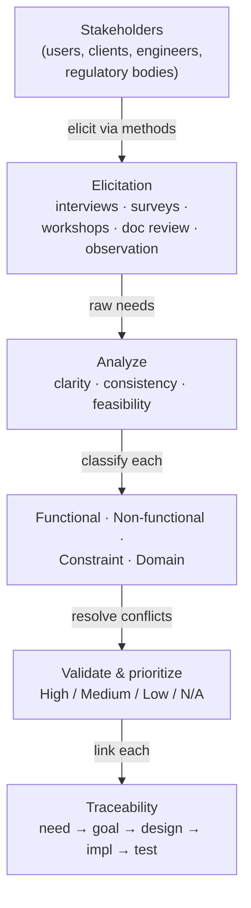

# Eliciting & Analyzing Requirements — Fundamentals

## Recall first

Try these from memory before reading (answers at the bottom):

1. Name three methods for gathering requirements from stakeholders.
2. What is the difference between a functional and a non-functional requirement?
3. Why must every requirement be traceable back to a source?

## Overview

Poorly defined requirements are a leading cause of project failures, cost overruns, delays, and systems that don't meet user needs; clear, validated requirements lay the foundation for successful design (source: m2-intro). The problem this solves: stakeholders speak in vague needs ("good coverage," "high-speed internet without interruption") and an engineer cannot build against vagueness. The shape of the solution is a two-step pipeline — **elicit** (gather raw needs from the people with a stake) then **analyze** (organize, filter, and structure them into clear, consistent, feasible specifications), followed by validation, prioritization, and traceability (source: m2-elicit).

## Detailed explanations

### Why requirements matter

Requirement elicitation and analysis "forms the foundation of any project development, allowing developers to understand what the system should do." Without gathering and validating needs, you get conflicting system actions, and cost, schedule, and scope all suffer (source: m2-elicit). The guiding principle: {{c1::you can't engineer a solution until you understand the problem}} (source: m2-intro).

### What elicitation is

**Elicitation** is the process of gathering information from stakeholders to define the system's needs (source: m2-elicit). **Stakeholders** include users, clients, system engineers, regulatory bodies, and anyone with a stake in the project's success (source: m2-elicit). The goal is to ensure stakeholder needs are properly understood, documented, and translated into system requirements (source: master-notes).

### Elicitation methods (with advantages & challenges)

Predict before reading: which method scales to thousands of people, and which gives the deepest insight into one person's needs?

- **Interviews** — one-on-one discussions with key stakeholders (customers, users, regulatory bodies) using open-ended questions to discover needs and expectations (source: m2-elicit, master-notes). *Example question for a smart-home thermostat:* "What aspects of home temperature control are most important to you?" (source: m2-elicit).
- **Surveys & questionnaires** — structured feedback from a large number of stakeholders; ideal for prioritizing features, capturing standard user expectations, and gathering statistical/numerical insight (source: m2-elicit, master-notes).
- **Workshops & focus groups** — collaborative sessions where multiple stakeholders brainstorm, discuss, refine requirements, resolve conflict, and ensure completeness (source: m2-elicit, master-notes).
- **Document review / document analysis** — reviewing business plans, incident reports, regulations, historical data, and previous specifications to surface **implicit requirements** stakeholders may not mention (source: m2-elicit, master-notes).
- **Observation** — watching stakeholders in their work environment (e.g., nurses using medical software) to reveal actual behavior, capability gaps, and where the interface needs improvement (source: m2-elicit, master-notes).

The master-notes group these and state their trade-offs (source: master-notes):

| Method group | Advantages | Challenges |
|---|---|---|
| Interviews & workshops | Direct interaction and clarification; deep insight into needs; encourage stakeholder buy-in and alignment | Time-consuming; need skilled facilitators to avoid bias; depend on third-party stakeholder availability/agenda |
| Surveys & questionnaires | Scalable and cost-effective; provide quantifiable data | Limited depth vs interviews; poorly designed questions yield misleading/inaccurate data |
| Observation & document analysis | Reveal actual behavior (not just stated needs); help identify overlooked requirements | Require expertise to interpret findings; time-consuming |

### Analyzing requirements (clarity, consistency, feasibility)

After gathering, **analyze**: organize, filter, and structure the collected information into a coherent set of specifications. The goal is requirements that are **clear** (no ambiguity), **consistent** (no contradictions), and **feasible** (achievable with available resources), aligned with project goals (source: m2-elicit). Refining a vague need is the core move: "The satellite should provide good coverage" → "The satellite shall provide continuous coverage for 99% of the time over the service area" adds clarity and measurable parameters (source: m2-elicit).

### Functional vs non-functional vs constraints

A common analysis scheme classifies each requirement (source: m2-elicit):

- **Functional requirement** — *what the system must do*; the specific features and functionalities, directly visible in the final product, measurable and clearly defined (source: m2-elicit, master-notes).
- **Non-functional requirement** — *how well the system should perform*; quality attributes like reliability, scalability, performance, security, usability, maintainability (source: m2-elicit, master-notes).
- **Constraint** — a limitation imposed on the design, e.g., cost or regulatory compliance (source: m2-elicit).

Satellite examples: *Functional* — "The satellite system shall process telemetry data at speeds of at least 100 Mbps." *Non-functional* — "The system shall be available 99.9% of the time." *Constraint* — "The system shall not exceed a budget of $10 million." (source: m2-elicit).

### Domain requirements

A **domain requirement** is industry-vertical specific; it can be either functional or non-functional and ensures the product aligns with established standards for that category and adheres to domain regulations (source: master-notes). *Example:* for a home security system, "the home security system shall comply with the UL 1023 standard for intrusion detection alarm units." UL 1023 is a safety standard for these alarms, ensuring reliability and security; compliance is often necessary for insurance approvals and certifications (source: master-notes).

### Resolving conflicting requirements

It is common to find conflicting requirements during analysis — e.g., one stakeholder wants high performance (100 Mbps) while another wants lower cost. You must **prioritize and find the right balance** to fix the conflict (source: m2-elicit).

### Validating & prioritizing (High / Medium / Low / N/A)

After analysis, requirements are **validated** (feasible, consistent, achievable with available resources, non-contradictory) and **prioritized** by how essential each is to operation, success, and user satisfaction (source: m2-elicit). One prioritization scheme uses labels (source: m2-elicit):

- **High** — must-have for the system to function.
- **Medium** — important, but not critical.
- **Low** — nice-to-have, but not necessary.
- **N/A** — not evaluated / document review.

*Example:* a High requirement is "The satellite shall provide continuous coverage for 99% of the time"; a Low requirement is "The satellite shall feature real-time video monitoring" (source: m2-elicit). A weighted-scale method can also score requirements against goals while keeping costs and risks low (source: m2-elicit). For *verifying* whether a requirement is well-written enough to validate (SMART, testable), see [06-verifying-requirements](../06-verifying-requirements/fundamentals.md).

### Traceability to source

Each requirement should be **traceable** back through a chain: the stakeholder need → the system goal it supports → design → implementation → testing. This ensures all system components align with the original user demand (source: m2-elicit). This topic introduces traceability *to source*; the forward/backward/bidirectional traceability *types* and tools like ReqView belong to [07-requirements-management](../07-requirements-management/fundamentals.md).

## Concept breakdowns

**Functional vs non-functional** — *Definition:* functional = what the system must do; non-functional = how well it performs (quality attributes) (source: m2-elicit, master-notes). *Why it matters:* a system can do everything required yet still fail (too slow, unreliable). *Simplest instance (security system):* functional — "detect motion within a 10-meter radius and trigger an alarm"; non-functional — "trigger the alarm in no more than three seconds" (source: master-notes). *Common confusion:* treating speed/reliability as features. If the statement names a capability, it's functional; if it qualifies *how well* a capability runs, it's non-functional.

**Constraint vs requirement** — *Definition:* a constraint is a *limitation imposed on the design* (cost, regulatory compliance), not a behavior the system performs (source: m2-elicit). *Why it matters:* constraints bound the whole solution space rather than describing one capability. *Simplest instance:* "shall not exceed a budget of $10 million" (source: m2-elicit). *Common confusion:* a regulatory limit ("comply with UL 1023") reads like a constraint but, when it pins the requirement to an industry standard, the master-notes call it a **domain requirement** (source: master-notes).

**Implicit requirement** — *Definition:* a need stakeholders *assume* the system will satisfy without stating it (source: m2-ex-elicit). *Why it matters:* unstated assumptions cause the worst surprises. *Simplest instance:* engineers assume a smart device always has internet, but a user assumes it still works offline (source: m2-ex-elicit). *Common confusion:* document review/observation exist largely to surface these, since they will not appear in interviews (source: m2-elicit).

**Traceability** — *Definition:* every requirement links back to its source and forward through design, implementation, and testing (source: m2-elicit). *Why it matters:* it keeps the build aligned with user demand and lets you track scope and cost changes. *Simplest instance:* requirement "remote temperature control" traces to the End User (Homeowner) stakeholder (source: m2-ex-elicit). *Common confusion:* traceability *to source* (here) vs traceability *types and tooling* (topic 07).

## How it fits together (diagram)

The diagram shows the elicit → analyze → validate/prioritize → trace pipeline the prose describes, with the classification step feeding analysis.

## Real-world use cases & industry applications

- **Communication satellite (broadband for remote regions):** vague stakeholder need "high-speed internet without interruption" translated into testable requirements (≥100 Mbps throughput, ≥1,000 simultaneous users, links maintained ≥99.9% of the time) (source: m2-intro).
- **Smart home thermostat:** interviews and observation drive functional requirements such as voice-assistant integration and mobile-app control (source: m2-elicit); full elicitation worked in [examples.md](examples.md) and [m2-ex-elicit].
- **Autonomous delivery robot:** a survey to a target demographic to learn how much users prioritize delivery speed and size over app experience (source: m2-elicit).
- **Medical software:** observing nurses to highlight capability gaps and interface needs (source: m2-elicit).
- **Home security system:** domain requirement compliance with UL 1023 for intrusion detection alarm units (source: master-notes).

## Best practices

- **Facilitate an effective stakeholder communication mechanism** so you gather all elements before design — prevents missing needs that surface late (source: m2-elicit).
- **Verify requirements rather than assume** them — avoids deviation and false assumptions baked into the build (source: m2-elicit).
- **Use clear methods to document constraints, priorities, and specifications** — keeps scope and cost changes trackable (source: m2-elicit).
- **Match the method to the goal:** surveys for scalable, quantifiable input; interviews/workshops for depth and buy-in; observation/document analysis for actual behavior and overlooked needs — gets the right data at the right cost (source: master-notes).
- **Organize requirements into categories** (functional, non-functional, constraints) with consistent naming/numbering — keeps a large set navigable (source: master-notes).

## Common pitfalls

- **Leaving requirements vague** ("good coverage," "good performance"). *Fix:* add measurable parameters — "continuous coverage for 99% of the time over the service area" (source: m2-elicit).
- **Missing non-functional requirements** because users don't know what they want in terms of performance/reliability/security. *Fix:* probe quality attributes explicitly during interviews and observation (source: m2-ex-elicit).
- **Ignoring implicit requirements** assumed by stakeholders (offline operation, interoperability). *Fix:* use document review and observation, and confirm assumptions out loud (source: m2-ex-elicit).
- **Designing surveys poorly**, yielding misleading data. *Fix:* design questions carefully; use surveys for quantifiable items, not nuance (source: master-notes).
- **Letting conflicts sit unresolved** (performance vs cost). *Fix:* prioritize and negotiate a balance before locking the spec (source: m2-elicit).

## Frequently asked questions

**Which elicitation method should I use?** Match it to the goal and stakeholder: surveys for large, scalable, quantifiable input; interviews/workshops for depth and alignment; observation and document analysis for actual behavior and overlooked or implicit needs (source: master-notes).

**Is a regulatory requirement a constraint or a domain requirement?** In this material both framings appear: m2-elicit calls regulatory compliance a *constraint*; master-notes call a standard-specific requirement (e.g., UL 1023) a *domain requirement*. Use "domain requirement" when it ties the system to an industry-vertical standard (source: m2-elicit, master-notes).

**Why are some requirements harder to elicit?** Non-functional ones (performance, reliability, security) are hard because users often don't know what they want; implicit ones are hardest because stakeholders assume them; interoperability with other systems can be unclear (source: m2-ex-elicit).

**What does "N/A" mean in prioritization?** Not evaluated / document review — the item wasn't scored on the High/Medium/Low scale (source: m2-elicit).

## References & further reading

- m2-intro — why requirements matter; satellite vague-need-to-requirement example.
- m2-elicit — elicitation methods, analysis, classification, conflict resolution, prioritization labels, traceability.
- m2-ex-elicit — smart-thermostat 5-requirement elicitation; hard-to-elicit requirement types.
- master-notes (Section 2, "Elicit and Analyze Requirements") — method advantages/challenges; functional/non-functional/domain detail; UL 1023.
- Next: [06-verifying-requirements](../06-verifying-requirements/README.md) (SMART, verification) and [07-requirements-management](../07-requirements-management/README.md) (traceability types, ReqView, change management). Glossary: [references.md#glossary](../../references.md#glossary).

---

## Answers

1. **Three elicitation methods (any three):** interviews, surveys/questionnaires, workshops/focus groups, document review, observation (source: m2-elicit).
2. **Functional vs non-functional:** functional = what the system must do (features/capabilities); non-functional = how well it performs (quality attributes like reliability, performance, security) (source: m2-elicit, master-notes).
3. **Why traceability:** so every requirement links back to its stakeholder need and system goal and forward to design, implementation, and testing — keeping all components aligned with the original user demand and making scope/cost changes trackable (source: m2-elicit).

> Revisit these answers tomorrow and again in a week — actively recalling them beats re-reading. [OUTSIDE MATERIAL]
