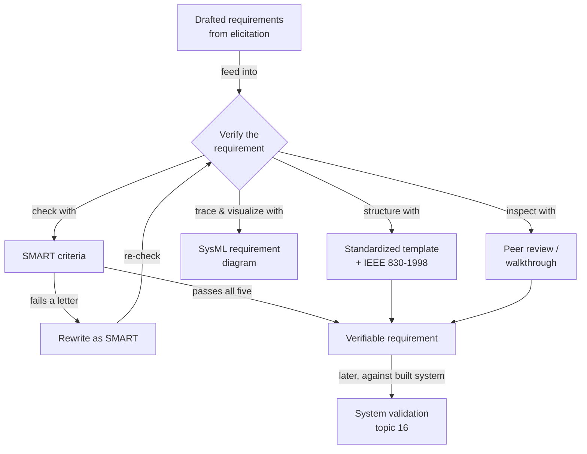

# Verifying Requirements — Fundamentals

## Recall first

Attempt these from memory before reading (answers at the bottom):

1. What does each letter of SMART stand for in the requirements context?
2. Why is "The satellite system should offer high data rates" *not* a verifiable requirement?
3. What is the difference between a peer review and a walkthrough?

## Overview

Even a perfectly written requirement is worthless if you cannot prove it is met (source: m2-verify). **Requirement verification** checks that each requirement is implemented correctly in the system — "did we build the system right?" — and is one of the final filters that separates a successful system from one that fails in the field (source: m2-verify). The mental model: before any design or code exists, you pass each *written requirement* through quality gates — SMART, standardized templates, models, and human review — so that vague, incomplete, or unrealistic statements are caught and fixed early, when changing them is cheap (source: m2-verify, master-notes). The slogan to remember: *"If you don't verify your requirements, you're building on assumptions, not specifications"* (source: m2-verify).

## Detailed explanations

### What verification means for requirements

Verification ensures each requirement is **clear, complete, and feasible** before development begins (source: m2-verify, master-notes). A requirement is **verifiable** when it can be confirmed through one of four methods — **inspection, test, analysis, or demonstration** (source: m2-verify, m2-ex-verify). The {{c1::verifiability}} of a statement is the property the whole topic turns on: if you cannot point to a way to prove the requirement is satisfied, the requirement is not done, regardless of how good the prose sounds.

Note the scope. Verifying *requirements* checks the quality of the written statements; **validating the built system** ("did we build the right system?") is a separate activity performed later against the real product — see [16-verification-validation-methods](../16-verification-validation-methods/fundamentals.md).

### The SMART criteria

The **SMART criteria** is a classic, powerful method to evaluate whether requirements are well-formed and, especially, whether they are verifiable (source: m2-verify). In the primary (m2-verify) phrasing:

| Letter | Meaning | What it means for requirements |
| :--- | :--- | :--- |
| **S** | Specific | The requirement is clear and unambiguous. |
| **M** | Measurable | You can quantify or assess it objectively. |
| **A** | Achievable | It is technically and practically feasible. |
| **R** | Relevant | It aligns with the system's goals and stakeholder needs. |
| **T** | Testable | There is a way to verify the requirement via inspection, test, analysis, or demonstration. |

(source: m2-verify)

> **Variant to be aware of:** the master course notes phrase SMART as **Specific / Measurable / Attainable / Relevant / Time-bound**, where *Attainable* = realistic and feasible (≈ Achievable) and *Time-bound* adds a time frame or performance deadline (source: master-notes). Both versions share S, M, R; the difference is the last two letters. This KB treats the m2-verify version (Achievable / Testable) as primary.

### Making a vague requirement SMART

The core procedure is to take a vague requirement, check it against each SMART letter, find which letters fail, and rewrite it to satisfy all five (source: m2-verify). The canonical example: *"The satellite system should offer high data rates"* is not SMART because it is not Specific (what does "high" mean?), not Measurable (how much data?), not clearly Achievable (within current satellite capability?), Relevance is unstated, and it is not Testable (source: m2-verify). The SMART rewrite: *"The satellite system shall provide a downlink data rate of at least 10 Mbps to ground terminals under standard operating conditions"* — now clear, quantified, feasible, supporting a key function, and testable through performance testing (source: m2-verify). The full step-by-step is worked in [examples.md](examples.md).

### Standardized templates

**Standardization** ensures every requirement meets minimum quality standards and can be reviewed, traced, and verified consistently; it reduces ambiguity, increases traceability, and aligns the whole team (source: m2-verify). A **requirement template** guides authors to include all essential elements (source: m2-verify). The template from m2-verify:

> The `[system/subsystem/component]` shall `[perform a function or exhibit a property]` `[with a measurable condition or constraint]` `[under defined conditions or context]`.

(source: m2-verify)

This forces three things into every statement: functionality is defined, a quantitative measurement is included, and operating context is specified (source: m2-verify). Example written with it: *"The onboard processor shall process telemetry data at a minimum rate of 50 packets per second under nominal operating conditions"* (source: m2-verify).

Standardized *document* templates exist too. **IEEE 830-1998** is a commonly used template for writing system requirements; it lists items a requirement must fulfill to ensure clarity and prevent missing information — including a verification method (so the requirement is testable) and a source field (so stakeholder input is traceable) (source: master-notes). The broader, current standard for the requirements engineering process is **ISO/IEC/IEEE 29148** (see [07-requirements-management](../07-requirements-management/README.md)).

### SysML requirement diagrams for verification

Models such as **Requirement Diagrams** in SysML let you visualize requirement relationships — traceability, derivations, decompositions, refinements, and links to test cases or verification activities — which promotes consistency and makes review and verification easier (source: m2-verify). They are used here only as a *verification aid*; the full treatment of SysML requirement diagrams and their relationship types (derive, satisfy, verify, refine) lives in [08-sysml-modeling](../08-sysml-modeling/fundamentals.md).

### Peer reviews and walkthroughs

Sometimes the best way to catch a vague or unverifiable requirement is a fresh pair of eyes — low-cost, high-impact techniques applied *before* design or implementation begins (source: m2-verify).

- **Peer review**: a *structured* activity where peers (engineers, analysts, designers) review requirements for clarity, completeness, consistency, and verifiability (source: m2-verify).
- **Walkthrough**: more *informal* — the author of the requirement walks through the document with a team, encouraging discussion, clarification, and collective ownership (source: m2-verify).

Example: before finalizing a new requirement set for a smart home system, the product owner walks through each section with systems engineers, software architects, and testers; the testers flag a few requirements that are hard to verify, prompting revisions that improve the requirements (source: m2-verify). The master notes call this same idea **feedback** — asking engineers and stakeholders to refine and detect inconsistencies or gaps before development, which is far cheaper than changing requirements mid-project (source: master-notes).

## Concept breakdowns

**SMART vs "sounds good."** *Definition:* SMART = Specific, Measurable, Achievable, Relevant, Testable (source: m2-verify). *Why it matters:* it converts a subjective "is this a good requirement?" into five objective yes/no checks. *Simplest instance:* "fast" fails Measurable; "5 km/h within 3 s" passes (source: m2-ex-verify). *Common confusion:* a fluent, grammatical sentence can still fail every SMART test — readability is not verifiability.

**Verifiable vs measurable.** *Definition:* verifiable = provable by inspection, test, analysis, or demonstration (source: m2-verify, m2-ex-verify). *Why it matters:* "Measurable" is one ingredient of verifiability, but a requirement can be measurable yet still need a defined condition/context to be testable. *Simplest instance:* "detect obstacles within 1 meter and stop within 2 seconds" is both measurable and testable (source: m2-ex-verify). *Common confusion:* assuming any number makes a requirement testable — without operating context, a number may not be reproducibly checkable.

**Verifying requirements vs validating the system.** *Definition (this topic):* verify the written requirement is well-formed; *Definition (topic 16):* validate the finished product against real needs. *Why it matters:* they happen at opposite ends of the lifecycle and use different evidence. *Common confusion:* people say "V&V" as one phrase and forget the requirement-quality gate comes first — see [16-verification-validation-methods](../16-verification-validation-methods/fundamentals.md).

## How it fits together (diagram)

The diagram shows the four verification aids all feeding the single "verify" gate; a requirement that fails SMART loops back through a rewrite, and only a verifiable requirement proceeds — with system validation as a distinct downstream step (source: m2-verify, master-notes).

## Real-world use cases & industry applications

- **Communication satellite design** — turning "high data rates" into "≥10 Mbps downlink under standard operating conditions," and writing onboard-processor throughput with the template (source: m2-verify).
- **Smart home / home security systems** — walkthrough of a requirement set with engineers, architects, and testers to flag hard-to-verify items (source: m2-verify); SMART rewrite of "fast response time" → "trigger an alarm within two seconds of detecting unauthorized motion" (source: master-notes).
- **Autonomous delivery robot** — verifying a draft requirement set and rewriting the non-SMART ones (worked in [exercises.md](exercises.md)) (source: m2-ex-verify).

## Best practices

- **Run every requirement through all five SMART letters, not just a gut check** — buys you objective, repeatable acceptance and exposes which specific dimension is weak (source: m2-verify).
- **Quantify and add operating conditions** — "≥10 Mbps … under standard operating conditions" is testable; "high data rates" is not — buys verifiability and reproducible tests (source: m2-verify).
- **Use a standardized template / IEEE 830-1998 for every statement** — buys consistency, traceability, and prevents missing information like the verification method (source: m2-verify, master-notes).
- **Hold a walkthrough or peer review before design** — buys early detection of unverifiable requirements when fixes are cheap, plus collective ownership (source: m2-verify).

## Common pitfalls

- **Subjective adjectives** ("fast," "responsive," "intuitive," "sleek," "modern") — *fix:* replace with a measured value and a condition (e.g., "reach 5 km/h within 3 seconds of a movement command") (source: m2-ex-verify).
- **A number with no context** — measurable but maybe not testable; *fix:* state the operating conditions ("under standard/nominal operating conditions") (source: m2-verify).
- **Confusing readability with verifiability** — a clean sentence can fail every SMART check; *fix:* test it against S-M-A-R-T explicitly (source: m2-verify).
- **Deferring verification until after design** — changing requirements mid-project costs far more; *fix:* verify (peer review / walkthrough / feedback) before development starts (source: master-notes).
- **Conflating requirement verification with system validation** — *fix:* verify the statement now; validate the product later (see [16-verification-validation-methods](../16-verification-validation-methods/fundamentals.md)).

## Frequently asked questions

**Is "verifiable" the same as "testable"?** Testable is the T in SMART; verifiable is the broader property satisfied by inspection, test, analysis, *or* demonstration (source: m2-verify, m2-ex-verify).

**Which SMART should I use — Testable or Time-bound?** This KB uses the m2-verify version (Achievable / Testable) as primary; the master notes use Attainable / Time-bound. They overlap on S, M, R (source: m2-verify, master-notes).

**What's the difference between a peer review and a walkthrough?** A peer review is a structured review by peers; a walkthrough is more informal and author-led (source: m2-verify).

**Where do SysML requirement diagrams really belong?** Their full treatment (derive/satisfy/verify/refine) is in [08-sysml-modeling](../08-sysml-modeling/fundamentals.md); here they are only a verification/traceability aid (source: m2-verify).

## References & further reading

- m2-verify — *Requirements Analysis and System Modeling - Verifying requirements* (SMART table, satellite example, template, peer review/walkthrough).
- m2-ex-verify — *Exercise: Verify requirements* (autonomous delivery robot requirement table).
- master-notes §2 *Verifying Requirements* (Attainable/Time-bound variant, IEEE 830-1998, feedback).
- Standards index and tools: [../../references.md](../../references.md).

---

## Answers

1. **SMART (m2-verify):** Specific (clear, unambiguous), Measurable (quantify/assess objectively), Achievable (technically and practically feasible), Relevant (aligns with goals and stakeholder needs), Testable (verifiable via inspection, test, analysis, or demonstration) (source: m2-verify). Master-notes variant: Specific, Measurable, Attainable, Relevant, Time-bound (source: master-notes).
2. **"High data rates" is not verifiable** because it is not Specific ("high" undefined), not Measurable (no quantity), not clearly Achievable, Relevance unstated, and not Testable (no way to confirm it) (source: m2-verify).
3. **Peer review** is a structured activity where peers review requirements for clarity, completeness, consistency, and verifiability; a **walkthrough** is more informal — the author walks the team through the document to encourage discussion and shared ownership (source: m2-verify).

---

> Forgetting-curve nudge: revisit this page within 24 hours, then again in ~3 days and ~1 week — re-attempt the Recall-first questions before re-reading. [OUTSIDE MATERIAL]
