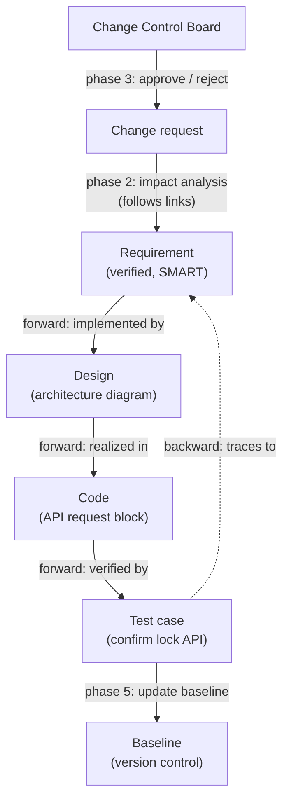

# Requirements Management, Traceability & Change Management — Fundamentals

## Recall first

Attempt these from memory before reading; answers are at the bottom.

1. Why is a spreadsheet or Word file no longer enough for managing requirements on a large system?
2. A test case points back to the requirement it verifies. Is that forward or backward traceability?
3. Name the five phases of a change management process and say which body usually does the approval.

## Overview

A verified requirement is not a finished requirement. Across the lifecycle requirements must be **captured, updated, tracked, and verified** so the system stays maintainable, traceable, and consistent (source: m2-reqtools). The problem this solves: as systems grow, requirements multiply and change, and static documents (spreadsheets, Word) cannot show what links to what or what a change breaks (source: m2-reqtools). The shape of the solution is three things working together — a **requirement management tool** to hold the requirements, **traceability** to link each requirement to its design, code, and tests, and a **change management** process to control how requirements change without causing scope creep or inconsistency (source: m2-reqtools; master-notes §2).

## Detailed explanations

### Why manage requirements over the lifecycle

Requirements don't stay static; stakeholder needs, regulatory standards, and project constraints evolve (source: master-notes §2). Management means continuously capturing, tracking, and updating requirements while maintaining traceability and consistency across the project (source: m2-reqtools). Done well, it lets you answer questions that static documents cannot: *Are all system requirements satisfied? Are all design elements implemented in code? Does code coverage match test cases? What happens if a requirement changes?* (source: m2-reqtools).

### Requirement management tools and ReqView

**Requirement management tools** help teams document, track, and trace requirements systematically; they enhance collaboration, improve traceability, and support change management (source: m2-reqtools). The course names several — **IBM DOORS**, **Jama Connect**, **Helix RM**, and **ReqView** — and notes most are not free or are heavily limited in free versions (source: master-notes §2).

**ReqView** is a purpose-built requirements-management tool, popular in systems engineering, medical-device, automotive, and aerospace work. Unlike general project-management tools such as Jira or Asana, it is built to support the *complete* requirement lifecycle — from elicitation to verification — while honoring the strict compliance needs of complex systems (source: m2-reqtools). It is used to author and structure requirements; track traceability across architecture, hardware, software, and testing; manage changes and version history; collaborate with stakeholders; and support compliance with industry standards (source: m2-reqtools).

ReqView's main features:

| Feature | Description |
| :--- | :--- |
| Document Management | Author hierarchical requirements with rich text (tables, pictures, formulas, attachments). |
| Traceability Links | Create and visualize links between requirements, source documents, test cases, etc., enabling impact analysis. |
| Change Management | Track revisions, manage baselines, and compare document versions to understand what changed. |
| Verification Planning | Assign verification methods (test, inspection, etc.) and track verification status per requirement. |
| Custom Attributes and Views | Add custom properties (status, risk, cost), design views, and filter to focus on relevant requirements. |
| Offline and Secure | Desktop application storing data locally or on a shared drive, meeting high security requirements. |
| Export & Reporting | Export to PDF, HTML, Word, or CSV for sharing and documentation. |
| Standards Support | Built-in templates for compliance via structured documentation and traceability. |

(source: m2-reqtools)

The standards ReqView helps comply with include **ISO 26262** (automotive functional safety), **DO-178C** (airborne software), and **IEC 62304** (medical-device software) (source: m2-reqtools). When starting a project it is also common to follow **ISO/IEC/IEEE 29148**, the international standard describing requirements-engineering processes, which contains five document templates: Stakeholder Requirements Specification (StRS), System Requirements Specification (SyRS), Software Requirements Specification (SRS), Business Requirements Specification (BRS), and System Operational Concept (OpsCon) (source: master-notes §2).

### Traceability types

**Traceability** links every requirement to design, implementation, and test artifacts so you can prove coverage and understand impact (source: m2-review). There are three types (source: m2-reqtools):

| Type | Direction | What it ensures |
| :--- | :--- | :--- |
| **Forward traceability** | requirement → design → code → test | All requirements are implemented and verified. |
| **Backward (reverse) traceability** | test / design → source requirement | No unnecessary elements are added (every artifact traces back to a real requirement). |
| **Bidirectional traceability** | both directions | Combines forward and backward — essential for safety-critical projects and compliance. |

Predict before reading: if a developer adds a clever feature nobody asked for, which traceability type catches it? *(Backward — it has no source requirement to trace back to.)*

The {{c1::bidirectional}} type is the one demanded by safety-critical and regulated work because auditors must follow links in *both* directions (source: m2-reqtools).

### The change management process

**Change management** is the structured process of handling changes while minimizing risk and disruption; it controls how change is requested, evaluated, and implemented, and helps an organization review/approve, record, and manage costs of a change request (source: m2-reqtools). A typical process has five phases (source: m2-reqtools):

1. **Request for Change** — a user, stakeholder, or developer raises a change request.
2. **Analyze the impact** — which requirements, components, and tests are affected? What are the time and cost implications?
3. **Review and Approve (or Reject)** — often done by a **Change Control Board (CCB)**.
4. **Implement the change** — update documents, models, code, and tests.
5. **Communicate and Track** — notify the team and update the **baseline** (version control).

The supporting practices behind these phases are **impact analysis** (assess how a proposed change affects the system), **version control** (keep historical versions to track changes), **stakeholder approval** (changes are reviewed and approved), and **baseline management** (lock a set of requirements at a specific stage) (source: master-notes §2).

> The full system-wide impact-analysis workflow, continuous validation, and a worked impact-analysis example live in [18-change-management-continuous-validation](../18-change-management-continuous-validation/fundamentals.md). This topic stays at the requirements level: the five-phase process and the CCB's role.

### The Change Control Board (CCB)

The **Change Control Board (CCB)** is the body that reviews a change request and decides to approve or reject it — phase 3 of the process (source: m2-reqtools). Its role is to ensure a change is justified before any artifacts are touched, so changes don't slip in informally and cause scope creep (source: master-notes §2 — "stakeholder approval to ensure changes are reviewed and approved").

## Concept breakdowns

**Forward vs backward traceability.**
- *Definition (source wording):* forward is "from requirements to design, code, and tests"; backward is "from tests or design all the way back to source requirements" (source: m2-reqtools).
- *Why it matters:* forward proves nothing was *missed*; backward proves nothing *extra* was added.
- *Simplest instance:* requirement R1 → test T1 is a forward link; T1 → R1 is the backward link. Recording both makes the pair bidirectional.
- *Common confusion:* learners think backward traceability finds missing implementations. It does not — it finds *orphan* artifacts (design/code/tests with no requirement behind them). Missing implementations are caught by forward traceability.

**Baseline.**
- *Definition (source wording):* baseline management "locks a set of requirements [at a] specific stage" (source: master-notes §2).
- *Why it matters:* without a baseline you can't say what "the change" changed — there is no fixed reference to compare against.
- *Simplest instance:* freeze the SRS at the end of design review as Baseline 1.0; the next approved batch of changes produces Baseline 1.1.
- *Common confusion:* a baseline is not a backup. A backup is a copy; a baseline is an *approved, version-controlled* reference point you measure change against.

**Impact analysis.**
- *Definition (source wording):* it "assess[es] how [a] proposed change affects the system" — which requirements, components, and tests are affected, plus time and cost (source: m2-reqtools; master-notes §2).
- *Why it matters:* it turns "sure, we can change that" into a costed, scoped decision the CCB can act on.
- *Simplest instance:* changing the motion-sensor requirement flags the linked sensor spec, alarm logic, and the related test case as needing update (source: master-notes §2).
- *Common confusion:* impact analysis depends on traceability links already existing — you cannot analyze impact on links you never recorded.

## How it fits together (diagram)

The prose above describes a chain from requirement to verification, with change management feeding back into it. The diagram below shows the traceability chain and where change control re-enters it.

The dashed edge is the backward link; together with the forward edges it makes the chain bidirectional (source: m2-reqtools).

## Real-world use cases & industry applications

- **Smart-home smart-lock system.** The requirement "The system shall control smart locks based on user authentication" is traced to a design (system architecture diagram), code (the block controlling API requests), and a test case ("Confirm smart lock API device connection"); if the requirement changes you immediately know what is impacted (source: m2-reqtools). Worked in full in [examples.md](examples.md).
- **Smart-home motion detection.** The requirement "The system shall detect unauthorized movement within a five-meter range and trigger an alarm within two seconds" is linked to the motion-sensor specification and the alarm-activation logic; a test case verifies movement triggers the alarm within the required time, and replacing the motion sensor flags the requirement for update (source: master-notes §2).
- **Regulated industries.** ReqView is used in medical-device, automotive, and aerospace work specifically because those domains must comply with standards like IEC 62304, ISO 26262, and DO-178C (source: m2-reqtools).

## Best practices

From the course's requirements-management best practices (source: master-notes §2), each with what it buys:

- **Use a structured approach** — organize requirements into functional, non-functional, and constraints, with consistent naming/numbering → links and impact analysis stay legible as the set grows.
- **Ensure clarity and completeness** — use clear, testable statements and SMART → requirements can actually be traced to tests (see [06-verifying-requirements](../06-verifying-requirements/fundamentals.md)).
- **Maintain traceability** — link requirements to design and test with a tool, and run regular traceability reviews → impact analysis is possible and coverage gaps surface early.
- **Establish a change-control process** — define how changes are proposed, reviewed, approved, and version-controlled → no scope creep or silent inconsistencies.
- **Regularly review and validate** — stakeholder reviews at key stages plus modeling/prototyping → requirements stay aligned with real needs over time.
- **Foster collaboration** — involve stakeholders early and use collaborative tools → fewer late, expensive surprises.

## Common pitfalls

- **Treating requirements as frozen after sign-off.** They evolve with stakeholder needs and standards; freezing them without a change process invites inconsistency. *Fix:* baseline, then change only through the five-phase process (source: m2-reqtools; master-notes §2).
- **Skipping backward links.** Forward-only tracing leaves orphan code/tests undetected. *Fix:* record both directions for safety-critical work — bidirectional (source: m2-reqtools).
- **Doing change without impact analysis.** Implementing first and discovering the blast radius later causes rework. *Fix:* phase 2 before phase 3 — analyze impact, then let the CCB decide (source: m2-reqtools).
- **No baseline / no version control.** You can't say what changed without a locked reference. *Fix:* lock a baseline at each stage and update it in phase 5 (source: master-notes §2).
- **Trying to manage complex requirements in a spreadsheet.** It does not scale and cannot show links or impact. *Fix:* use a purpose-built tool such as ReqView (source: m2-reqtools).

## Frequently asked questions

**Forward vs backward vs bidirectional — when do I need which?**
Use **forward** to prove every requirement is implemented and verified (coverage). Use **backward** to prove nothing extra crept in (no orphan design/code/tests). Use **bidirectional** — both — for safety-critical projects and compliance, where auditors must follow links in either direction (source: m2-reqtools).

**Isn't change management the same thing as verifying requirements?**
No. Verification (topic 06) judges whether a single requirement is well written. Change management controls how an *already-accepted* requirement is altered later (source: m2-reqtools).

**Is ReqView just project management like Jira?**
No — it is purpose-built for the requirement lifecycle (elicitation to verification) with compliance support, which general PM tools like Jira or Asana don't provide (source: m2-reqtools).

**Where's the deep impact-analysis material?**
The full system-wide impact-analysis workflow and continuous validation are in [18-change-management-continuous-validation](../18-change-management-continuous-validation/fundamentals.md). Here we cover change at the requirements level only.

## References & further reading

- m2-reqtools — *Requirement management tools* (ReqView features table, traceability types, smart-lock example, five-phase change process). Primary source for this topic.
- m2-review — *Lesson Review*, "Traceability and Change Management" recap.
- master-notes §2 — *Requirement Management Tools* (five-meter motion example, ISO/IEC/IEEE 29148 templates, best practices).
- Cross-topic: [06-verifying-requirements](../06-verifying-requirements/fundamentals.md), [05-requirements-elicitation-analysis](../05-requirements-elicitation-analysis/fundamentals.md), [18-change-management-continuous-validation](../18-change-management-continuous-validation/fundamentals.md).
- Glossary: [references.md#glossary](../../references.md#glossary).

---

## Answers

1. **Why isn't a spreadsheet/Word file enough?** As systems grow in complexity, static documents can't capture the links between requirements, design, code, and tests or show what a change impacts; managing requirements requires capturing, updating, tracking, and verifying them systematically with a dedicated tool (source: m2-reqtools).
2. **Test → requirement is which type?** Backward (reverse) traceability — from a test/design artifact back to its source requirement (source: m2-reqtools).
3. **Five phases + approver.** Request for change → Analyze impact → Review & Approve/Reject → Implement → Communicate & Track; the **Change Control Board (CCB)** usually does the review/approval in phase 3 (source: m2-reqtools).

---

> Spaced-review nudge: re-test the five phases and three traceability types tomorrow, then in 3 days, then in a week — recalling them cold beats re-reading this page. [OUTSIDE MATERIAL]
