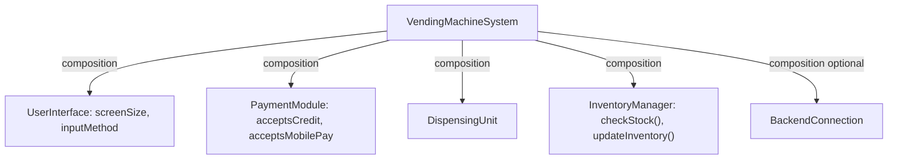
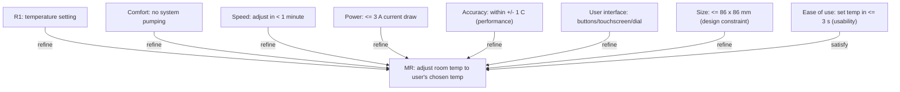

# System Modeling with SysML — Examples

These examples *build* diagrams. Work them with a tool (Visual Paradigm online is free; source: m2-sysml) or on paper. Blanked steps are solved in the Solutions section at the bottom.

## Simple example — fully worked: Vending Machine BDD

**Task:** model the high-level structure of an Automated Vending Machine (sells snacks/drinks/hygiene products; accepts cash, credit, mobile pay; touchscreen; backend for inventory and maintenance alerts) with a **Block Definition Diagram** (source: m2-ex-vending).

**Step 1 — create a SysML project and a Block Definition Diagram.** *Reason:* a BDD is the structure diagram for defining blocks (components) and their relationships (source: m2-models).

**Step 2 — add the main system block:** `VendingMachineSystem`. *Reason:* the BDD needs a top-level block representing the whole system, which the parts compose into (source: m2-ex-vending).

**Step 3 — add the five module blocks:** `UserInterface`, `PaymentModule`, `DispensingUnit`, `InventoryManager`, `BackendConnection`. *Reason:* these are the system's structural components (source: m2-ex-vending).

**Step 4 — connect each module to the system with a composition relationship**, using the meanings below (source: m2-ex-vending):

| Parent Block | Part Block | Relationship Type | Meaning |
| :--- | :--- | :--- | :--- |
| VendingMachineSystem | UserInterface | Composition | A single user interface is essential for interacting with the machine. |
| VendingMachineSystem | PaymentModule | Composition | Every vending machine has one payment system for transaction handling. |
| VendingMachineSystem | DispensingUnit | Composition | It needs one dispensing unit to release products. |
| VendingMachineSystem | InventoryManager | Composition | It must include an inventory manager to track stock. |
| VendingMachineSystem | BackendConnection | Composition (optional) | It may include a backend connection for remote updates/monitoring. |

*Reason:* composition is the whole-part relationship — the modules are integral parts of the machine (source: m2-models). The backend is optional because the machine can run without remote monitoring (source: m2-ex-vending).

**Step 5 — add attributes (properties) and operations to the blocks** (source: m2-ex-vending):
- `UserInterface`: attributes `screenSize`, `inputMethod`
- `PaymentModule`: attributes `acceptsCredit`, `acceptsMobilePay`
- `InventoryManager`: operations `checkStock()`, `updateInventory()`

*Reason:* properties describe state; operations describe behavior — together they give each block meaning beyond a name (source: m2-models).

**Step 6 (optional) — add generalization for product-specific dispensers**, e.g., `SnackDispenser` and `DrinkDispenser` as specializations of a dispenser. *Reason:* generalization (inheritance) captures "is-a-kind-of" specialization in a BDD (source: m2-ex-vending, m2-models).

**Resulting structure:**

## Intermediate example — completion problem: smart-home security BDD

**Task:** start a BDD for the smart-home security system. The blocks are given; complete the last two steps.

**Step 1 (done):** add blocks `MotionSensor`, `Camera`, `ControlUnit`, `Alarm` (source: m2-models).
**Step 2 (done):** give `MotionSensor` the property `sensitivity` and the operation `activate` (source: m2-models).
**Step 3 — YOU complete:** what relationship type connects each sensor/camera/alarm to the `ControlUnit`-anchored system, and why?
**Step 4 — YOU complete:** to show *how the `ControlUnit` internally communicates with sensors and signals the alarm or notifies the phone app*, which diagram do you switch to, and why is the BDD the wrong place?

*(Solutions at the bottom.)*

## Advanced example — fresh case, strategy hint only

**Task:** you are told "model, for the smart-home system, how the system behaves when motion is detected — branching between sounding the alarm or checking for a false positive, then sending a notification." Pick the **diagram type**, name its core constructs, and sketch the flow.

*Strategy hint:* this is a *workflow with a decision branch* — match it to the behavior category (source: m2-models). *(Solution at the bottom.)*

## Real-world case study — thermostat requirements model (source: master-notes)

**Situation:** an engineer must capture and relate the requirements for a thermostat device so the model shows what the system must do and how, with traceability.

**Approach:** in Visual Paradigm online (free), they create a requirements diagram inside a Block Definition Diagram canvas (it supplies the SysML requirement blocks). They place a **main requirement** and surround it with refining/satisfying requirements of several types, then draw the relationship arrows.

**Outcome:** a single diagram in which the main requirement (regulate temperature) is connected to nine supporting requirements covering behavior, performance, interface, physical, and usability concerns, joined by `refine` and `satisfy` arrows.

**Lesson:** the value is in the relationships — the diagram makes the *how* and the supporting properties explicit and traceable to the one goal, and it scales: you can keep adding requirements to refine or to test/verify the thermostat (source: master-notes). Full build below.

## Guided walkthrough — building the thermostat requirements diagram (source: master-notes)

Narrated start to finish. Every requirement's id, text, and type is from master-notes.

1. **Open the tool.** Go to `online.visual-paradigm.com`, *Get Started for Free*, *Create New*, search "block definition diagram," open it. It carries the SysML blocks needed for a requirements diagram. From the left search bar, type "requirement," add a requirement *diagram* frame, enlarge it, recolor it, and rename it **"Thermostat requirements."**

2. **Add the main requirement (MR).** A requirement block, id **MR**, text: *"Adjust room temperature to the temperature chosen by the user."* This is the goal everything else supports.

3. **Add R1 — a refinement of the main one.** Requirement **R1**, "Temperature setting": *"The user shall be able to set the temperature he wants in the room."*

4. **Add three extended requirements** that also refine the main one, adding important properties — comfort, speed, power consumption:
   - **Comfort:** adjust the room temperature to the chosen temperature with no pumping (oscillation) of the system.
   - **Speed:** adjust the room temperature in less than one minute.
   - **Power consumption:** achieve the adjustment with no more than three amps of current draw.

5. **Add a performance requirement and an interface requirement:**
   - **Accuracy** (performance): the system should adjust the temperature within a defined range of ±1 °C.
   - **User interface** (interface): the system should have an easy way to set the temperature — via buttons, touchscreen, or dial.

6. **Add a design constraint and a usability requirement**, both refining the main one:
   - **Size** (design constraint): the system should be at most 86 × 86 mm.
   - **Ease of use** (usability): users should be able to set a desired temperature in no more than 3 seconds.

7. **Draw the relationships.** Connect the supporting requirements to **MR** with arrows: most are **refine**, and one is **satisfy** (master-notes: "these are refined, and this satisfy").

8. **Read the result.** The main requirement (regulate temperature) sits at the center; the surrounding requirements define *how* it is achieved and pin down properties and behaviors. You can extend it with more requirements to refine MR or to test and verify the thermostat (source: master-notes).

---

## Solutions

**Intermediate, Step 3:** use **composition** — the sensors, camera, and alarm are integral whole-parts of the system (whole-part is exactly what composition expresses in a BDD) (source: m2-models). *(Association would be acceptable if they were merely related, not parts; composition is stronger and matches the vending-machine pattern.)*

**Intermediate, Step 4:** switch to an **Internal Block Diagram (IBD)**. The IBD zooms inside the `ControlUnit` to show its internal parts and how they connect to other blocks via ports — e.g., communicating with sensors and signaling the alarm or notifying the phone app. The BDD only catalogues *what blocks exist* and their relationships; it does not show internal port-level connections (source: m2-models).

**Advanced:** use an **Activity Diagram** — the behavior diagram for workflows/processes, supporting decisions, parallel operations, and loops (source: m2-models). Core constructs: actions ("detect motion," "sound alarm," "check false positive," "send notification"), a **decision** node branching alarm vs false-positive check, and the flow ending in the notification action (source: m2-models).
