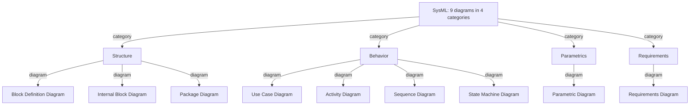

# System Modeling with SysML — Fundamentals

## Recall first

Try these from memory before reading. Answers at the bottom.

1. SysML extends which other modeling language, and what does it add that the other lacks?
2. Name the four categories of SysML diagrams.
3. What is the key difference between a `derive` relationship and a `refine` relationship?

## Overview

A textual requirements list quickly becomes impossible to keep consistent as a system grows: gaps, conflicts, and broken traceability hide in the prose. **System modeling** solves this by translating text into a connected visual model so engineers can visualize, analyze, and communicate system structure and behavior (source: m2-models). **SysML (Systems Modeling Language)** is the standardized graphical language used for this; it extends **UML (Unified Modeling Language)** with constructs tailored for systems engineering — hardware, electrical, and mechanical, not just software (source: m2-models). The model is built from nine diagram types in four categories, and its real power comes not from drawing components but from the *relationships* you create among requirements and other model elements (source: m2-models).

## Detailed explanations

### SysML vs UML — extension and overlap

SysML is built on UML rather than replacing it. To picture the relationship, imagine a Venn diagram of the two languages' modeling constructs: the overlap region — labelled **"UML reused by SysML"** — is the set of UML constructs that SysML adopts directly. Outside that overlap, SysML defines *new* constructs (e.g., requirement, block, parametric) that have no UML counterpart or that replace UML ones; and a portion of UML is *not required* to be implemented in SysML at all (source: master-notes). The takeaway: SysML reuses much of UML but is {{c1::tailored for systems}}, covering hardware, software, electrical, and mechanical components (source: m2-models).

### The 9 diagrams in 4 categories

SysML has nine diagram types grouped into four categories. Each serves a distinct purpose (source: m2-models):

| Category | Diagram Type | Purpose |
| :--- | :--- | :--- |
| **Structure** | Block Definition Diagram (BDD) | Define system blocks (components) and their relationships. |
| | Internal Block Diagram (IBD) | Show internal parts and connections of a block. |
| | Package Diagram | Organize and group elements into packages (like folders). |
| **Behavior** | Use Case Diagram | Represent user interactions (functional goals of the system). |
| | Activity Diagram | Model workflows or processes, like flowcharts. |
| | Sequence Diagram | Show interactions between elements over time. |
| | State Machine Diagram | Model states of a component and transitions between them. |
| **Parametrics** | Parametric Diagram | Model constraints and equations (e.g., physics, cost models). |
| **Requirements** | Requirements Diagram | Display system requirements and trace links to system elements. |

*(Note: master-notes groups the nine into three families — structure, behavior, requirements — folding parametrics under structure-style analysis. The four-category split above follows m2-models, the more detailed source.)*

Each diagram, with its smart-home / security-system example (source: m2-models):

1. **Block Definition Diagram (BDD)** — defines structural elements called **blocks** and their relationships: associations, generalizations (inheritance), and composition (whole-part). It is like a software class diagram adapted for systems. In a smart home, blocks like `MotionSensor`, `Camera`, `ControlUnit`, and `Alarm` each carry properties (e.g., sensitivity) and operations (e.g., activate), giving a high-level view of how the system is organized.

2. **Internal Block Diagram (IBD)** — zooms *inside* one block to show its internal parts and how they connect to other blocks via interfaces called **ports**. It is like opening a car's hood to see how engine, battery, and sensors are wired. A security system's `ControlUnit` IBD shows how it communicates with sensors and signals an alarm or notifies a smartphone app.

3. **Package Diagram** — groups related elements into **packages**, like folders or namespaces, for readability and maintainability in large models. E.g., all sensor elements in a `Sensors` package, all UI elements in a `UI` package.

4. **Use Case Diagram** — a high-level view of how **actors** (users) interact with the system through goals called **use cases**, without diving into implementation. For home automation: use cases "Activate System," "Arm Night Mode," "Receive Intrusion Alert," with actors "Homeowner" or "Maintenance Technician." Strong for eliciting requirements early.

5. **Activity Diagram** — an advanced flowchart describing the flow of activities, including decisions, parallel operations, and loops. When motion is detected, the system could branch between activating the alarm or checking for false positives, then sending a notification.

6. **Sequence Diagram** — models interactions over time, showing the order of messages exchanged between components (lifelines). A "Trigger Alarm" sequence: the motion sensor detects movement, signals the control unit, which activates the alarm and sends an alert. Emphasizes timing and interaction order.

7. **State Machine Diagram** — shows how a component behaves in response to events through **states** and **transitions**. A `MotionSensor` might have states Idle, Armed, Triggered, and Reset, with transitions driven by inputs or timeouts. Ideal for event-driven or condition-dependent logic.

8. **Parametric Diagram** — models mathematical constraints and equations (physical laws, cost equations, performance limits) by linking system parameters to **constraint blocks**. E.g., the relationship between `BatteryLife`, `PowerConsumption`, and `UsageTime`. Useful for trade studies and performance compliance.

9. **Requirements Diagram** — shows requirements and their relationships to other model elements (blocks, test cases, other requirements), giving visual traceability so you can see which part satisfies which requirement and detect gaps. E.g., "Detect motion in under 2 seconds" linked to the `MotionSensor` block and its test case.

> These nine diagram definitions are **owned by this topic**. For using BDD / IBD specifically as *architecture documentation*, see [14-documenting-architecture](../14-documenting-architecture/README.md), which links back here for the definitions.

### Requirements in SysML — what a requirement is, and its types

A **requirement** specifies a capability or condition that must (or should) be satisfied — a function the system must perform or a performance condition it must achieve. Requirements form a contract between stakeholders and those designing and implementing the system (source: m2-models). A standard SysML requirement carries at least a unique **identifier** and the **requirement text**; the user can add properties such as verification status and priority (source: m2-models).

SysML defines eight requirement **types** (source: m2-models):

- **Business requirement** — a business-level need.
- **Design constraint** — a constraint imposed on the design (e.g., the thermostat must be at most 86 × 86 mm; source: master-notes).
- **Extended requirement** — adds extra properties beyond the base (e.g., comfort, speed, power; source: master-notes).
- **Functional requirement** — what the system must do.
- **Interface requirement** — a requirement about an interface (e.g., the UI to set temperature; source: master-notes).
- **Performance requirement** — how well it must perform (e.g., accuracy ±1 °C; source: master-notes).
- **Physical requirement** — a physical property.
- **Usability requirement** — ease-of-use (e.g., set temperature in ≤3 seconds; source: master-notes).

### The 7 requirement relationships

Capturing requirements is useful, but the greater value is in the relationships among them and other model elements. SysML specifies **seven** requirement relationships. Their semantics are not formally fixed and are open to interpretation, so teams need heuristics and guidelines to use them consistently (source: m2-models).

1. **Composite (containment)** — a composite requirement contains sub-requirements via the namespace containment mechanism, forming a hierarchy. "The system shall do A and B" decomposes into children "shall do A" and "shall do B." Partitioning a composite into simpler requirements establishes full traceability and shows how each is the basis for derivation, satisfaction, and verification (source: m2-models).

2. **Derive** — a derived requirement corresponds to the next level of the system hierarchy: e.g., a vehicle *acceleration* requirement is analyzed to derive *engine power* requirements. It can also relate requirements at the same level but different levels of abstraction (system-team requirements analyzed by the hardware/software team into more detailed ones reflecting implementation constraints). Key constraints: a derive relationship **can only exist between requirements**, and it is intended to **impose additional constraints based on analysis** (source: m2-models).

3. **Refine** — describes how a model element (or set of them) further refines a requirement; e.g., a use case or activity diagram refines a text-based functional requirement. It can also run the other way (text refining a less fine-grained model element). A refinement should **clarify the requirement's meaning or context**. Unlike derive, a refine relationship **can exist between a requirement and *any* model element**, not just another requirement (source: m2-models).

4. **Satisfy** — describes how a design or implementation element satisfies one or more requirements; it allocates a requirement to a structure. Crucially, *an assertion does not constitute proof* — the satisfy relationship only allocates; **proof that the requirement is actually satisfied comes from test cases** (source: m2-models).

5. **Verify** — defines how a **test case** (or other named element) verifies a requirement. The element can represent any standard verification method: **inspection, analysis, demonstration, or test** (source: m2-models).

6. **Copy** — supports requirement reuse across product families and projects (regulatory, statutory, or contractual requirements that apply across products). The copy's text is a **read-only copy** of the source's text, but the copy has a **different id** and may live in a different namespace (source: m2-models).

7. **Trace** — a generic, general-purpose link between a requirement and any model element. Its semantics carry **no real constraints and are therefore weak**; it is usually recommended to use one of the more meaningful relationships instead. Trace is still useful for linking requirements to source documentation or to a specification tree (source: m2-models).

### Modeling tools — Visual Paradigm

**Visual Paradigm** is a comprehensive modeling platform supporting many methodologies (including Agile and Scrum). Its main features: diagramming support for UML, BPMN, ERD, DFD, and SysML; Agile/Scrum tools (user-story mapping, sprint management); database design (ER, ORM); code engineering (generation and reverse engineering); team collaboration (version control, repositories); and IDE / Microsoft Office integration (source: m2-sysml). A free online version (with limitations) is available at `online.visual-paradigm.com` (source: m2-sysml).

## Concept breakdowns

**Derive vs Refine** — the most-confused pair. *Definition:* derive imposes additional constraints based on analysis and exists **only between requirements**; refine clarifies meaning and can link a requirement to **any** model element (source: m2-models). *Why it matters:* picking the wrong one breaks the meaning of your traceability. *Simplest instance:* "acceleration → engine power" is **derive** (requirement-to-requirement, from analysis); "functional requirement ← activity diagram" is **refine** (requirement clarified by a model element). *Common confusion:* using derive to point a requirement at a diagram — illegal, because derive only connects requirements.

**Satisfy vs Verify (and why satisfy is not proof)** — *Definition:* satisfy allocates a requirement to a design structure; verify links a requirement to a test case / inspection / analysis / demonstration (source: m2-models). *Why it matters:* a satisfy arrow merely *asserts* that some block is meant to meet the requirement — it is not evidence. *Simplest instance:* "the `Alarm` block **satisfies** the alert requirement" is a claim; "**verify** via lab test at 3/5/7/10 m" is the evidence. *Common confusion:* treating a satisfy link as if the requirement is already met — proof only comes from the verify side (test cases).

**BDD vs IBD** — *Definition:* a BDD defines *what blocks exist* and their relationships; an IBD shows *how the parts inside one block connect* via ports (source: m2-models). *Why it matters:* they answer different questions — catalogue vs wiring. *Simplest instance:* BDD lists `ControlUnit`, `MotionSensor`, `Alarm`; the `ControlUnit` IBD shows how it talks to sensors and signals the alarm. *Common confusion:* trying to show internal connections on a BDD — that is the IBD's job.

## How it fits together (diagram)

The tree mirrors the category/purpose table: the four category nodes are the columns of that table, and the leaf nodes are the nine diagram types (source: m2-models).

## Real-world use cases & industry applications

- **Smart-home / security system** — the running example throughout m2-models: BDD for sensors/cameras/control unit/alarm, IBD for the `ControlUnit`'s internal wiring, sequence for "Trigger Alarm," requirements diagram linking "detect motion in under 2 s" to the `MotionSensor` and its test case (source: m2-models).
- **Thermostat device** — the master-notes walkthrough models a thermostat's requirements and relationships in Visual Paradigm (source: master-notes; fully narrated in [examples.md](examples.md)).
- **Vending machine** — the m2-ex-vending exercise models an automated vending machine's structure with a BDD (source: m2-ex-vending; worked in [examples.md](examples.md)).

## Best practices

- **Prefer a meaningful relationship over trace** — trace's weak semantics give little traceability value; use derive/refine/satisfy/verify when one fits, reserving trace for source-document links (source: m2-models). *Buys:* consistent, interpretable traceability.
- **Partition composite requirements into simpler ones** — decomposition establishes full traceability and shows how each child is derived, satisfied, and verified (source: m2-models). *Buys:* you can prove coverage piece by piece.
- **Always back a satisfy with a verify** — since assertion is not proof, link a test case so the requirement is actually demonstrated (source: m2-models). *Buys:* real evidence of compliance.
- **Group elements into packages in large models** — improves readability and maintainability, especially in collaborative projects (source: m2-models). *Buys:* a navigable model.

## Common pitfalls

- **Using `derive` to point a requirement at a diagram or block.** Derive exists *only between requirements*. *Fix:* use `refine` (requirement ↔ any model element) or `satisfy` (design element → requirement) (source: m2-models).
- **Treating a `satisfy` link as proof of compliance.** An assertion is not proof. *Fix:* add a `verify` to a test case / inspection / analysis / demonstration (source: m2-models).
- **Confusing BDD and IBD.** Trying to show internal port wiring on a BDD. *Fix:* the BDD catalogues blocks and relationships; put internal connections on the IBD (source: m2-models).
- **Defaulting to `trace` everywhere.** Its semantics are weak and add little. *Fix:* choose the specific relationship that captures the real intent (source: m2-models).

## Frequently asked questions

**Q: Is SysML a different language from UML or an extension?** An extension — it reuses a subset of UML constructs and adds new ones (block, requirement, parametric) tailored for systems, including hardware/electrical/mechanical (source: master-notes, m2-models).

**Q: How many diagrams and categories are there?** Nine diagram types in four categories: Structure, Behavior, Parametrics, Requirements (source: m2-models).

**Q: What's the quickest way to remember derive vs refine?** Derive = requirement→requirement, from analysis, imposes constraints. Refine = requirement↔any element, clarifies meaning (source: m2-models).

**Q: Which verification methods can a `verify` relationship represent?** Inspection, analysis, demonstration, or test (source: m2-models).

**Q: Do I need to buy a tool to try this?** No — Visual Paradigm offers a free online version (with limitations) at `online.visual-paradigm.com` (source: m2-sysml).

## References & further reading

- m2-models — *Creating and interpreting system models* (the SysML language, the 9 diagrams + category table, requirement types, all 7 relationships). Owns the canonical diagram and relationship definitions for this KB.
- m2-sysml — *Creating SysML diagrams* (Visual Paradigm features and the free online tool).
- m2-ex-vending — *Exercise: VendingMachineSystem* (worked BDD; see [examples.md](examples.md)).
- master-notes §2 — *Creating and Interpreting System Models* + *Creating SysML Diagrams* (UML/SysML Venn relationship; thermostat requirements-diagram walkthrough).
- Glossary: [../../references.md#glossary](../../references.md#glossary).

---

## Answers

1. SysML extends **UML**; it adds constructs tailored for **systems engineering** — hardware, software, electrical, and mechanical components — whereas UML targets software (source: m2-models).
2. **Structure, Behavior, Parametrics, Requirements** (source: m2-models).
3. **Derive** exists *only between requirements* and imposes additional constraints based on analysis; **refine** clarifies a requirement's meaning and can link it to *any* model element (source: m2-models).

> Spacing nudge: revisit this page within 24 hours, then at ~3 days and ~1 week — the four categories and the derive/refine/satisfy/verify distinctions decay fastest. [OUTSIDE MATERIAL]
