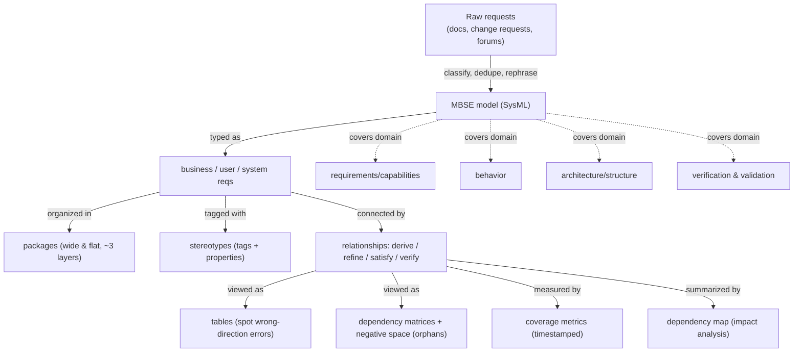

# Requirements in Model-Based Systems Engineering (MBSE) — Fundamentals

## Recall first

Attempt these from memory before reading. Answers are at the bottom under **Answers**.

1. What is the one structural difference between MBSE and document-based systems engineering, and what two benefits does it buy?
2. Name the three main requirement types in MBSE, ordered high-level to detailed.
3. If a *business* requirement appears in a table with a value in its "Derived From" column, what has gone wrong?

## Overview

Traditionally a project starts from **requirements** — an initial description of the problem(s) a future system should solve, arriving as a wishes document, business-analysis output, a change request, or a verbal/sponsor request (source: m2-mbse). Document-based SE scatters those across documents; **MBSE** instead makes a single formal digital model authoritative, supporting requirements, design, analysis, verification, and validation of complex systems (source: m2-mbse). The payoff is that the model can be *queried and analyzed*: it reduces development time and cost, improves the ability to produce secure and correctly functioning software, and — per SEI CERT research — lets security be designed in early rather than bolted on later (source: m2-mbse). This topic is about *using* that model analytically: typing requirements, mapping them to SysML, organizing them, and running tables/matrices/metrics over their relationships to find errors and gaps.

## Detailed explanations

### What MBSE is and why it beats document-based SE

MBSE is a *formalized methodology* — it does not dictate a specific process, but **any MBSE process should cover four systems engineering domains**: requirements/capabilities, behavior, architecture/structure, and verification & validation (source: m2-mbse). This topic addresses the first domain, requirements, which describe the problem(s) to address (source: m2-mbse). Because everything lives in one model rather than disconnected documents, MBSE in a digital-modeling environment provides advantages document-based SE cannot: it saves cost by reducing development time and improves the production of secure, correctly functioning software, which has driven growing adoption (source: m2-mbse). The **SEI CERT Division** has begun researching how MBSE can mitigate security risks early so systems are **secure by design**, in contrast to the common practice of adding security features later (source: m2-mbse).

Before requirements enter the model they need **classification, deduplication, and rephrasing** — you cannot just dump raw requests in (source: m2-mbse).

### The three main requirement types

Many requirement types can be represented, but three are central (source: m2-mbse):

- **Business requirements** — high-level statements of an organization's goals, objectives, or needs; they describe opportunities or problems pertaining to the organization.
- **User requirements** — mid-level statements of a stakeholder (or group's) needs; they describe how someone wants to interact with the solution, sitting midway between business requirements and detailed solution requirements.
- **System requirements** — usually detailed statements of capabilities, behavior, information, conditions, qualities, and constraints. They include **non-functional requirements**, also called quality attributes or **"ilities"** — e.g. security, usability, testability, modifiability (source: m2-mbse).

Predict before reading: which of the three can never be *derived from* another requirement? (The high-level one — see Concept breakdowns.)

### Mapping requirement types to SysML

Unless stated otherwise, MBSE here means **MBSE with SysML**, chosen because its strict syntax and rules for relationships and connections avoid ambiguity (source: m2-mbse). SysML offers a generic **requirement** element plus subclasses: business requirement, usability requirement, functional requirement, performance requirement, interface requirement, physical requirement, and design constraint (source: m2-mbse). There are no strict rules on which to use — you can model everything as generic requirements, use all offered types (and even custom ones), or take a middle course of business requirements + generic requirements with stereotypes + other types as needed (source: m2-mbse). The straightforward mapping (source: m2-mbse):

| MBSE requirement type | SysML representation |
|---|---|
| business requirement | SysML **business requirement** |
| user requirement | SysML **generic requirement** + *user requirement* stereotype |
| system functional requirement | SysML **generic requirement** + *system requirement* stereotype, **or** SysML **functional requirement** subclass |
| system non-functional requirement | SysML **design constraint, usability, performance, interface,** or **physical requirement** |

### Package structure: wide and flat

Requirements analysis includes **categorization** — clustering requirements by functionality, by part of a business process, or by subsystem/component (source: m2-mbse). SysML organizes them with **packages**, folder-like structures holding requirements hierarchically (source: m2-mbse). Packages can have internal structure that relieves complexity, but **structures that are too deep inhibit navigation**: in most cases **three layers should be sufficient**, and if you need more, redesign the structure to be **wider and flatter** (source: m2-mbse).

### Stereotypes as tags

When categorization needs *extra dimensions* the package tree can't express, use the SysML **stereotype** element. It works like a **tag but can have its own properties**, and can be applied to a requirement (source: m2-mbse). The stereotype comes to SysML from UML and is one of three UML extensibility mechanisms (source: m2-mbse). Stereotyped requirements can then be surfaced in views — a table with an "Applied Stereotype" column, or a "Used By" view that finds every place a stereotype appears across the model (source: m2-mbse).

### Telling the traceability story: the requirement diagram

A **requirement diagram** lets the engineer tell a story for each requirement by mapping its **provenance** (source: m2-mbse). For a requirement, the diagram reveals (source: m2-mbse):

- which **version of the system requirements document (SRD)** it was published to stakeholders in,
- whether other requirements were **derived** from it,
- whether it **refines** any use cases,
- whether it has associated **test cases** to be verified,
- which parts of the **solution architecture** it **satisfies**.

(The seven relationship types themselves — derive/refine/satisfy/verify/etc. — are defined in [08-sysml-modeling](../08-sysml-modeling/fundamentals.md); here we use them as analytical data.) For many requirements it can pay to split high-level and system-level requirement diagrams, since one combined diagram can be too busy to read (source: m2-mbse). The right way to say "consider these two objects together" is not to cram them into one diagram but to **create a relationship** between them — once a relationship exists, you can spin up many *views* of it (source: m2-mbse).

### Tables to spot model errors

A **table** view shows attributes and relationships and is valuable for **spotting errors such as a relationship created in the wrong direction** (source: m2-mbse). Example: add "Derived" and "Derived From" columns. Because business requirements are high-level and **cannot be derived from any other requirement, their "Derived From" column should be empty**; a value there is an error the table makes obvious. Symmetrically, a low-level **system requirement can only be derived, so its "Derived" column should be empty** (source: m2-mbse).

### Dependency matrices and negative space

A key model advantage is **dependency matrices** for every relationship type, **automatically updated** whenever the relationship changes (source: m2-mbse). Like tables, they are a verification tool:

- **Verify matrix** — requirements vs. test-case activities (Verify relationship); shows which requirements are verified and which are not (source: m2-mbse).
- **Derive matrix** — shows Derive relationships; a **negative "Derive" matrix** shows requirements with **no** "Derived From" relationship — the **"negative space"** — which helps identify **"orphaned" requirements** such as unmapped business requirements (source: m2-mbse).
- **Satisfy matrix** — shows all Satisfy relationships in scope. All matrices can show relationships in one or both directions, and the negative space (source: m2-mbse).

### Coverage metrics and dependency maps

A **coverage metric** evaluates the current state of the model — e.g. how many requirements are covered by test cases (Verify) or design elements (Satisfy) — and **every metric records a time stamp**, so recomputing it periodically lets you monitor an aspect of the model over time (source: m2-mbse). A **dependency map**, generated for a requirement at the top of a tree, gives a comprehensive view: it shows all relationship types involving that requirement, across multiple levels, and how it relates to other domains (testing, security, documentation, system behavior) — letting you project the impact of a change at the top or middle of the tree (source: m2-mbse).

## Concept breakdowns

**Negative space (matrices).** *Definition (source wording):* a matrix view showing "the requirements that are without the Derive relationship" (source: m2-mbse). *Why it matters:* a normal matrix shows what *exists*; the gaps are easy to overlook. Negative space inverts the view so only the *missing* relationships show, making **orphaned requirements** jump out. *Simplest instance:* a negative Derive matrix listing every requirement with an empty "Derived From." *Common confusion:* negative space ≠ a smaller matrix; it shows the same scope but highlights absence, not presence.

**Wrong-direction relationship.** *Definition:* a relationship created pointing the wrong way (e.g., a business requirement shown as *derived from* a user requirement) (source: m2-mbse). *Why it matters:* the model "compiles" — the relationship is structurally valid — but it violates the **type hierarchy** (business is high-level; system is low-level). *Simplest instance:* Business Requirement with a non-empty "Derived From," or a system requirement with a non-empty "Derived." *Common confusion:* this is a *semantic* error a table/matrix exposes, not a SysML syntax error.

**Stereotype vs. package.** *Definition:* a stereotype is a UML-origin extensibility tag, applied to an element, that can carry its own properties (source: m2-mbse); a package is a folder-like container (source: m2-mbse). *Why it matters:* packages give one primary hierarchy; stereotypes add **orthogonal dimensions** (e.g., "Protocols") without deepening the tree. *Common confusion:* deepening the package tree to express extra dimensions instead of tagging — the source explicitly prefers wide-and-flat packages plus stereotypes.

**Coverage metric vs. matrix.** *Definition:* a matrix is a per-relationship view; a coverage metric is a *timestamped statistic* over relationships (source: m2-mbse). *Why it matters:* a matrix answers "which?", a metric answers "how much, and is it trending up?" *Common confusion:* a single coverage number is a snapshot; its value is in the time series of repeated, timestamped measurements.

## How it fits together (diagram)

The diagram traces one requirement's provenance, the relationship data feeding the analytical tools, and the four MBSE domains those requirements live among.

## Real-world use cases & industry applications

- **Secure-by-design at SEI CERT.** The SEI CERT Division researches MBSE to mitigate security risks early in development so systems are secure by design, rather than adding security features late (source: m2-mbse). The requirement diagram in the source even carries a special **security control** element type (deferred to a future post) (source: m2-mbse).
- **Cost/time reduction driving adoption.** Organizations adopt MBSE because the single digital model reduces development time and cost and improves secure, correct software (source: m2-mbse).
- **Impact analysis via dependency maps.** Generating a top-of-tree dependency map lets teams project the impact of a change across testing, security, documentation, and behavior before making it (source: m2-mbse).

## Best practices

- **Classify, deduplicate, and rephrase requirements before modeling them** — keeps the model clean and unambiguous (source: m2-mbse).
- **Keep package structures wide and flat, ~3 layers max** — deep structures inhibit navigation; redesign wider/flatter if you exceed that (source: m2-mbse).
- **Use stereotypes for extra categorization dimensions** instead of deepening the tree — adds orthogonal tags with properties without hurting navigation (source: m2-mbse).
- **Establish a relationship rather than co-locating elements in a diagram** to say "consider these together" — a relationship can be re-viewed many ways (tables, matrices, maps) (source: m2-mbse).
- **Split high-level and system-level requirement diagrams** when one would be too busy — keeps each diagram readable (source: m2-mbse).
- **Use tables/matrices as verification tools and recompute coverage metrics periodically** — catches wrong-direction errors and orphans and lets you monitor model health over time (source: m2-mbse).

## Common pitfalls

- **Dumping raw requests into the model.** Fix: classify, deduplicate, and rephrase first (source: m2-mbse).
- **Building deep package trees.** They inhibit navigation. Fix: cap at ~3 layers; go wider and flatter; push extra dimensions into stereotypes (source: m2-mbse).
- **Creating a relationship in the wrong direction.** A business requirement should never have a "Derived From"; a system requirement should never have a "Derived." Fix: check the table view — the empty-column rule makes the error obvious (source: m2-mbse).
- **Orphaned requirements going unnoticed.** Fix: use a negative ("Derive") matrix to surface requirements with no Derived From relationship (source: m2-mbse).
- **Cramming all requirements into one diagram.** It becomes too busy to understand. Fix: separate high-level and system-level diagrams (source: m2-mbse).
- **Treating coverage as a one-off number.** Fix: rely on the timestamp — recompute the same metric periodically and watch the trend (source: m2-mbse).

## Frequently asked questions

**Does MBSE force a particular process?** No. MBSE does not dictate a specific process; it only requires that the process cover the four domains (requirements/capabilities, behavior, architecture/structure, V&V) (source: m2-mbse).

**Do I have to use all the SysML requirement subclasses?** No. You may model everything as generic requirements, use every offered type (plus custom ones), or take a middle course mixing business requirements, stereotyped generic requirements, and other types as needed (source: m2-mbse).

**What exactly is an "ility"?** A non-functional requirement / quality attribute the system must have — e.g. security, usability, testability, modifiability (source: m2-mbse).

**Why use a model instead of a requirements document?** The model is queryable: it auto-updates dependency matrices, computes timestamped coverage metrics, and generates dependency maps for impact analysis — analyses a static document can't provide (source: m2-mbse).

**What's a "security control" element?** A special element type the source's requirement diagram includes; the article defers its discussion (and its link to security requirements) to a future post (source: m2-mbse). See [advanced.md](advanced.md).

## References & further reading

- **m2-mbse** — *Requirements in Model-Based Systems Engineering (MBSE)* (SEI CERT blog-style article): the sole source for this topic, covering MBSE advantages, the four domains, requirement types, SysML mapping, packages, stereotypes, traceability diagrams, tables, dependency matrices, negative space, coverage metrics, and dependency maps.
- SysML requirement element and the seven relationships: [08-sysml-modeling](../08-sysml-modeling/fundamentals.md).
- Traceability concepts and requirement management tooling: [07-requirements-management](../07-requirements-management/fundamentals.md).
- Glossary: [references.md#glossary](../../references.md#glossary).

---

## Answers

1. **MBSE makes a single digital model authoritative instead of scattered documents.** Two benefits: it reduces development time/cost and improves the production of secure, correctly functioning software (enabling secure-by-design) (source: m2-mbse).
2. **Business → user → system** (high-level org goals → mid-level stakeholder needs → detailed capabilities/behavior/qualities incl. non-functional "ilities") (source: m2-mbse).
3. A wrong-direction relationship error: business requirements are high-level and **cannot be derived from** any other requirement, so their "Derived From" must be empty (source: m2-mbse).

> Spaced practice beats cramming: revisit these answers after a day, then a week — each retrieval strengthens recall more than re-reading. [OUTSIDE MATERIAL]
