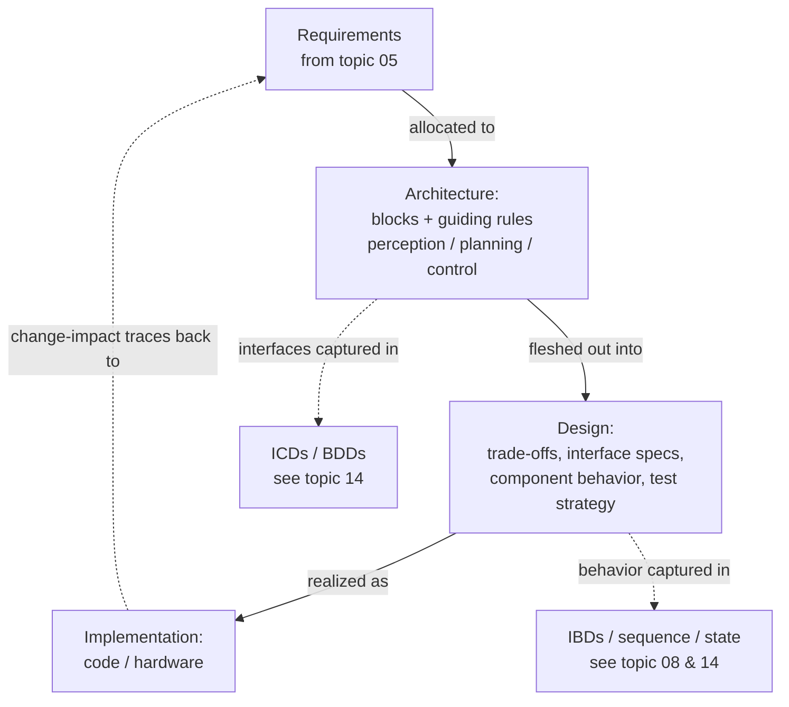

# System Design vs Architecture — Fundamentals

## Recall first

Attempt these from memory before reading (answers at the bottom):

1. In one sentence each, what does *architecture* decide and what does *design* decide?
2. Name the three reasons the course gives for why design and architecture matter.
3. An architectural framework "isn't just about drawing diagrams." What are the five things it actually provides?

## Overview

Architecture and design are the **blueprint phase** of systems engineering: the point where abstract requirements turn into a clear, actionable plan that "unlocks every subsystem, component, and interface" in the solution (source: m3-intro). The mental model is two zoom levels on the same blueprint. **Architecture** is the zoomed-out view — the major building blocks and the rules that hold them together. **Design** is the zoomed-in view — the detailed, implementable choices inside and between those blocks (source: m3-intro). Both exist so that complexity is partitioned before anyone builds anything, and so every decision can be traced back to a requirement and forward to an implementation (source: m3-intro).

## Detailed explanations

### Architecture — the blueprint phase

**System architecture** defines the major **building blocks** (subsystems or components) and their relationships, plus the **guiding rules** — for example {{c1::layered, service-oriented, or event-driven}} styles — that ensure consistency, scalability, and maintainability (source: m3-intro). It explains how components connect, communicate, and exchange data; those interfaces are captured in **Interface Control Documents (ICDs)** or SysML **Block Definition Diagrams (BDDs)**. Architecture provides a shared model so engineers, managers, customers, and suppliers can verify scope, responsibilities, and constraints *before* detailed work begins (source: m3-intro).

> Predict before reading: for an autonomous vehicle, what are the three big blocks? — The architecture defines a **perception** subsystem (sensors, data fusion), a **planning** subsystem (route computation, maneuver logic), and a **control** subsystem (actuators, safety overrides), plus how they exchange timing-sensitive data (source: m3-intro).

The artifacts named here (BDD/ICD) are *owned* by [14-documenting-architecture](../14-documenting-architecture/fundamentals.md); SysML notation is owned by [08-sysml-modeling](../08-sysml-modeling/fundamentals.md). Architecture only *names* them as where interfaces get captured.

### Design — fleshing out the blueprint

**System design** is the process of turning the architectural blueprint into detailed, implementable solutions (source: m3-intro). It does four things:

1. **Technical trade-offs** — evaluating performance, cost, reliability, and schedule to select hardware, software frameworks, and network protocols (source: m3-intro). The *methods* for doing this systematically live in [12-design-tradeoffs](../12-design-tradeoffs/fundamentals.md).
2. **Interface specifications** — pinning down signal definitions, message schemas, data rates, and error handling for every connection (source: m3-intro).
3. **Component definition** — adding the detailed behavior and structure of each subsystem, often captured in SysML **Internal Block Diagrams (IBDs)**, sequence diagrams, or state-machine diagrams (source: m3-intro).
4. **Early test-and-validation strategy** — test points, simulation environments, and acceptance criteria (source: m3-intro).

The classic design-level decision: for the perception subsystem, **choosing LiDAR vs. stereo-vision**, specifying sensor mounting geometry, defining data-processing algorithms, and allocating computational resources (source: m3-intro).

### Architecture vs design — the distinction

Architecture sets the *partitions and rules*; design *fills the partitions with real, testable modules* (source: m3-intro). Same blueprint, different altitude: "the architecture might define a perception subsystem" (block); "design decisions include choosing LiDAR vs. stereo-vision" (detail inside that block) (source: m3-intro). If a decision changes which big blocks exist or how they relate, it is architectural; if it changes only how one block is implemented, it is design.

### Why it matters

- **Clarity & Control:** architecture prevents "big-picture" chaos by partitioning complexity; design turns those partitions into real, testable modules (source: m3-intro).
- **Risk Mitigation:** early architectural decisions expose critical dependencies; detailed design uncovers implementation challenges before coding or fabrication (source: m3-intro).
- **Traceability:** the chain requirements ➔ architecture ➔ design ➔ implementation gives a clear lineage for verification, change-impact analysis, and future upgrades (source: m3-intro).

Investing up front minimizes costly rework, reduces integration risk, and helps the system meet requirements on time and on budget (source: m3-intro).

### What an architectural framework provides

An **architectural framework** is a structured approach for developing, documenting, and governing system architectures. It bundles a methodology (step-by-step processes), a meta-model (standardized concepts and relationships), viewpoints and views, and best practices (checklists, patterns, heuristics) so teams speak a common language, reuse proven patterns, and avoid reinventing the wheel (source: m3-frameworks). Frameworks are used across enterprise architecture (EA), software architecture, systems engineering, and IT governance, keeping architecture aligned with business objectives, technical requirements, and stakeholder needs (source: m3-frameworks).

The five elements (source: m3-frameworks, master-notes §3):

| Element | What it describes | Why it matters |
|---|---|---|
| Architectural Views & Perspectives | Different ways to model the system from various stakeholder standpoints | Ensures coverage of all concerns and system dimensions |
| Architecture Principles & Guidelines | Design rules and best practices | Keeps architecture consistent, future-proof, and aligned with goals |
| Processes & Methodologies | How to build and evolve the architecture | Enables repeatability, governance, and lifecycle integration |
| Stakeholder Concerns & Roles | Who cares about what in the system | Ensures the architecture meets real needs |
| Standards & Best Practices | Industry norms for modeling, security, and integration | Ensures quality, compliance, and interoperability |

- **Stakeholder viewpoints/views:** the framework describes the architecture from multiple perspectives — Business View (goals, processes, value chains), System/Logical View (components, functions, interfaces, data flow), Technical/Infrastructure View (hardware, networks, platforms), Security/Risk View (threats, controls, mitigations), and Operational View (behavior in real scenarios). Each answers different stakeholder questions — business leaders care about ROI and risk, engineers about data flow and latency (source: m3-frameworks).
- **Architecture principles & design guidelines:** **principles** are high-level, stable rules ("Reuse before buy, buy before build", "Data is a shared asset", "Security is everyone's responsibility"); **design guidelines** translate them into actionable rules ("Use RESTful APIs for system communication", "Maintain loose coupling between services", "Follow naming/coding conventions") (source: m3-frameworks).
- **Processes & methodologies:** repeatable methods — lifecycle processes, steps/phases (e.g. TOGAF's **ADM**, Architecture Development Method), deliverables and checkpoints, and governance (source: m3-frameworks). The ADM detail belongs to [11-architecture-frameworks](../11-architecture-frameworks/fundamentals.md).
- **Stakeholder concerns & roles:** the framework names *who* is involved (business owners, users, engineers, operators, regulators) and *what* matters to them (ROI and time-to-market for owners; modularity, reuse, and performance for developers; uptime for operators). It maps concerns to views. **Zachman** is organized around stakeholder roles × system aspects (source: m3-frameworks) — see [11-architecture-frameworks](../11-architecture-frameworks/fundamentals.md).
- **Standards & best practices:** modeling standards (SysML, UML, BPMN), documentation standards like **ISO/IEC 42010** for describing architecture, and interoperability standards for APIs, data formats, and protocols (source: m3-frameworks). Best practices include layered architecture, microservices, DevSecOps, and version-control strategies — reducing vendor lock-in and supporting auditability and scalability (source: m3-frameworks).

## Concept breakdowns

**Architecture vs design (the core confusion).**
*Definition (source wording):* architecture "defines the major building blocks … and their relationships [and] guiding rules"; design "is the process of fleshing out that architectural blueprint into detailed, implementable solutions" (source: m3-intro). *Why it matters:* misclassifying a decision either over-constrains too early (treating a detail as architecture) or leaves a structural gap (treating a load-bearing block as a detail). *Simplest instance:* "perception subsystem exists" = architecture; "perception uses LiDAR" = design (source: m3-intro). *Common confusion:* "design = the trade-off step." Trade-off *evaluation* is a design activity, but its toolkit is a separate topic ([12-design-tradeoffs](../12-design-tradeoffs/fundamentals.md)); here, design is the whole detailing phase, not just one step.

**Viewpoint vs view.**
*Definition:* viewpoints/views are "templates for capturing different stakeholder concerns" — different ways to model the system from various standpoints (source: m3-frameworks). *Why it matters:* one diagram cannot serve a CFO and a network engineer; views let each stakeholder see the slice they care about. *Simplest instance:* the Business View shows ROI and processes; the Technical View shows hardware and networks (source: m3-frameworks). *Common confusion:* treating "views" as just multiple pictures — they are perspective-specific *models* tied to specific concerns (source: m3-frameworks).

**Principles vs guidelines.**
*Definition:* principles are "high-level and stable rules that shape system design"; guidelines "translate principles into actionable rules" (source: m3-frameworks). *Why it matters:* principles rarely change and set direction; guidelines are concrete enough to follow daily. *Simplest instance:* principle "Security is everyone's responsibility" ➔ guideline "Maintain loose coupling between services" (source: m3-frameworks). *Common confusion:* writing a "principle" that is actually a low-level coding rule.

## How it fits together (diagram)

The prose's central claim — traceability from requirements through to implementation, with architecture choosing blocks+rules and design adding the detail — is shown below (source: m3-intro).

## Real-world use cases & industry applications

- **Autonomous vehicles:** architecture splits the system into perception, planning, and control subsystems exchanging timing-sensitive data; design then picks LiDAR vs. stereo-vision and allocates compute for perception (source: m3-intro).
- **Autonomous delivery drones ("Drones For Us"):** a team that jumped straight into development hit drained batteries, an unreliable navigation system, and flaky communication; a structured design-and-architecture approach (clear requirements, modular architecture, SysML diagrams, systematic trade-offs like battery life vs. payload) turned chaos into a working drone and secured investment (source: master-notes §3).
- **Cross-domain:** frameworks apply to enterprise architecture, software architecture, systems engineering, and IT governance (source: m3-frameworks). The course later applies TOGAF to an online banking system [OUTSIDE MATERIAL for this topic — see [11-architecture-frameworks](../11-architecture-frameworks/fundamentals.md)].

## Best practices

- **Decide architecture before detailing design** — partitioning complexity first prevents big-picture chaos and lets design produce real, testable modules (source: m3-intro).
- **Maintain the requirements ➔ architecture ➔ design ➔ implementation lineage** — it buys verification, change-impact analysis, and clean future upgrades (source: m3-intro).
- **Adopt a framework rather than working ad hoc** — teams get a common language, reusable patterns, and a defined roadmap instead of reinventing the wheel (source: m3-frameworks).
- **Map each stakeholder concern to a specific view** — ensures every voice (owner, engineer, operator, regulator) is represented and the architecture meets real needs (source: m3-frameworks).
- **Use industry standards (SysML/UML, ISO/IEC 42010, interoperability standards)** — ensures compatibility, reduces vendor lock-in, supports auditability and scalability (source: m3-frameworks).

## Common pitfalls

- **Skipping the blueprint and coding immediately.** The Drones-For-Us team did exactly this and hit battery, navigation, and communication failures plus a blown deadline (source: master-notes §3). *Fix:* define requirements and a modular architecture first, then evaluate trade-offs before building expensive prototypes.
- **Confusing a design decision for an architectural one (or vice versa).** "Use LiDAR" is design; "have a perception subsystem" is architecture (source: m3-intro). *Fix:* ask "does this change which blocks exist or how they relate?" — if yes, it's architecture.
- **Treating a framework as just diagrams.** It is "about creating a shared language, process, and structure," not drawing pictures (source: m3-frameworks). *Fix:* also pin down principles, processes, concerns/roles, and standards.
- **Writing one document for all stakeholders.** Business leaders and engineers ask different questions (source: m3-frameworks). *Fix:* produce role-specific views.
- **Deferring the test strategy until after implementation.** Design is supposed to create early test-and-validation strategies — test points, simulation environments, acceptance criteria (source: m3-intro). *Fix:* define them during design, not after.

## Frequently asked questions

**Is architecture just "high-level design"?** Loosely yes, but the course draws a working line: architecture = building blocks + guiding rules + interfaces; design = the detailed, implementable solutions inside and between those blocks, plus trade-offs and the test strategy (source: m3-intro).

**Where do BDDs, IBDs, and ICDs belong — architecture or design?** Architecture captures interfaces in ICDs/BDDs; design captures detailed component behavior in IBDs, sequence, and state diagrams (source: m3-intro). The artifacts themselves are detailed in [14-documenting-architecture](../14-documenting-architecture/fundamentals.md).

**What does ISO/IEC 42010 do?** It is the documentation standard for *describing* architecture (and architecture frameworks); frameworks recommend or require it for consistency (source: m3-frameworks).

**Do I have to use a named framework like TOGAF?** Frameworks are optional but valuable: they give a common language, proven patterns, and a roadmap instead of ad hoc work (source: m3-frameworks). The specific ones (TOGAF, Zachman, NIST) are covered in [11-architecture-frameworks](../11-architecture-frameworks/fundamentals.md).

## References & further reading

- `m3-intro` — Introduction to Systems Design and Architecture (blueprint phase; architecture vs design; why it matters; autonomous-vehicle example).
- `m3-frameworks` — Architectural frameworks and design systems (five elements; viewpoints; principles vs guidelines; standards incl. ISO/IEC 42010).
- `master-notes` §3 — Introduction to Systems Design and Architecture + Architectural Frameworks intro (Drones-For-Us narrative).
- Glossary: [../../references.md#glossary](../../references.md#glossary).

---

## Answers

**Recall 1.** Architecture decides the major building blocks (subsystems/components), their relationships, and the guiding rules; design decides the detailed, implementable solutions inside/between those blocks — trade-offs, interface specs, component behavior, and the test strategy (source: m3-intro).

**Recall 2.** Clarity & Control, Risk Mitigation, and Traceability (source: m3-intro).

**Recall 3.** Architectural views & perspectives; architecture principles & guidelines; processes & methodologies; stakeholder concerns & roles; standards & best practices (source: m3-frameworks).

---

> Spaced-repetition nudge: re-test yourself on the architecture-vs-design boundary in ~1 day, then ~1 week — recall decays fastest right after first learning. [OUTSIDE MATERIAL]
