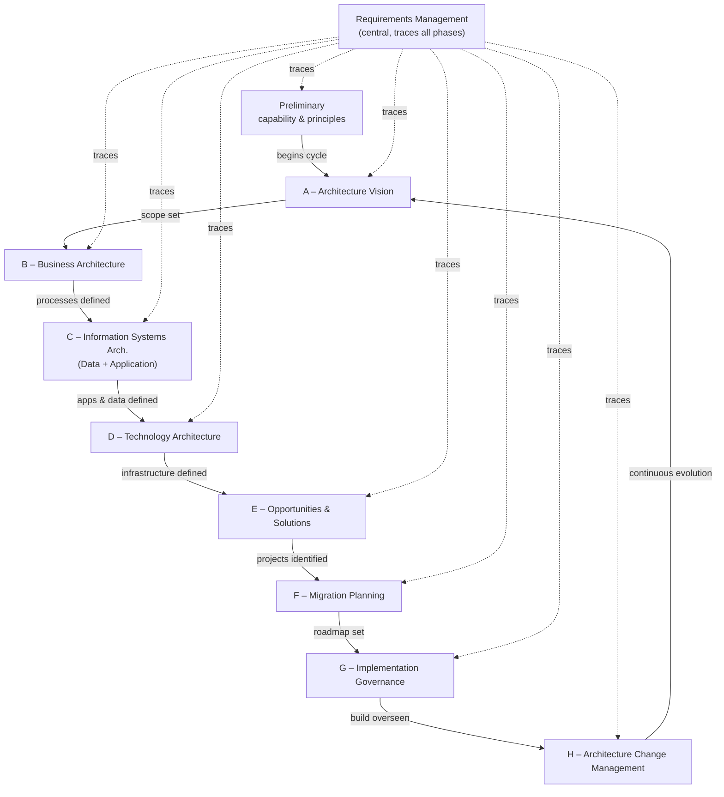

# Architecture Frameworks: TOGAF, Zachman, NIST — Fundamentals

## Recall first

Attempt these from memory before reading; answers are at the bottom.

1. What does TOGAF stand for, and what kind of thing is it — a process, a taxonomy, or a layered model?
2. How many phases does the TOGAF ADM have, and what is the one phase that sits at the centre touching all the others?
3. What are the six interrogatives (columns) of the Zachman Framework, and what aspect does each map to?

## Overview

All three frameworks in this topic answer the same business problem — *how do we develop, document, and govern a large enterprise/system architecture consistently?* — but they answer it in three structurally different ways. **TOGAF gives you a method** (a repeatable phase-by-phase cycle), **Zachman gives you a classification grid** (what to document, from which viewpoint), and **NIST gives you a layered model** (five horizontal slices from business goals to hardware). The general definition of an architectural framework — principles, stakeholder views, standards, methodologies — is established in [10-design-architecture-fundamentals](../10-design-architecture-fundamentals/fundamentals.md); here we instantiate that definition in three named, widely-used frameworks (source: m3-frameworks; master-notes §Architectural Frameworks).

## Detailed explanations

### TOGAF — The Open Group Architecture Framework

**TOGAF** stands for *The Open Group Architecture Framework*. It provides a comprehensive approach for designing, planning, implementing, and governing an enterprise information architecture (source: m3-togaf). Its main purposes are to **align IT with business strategy**, provide a **standardized method** for developing architecture, ensure **consistent decision-making and documentation**, and **support interoperability and change management** (source: m3-togaf). Organizations use it to reduce complexity, improve efficiency, and ensure business–IT alignment in large-scale architectures (source: master-notes §Architectural Frameworks).

The {{c1::ADM (Architecture Development Method)}} is the **heart of TOGAF** — a cyclical, iterative process for developing and evolving architectures (source: m3-togaf). TOGAF's core components are:

| Component | Description |
|---|---|
| **ADM (Architecture Development Method)** | Step-by-step process to develop and manage architectures |
| **Enterprise Continuum** | A model to categorize architectural assets (e.g., industry standards, templates) |
| **Architecture Content Framework** | Defines the artifacts (e.g., diagrams, catalogs) to be produced |
| **TOGAF Reference Models** | Predefined patterns and models, including the TRM and III-RM |
| **Capability Framework** | Guidance on roles, skills, and tools to support architecture development |

(source: m3-togaf)

The ADM iteratively develops four architecture **domains** — Business, Application, Data, and Technology — to create a balanced architecture (source: master-notes §Architectural Frameworks).

### The ADM 9 phases (+ central Requirements Management)

The ADM has **9 phases, labeled from Preliminary to Architecture Change Management**. This count does *not* include **Requirements Management**, which is present in all steps. Each phase answers specific questions and produces specific deliverables (source: m3-togaf).

| Phase | Purpose |
|---|---|
| **Preliminary** | Establish architecture capability and principles |
| **A – Architecture Vision** | Define scope, stakeholders, and high-level vision |
| **B – Business Architecture** | Develop the business process and organizational architecture |
| **C – Information Systems Architecture** | Define Data and Application Architectures |
| **D – Technology Architecture** | Define IT infrastructure and platforms |
| **E – Opportunities & Solutions** | Identify possible projects and transitions |
| **F – Migration Planning** | Plan the roadmap for implementation |
| **G – Implementation Governance** | Oversee realization of architecture |
| **H – Architecture Change Management** | Enable continuous evolution and adaptation |
| **Requirements Management** | Central process ensuring all requirements are traced across all phases |

(source: m3-togaf)

The ADM is **iterative** — each phase can be revisited based on feedback or evolving needs. It supports multiple levels of architecture (enterprise, domain, project) and maintains **traceability** through Requirements Management, which ties all phases together (source: m3-togaf). The deeper feedback-driven revisiting belongs to change management; see [18-change-management-continuous-validation](../18-change-management-continuous-validation/README.md).

### TOGAF artifacts (catalogs, matrices, diagrams)

TOGAF specifies the types of **outputs (artifacts)** for each ADM phase. They document the architecture in a structured, reusable way (source: m3-togaf):

| Artifact type | Examples |
|---|---|
| **Catalogs** | Application Portfolio, Technology Standards, Business Service Catalog |
| **Matrices** | Role-to-Application, Data Entity-to-Business Function |
| **Diagrams** | Business Process Models, Application Communication Diagrams |

(source: m3-togaf). A useful rule: a **catalog** is a *list* of one kind of thing; a **matrix** maps one kind of thing *against another*; a **diagram** shows *structure/flow* visually.

### The Zachman Framework

The **Zachman Framework** is a **taxonomy** for organizing architectural representations based on perspectives (rows) and aspects (columns). It was created by **John Zachman in the 1980s**. It is **not a process or methodology — it is a schema for describing the enterprise** (source: m3-zachman). Instead of focusing on process like TOGAF or layers like NIST, it is a **classification system** that organizes architectural artifacts into a **6×6 matrix** (source: master-notes §Architectural Frameworks).

**Columns = the six interrogatives** (which aspect is being described):

| Column | Aspect | Describes |
|---|---|---|
| **What** | Data | What things the enterprise deals with (data, information) |
| **How** | Function | How the business works (processes, logic, behavior) |
| **Where** | Network | Where the business operates (locations, connectivity) |
| **Who** | People | Who is involved (roles, responsibilities, organizational units) |
| **When** | Time | When things happen (timing, cycles, events) |
| **Why** | Motivation | Why the business operates (goals, strategies, rules) |

(source: m3-zachman)

**Rows = the six perspectives** (whose viewpoint):

| Row | Perspective | Viewer | Description |
|---|---|---|---|
| 1 | **Planner** (Scope) | Executive | High-level scope and strategic context |
| 2 | **Owner** (Business) | Business Management | Business model and operations |
| 3 | **Designer** (System) | Architect | System model – logical representations |
| 4 | **Builder** (Tech) | Engineer/Developer | Technology model – physical design |
| 5 | **Subcontractor** (Tool) | Implementer | Detailed configurations and code |
| 6 | **Functioning System** | User or System | The real, operational system |

(source: m3-zachman)

Each cell contains a model of one aspect of the enterprise from one stakeholder's perspective; together the 36 cells constitute the total set of models needed to describe the enterprise. Combining the cells in **one row** forms a complete view for **one type of stakeholder** (source: master-notes §Architectural Frameworks).

### The NIST EA model

The **NIST Enterprise Architecture (EA) Model** was developed by the **National Institute of Standards and Technology** to provide a structured approach for managing enterprise architectures. It was introduced in **NIST Special Publication 500-167** and heavily influenced other frameworks, notably the **Federal Enterprise Architecture Framework (FEAF)** (source: m3-nist). Its purpose is to standardize how enterprise architecture is described and developed, promote interoperability/integration/efficiency, and address strategic alignment, process improvement, and technology planning (source: m3-nist).

It breaks enterprise architecture into **five interrelated layers**:

| Layer | Description |
|---|---|
| **Business Architecture** | Defines the organization's mission, goals, processes, and organizational structure |
| **Information Architecture** | Describes the kinds of data and information used across the enterprise |
| **Information Systems Architecture** | Defines software applications and how they interact with each other and with data |
| **Data Architecture** | Specifies the data models, storage, access, and flow mechanisms |
| **Technology Infrastructure Architecture** | Describes the physical and virtual hardware, networks, and platforms |

(source: m3-nist)

Each layer is **independent but interconnected**: a change at one layer (e.g., new business processes) may require changes in other layers (e.g., IT systems and infrastructure). This helps organizations manage complexity and align IT investments with business goals (source: m3-nist).

### Comparing the three

The single most important fact about these three is that **they are different *kinds* of artifact** (source: master-notes §Architectural Frameworks; m3-zachman):

| Framework | Type | Organizing idea | Answers |
|---|---|---|---|
| **TOGAF** | Process / method | Phases (the ADM cycle) | *How* do we build and govern the architecture? |
| **Zachman** | Classification taxonomy | 6×6 matrix (interrogatives × perspectives) | *What* must be documented, and *from whose viewpoint*? |
| **NIST EA** | Layered model | 5 horizontal layers | *Which layer* does this concern belong to? |

They are complementary, not mutually exclusive — you can use TOGAF's ADM as the *process* while using a Zachman matrix to check *coverage* of your artifacts.

## Concept breakdowns

**ADM (Architecture Development Method).** *Definition:* the step-by-step, cyclical, iterative process that is the heart of TOGAF (source: m3-togaf). *Why it matters:* it converts the vague goal "do enterprise architecture" into nine concrete phases with named deliverables. *Simplest instance:* Preliminary → A (Vision) → ... → H, with Requirements Management in the middle touching every phase. *Common confusion:* counting Requirements Management as the "10th phase" — it is the *central* process spanning all phases, not a sequential step (source: m3-togaf).

**Requirements Management as the hub.** *Definition:* the central process ensuring all requirements are traced across all phases (source: m3-togaf). *Why it matters:* it gives the cycle traceability — a requirement raised in any phase stays visible everywhere. *Simplest instance:* a security requirement defined in the Preliminary phase is still enforced in Implementation Governance. *Common confusion:* thinking requirements are "done" after Phase A; they flow through every phase.

**Zachman cell = one model, not one document type.** *Definition:* each of the 36 cells is a distinct model of one aspect from one perspective (source: master-notes §Architectural Frameworks). *Why it matters:* it forces *coverage* — every question (column) is answered from every viewpoint (row). *Simplest instance:* the Planner's "What" cell lists entities (Flights, Customers, Tickets); the Builder's "What" cell is database tables (source: m3-zachman). *Common confusion:* reading a column or a row as a "phase" — Zachman has no order or process (source: m3-zachman).

**NIST layers are independent *but* coupled.** *Definition:* five layers, each describing a different aspect, independent yet interconnected (source: m3-nist). *Why it matters:* it predicts ripple effects — a business-process change can force technology-layer changes. *Common confusion:* treating the layers as a one-way top-down sequence; the coupling is bidirectional and change-driven (source: m3-nist).

## How it fits together (diagram)

The TOGAF ADM is a cycle: Preliminary leads into Phase A, the phases run A→H, H feeds back into the cycle, and **Requirements Management** sits at the centre connected to every phase.

(source: m3-togaf)

## Real-world use cases & industry applications

- **Digital/online banking system designed with TOGAF ADM** — performance (< 2 s transactions), reliability (99.99% uptime), security (ISO 27001, PCI DSS), and usability are carried phase-by-phase through the ADM (source: m3-applytogaf; master-notes §Applying TOGAF). Worked in full in [examples.md](examples.md).
- **Smart Campus System** (smart scheduling, IoT energy management, student app, campus Wi-Fi/cloud) planned with the ADM (source: m3-ex-togaf).
- **Airline reservation system** classified with a Zachman "What" column (Flights/Customers/Tickets down to live booking records) (source: m3-zachman).
- **Digital banking system** classified across a full Zachman matrix — every interrogative answered from Planner through User (source: master-notes §Architectural Frameworks).

## Best practices

- **Pick the framework by the question you have.** Need a repeatable build process → TOGAF; need to check documentation coverage across viewpoints → Zachman; need to slice the enterprise into manageable layers → NIST (source: master-notes §Architectural Frameworks). Buys: you stop forcing the wrong tool onto the job.
- **Run Requirements Management continuously, not once.** Keep every requirement traceable across all ADM phases (source: m3-togaf). Buys: changes never silently drop a stakeholder need.
- **Treat the ADM as iterative.** Revisit phases on feedback or evolving needs (source: m3-togaf). Buys: the architecture evolves with the business instead of going stale.
- **Define architecture principles in the Preliminary phase first.** e.g. modularity, interoperability, sustainability for a smart campus (source: m3-ex-togaf). Buys: every later design decision has a yardstick.

## Common pitfalls

- **Confusing the three frameworks' *type*.** TOGAF is a process, Zachman is a taxonomy, NIST is a layered model — they are not interchangeable methods (source: master-notes §Architectural Frameworks; m3-zachman). *Fix:* memorize "process vs taxonomy vs layered model".
- **Confusing Architecture Vision (A) with Business Architecture (B).** Vision is about *buy-in and aligning the effort with business goals* (what we aim to achieve and why); Business Architecture *translates that vision into detailed business needs* (how the business works, what functions must be enabled) (source: m3-ex-togaf). *Fix:* Vision = why/what-for; B = how-the-business-works.
- **Counting Requirements Management as a sequential 10th phase.** It is the *central* process spanning all phases (source: m3-togaf). *Fix:* draw it in the middle, not at the end.
- **Reading a Zachman row or column as an ordered process.** Zachman prescribes no order or method (source: m3-zachman). *Fix:* treat cells as a coverage checklist, not a workflow.
- **Treating NIST layers as a one-way cascade.** Changes propagate in both directions because the layers are interconnected (source: m3-nist). *Fix:* check sibling layers when one changes.

## Frequently asked questions

**Is Requirements Management one of the 9 phases?** No. The ADM has 9 phases (Preliminary, A–H); Requirements Management is a *separate central process* present in all of them (source: m3-togaf).

**What's the difference between TOGAF Phase C "Data Architecture" and the NIST "Data Architecture" layer?** TOGAF folds Data into Phase C (Information Systems Architecture) alongside Application Architecture (source: m3-togaf), while NIST makes Data its own distinct layer separate from Information Systems Architecture (source: m3-nist). Same word, different placement.

**Who created Zachman, and when?** John Zachman, in the 1980s (source: m3-zachman).

**Where did the NIST EA model come from, and what did it influence?** It was introduced in NIST Special Publication 500-167 and heavily influenced FEAF (source: m3-nist).

**Can I use more than one framework at once?** Yes — they answer different questions and are complementary; e.g. use the TOGAF ADM as your process while using a Zachman matrix to verify coverage (source: master-notes §Architectural Frameworks).

## References & further reading

- TOGAF components, ADM 9-phase table, artifact types — `m3-togaf`
- Online-banking ADM worked example — `m3-applytogaf`; master-notes §Applying TOGAF
- Smart Campus ADM exercise + model answer — `m3-ex-togaf`
- Zachman 6×6 matrix, interrogatives, perspectives, airline "What" example, digital-banking matrix — `m3-zachman`; master-notes §Architectural Frameworks
- NIST five layers, SP 500-167, FEAF — `m3-nist`; master-notes §Architectural Frameworks
- General "what a framework provides" — see [10-design-architecture-fundamentals](../10-design-architecture-fundamentals/fundamentals.md)
- Glossary — [../../references.md#glossary](../../references.md#glossary)

---

## Answers

1. **TOGAF = The Open Group Architecture Framework.** It is a **process/method** — its ADM is a step-by-step cyclical process (source: m3-togaf; master-notes §Architectural Frameworks).
2. **9 phases** (Preliminary, A–H). The central phase touching all others is **Requirements Management** (source: m3-togaf).
3. **What→Data, How→Function, Where→Network, Who→People, When→Time, Why→Motivation** (source: m3-zachman).

> Spaced practice beats cramming: revisit these three framework *types* tomorrow, in three days, and in a week — recall decays fastest right after first learning. [OUTSIDE MATERIAL]
