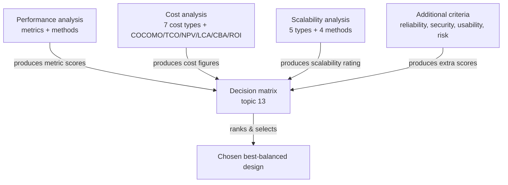

# Evaluating Design Trade-offs: Performance, Cost & Scalability — Fundamentals

## Recall first

Attempt these from memory before reading; answers are at the bottom.

1. Name the three core criteria almost every design trade-off evaluation weighs, and one reason each matters.
2. Write the Basic COCOMO effort formula and say what KLOC stands for.
3. A system handles 10× more users by adding more servers behind a load balancer. Which type of scalability is that?

## Overview

Every engineering decision involves trade-offs: do you prioritize high performance, keep costs low, choose the safest option, or the one that scales better (source: master-notes)? Designing a system is not about picking the "best" option in the abstract — it is about **balancing competing factors** (performance, cost, risk, scalability) to find the right solution for your needs and constraints (source: m3-tradeoffs). The mental model is simple: each candidate design is scored against several criteria, no single design usually wins on all of them, and the engineer's job is to analyze each criterion quantitatively so the eventual choice is data-driven rather than intuitive (source: m3-tradeoffs). The {{c1::three core criteria}} commonly analyzed are **performance**, **cost**, and **scalability**, with reliability, security, usability, or risk added depending on the domain (source: m3-tradeoffs).

## Detailed explanations

### Why trade-offs exist

A high-performance system might be expensive, while a cheaper one might not scale well (source: m3-tradeoffs). Because resources are finite, gains on one axis usually cost something on another — a higher upfront cost might mean lower operational cost later (source: m3-cost). Evaluating trade-offs makes those tensions explicit so you select the **best-balanced** solution for the context rather than the best on any single dimension (source: m3-tradeoffs). The three core criteria and why each matters (source: m3-tradeoffs):

| Criterion | What it measures | Why it matters |
|---|---|---|
| **Performance** | Speed, responsiveness, throughput | Affects user experience and system effectiveness |
| **Cost** | Development, deployment, and maintenance cost | Impacts project feasibility and budget compliance |
| **Scalability** | Ability to handle growth and load increases | Determines long-term sustainability and flexibility |

Additional criteria may include **reliability, security, usability, or risk** depending on the domain (source: m3-tradeoffs).

### Performance analysis — metrics

Performance analysis evaluates how effectively and efficiently a system performs its required tasks, focusing on speed, responsiveness, capacity, and throughput under various loads (source: m3-perf). The common metrics (source: m3-perf):

| Metric | Description | Example |
|---|---|---|
| **Response time** | Time to complete a single task/request | API call returns in 300 ms |
| **Throughput** | Tasks/transactions handled per unit time | 1,000 orders processed per second |
| **Latency** | Delay between input and start of processing | 50 ms delay before streaming starts |
| **Resource utilization** | % of CPU, memory, network in use | CPU at 75%, memory at 60% |
| **Availability** | % of time the system is operational | 99.9% uptime (monthly) |
| **Scalability** | How performance holds up as load increases | Double the users, still responds fast |

The performance-analysis procedure: (1) define scenarios and requirements — what are the use cases, and what thresholds are acceptable (e.g. "response time < 1 s for 95% of requests"); (2) select metrics; (3) simulate realistic loads using tools or prototypes (e.g. JMeter for load testing, New Relic for real-time monitoring) and run baseline, load, and stress tests; (4) analyze bottlenecks — slow components, overloaded resources, poor scaling; (5) compare alternatives, feeding the results into a decision matrix (source: m3-perf).

### Performance analysis — methods

Beyond the procedure, four analysis methods recur (source: master-notes):

- **Benchmarking** — compare the system against industry standards, competitor products, or predefined metrics by running standardized tests and comparing to reference systems (e.g. testing a smart-home security system against competitor models for camera response time, motion-detection accuracy, data-transmission speed) (source: master-notes).
- **Simulation and modeling** — use mathematical/computational models (a "digital twin") to predict behavior under conditions like heavy load or network failure without physical testing (e.g. a traffic-monitoring system simulated in MATLAB for rush-hour surges) (source: master-notes).
- **Load testing** — evaluate performance under expected and peak usage by gradually increasing users/requests, measuring responsiveness, utilization, and failure point (e.g. a smart-home security server load-tested with thousands of simultaneous video feeds) (source: master-notes).
- **Latency vs throughput** — **latency** measures response time (how long to process a request); **throughput** measures capacity (how many requests per unit time). You measure end-to-end response time, analyze throughput under different loads to find limits, and identify latency sources such as network delays or processing bottlenecks (source: master-notes).

### Cost analysis

Cost analysis estimates and evaluates the **total cost of ownership (TCO)** of a system to understand financial impacts, compare alternatives, and make cost-effective choices (source: m3-cost). The seven cost types (source: m3-cost):

| Cost type | Description | Example |
|---|---|---|
| **Development** | One-time costs to design, build, test | Engineering hours, prototyping |
| **Deployment** | Costs to roll out into production | Hardware setup, licensing |
| **Operational** | Recurring costs to run and support | Cloud hosting, support staff |
| **Maintenance** | Costs to fix bugs, patch, update | Scheduled updates, tech support |
| **Training** | Onboarding users and administrators | Workshops, manuals |
| **Decommissioning** | Retiring the system at end of life | Data migration, shutdown tasks |
| **Opportunity** | Value foregone by choosing one alternative over another | Delay in feature release |

The five steps of cost analysis: (1) define scope and timeframe (project vs whole lifecycle; horizon e.g. 5 years); (2) identify cost categories, using a Work Breakdown Structure if needed; (3) estimate each cost from historical data, vendor quotes, benchmarks, or expert judgment (variable costs by usage, e.g. per user or per API call); (4) use a cost model — tabulate costs per alternative, applying **Net Present Value (NPV)** or **TCO** when comparing over time; (5) visualize and compare with charts, factoring trade-offs such as higher upfront cost for lower operational cost later (source: m3-cost). Cost analysis can use simple spreadsheets or estimation software like SEER or COCOMO (source: m3-cost).

Four cost **methods** assess costs across lifecycle stages (source: master-notes):

- **LCA (Life-Cycle Assessment/cost)** — total cost from design to disposal: identify all cost components (development, production, operation, maintenance, decommissioning), estimate over the expected lifespan, and use **discounted cash flow (DCF)** to account for the time value of money (source: master-notes).
- **TCO** — expands LCA to include both **direct** costs (purchase, installation, operational) and **indirect** costs (training, downtime, efficiency losses), helping identify hidden expenses (source: master-notes).
- **CBA (Cost-Benefit Analysis)** — compares expected benefits to costs to decide whether an investment is justified. Identify all costs (initial, recurring, hidden), quantify all benefits (revenue, efficiency gains, risk reduction), then compute **net benefit = total benefits − total costs**; if net benefit > 0 the project is financially viable (source: master-notes).
- **ROI (Return on Investment)** — measures profitability by comparing net gain to cost: **ROI = (net gain from investment − cost of investment) / cost of investment × 100%**; a higher ROI means a better financial return (source: master-notes).

### The COCOMO model

The **Constructive Cost Model (COCOMO)**, proposed by **Barry Boehm in 1981** from a study of 63 projects, is a procedural software cost-estimation model that predicts **effort, cost, time, and quality**, with effort and schedule as its primary outputs (source: m3-cocomo). COCOMO classifies projects into three **types** by complexity, size, and environment (source: m3-cocomo):

| Aspect | Organic | Semi-detached | Embedded |
|---|---|---|---|
| Project size | 2–50 KLOC | 50–300 KLOC | 300+ KLOC |
| Complexity | Low | Medium | High |
| Team experience | Highly experienced; well-understood, previously-solved problem | Mix of experienced and inexperienced | Mixed, includes experts; needs creativity |
| Environment | Flexible, few constraints | Moderately flexible | Rigorous, strict requirements |
| Example | Simple payroll system | New system interfacing with existing systems | Flight-control software |

There are three model levels (source: m3-cocomo):

1. **Basic** — effort as a function of size (**KLOC**) only; rough, because reliability/expertise aren't considered.
2. **Intermediate** — multiplies the basic estimate by an **Effort Adjustment Factor (EAF)** built from 15 cost drivers (reliability, experience, capability, etc.).
3. **Detailed** — applies cost-driver impact phase-by-phase across the software-engineering process, summing module-level estimates for the highest accuracy.

**Basic COCOMO formulas** (corrected from the OCR-garbled source — see Concept breakdowns) (source: m3-cocomo):

```
E      = a · (KLOC)^b      [Effort, in Person-Months]
T_dev  = c · (E)^d         [Development time, in months]
Persons required = Effort / Time
```

Basic-model constants by project type (source: m3-cocomo):

| Project type | a | b | c | d |
|---|---|---|---|---|
| Organic | 2.4 | 1.05 | 2.5 | 0.38 |
| Semi-detached | 3.0 | 1.12 | 2.5 | 0.35 |
| Embedded | 3.6 | 1.20 | 2.5 | 0.32 |

**Advantages**: systematic cost/effort estimation; usable at different stages; identifies high-impact factors; supports feasibility evaluation (source: m3-cocomo). **Disadvantages**: assumes size is the main driver; ignores team-specific characteristics; estimates are rough because they rest on assumptions and averages (source: m3-cocomo).

### Scalability analysis

**Scalability** is the ability of a system to handle increased workload, data, or users without a drop in performance, or with acceptable resource increases — it answers "can this system grow effectively as demand increases?" (source: m3-scalability). It matters because it ensures reliability under growth, prevents costly rework or crashes, supports long-term viability and business expansion, and keeps the user experience smooth at scale (source: m3-scalability). The five **types** (source: m3-scalability):

| Type | Description | Example |
|---|---|---|
| **Vertical** | Add more resources to a single node | Upgrade server CPU/RAM |
| **Horizontal** | Add more nodes to distribute load | Add servers to a load balancer |
| **Data** | Handle more data efficiently | Efficient databases, indexing |
| **Functional** | Add features/modules without affecting others | Plug-and-play architecture |
| **Administrative** | Grow admin/control over more resources/users | Centralized admin for 10,000 users |

Four **methods** to analyze scalability (source: m3-scalability):

- **Capacity planning** — how much workload before performance degrades: measure current usage (CPU, memory, disk I/O, bandwidth), predict future demand from historical data/trends, plan when and how to expand.
- **Elasticity testing** — how well the system scales dynamically up (add resources) and down (release unused resources) with real-time demand: simulate workload spikes, observe how efficiently resources scale, identify scaling delays/limits.
- **Bottleneck analysis** — find performance constraints (CPU overuse, memory exhaustion, database slowdowns): profile to find slow operations, locate where requests pile up, then optimize (slow queries, hardware, algorithms).
- **Modular design** — structure the system into independent components so it scales without overhauling everything: decompose into independent modules, ensure plug-and-play (interchangeable, independently scalable) architecture, design for future expansion.

### Additional criteria

Depending on the domain, evaluations also weigh **reliability, security, usability, and risk** (source: m3-tradeoffs). The decision-matrix categories echo this: performance, cost, risk (technical/financial/security), scalability, and maintainability (source: master-notes). The full multi-criteria ranking method lives in [13-decision-matrix](../13-decision-matrix/fundamentals.md); here we analyze the criteria one at a time so each produces a comparable number.

## Concept breakdowns

**Latency vs throughput.** Definition (source): latency is the *delay between input and start of processing* (a 50 ms wait before streaming begins); throughput is the *number of tasks handled per unit time* (1,000 orders/second) (source: m3-perf). Why it matters: optimizing one can hurt the other — batching raises throughput but adds latency. Simplest instance: a checkout that confirms in 200 ms (low latency) but only 50 orders/second (low throughput). Common confusion: treating them as the same "speed" number — they answer different questions ("how fast for one?" vs "how many at once?") (source: master-notes).

**The Basic COCOMO formula (and the source's garble).** Definition (source): `E = a·(KLOC)^b` person-months; `T_dev = c·(E)^d` months (source: m3-cocomo). Why it matters: it turns a single size estimate into effort and schedule. The common confusion is the source itself: in m3-cocomo the exponents (1.05, 0.38, ...) are OCR-detached from the equations and float on separate lines, the worked example writes `effort = 2.4 × (400) ≈ 1295` with the `^1.05` missing, and it reports **all three** modes' dev-time as "≈ 38 months." The exponents belong on KLOC and E; the equal-looking 38-month figures are a rounding coincidence (organic 38.08, semi-detached 38.45, embedded 37.60 mo), not a real identity — see [examples.md](examples.md) for the clean recomputation.

**TCO vs NPV vs ROI.** TCO sums every cost over the lifecycle, direct and indirect (source: master-notes); NPV discounts future costs to present value so multi-year alternatives compare fairly (source: m3-cost); ROI is a *profitability ratio*, `(net gain − cost)/cost × 100%`, not a total cost (source: master-notes). Confusion: using ROI to compare two cost-only options — ROI needs a *benefit/gain* term, so for pure cost comparison use TCO or NPV.

**Cost type vs cost method.** A cost *type* is a bucket of spending (development, operational, ...) (source: m3-cost); a cost *method* (LCA, TCO, CBA, ROI, COCOMO) is a technique for estimating or comparing those buckets (source: master-notes, m3-cocomo). You enumerate types, then apply a method.

**Vertical vs horizontal scalability.** Vertical = make one node bigger (more CPU/RAM); horizontal = add more nodes behind a load balancer (source: m3-scalability). Confusion: vertical hits a hardware ceiling and a single point of failure; horizontal scales further but needs the workload to be distributable.

## How it fits together (diagram)

The diagram shows how per-criterion analysis (this topic) produces numbers that the decision matrix (topic 13) combines.



## Real-world use cases & industry applications

- **Smart-home security platform — capacity planning**: monitors thousands of cameras; engineers analyze trends to predict when to increase server capacity for growing demand (source: m3-scalability).
- **Cloud traffic-monitoring system — elasticity testing**: must scale up at peak hours and down at night to cut cost; engineers simulate high-traffic events to confirm automatic scaling (source: m3-scalability).
- **Real-time surveillance — bottleneck analysis**: struggles with many video streams; engineers identify database query processing as the bottleneck and optimize indexing (source: m3-scalability).
- **Smart-home automation — modular design**: separates motion-detection, camera-streaming, and alarm modules so new features add without affecting existing ones (source: m3-scalability).
- **Smart-traffic-lights — CBA**: a city compares installation cost against reduced congestion, lower fuel use, and fewer accidents (source: master-notes).
- **AI surveillance cameras — ROI**: a security company computes ROI from fewer false alarms and faster response leading to more contracts (source: master-notes).
- **NASA Space Shuttle software — COCOMO**: NASA estimated time and money using COCOMO, weighing size, complexity, and team experience (source: m3-cocomo).

## Best practices

- Define performance scenarios and acceptance thresholds *before* testing (e.g. "< 1 s for 95% of requests"), so results are pass/fail rather than vague — gives an objective comparison basis (source: m3-perf).
- When comparing alternatives over time, apply NPV or TCO rather than upfront cost alone — captures the higher-upfront/lower-operational trade-off that simple sticker prices hide (source: m3-cost).
- Calibrate COCOMO with historical data from your own past projects — real data reflects project-specific factors, making estimates more reliable (source: m3-cocomo).
- Triangulate COCOMO with expert judgment, analogy, and bottom-up estimation — reduces the bias of any single method (source: m3-cocomo).
- Feed each criterion's number into a [decision matrix](../13-decision-matrix/README.md) rather than judging holistically — keeps the final choice data-driven (source: m3-perf).

## Common pitfalls

- **Optimizing one metric in isolation.** Maximizing throughput by batching can raise latency past the threshold. Fix: hold all defined thresholds simultaneously, not one at a time (source: m3-perf, master-notes).
- **Comparing only upfront cost.** A cheaper build can cost more over its life through maintenance and downtime. Fix: use TCO/LCA over the full lifespan, including indirect costs (source: m3-cost, master-notes).
- **Trusting the COCOMO source's example verbatim.** Its formula lost the exponents and it reports all three modes as exactly 38 months. Fix: apply `E = a·(KLOC)^b` and `T_dev = c·E^d` and recompute — the three dev-times differ (source: m3-cocomo).
- **Treating COCOMO as precise.** It assumes size is the main driver and ignores team specifics; the estimate is rough. Fix: treat it as an approximation and validate against actuals (source: m3-cocomo).
- **Confusing scalability types.** Buying a bigger server is vertical, not horizontal, scaling. Fix: ask "one node bigger" (vertical) vs "more nodes" (horizontal) (source: m3-scalability).
- **Using ROI for a cost-only comparison.** ROI needs a benefit/gain term. Fix: for two cost options use TCO or NPV; reserve ROI for investments with quantifiable returns (source: master-notes).

## Frequently asked questions

**Q: If microservices won the performance comparison, should I always choose them?**
No. The performance table only shows design B (microservices) is better-performing and more scalable; cost, risk, and other criteria still apply, and the final pick comes from balancing all of them in a decision matrix (source: m3-perf, m3-tradeoffs).

**Q: Is KLOC measured in characters or lines?**
KLOC is **K**ilo **L**ines **O**f **C**ode — thousands of lines — and it is the estimated size input to COCOMO (source: m3-cocomo).

**Q: What's the difference between Basic and Intermediate COCOMO?**
Basic uses size alone (`E = a·KLOC^b`); Intermediate multiplies that by an Effort Adjustment Factor from 15 cost drivers (`E = a·KLOC^b·EAF`) to refine the estimate (source: m3-cocomo).

**Q: Does NPV or TCO go inside the cost analysis or replace it?**
They are the *cost model* used in step 4 of the five-step cost analysis when comparing alternatives over time (source: m3-cost).

**Q: Is "scalability" a performance metric or its own criterion?**
Both. It appears as a performance metric ("how performance holds up as load increases") and as one of the three core trade-off criteria, with its own dedicated analysis methods (source: m3-perf, m3-tradeoffs, m3-scalability).

## References & further reading

- Trade-off framing and the three core criteria: m3-tradeoffs; master-notes §"Evaluating Design Tradeoffs".
- Performance metrics, procedure, monolith-vs-microservices comparison: m3-perf; performance methods (benchmarking, simulation, load testing, latency/throughput): master-notes.
- Cost types, 5 steps, TCO/NPV: m3-cost; LCA/TCO/CBA/ROI with formulas: master-notes.
- COCOMO model, project types, formulas, constants: m3-cocomo (Boehm 1981; GeeksforGeeks — OCR-garbled, recomputed here).
- Scalability types and methods: m3-scalability; master-notes.
- Glossary: [references.md#glossary](../../references.md#glossary).

---

## Answers

1. **Performance** (speed/responsiveness/throughput — affects user experience and effectiveness), **cost** (development/deployment/maintenance — affects feasibility and budget), **scalability** (handling growth — affects long-term sustainability and flexibility) (source: m3-tradeoffs).
2. `E = a · (KLOC)^b`, effort in person-months. **KLOC** = Kilo Lines Of Code = thousands of estimated lines of code, the size input (source: m3-cocomo).
3. **Horizontal** scalability — adding more nodes to distribute load behind a load balancer (source: m3-scalability).

> Spaced practice beats cramming: revisit these answers tomorrow, then in three days, then in a week — each successful recall flattens the forgetting curve. [OUTSIDE MATERIAL]
