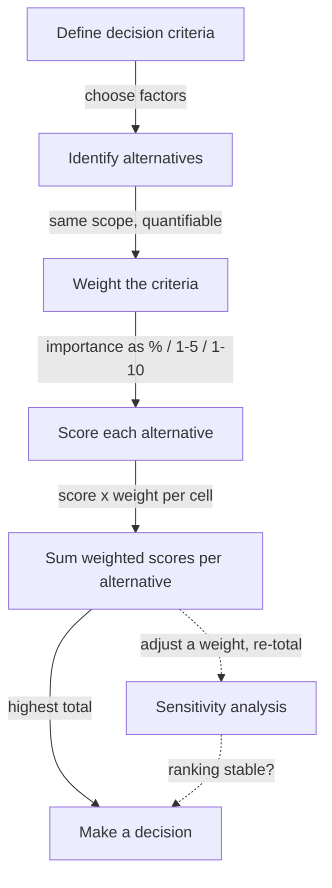

# Decision Matrices: Ranking & Scoring Alternatives — Fundamentals

## Recall first

Attempt these from memory before reading; answers are in the **Answers** section at the bottom.

1. You have three design options and three criteria of differing importance. How do you turn "which is best?" into a single number per option?
2. If two criteria are worth 30% each and one is worth 40%, what must the three weights add up to, and why?
3. What is *sensitivity analysis* in the context of a decision matrix?

## Overview

When you must choose between design alternatives, no single option is best at everything — the fast one costs more, the cheap one scales worse. A **decision matrix** (a.k.a. **weighted scoring model**) solves this by listing your evaluation **criteria**, assigning each a **weight** for its importance, **scoring** every alternative on every criterion, multiplying each score by its weight, and summing those products per alternative. The highest total wins (source: m3-decision). It converts a messy judgment about competing factors into one comparable number per option, so the decision is objective and data-driven instead of a gut call (source: master-notes).

## Detailed explanations

### What a decision matrix is

A decision matrix is a structured method to **objectively compare options** when balancing performance, cost, risk, scalability, and other factors. The course names it two ways: **Decision Matrix** and **Weighted Scoring Model** — same tool (source: m3-decision). It supports tradeoff studies, whose goal is to "select the best possible design given constraints such as budget, technical feasibility, and operational requirements" (source: m3-decision).

The {{c1::decision matrix}} is also called the {{c1::weighted scoring model}}.

### The steps to build one

The course gives a fixed sequence (source: m3-decision; master-notes):

1. **Define decision criteria** — choose the most important evaluation factors. Ask: *What is the most important goal of the selection? Who are the stakeholders and what do they prioritize?* (source: master-notes)
2. **Identify alternatives** — list the design options you're evaluating. They must be *compatible*: the same level of detail and scope, with quantifiable information for every criterion you chose (source: master-notes).
3. **Weight the criteria** — assign an importance weight to each criterion based on priorities (source: m3-decision; master-notes).
4. **Score each alternative** — rate how well each option performs on each criterion, using a chosen scale (source: m3-decision).
5. **Multiply score × weight** — for each cell, multiply the score by the criterion's weight to get the weighted score (source: m3-decision).
6. **Sum and decide** — total the weighted scores for each alternative; the highest total is the recommended choice (source: m3-decision).

The master notes fold a **sensitivity analysis** into the final step: *Analyze sensitivity and make a decision — what if priorities change? Adjust weights and see how rankings shift, then make a choice and ensure the top choice is practical and aligns with project goals* (source: master-notes).

> Predict before reading: if every alternative scored identically on every criterion, would the weights change the winner? (Answer below.)

### Choosing and weighting criteria

The course says decision criteria generally fall into these categories (source: master-notes):

- **Performance** — speed, accuracy, efficiency.
- **Cost** — initial cost, operational cost, life-cycle cost.
- **Risk** — technical, financial, security risk.
- **Scalability** — future growth potential of the choice.
- **Maintainability** — is the choice easy to update or repair?

How you actually *measure* each of these is owned by [12-design-tradeoffs](../12-design-tradeoffs/fundamentals.md) — benchmarking and load testing for performance, life-cycle cost / TCO / [COCOMO](../12-design-tradeoffs/fundamentals.md) for cost, capacity and elasticity testing for scalability. Here you only consume those numbers.

**Weights** can be expressed as percentages, a 1–5 scale, a 1–10 scale, and so on (source: m3-decision). The architecture example uses percentages converted to decimals (0.4, 0.3, 0.3) that **sum to 1.0** (source: m3-decision). You can gather weights from engineers, stakeholders, or surveys (source: master-notes).

### Scoring and weighted totals

You pick a **scoring scale** — 1–10, low/medium/high, or percentage (source: master-notes); the worked examples use a **1–5** scale (source: m3-decision; m3-ex-decision). You assign each score yourself by investigating how well the alternative performs on that criterion (source: m3-decision). Then:

```
weighted score (per cell)        = score × weight
total (per alternative)          = sum of its weighted scores
decision                         = alternative with the highest total
```

For example, on performance (weight 0.4): option A scores 3 → 3 × 0.4 = 1.2; on cost (weight 0.3) option B scores 3 → 3 × 0.3 = 0.9 (source: m3-decision).

### Sensitivity analysis

After computing totals, ask **what if priorities change**: adjust a weight and re-total to see whether the ranking shifts (source: master-notes). A winner that survives reasonable weight changes is a *robust* choice; a winner that flips when one weight nudges is *sensitive* and the team should be sure the weights are right before committing.

## Concept breakdowns

**Weight** — *the importance assigned to each criterion based on priorities* (source: master-notes). Why it matters: without weights, a trivial criterion counts as much as a critical one, so the total wouldn't reflect what the project actually cares about. Simplest instance: performance 0.4, cost 0.3, scalability 0.3 (source: m3-decision). Common confusion: weights vs. scores — a **weight** belongs to a *criterion* (fixed across all alternatives in a row); a **score** belongs to a *cell* (one alternative on one criterion).

**Weighted score** — *the score multiplied by the criterion's weight* (source: m3-decision). Why it matters: it scales each raw judgment by how much it should count. Simplest instance: a 5 on a 0.4-weight criterion contributes 2.0, while the same 5 on a 0.3-weight criterion contributes only 1.5 (source: m3-decision). Common confusion: people compare raw scores across criteria; only the *weighted* scores are comparable across rows.

**Compatible alternatives** — options at *the same level of detail and scope*, each with quantifiable data for every criterion (source: master-notes). Why it matters: scoring is meaningless if one option is a rough sketch and another a detailed spec. Common confusion: assuming any list of options can go in a matrix — if you can't put a number in every cell, the alternative isn't ready.

**Sensitivity analysis** — re-running the totals after changing a weight to see if the ranking moves (source: master-notes). Why it matters: it tells you whether the decision is robust or fragile. Common confusion: it changes *weights*, not the underlying scores.

## How it fits together (diagram)



The prose maps onto this: criteria and weights set up the rows, scores fill the cells, the score × weight products feed the per-alternative sums, and sensitivity analysis loops back to test the decision (source: m3-decision; master-notes).

## Real-world use cases & industry applications

- **Choosing a system architecture** — Centralized vs. Microservices vs. Serverless, scored on performance, cost, scalability (source: m3-decision). See [examples.md](examples.md).
- **Selecting a deployment model for a Smart Campus** — Cloud vs. Hybrid vs. Local Server across six criteria (source: m3-ex-decision).
- **Selecting a drone battery** — comparing battery chemistries (lithium polymer, lithium ion, nickel-metal hydride, nickel cadmium) on size, weight, energy capacity (flight time), and cost (source: master-notes).

## Best practices

- **Make weights sum to a known total (e.g. 1.0).** Buys comparable totals across alternatives, as in the 0.4/0.3/0.3 example (source: m3-decision).
- **Tie each criterion to a stakeholder priority.** Asking "what is the most important goal? who prioritizes what?" keeps weights honest (source: master-notes).
- **Keep alternatives at the same scope with data in every cell.** Buys meaningful, apples-to-apples scoring (source: master-notes).
- **Run a sensitivity analysis before committing.** Buys confidence that the winner isn't an artifact of one shaky weight (source: master-notes).
- **Document why the top choice was selected.** Explaining the tradeoffs behind a decision aids stakeholder communication (source: master-notes).

## Common pitfalls

- **Picking the biggest single number and stopping.** The notes warn: when choosing a drone battery you might just grab the biggest capacity for more flight time, "but it's not that simple" — size, weight, and cost matter too (source: master-notes). Fix: score *all* the criteria, not the one that's easiest to see.
- **Weights that don't sum to a consistent total.** Then totals across alternatives aren't comparable. Fix: normalize so weights sum to 1.0 (or 100%) (source: m3-decision).
- **Confusing weight with score.** A weight is per-criterion (the whole row); a score is per-cell. Fix: fill all weights first, then all scores, then multiply.
- **Incomparable alternatives.** Options at different detail levels or missing data in some cells break the matrix. Fix: ensure all alternatives have quantifiable information for every criterion before scoring (source: master-notes).
- **Treating the total as the final word.** A choice can win on paper yet be impractical. Fix: confirm the top choice is practical and aligns with project goals, and check sensitivity (source: master-notes).

## Frequently asked questions

**Is "decision matrix" the same as "weighted scoring model"?** Yes — the course uses both names for the same tool (source: m3-decision).

**What scale should scores use?** Any consistent one: 1–10, low/medium/high, or percentage; the worked examples use 1–5 (source: master-notes; m3-decision).

**Do weights have to be percentages?** No. You can weight as percentages, 1–5, or 1–10 — whatever expresses relative importance consistently (source: m3-decision).

**Where do the scores come from?** You assign them by investigating how well each alternative performs on each criterion — using engineering data, benchmarks, or stakeholder input (source: m3-decision; master-notes). The measurement techniques live in [12-design-tradeoffs](../12-design-tradeoffs/fundamentals.md).

**What if the winner barely beats the runner-up?** Run a sensitivity analysis: change a weight and see if the ranking holds (source: master-notes).

## References & further reading

- m3-decision — *Ranking and Scoring Design Alternatives* (decision matrix steps + the three-architecture worked example).
- m3-ex-decision — *Exercise: decision matrix* (Smart Campus six-criteria matrix and solution).
- master-notes — *Evaluating Design Tradeoffs* (Section 3): criteria categories, weighting, scoring, the drone-battery example, and sensitivity analysis.
- For *measuring* the criteria themselves: [12-design-tradeoffs](../12-design-tradeoffs/fundamentals.md). For architecture frameworks: [11-architecture-frameworks](../11-architecture-frameworks/fundamentals.md). Glossary: [references.md](../../references.md#glossary).

---

## Answers

1. Build a decision matrix: weight each criterion, score each option per criterion, multiply score × weight, and sum per option — the totals are the single comparable numbers (source: m3-decision).
2. They must add up to 100% (or 1.0 as decimals: 0.4 + 0.3 + 0.3 = 1.0). A fixed total keeps the per-alternative totals on the same scale and therefore comparable (source: m3-decision).
3. Re-running the totals after adjusting a criterion's weight to see whether the ranking shifts — it tests how robust the decision is to a change in priorities (source: master-notes).
- *Predict-before-reading (would weights change the winner if all alternatives scored identically?)*: No — if every alternative has the same scores, every alternative gets the same total no matter the weights; weights only matter when alternatives differ.

> Spaced practice beats cramming: revisit this topic after ~1 day, then ~1 week, re-deriving the architecture totals from memory each time. [OUTSIDE MATERIAL]
