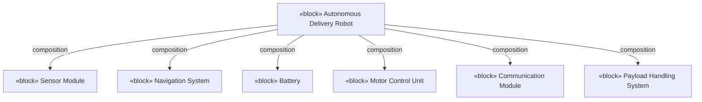

# Documenting System Architecture — Examples

All examples use the course's **Autonomous Delivery Robot (ADR)** system. Code/message blocks are quoted verbatim from the source ICD (spelling corrected) (source: m3-icd).

## Simple example — build the ADR Block Definition Diagram (fully worked)

**Goal:** produce a BDD for the autonomous delivery robot, following the five steps (source: master-notes; source: m3-document).

1. **Identify the system and components** — *reason: a BDD breaks a complex system into hierarchical blocks.* Main system = **Autonomous Delivery Robot**. Components = Sensor Module, Navigation System, Battery, Motor Control Unit, Communication Module, Payload Handling System (six components) (source: master-notes).
2. **Define the blocks** — *reason: each block needs attributes and operations.* The main robot block gets operations `StartDelivery()`, `DeliverPayload()`, `StopDelivery()` and properties delivery speed, battery life, max load capacity (source: master-notes). Component blocks get their own properties, e.g. Sensor Module → LiDAR, Camera, Ultrasonic Sensor; Navigation System → GPS Receiver, IMU (source: master-notes).
3. **Establish relationships** — *reason: the connector encodes the kind of dependency.* All six components are essential parts of the robot, so use **composition** (filled diamond) for each (source: master-notes; source: m3-document).
4. **Add properties** — *reason: properties describe internal characteristics.* e.g. "Battery life: 8 hours" on the robot, "Camera: enabled" on the Sensor Module (source: m3-document).
5. **Use a modeling tool** — *reason: SysML tools give scalable, collaborative diagrams.* Build it in draw.io (saved as `ADR.drawio`) or Cameo (source: master-notes).

**Result (composition tree):**



## Intermediate example — Internal Block Diagram of the Navigation System (completion problem)

Follow the five IBD steps. The first three are done; **you complete steps 4 and 5** (solutions at the bottom).

1. **Choose a block to decompose** — the **Navigation System** block from the ADR BDD (source: m3-document).
2. **Define internal parts** — **GPS Receiver** and **IMU (Inertial Measurement Unit)** (source: m3-document; source: master-notes).
3. **Show connections** — connect the parts and route a signal out to the robot so it knows its location (source: m3-document).
4. **Add ports for interaction** — ❓ *Which port type carries the proximity/obstacle interface, and which carries battery energy in? Place one of each.*
5. **Use a modeling tool** — ❓ *Name a tool you'd use.*

## Advanced example — write an ICD Data Exchange section (mostly blanked)

**Task:** write the *Data Exchange Details* entry for the **Sensor Module → Navigation System** interface of the ADR, given only the strategy hint below. Then check against the source.

*Strategy hint:* an ICD data-exchange entry needs **data format**, a **message example**, and an **update frequency** (source: m3-document; source: m3-icd). Use JSON for obstacle data.

Write your version, then compare with the Solutions section.

## Real-world case study — the Autonomous Delivery Robot ICD

**Situation.** The ADR has six subsystems built by different teams; they must interoperate (Navigation, Sensor, Battery, Motor Control, Communication, Payload Handling) (source: m3-icd). Without an agreed contract, mismatched data formats and protocols cause integration failure.

**Approach.** The team writes an **Interface Control Document, Version 1.0**, covering all six standard sections (source: m3-icd):

**1. Overview / Systems involved** — Navigation System (path planning, movement control); Sensor Module (obstacle/environment detection); Battery System (power); Motor Control Unit (movement/steering); Communication Module (remote monitoring, cloud); Payload Handling System (package load/unload) (source: m3-icd).

**2.1 Physical interfaces** (source: m3-icd):

| Subsystem connection | Type | Connector type | Voltage/Power |
|---|---|---|---|
| Battery → Motor Control Unit | Electrical | XT60 Connector | 24V DC |
| Battery → Sensor Module | Electrical | JST Connector | 5V DC |
| Communication Module → Cloud | Wireless | Wi-Fi/LTE | N/A |

**2.2 Data interfaces** (source: m3-icd):

| Sender | Receiver | Data type | Protocol | Message format |
|---|---|---|---|---|
| Sensor Module | Navigation System | Obstacle Data | I2C | JSON |
| Navigation System | Motor Control Unit | Movement Commands | CAN Bus | Binary |
| Communication Module | Cloud Server | Status Updates | MQTT | JSON |

**3. Data exchange details** — three interfaces, each with format, message, and update frequency (source: m3-icd):

*3.1 Sensor Module → Navigation System* — Format JSON, **10 Hz**:

```json
{
  "obstacle_distance": "1.2m",
  "object_detected": "Yes",
  "sensor_id": "LIDAR_01"
}
```

*3.2 Navigation System → Motor Control Unit* — Format Binary (encoded commands), **100 Hz**:

```
0xA1 0xB2 0xC3 0x01   (Move Forward, Speed 1 m/s)
```

*3.3 Communication Module → Cloud Server* — Format JSON over MQTT, **every 30 seconds**:

```json
{
  "robot_id": "DELROBOT_001",
  "battery_level": "75%",
  "status": "Delivering Package"
}
```

**4. Communication protocols** (source: m3-icd):
- Internal system: **CAN Bus** for real-time commands between Navigation and Motor Control.
- External communication: **Wi-Fi/LTE using MQTT** for cloud updates.
- Error handling: **CRC checks** on CAN Bus messages, **retries** on MQTT communication failures.

**5. System constraints and assumptions** (source: m3-icd):
- Battery voltage remains within 20V–25V.
- Wi-Fi connectivity must be available for cloud updates.
- Sensor data refresh rate does not exceed 10 ms latency.

**6. Version control and change management** (source: m3-icd):

| Version | Date | Description |
|---|---|---|
| 1.0 | [Insert Date] | Initial version |

**Outcome.** Each team codes to the documented contract — the Sensor team emits the exact JSON at 10 Hz, the Motor team decodes the binary CAN frame, the Cloud team subscribes to the MQTT status — so the subsystems integrate cleanly (source: m3-icd).

**Lesson.** A complete ICD (formats + protocols + frequencies + constraints + version control) is what lets independently built subsystems interoperate; omit the update frequencies or constraints and integration breaks (source: m3-document; source: m3-icd).

## Guided walkthrough — the ADR Functional Flow Block Diagram (start to finish)

An FFBD models functional sequencing with **blocks** (steps), **arrows** (control flow/order), and **branches/loops** (conditional/iterative behavior) (source: m3-document). The robot's delivery function is a straight sequence of six steps (source: m3-document):


Reading it: power the drive (Start motors), build situational awareness (Scan Area), move to the drop-off (Navigate), hand over the package (Deliver), come back (Return), and idle until the next job (Stand-by) (source: m3-document). Because the source describes this as a linear flow, no branches/loops are shown; you would add a branch if, for example, "Scan Area" detected an obstacle and looped back to re-plan.

---

## Solutions

**Intermediate example, step 4.** Add a **standard port** for the proximity/obstacle interface (interface-based interaction — e.g., navigation querying LiDAR/proximity sensors) and a **flow port** for battery energy in (exchange of energy) (source: m3-document; source: master-notes).

**Intermediate example, step 5.** Any SysML modeling tool, e.g. **draw.io** or **Cameo** (source: m3-document; source: master-notes).

**Advanced example — model answer (the source ICD §3.1):**
- Data Format: **JSON**
- Message Example:
```json
{
  "obstacle_distance": "1.2m",
  "object_detected": "Yes",
  "sensor_id": "LIDAR_01"
}
```
- Update Frequency: **10 Hz** (source: m3-icd).

Common miss: omitting the update frequency. The data-exchange section explicitly requires timing/synchronization, so the 10 Hz figure is part of a complete answer (source: m3-document; source: m3-icd).
