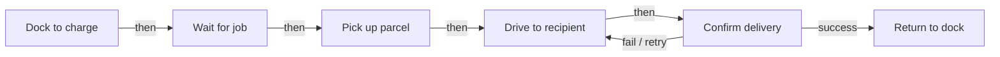

# Documenting System Architecture — Exercises

Attempt each from memory before checking the Solutions at the bottom.

## Warm-up (Tier 1 — production recall)

1. From memory, list the four core architecture artifacts (acronym + one-phrase purpose each).
2. From memory, name the three BDD relationship connectors and the symbol for each.
3. From memory, list the six sections of an ICD in order.
4. From memory, state the difference between a standard port and a flow port.
5. From memory, list the four stakeholder types and what each needs from architecture docs.

## Core exercises (Tier 2 — apply)

**C1 — BDD relationships.** You are documenting a drone. The Frame physically contains the Motor, and the drone *is a kind of* general "Aerial Vehicle". Which BDD connector do you use for (a) Frame–Motor and (b) Drone–Aerial Vehicle? Justify each.

**C2 — IBD five steps (guidance-fading pair, part 1 of 2).** Decompose the ADR **Communication Module** into an IBD. The lecture mentions a WiFi Port connecting to the Cloud Server. Walk through steps 1–3 (choose block → internal parts → connections), naming a plausible internal part and what it connects to. *(This step is scaffolded; part 2 below removes the scaffold.)*

**C3 — IBD five steps (guidance-fading pair, part 2 of 2).** Now, with no scaffold, do steps 4–5 for the Communication Module IBD: add the correct **port** for the cloud link and name the tool. State *why* you chose that port type.

**C4 — Write an ICD section.** Write a complete *Data Exchange Details* entry for the ADR **Navigation System → Motor Control Unit** interface. Include data format, a message example, and update frequency. (Use the source values.)

**C5 — Build an FFBD.** A campus mailroom robot must: dock to charge, wait for a job, pick up a parcel, drive to the recipient, confirm delivery, then return to dock. Draw this as an FFBD (blocks + arrows). Add one branch: if "confirm delivery" fails, loop back to "drive to the recipient".

**C6 — Explain it back (Feynman).** In ~4 sentences, explain to a non-technical project manager what a BDD, an IBD, and an ICD each are and why the project needs all three. *Self-check rubric:* (a) each artifact described in plain language; (b) BDD=structure, IBD=internal interaction, ICD=interface contract clearly distinguished; (c) at least one benefit named (communication / validation / traceability / collaboration); (d) no unexplained jargon.

## Challenge exercises (Tier 3 — analyze/evaluate)

**X1 — Match document to stakeholder (interleaved).** For each request below, first decide *which artifact/view applies* (BDD, IBD, ICD, FFBD, or high-level overview), then *which stakeholder type* it best serves:
- (a) "I need to confirm every requirement is covered by some tested component."
- (b) "I need to know which subsystems exist and who owns each, with delivery dates."
- (c) "My team builds the Motor Control Unit; tell me exactly what bytes the Navigation System will send and how often."
- (d) "I'm pitching this robot to a customer — what does it do for them?"
- (e) "I need to see how the GPS Receiver and IMU are wired inside the Navigation System."

**X2 — Critique an ICD.** A teammate's ICD for the Sensor → Navigation link lists "Data type: Obstacle Data, Protocol: I2C, Format: JSON" but nothing else. Name two sections/details that are missing and why each omission would block integration.

**X3 — Build the map yourself.** Nodes: `Autonomous Delivery Robot`, `Sensor Module`, `Navigation System`, `Battery`, `Motor Control Unit`, `Communication Module`, `Payload Handling System`. Draw the BDD edges (you choose the relationship type and direction) and justify the type you used.

**X4 — Living-document reasoning.** A new requirement says all cloud traffic must be encrypted. Which artifact(s) change, and what specifically do you add to each? Explain why the BDD is called a "living document" here.

---

## Solutions & explanations

**Warm-up 1.** BDD = components + relationships (structure); IBD = internal parts + interactions; ICD = detailed interface definitions; FFBD = function sequencing + control logic (source: m3-review).

**Warm-up 2.** Composition = filled (black) diamond; generalization = hollow triangle arrow; association = plain line (source: master-notes; source: m3-document).

**Warm-up 3.** (1) Overview of the interface, (2) Interface description, (3) Data exchange details, (4) Communication protocols, (5) System constraints and assumptions, (6) Version control and change management (source: m3-document; source: m3-icd).

**Warm-up 4.** Standard port = interface-based interaction (e.g., a service/sensor query); flow port = exchange of material, energy, or data (e.g., battery energy) (source: m3-document; source: master-notes).

**Warm-up 5.** Engineers → technical detail, interfaces, dependencies; Project Managers → component scope, responsibilities, timelines; Customers/Users → high-level views, capabilities, benefits; QA/Test Teams → traceability, functional/physical breakdown (source: m3-document; source: m3-review).

**C1.** (a) Frame–Motor = **composition** (filled diamond): the Motor is an essential whole-part of the Frame/drone — kill the whole and the part goes with it. (b) Drone–Aerial Vehicle = **generalization** (hollow triangle): the drone *is a kind of* aerial vehicle (inheritance/specialization) (source: m3-document; source: master-notes). Common wrong answer: using association (plain line) for Frame–Motor — too weak, since association is a looser "has-a"/"uses" link.

**C2 (steps 1–3).** Step 1: decompose the **Communication Module** block. Step 2: internal parts — e.g., a WiFi radio/module (any plausible part). Step 3: connect it outward to the **Cloud Server** for remote monitoring (source: m3-document).

**C3 (steps 4–5).** Step 4: add a **standard port** (a WiFi Port) for the interface-based link to the Cloud Server — it is an interface interaction, not a flow of material/energy. Step 5: use **draw.io** or **Cameo** (source: m3-document). (If you modeled the link as a data flow you could argue a flow port; the lecture frames the WiFi Port as an interface connection — the key is justifying the choice.)

**C4.** Navigation System → Motor Control Unit: **Data Format: Binary (encoded commands)**; **Message example: `0xA1 0xB2 0xC3 0x01` (Move Forward, Speed 1 m/s)**; **Update Frequency: 100 Hz** (source: m3-icd).

**C5.** A valid FFBD:

Blocks = steps, arrows = control flow/order, and the labeled fail edge from "Confirm delivery" back to "Drive to recipient" is the branch/loop (source: m3-document).

**C6 (model answer).** "A BDD is a picture of the system's building blocks and how they fit together — like an org chart for the machine. An IBD zooms into one block to show how its parts work together inside. An ICD is the written agreement of exactly how two parts talk to each other — the data, format, and timing. We need all three because the BDD keeps everyone agreed on structure, the IBD lets engineers reason about a subsystem, and the ICD lets separate teams build interoperable parts in parallel — together giving us clear communication and traceability" (source: m3-document; source: m3-review).

**X1.** (a) BDD/FFBD traceability view → **QA/Test Teams**; (b) high-level component scope → **Project Managers**; (c) the **ICD** → **Engineers**; (d) high-level overview of capabilities/benefits → **Customers/Users**; (e) **IBD** of the Navigation System → **Engineers** (source: m3-document; source: m3-review). The interleaving trap: (c) and (e) both serve engineers but need *different artifacts* — an ICD (interface contract) vs. an IBD (internal wiring).

**X2.** Missing, among others: **Data exchange details** (no message example, units/ranges, or update frequency — the receiver can't parse or time the data) and **System constraints/assumptions** (no latency/power limits — integration can fail under real-time load). Also no version control. Each omission blocks integration because the other team has no complete contract to build against (source: m3-document; source: m3-icd).

**X3.** All six components are essential parts of the robot, so every edge is **composition** (filled diamond) from `Autonomous Delivery Robot` to each of the six component blocks — the robot is the whole, the six are the parts that cannot exist independently of it (source: master-notes; source: m3-document).

**X4.** Update the **BDD** (add an "encrypted communication" property to the Communication Module), the **ICD** (specify the encryption in the Communication Module → Cloud interface description/protocols and bump the version under change management), and possibly the **IBD** of the Communication Module. The BDD is a "living document" because new requirements/interactions discovered during the IBD/ICD phases routinely add properties, blocks, or connections — refinement is expected, not a failure (source: m3-document).
