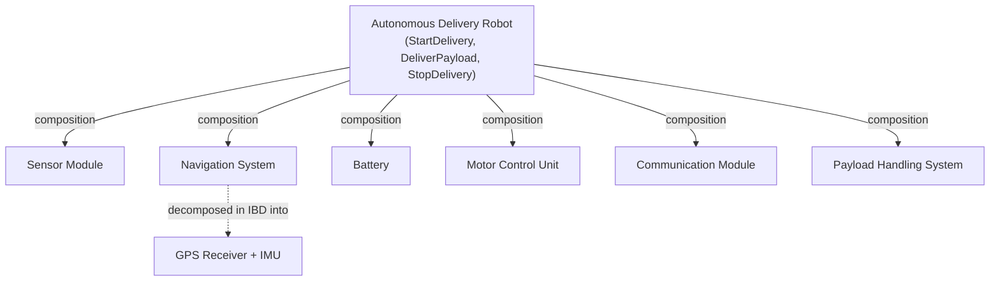

# Documenting System Architecture — Fundamentals

## Recall first

Attempt these from memory before reading; answers are at the bottom.

1. Name the four core architecture artifacts (by acronym) and, in one phrase each, what they capture.
2. A BDD says *what components exist*. What does an IBD add that a BDD does not?
3. Why does a project manager want different architecture documentation than a QA/test engineer?

## Overview

An architecture that lives only in conversations and one engineer's head cannot be verified, handed off, or maintained. **Documenting system architecture** solves this by producing a structured representation of system components, their interactions, and dependencies, so that teams can communicate clearly, validate the design against requirements, trace decisions, and collaborate (source: m3-document; source: m3-review). Four artifacts do most of the work: the **BDD** captures structure, the **IBD** captures internal interactions, the **ICD** captures interface contracts, and the **FFBD** captures functional sequencing (source: m3-review). A well-documented architecture prevents design inconsistencies, supports troubleshooting, and makes future upgrades possible across the system's lifecycle (source: m3-document).

## Detailed explanations

### Why documentation matters

Documentation earns its cost through four payoffs (source: m3-document; source: m3-review):

- **Communication** — a visual, structured representation lets engineers, designers, managers, and stakeholders understand the same system the same way.
- **Validation** — by explicitly stating components and attributes, the documentation lets you check whether the architecture actually meets its design requirements.
- **Traceability** — it links architecture to requirements, interfaces, and design decisions, supporting testing and maintenance.
- **Collaboration** — it gives teams a shared reference for design decisions, system constraints, and interoperability so they can develop in parallel (source: master-notes).

The {{c1::ICD}} in particular lets separate teams build interoperable components in parallel because each side codes to the same documented contract (source: m3-review).

### Block Definition Diagram (BDD) for architecture

A **BDD** gives a clear, structured, hierarchical representation of a system's components, their properties, and their relationships (source: m3-document). It is the artifact you reach for to **define system structure**: it breaks a complex system into hierarchical blocks, clarifies relationships, improves communication, supports validation, and enhances modularity/scalability (source: m3-document).

Its main features (source: m3-document):

| Feature | Description |
|---|---|
| **Blocks** | Represent system elements (e.g., Sensor, Controller) |
| **Associations** | Show relationships (e.g., "has-a", "uses") |
| **Generalization** | Inheritance or specialization among blocks |
| **Value properties** | Quantitative features (mass, capacity) |

Relationships are drawn with distinct connectors (source: master-notes; source: m3-document):

- **Composition** — a filled (black) diamond. A whole-part relationship: if the whole does not exist, neither do these parts.
- **Generalization** — a hollow triangle arrow. Inheritance/specialization.
- **Association** — a plain line. A dependency or interaction such as "has-a"/"uses".

The five steps to create a BDD (source: master-notes):

1. **Identify the system and components** — define the main system, break it into subsystems/components (blocks).
2. **Define the blocks** — give each block attributes (value properties) and operations (behaviors).
3. **Establish relationships** — pick the right connector: filled diamond (composition), hollow triangle (generalization), plain line (association).
4. **Add properties** — add internal variables/components each block has.
5. **Use a modeling tool** — create the diagram in a SysML tool such as draw.io or Cameo.

The BDD is a **living document**. As you refine requirements and learn more about component interactions — especially during the IBD and ICD phases — you may add blocks, properties, or connections. For example, if a future requirement demands encrypted communication, you would update the Communication Module with that property. Refinement is normal: the BDD organizes structure early and gets sharper as you go deeper into design and integration (source: m3-document).

### Internal Block Diagram (IBD) in five steps

While a BDD defines *what* components exist, an **IBD** focuses on *how* they interact internally — the connections between parts, including data flow, signal flow, and physical connections (source: m3-document). Create it in five steps (source: m3-document; source: master-notes):

1. **Choose a block to decompose** — the IBD is built for one specific block from the BDD. (E.g., decompose the Navigation System.)
2. **Define internal parts** — identify the components inside that block. (E.g., the Navigation System has a GPS Receiver and an IMU — Inertial Measurement Unit.)
3. **Show connections between parts** — use connectors (lines) for data flow, signal flow, or physical interaction. (E.g., the Navigation System sends signals to the robot so it knows where it is.)
4. **Add ports for interaction** — two kinds:
   - **Standard port** — represents interactions based on an interface (e.g., navigation using LiDAR/proximity sensors to detect an obstacle).
   - **Flow port** — represents the exchange of material, energy, or data (e.g., the battery module supplying energy to the robot).
5. **Use a modeling tool** — draw.io or Cameo.

### Interface Control Document (ICD) contents

An **ICD** is a formal document that defines and manages the interactions between systems, subsystems, or components: data exchange, communication protocols, electrical and mechanical connections, and any other interface details. It ensures different parts can work together seamlessly by clearly specifying how they interact (source: m3-document). A well-structured ICD typically includes six parts (source: m3-document; source: m3-icd):

1. **Overview of the interface** — purpose, the systems/components involved, a high-level description of interactions.
2. **Interface description** — physical interfaces (connectors, wiring, hardware specs), data interfaces (formats, protocols, message structures), and software interfaces (APIs, function calls, data exchange methods).
3. **Data exchange details** — input/output data, types, units, valid ranges, timing and synchronization requirements.
4. **Communication protocols** — the protocols used (TCP/IP, CAN, UART), message formats (JSON, XML, binary), and error handling/validation mechanisms.
5. **System constraints and assumptions** — power requirements, performance/latency, response time.
6. **Version control and change management** — version history, change tracking, impact assessment.

(See [examples.md](examples.md) for the full autonomous-delivery-robot ICD with its JSON, CAN, and MQTT messages.)

### Functional Flow Block Diagram (FFBD)

An **FFBD** models the sequential functions and control flow of a system. It contains **blocks** (operations/steps the system performs), **arrows** (control flow and order of execution), and **branches/loops** (conditional or iterative behavior). It is used for functional analysis, process modeling, and early-phase design (source: m3-document). The autonomous delivery robot's FFBD runs: Start motors → Scan Area → Navigate to destination → Deliver the payload → Return → Stand-by (source: m3-document).

### Documenting for different stakeholders

Different stakeholders — executives, engineers, regulators, end-users — need different levels of detail, from high-level overviews to technical specifications (source: m3-document). Match the document to the audience (source: m3-document; source: m3-review):

| Stakeholder type | Needs from architecture docs |
|---|---|
| Engineers | Technical detail, interfaces, dependencies |
| Project Managers | Component scope, responsibilities, timelines |
| Customers/Users | High-level views, capabilities, benefits |
| QA/Test Teams | Traceability, functional/physical breakdown |

### Best practices

The five recommendations for communicating architecture to stakeholders (source: m3-document; source: master-notes):

1. **Tailor documentation** — executives/managers prefer high-level overviews, benefits, and key trade-offs; engineers/developers need detailed diagrams, specs, and interface details.
2. **Clear and concise language** — avoid excessive jargon with non-technical stakeholders; use summaries, bullet points, and visuals.
3. **Visual representation** — use BDDs for structural relationships, IBDs for internal interactions, sequence diagrams for message flow, and architecture overviews for layered views.
4. **Traceability** — clearly link architecture to requirements, interfaces, and design decisions; use tools like ReqView or DOORS (see [07-requirements-management](../07-requirements-management/fundamentals.md)).
5. **Justification** — explain *why* decisions were made (e.g., performance vs. cost trade-offs) and include alternatives considered and their impact.

## Concept breakdowns

**BDD vs. IBD — the hardest confusion.** A BDD answers *"what components exist and how are they related?"*; an IBD answers *"how do the parts of one block interact internally?"* (source: m3-document). The simplest test: a BDD of the robot lists Sensor Module, Navigation System, Battery, etc., and connects them with composition diamonds; the IBD of the *Navigation System block* opens it up to show its GPS Receiver and IMU wired together with ports. **Common mistake:** trying to show internal data flow on a BDD, or trying to list every subsystem on a single IBD — each IBD decomposes exactly one block (source: m3-document).

**Composition vs. association vs. generalization.** Composition (filled diamond) is a *whole-part* dependency — kill the whole and the parts die with it. Association (plain line) is a looser "has-a"/"uses" link. Generalization (hollow triangle) is *is-a-kind-of* inheritance (source: master-notes; source: m3-document). **Common confusion:** drawing an association where a composition is meant — composition asserts the part cannot exist independently of the whole, which is a much stronger claim (source: m3-document).

**Standard port vs. flow port.** A standard port carries *interface-based interactions* (service/operation calls — e.g., querying a proximity sensor); a flow port carries *the exchange of material, energy, or data* (e.g., battery energy to the robot) (source: m3-document; source: master-notes). **Common confusion:** using a flow port for what is really an interface call, or vice versa — ask "is something physically/quantitatively flowing, or is one part *invoking* another?"

**ICD vs. the diagrams.** The BDD/IBD/FFBD are SysML diagrams; the ICD is a *formal document* (often a contract between teams). Where an IBD *shows* that two blocks connect, the ICD *specifies* the exact data formats, protocols, update frequencies, and constraints of that connection so the two teams can build to the same agreement (source: m3-document; source: m3-icd; source: m3-review).

## How it fits together (diagram)

The autonomous delivery robot BDD is a composition tree: six components are whole-part children of the robot (source: master-notes; source: m3-document).

The dashed edge shows where the IBD takes over: it opens the Navigation System block to reveal its internal parts and their ports (source: m3-document).

## Real-world use cases & industry applications

The course's worked case is the **Autonomous Delivery Robot** documentation set: a BDD with six components, an IBD decomposing the Navigation System (GPS Receiver + IMU), a full ICD specifying the inter-subsystem interfaces, and an FFBD of the delivery sequence (source: m3-document; source: m3-icd; source: master-notes). More broadly, ICDs are the standard mechanism for coordinating development across teams and organizations — for example, the Boeing 787 program adopted interface control documents to prevent the miscommunications that arose when 70% of components were outsourced to suppliers worldwide (source: master-notes; see [15-integration-strategies](../15-integration-strategies/fundamentals.md)).

## Best practices

- **Treat the BDD as a living document** — refine it through the IBD and ICD phases; this keeps structure, internal flows, and interface contracts consistent as understanding grows (source: m3-document).
- **Use multiple architectural views** (structure, behavior, interface) — one diagram type cannot serve every concern, so a complete picture needs BDD + IBD + FFBD + ICD (source: m3-review).
- **Keep diagrams consistent, complete, and easy to read** — inconsistency between views silently corrupts the shared mental model (source: m3-review).
- **Use SysML modeling environments** (draw.io, Cameo) — they give scalability and collaboration that hand-drawn diagrams cannot (source: m3-review; source: m3-document).

## Common pitfalls

- **Putting internal data flow on a BDD.** Fix: a BDD shows structure and relationships only; move interactions to the IBD of the relevant block (source: m3-document).
- **One IBD for the whole system.** Fix: an IBD decomposes exactly one block; build a separate IBD per block you need to open up (source: m3-document).
- **Drawing association where composition is meant.** Fix: if the part cannot exist without the whole, use the filled diamond, not a plain line (source: m3-document; source: master-notes).
- **Confusing standard and flow ports.** Fix: flow port = material/energy/data flowing; standard port = interface-based interaction (source: m3-document).
- **An ICD that omits update frequency or constraints.** Fix: include data exchange details (timing/synchronization) and system constraints — without them teams cannot integrate reliably (source: m3-icd; source: m3-document).
- **One document for all stakeholders.** Fix: tailor — managers get high-level overviews and trade-offs; engineers get diagrams, specs, and interface details (source: m3-document).
- **Drowning non-technical readers in jargon.** Fix: use summaries, bullet points, and visuals for non-technical audiences (source: m3-document).

## Frequently asked questions

**Is the first BDD final?** No. The diagram "might not be final"; you update or expand it as requirements and component interactions become clearer through the IBD/ICD phases — refinement is normal (source: m3-document).

**Is an ICD a SysML diagram?** No — it is a *formal document* defining and managing interface details (data exchange, protocols, electrical/mechanical connections). The BDD/IBD/FFBD are diagrams; the ICD is the written interface contract (source: m3-document; source: m3-review).

**When do I use an FFBD instead of an IBD?** Use an FFBD to model *functional sequencing and control logic* (the order of operations); use an IBD to model *internal parts and their interactions* (source: m3-review; source: m3-document).

**Why tailor documentation — isn't more detail always better?** No. A customer wants capabilities and benefits, not interface tables; a manager wants scope and timelines; only engineers and QA need full technical/traceability detail. Matching detail to audience is what makes the documentation actually communicate (source: m3-document; source: m3-review).

## References & further reading

- **m3-document** — the full lesson on documenting system architecture (BDD features and 5 steps, IBD 5 steps, ICD contents, FFBD, stakeholder table, best practices).
- **m3-icd** — the complete Autonomous Delivery Robot ICD example (physical/data interfaces, JSON/CAN/MQTT messages, protocols, constraints, version control).
- **m3-review** — Module 3 recap with the BDD/IBD/ICD/FFBD artifact table and stakeholder summary.
- **master-notes** — Section 3 "Document System Architecture": the 5-step BDD creation, the draw.io ADR walkthrough, IBD ports, ICD contents.
- For SysML diagram grammar see [08-sysml-modeling](../08-sysml-modeling/fundamentals.md); for the architecture being documented see [10-design-architecture-fundamentals](../10-design-architecture-fundamentals/fundamentals.md). Full citation list: [references.md](../../references.md#glossary).

---

## Answers

**Recall 1.** BDD (Block Definition Diagram) = system components and their relationships/structure; IBD (Internal Block Diagram) = internal parts and how they interact; ICD (Interface Control Document) = detailed definitions of interfaces; FFBD (Functional Flow Block Diagram) = function sequencing and control logic (source: m3-review).

**Recall 2.** A BDD defines *what* components exist and how they relate (composition/association/generalization); an IBD adds *how the parts interact internally* — data flow, signal flow, and physical connections, with ports (source: m3-document).

**Recall 3.** A project manager needs component scope, responsibilities, and timelines (to plan and track work); a QA/test engineer needs traceability and the functional/physical breakdown (to validate requirements coverage). Each role acts on different information, so each gets a tailored view (source: m3-document; source: m3-review).

---

> Spaced-repetition nudge: re-test yourself on the BDD-vs-IBD distinction and the six ICD sections tomorrow, then in three days — the forgetting curve is steepest in the first 24 hours. [OUTSIDE MATERIAL]
