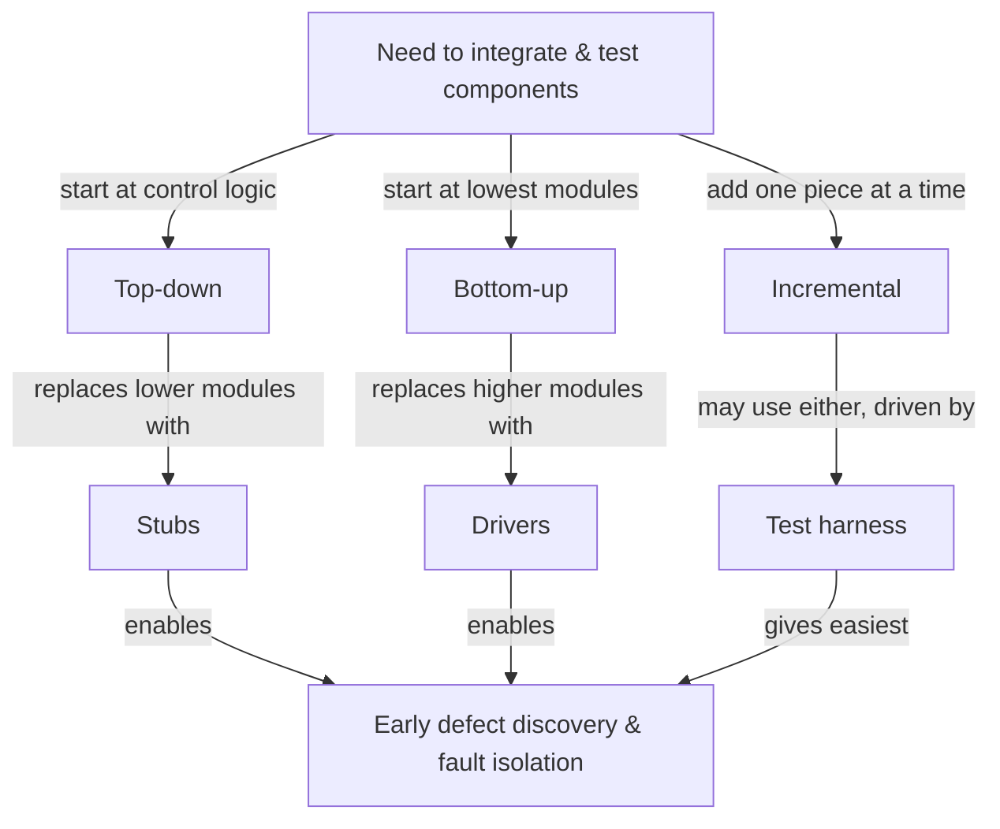

# Integration Strategies & Managing Interfaces — Fundamentals

## Recall first

Attempt these from memory before reading (answers at the bottom):

1. What does an integration strategy actually decide, and what three things does choosing it well buy you?
2. Top-down integration needs *stubs*; bottom-up needs *drivers*. What is the difference between a stub and a driver?
3. Name the four types of dependency between components during integration.

## Overview

After requirements, design, and architecture, the parts of a system still have to be **brought together and tested as a whole** — and the order you do this in is not arbitrary. An **integration strategy defines the order and method in which individual system components or subsystems are combined and tested**; choosing the right one can reduce integration complexity, improve fault isolation, and help identify defects earlier (source: m4-integration). The mental model: integration is risk management. You sequence the assembly so that when something breaks, you know *which* newly added piece broke it (fault isolation), and you fill in not-yet-built neighbours with throwaway placeholders (stubs and drivers) so testing can start before everything is ready (source: m4-integration).

## Detailed explanations

### What an integration strategy is

An integration strategy answers two questions: **in what order** do we combine components, and **by what method** do we test each combination (source: m4-integration). The payoff of a good answer is threefold — lower integration complexity, better **fault isolation** (a defect can be traced to the piece just added), and earlier defect discovery, which is cheaper to fix (source: m4-integration). Even a brilliant design fails if subsystems don't play well together, so integration is the phase where "the rubber meets the road" (source: m4-intro).

### Top-down integration

In **top-down integration**, integration starts from the top-level modules (usually the control or decision logic) and proceeds down to the lower-level modules (source: m4-integration). Because the lower modules don't exist yet when you test the top, you replace them with **stubs** — temporary modules that simulate lower-level behaviour (source: m4-integration). Predict before reading: if you test from the top down, which part of the system gets validated *late*?

| Advantages | Challenges |
|---|---|
| Early testing of high-level logic and control flow | Requires stubs (temporary modules that simulate lower-level behaviour) |
| Useful for validating system architecture early | Lower-level modules are tested later |

(source: m4-integration; source: m4-review)

### Bottom-up integration

In **bottom-up integration**, integration begins with the lowest-level modules (often utility functions or hardware drivers) and proceeds upwards (source: m4-integration). Here the *higher* modules are missing, so you use **drivers** — temporary modules that simulate higher-level behaviour to exercise the lower ones (source: m4-integration). It is the mirror image of top-down: {{c1::no stubs are required, only drivers}} (source: m4-integration).

| Advantages | Challenges |
|---|---|
| Early testing of fundamental building blocks | High-level logic is tested late |
| No stubs required; only drivers (to simulate higher levels) | System-level behaviours aren't visible until late in the process |

(source: m4-integration; source: m4-review)

### Incremental integration

In **incremental integration**, components are integrated and tested one at a time or in small groups, following either a top-down, bottom-up, or functional flow-based order (source: m4-integration). Adding one piece at a time is what makes fault isolation easy — if the build breaks, the suspect is the single module you just added. It needs a **test harness** to drive each increment.

| Advantages | Challenges |
|---|---|
| Easier fault isolation | Requires a well-planned test harness |
| Continuous feedback and reduced rework | Can be time-consuming without automation |
| Combines benefits of both top-down and bottom-up integration | |

(source: m4-integration; source: m4-review)

### Comparing and selecting a strategy

The selection table is the decision tool — read down the column you care about (e.g. "I need easy fault isolation" → incremental):

| Strategy | Testing starts from | Requires stubs | Requires drivers | Fault isolation | Risk level | When to use |
|---|---|---|---|---|---|---|
| Top-down | High-level modules | Yes | No | Moderate | Medium | When validating control logic / architecture early is important |
| Bottom-up | Low-level modules | No | Yes | Moderate | Medium | When infrastructure / utilities are critical |
| Incremental | Any level (by plan) | Maybe | Maybe | Easy | Low | For continuous integration testing |

(source: m4-integration)

### Managing dependencies

A **dependency exists when one component relies on another to function correctly** — a hardware component needing a driver, a service requiring a database, or a module expecting data in a specific format (source: m4-integration). The four types (source: m4-integration):

- **Data dependency** — one module requires data from another.
- **Control dependency** — a module's behaviour depends on another module's control flow.
- **Timing/temporal dependency** — components must execute in a specific order (e.g., initialization before execution).
- **Resource dependency** — multiple components share a resource (e.g., memory, a database).

Management practices: identify and document all critical dependencies in advance; **integrate the components with the most dependencies earlier**; simulate missing components; and define clear assumptions and expectations between modules (source: m4-integration).

### Managing interfaces

An **interface defines how two components interact — the shared boundary for data exchange, control signals, or service calls** (source: m4-integration). The three types (source: m4-integration):

- **Hardware interfaces** — connectors, voltage levels, signal types.
- **Software interfaces** — APIs, data formats, protocols.
- **Human-machine interfaces** — UI elements, displays, controls.

Management practices: define interfaces early in system design (often using **Interface Control Documents / ICDs**); use interface standards where possible to reduce ambiguity; validate interfaces independently before full integration; automate interface testing; and monitor version compatibility during development and updates (source: m4-integration). The full anatomy of an ICD is owned by [14-documenting-architecture](../14-documenting-architecture/fundamentals.md).

### Best practices and tools

| Practice | Description |
|---|---|
| Document dependencies | Use diagrams or tables to show what components rely on others |
| Define clear interface contracts | Specify inputs, outputs, formats, and error handling |
| Use mock components (stubs/drivers) | Allow early testing when real components aren't ready |
| Plan integration order strategically | Integrate components with the most dependencies earlier |
| Automate interface tests | Detect mismatches or failures early through repeatable tests |
| Control configuration versions | Prevent interface mismatches due to unsynchronized updates |

(source: m4-integration)

**Tools:** ReqView, IBM DOORS, Enterprise Architect, Cameo Systems Modeler, and Postman / Swagger for API testing and interface validation (source: m4-integration). **Techniques:** dependency matrices, SysML Internal Block Diagrams (to model data and control between modules — see [08-sysml-modeling](../08-sysml-modeling/README.md)), and automated testing to validate dependencies and interfaces continuously (source: m4-integration).

## Concept breakdowns

**Stub vs. driver** — *Definition (source wording):* a stub is a "temporary module that simulates lower-level behaviour"; a driver simulates higher-level behaviour to exercise lower modules (source: m4-integration). *Why it matters:* it is the single most-confused pair in this topic and it follows mechanically from direction — top-down replaces what's *below* (stubs), bottom-up replaces what's *above* (drivers). *Simplest instance:* testing a UI before the database exists → write a stub that returns canned data. *Common confusion:* swapping the two; remember "stub = down, driver = drive up."

**Fault isolation** — *Definition:* the ease of tracing a defect to the component that caused it (source: m4-integration). *Why it matters:* it drives strategy choice — incremental scores "Easy" because you add one piece at a time (source: m4-integration). *Simplest instance:* a build that passed yesterday fails after adding module X → X is the prime suspect. *Common confusion:* thinking more components integrated at once is faster; big-bang integration destroys fault isolation.

**Dependency vs. interface** — *Definition:* a dependency is a *reliance* of one component on another; an interface is the *shared boundary* through which they interact (source: m4-integration). *Why it matters:* they fail differently — a dependency issue is a missing/incompatible *component*; an interface issue is a mismatched *boundary* (e.g., incompatible data standards). *Simplest instance:* "service needs a database" = dependency; "service and database disagree on the date format" = interface. *Common confusion:* lumping all integration problems together; the Boeing 787 case is deliberately split into both (source: m4-integration).

## How it fits together (diagram)

The three strategies differ only in *where testing starts* and *which placeholder* fills the missing neighbour:

(source: m4-integration)

## Real-world use cases & industry applications

The **Boeing 787 Dreamliner** is the source's worked case: with 70% of components outsourced worldwide, independently designed subsystems produced both dependency issues (incomplete/incompatible deliveries delaying testing) and interface issues (mismatched data communication standards causing avionics integration failures), plus an all-electric power-distribution failure traced to a battery management system that did not communicate properly with other systems (source: m4-integration). Walked end-to-end in [examples.md](examples.md).

## Best practices

- **Integrate the most-dependent components earliest** — surfaces the highest-risk interactions while there is still time to fix them (source: m4-integration).
- **Define interfaces early via ICDs and standards** — reduces ambiguity, the root of the 787 avionics mismatches (source: m4-integration).
- **Validate interfaces independently before full integration** — catches a mismatch at the boundary before it cascades into system-level failures (source: m4-integration).
- **Automate interface tests** — repeatable tests detect mismatches or failures early instead of at final assembly (source: m4-integration).
- **Control configuration versions** — prevents interface mismatches caused by unsynchronized updates (source: m4-integration).

## Common pitfalls

- **Swapping stubs and drivers.** Fix: tie it to direction — top-down → stubs (simulate what's below), bottom-up → drivers (simulate what's above) (source: m4-integration).
- **Leaving system-level behaviour untested until the end** (the structural weakness of bottom-up). Fix: if early system/architecture validation matters, choose top-down instead (source: m4-integration).
- **Big-bang integration with no plan.** Fix: integrate incrementally so a failure points to the one module just added; otherwise fault isolation collapses (source: m4-integration).
- **Treating every integration problem the same.** Fix: separate dependency issues (missing/incompatible *component*) from interface issues (mismatched *boundary*) — they have different remedies (source: m4-integration).
- **Defining interfaces late or informally.** Fix: write ICDs and adopt interface standards up front; the 787's avionics failures came from mismatched communication standards across independently built subsystems (source: m4-integration).

## Frequently asked questions

**Q: Top-down or bottom-up — how do I pick?** Pick top-down when validating control logic/architecture early matters; pick bottom-up when the infrastructure/utilities are the critical, must-work-first part (source: m4-integration).

**Q: When should I just use incremental?** When you want the easiest fault isolation and lowest risk and can invest in a test harness/automation — it combines the benefits of top-down and bottom-up (source: m4-integration).

**Q: Are stubs and drivers the same as mocks?** The source groups them under "mock components (stubs/drivers)" used to allow early testing when real components aren't ready (source: m4-integration).

**Q: Where do I document an interface?** In an Interface Control Document (ICD); its full contents are covered in [14-documenting-architecture](../14-documenting-architecture/fundamentals.md) (source: m4-integration).

## References & further reading

- Primary: **m4-integration** — Integration strategies and techniques (strategies, stubs/drivers, selection table, dependencies, interfaces, best practices, tools, Boeing 787 case).
- Context: **m4-intro** — module overview placing integration before V&V; **m4-review** — condensed pros/cons of each strategy.
- Cross-topic: V&V methods → [16-verification-validation-methods](../16-verification-validation-methods/README.md); ICD detail → [14-documenting-architecture](../14-documenting-architecture/README.md); SysML IBDs → [08-sysml-modeling](../08-sysml-modeling/README.md). Glossary: [references.md#glossary](../../references.md#glossary).

---

## Answers

1. An integration strategy decides **the order and method in which components/subsystems are combined and tested**; choosing well **reduces integration complexity, improves fault isolation, and helps find defects earlier** (source: m4-integration).
2. A **stub** simulates *lower-level* behaviour (used in top-down, where lower modules aren't built yet); a **driver** simulates *higher-level* behaviour (used in bottom-up, where higher modules aren't built yet) (source: m4-integration).
3. **Data, control, timing/temporal, and resource** dependencies (source: m4-integration).

> Spaced practice beats cramming: revisit the strategy-selection table after one day, then one week — recall decays fastest right after first exposure. [OUTSIDE MATERIAL]
