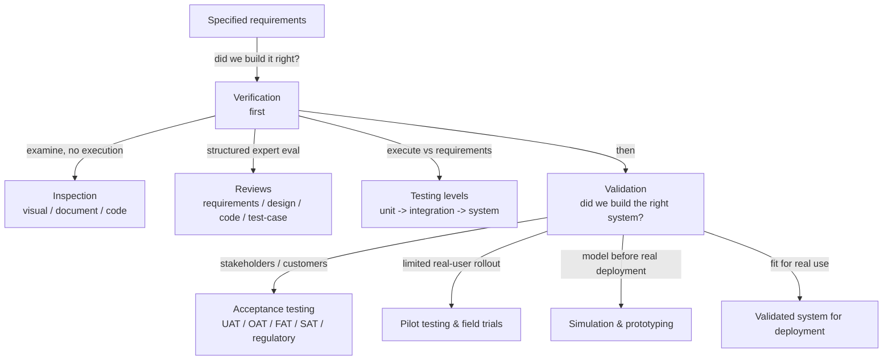

# Verification & Validation Methods — Fundamentals

## Recall first

Attempt these from memory before reading (answers at the bottom):

1. Which question does verification answer, and which does validation answer?
2. Does verification come before or after validation, and why?
3. A hospital lets its nurses try a new patient-management system before go-live to confirm it supports their real workflows. Is that verification or validation, and which named method is it?

## Overview

A system can pass every requirement on paper and still be the wrong system for its users — so two distinct checks are needed (source: m4-vv). **Verification** is the process of ensuring a system or component **meets specified requirements**; it answers *"Did we build the system right?"* (source: m4-vv). **Validation** is the process of ensuring the system **meets user needs, intended use, and stakeholder expectations in a real-world operational environment**; it answers *"Did we build the right system?"* (source: m4-vv). The mental model: verification is done **before** validation — first confirm the product matches the spec (inspections, reviews, testing), then confirm the spec was the right one to build (acceptance testing, pilot testing, simulation) (source: m4-vv). The slogan: verification ensures the system is built *correctly* according to specifications; validation ensures the *right* system was built to fulfil the intended purpose (source: m4-vv).

## Detailed explanations

### Verification vs validation

These are the load-bearing pair for the whole topic. **Verification** checks compliance with the written requirements — "did we build the system right?" — and is performed before validation, using inspections, reviews, and testing (source: m4-vv). **Validation** checks fitness for real use — "did we build the right system?" — confirming the system meets user needs and stakeholder expectations in a real-world operational environment (source: m4-vv). The {{c1::verification}} step asks whether the build matches the spec; the {{c2::validation}} step asks whether the spec was right in the first place.

Note the scope boundary with the earlier requirements topic: verifying a *requirement statement* is well-formed (SMART) is owned by [06-verifying-requirements](../06-verifying-requirements/fundamentals.md). Here, "verification" means checking the *built system* against those requirements.

### Inspections & reviews (verification, no execution)

**Inspection** is a detailed examination of hardware, software, documents, or code to ensure compliance with requirements; its purpose is to **detect defects, inconsistencies, or deviations without execution** (source: m4-vv). The three types (source: m4-vv):

- **Visual inspection** — checking physical components (e.g., PCB layout, structural integrity).
- **Document inspection** — reviewing design documents, requirements specifications, or test plans.
- **Code inspection** — manual review of source code for compliance, structure, and potential bugs.

**Reviews** are a structured evaluation process where experts examine system artifacts to ensure quality and compliance; the purpose is to **identify issues early** by assessing designs, architectures, and documents before full system development (source: m4-vv). The four types (source: m4-vv):

| Review type | What it checks |
| :-- | :-- |
| Requirements review | Clarity, completeness, testability |
| Design review | Architecture, interfaces, maintainability |
| Code review | Logic errors, style violations, potential defects |
| Test case review | Coverage, correctness, traceability |

The one-line distinction to memorize: **inspection detects issues without execution; reviews ensure compliance before implementation; testing verifies performance under real conditions** (source: m4-vv).

### Testing against requirements (the testing levels)

Testing against requirements means **executing a system or component to check it meets defined functional and performance requirements**, verifying expected behavior under various conditions (source: m4-vv). The four levels, smallest scope to largest (source: m4-vv):

- **Unit testing** — verifying individual modules or components.
- **Integration testing** — ensuring subsystems work together correctly.
- **System testing** — evaluating the full system against requirements.
- **Acceptance testing** — validating the system with stakeholders or customers.

Predict before reading: which of those four is really a *validation* activity? **Acceptance testing** — it brings in stakeholders/customers and checks the system against their needs, which is why it reappears below under validation (source: m4-vv). The other three are verification. *This topic names the testing levels; how to write the test cases and plans that drive them lives in [17-test-plans-cases](../17-test-plans-cases/fundamentals.md), and integration-testing strategy lives in [15-integration-strategies](../15-integration-strategies/fundamentals.md).*

### Validation: acceptance testing

**Acceptance testing** evaluates the system in a real-world scenario to confirm it meets the end-user's needs, ensuring it functions as expected before deployment (source: m4-vv). The five named types (source: m4-vv):

| Type | Who / where / what |
| :-- | :-- |
| **UAT** — User Acceptance Testing | Performed by **end-users** to confirm the system meets **business needs** |
| **OAT** — Operational Acceptance Testing | Assesses **performance, security, and maintainability** in the final environment |
| **Regulatory / Compliance Testing** | Ensures the system meets **industry regulations and legal requirements** |
| **FAT** — Factory Acceptance Testing | Performed at the **manufacturer's site before delivery** |
| **SAT** — Site Acceptance Testing | Conducted at the **customer's location after installation** |

The FAT→SAT pairing is the easy confusion: **F**actory = manufacturer's site *before* delivery; **S**ite = customer's site *after* installation (source: m4-vv).

### Pilot testing & field trials (validation)

**Pilot testing** is **deploying the system in a limited environment with real users before full-scale rollout**; it serves to identify usability issues, performance gaps, or unexpected failures (source: m4-vv). Example: a new traffic-monitoring system is installed in **one city district** before expanding citywide to ensure proper functionality (source: m4-vv).

### Simulation & prototyping (validation)

This method **creates a model or prototype to validate system behavior before full deployment**, reducing risk by testing system concepts early (source: m4-vv). Example: NASA validates **Mars rover navigation using high-fidelity simulations** before launching the real system into space (source: m4-vv).

### Validation challenges & best practices

Validation is hard for two reasons (source: m4-vv): user requirements can be **unclear or in constant evolution**, which makes validation difficult because the test methods must change too; and **lab testing — even when simulating real conditions — can still differ from the real world** and miss scenarios. Four best practices counter these (source: m4-vv):

- **Engage users early** — involve stakeholders throughout validation.
- **Test in real environments** — simulate real-world conditions as closely as possible.
- **Use iterative validation** — validate at multiple stages to catch issues early.
- **Document validation criteria** — define pass/fail criteria in advance.

## Concept breakdowns

**Verification vs validation.** *Definition (source wording):* verification ensures a system meets specified requirements ("did we build the system right?"); validation ensures it meets user needs in a real-world environment ("did we build the right system?") (source: m4-vv). *Why it matters:* they catch different failures — verification catches spec non-compliance, validation catches building the wrong thing. *Simplest instance:* crash-testing a car to prove it meets safety requirements is verification (source: m4-vv); letting hospital staff trial the patient system to confirm it fits their workflow is validation (source: m4-vv). *Common confusion:* treating "passes its tests" as proof the system is what users wanted — that's verification only.

**Inspection vs review.** *Definition:* inspection = detailed examination to detect defects **without execution**; review = **structured expert evaluation** of artifacts to ensure quality/compliance before full development (source: m4-vv). *Why it matters:* both are non-execution verification, but inspection targets a single artifact for defects, while a review is a structured group evaluation. *Simplest instance:* a code inspection reads source for bugs; a code review is the structured peer evaluation of that code (source: m4-vv). *Common confusion:* using the two words interchangeably — the source treats inspection as defect-detection and reviews as compliance-before-implementation.

**Acceptance testing as the verification/validation hinge.** *Definition:* the fourth testing level — "validating the system with stakeholders or customers" — and simultaneously the umbrella for UAT/OAT/FAT/SAT/regulatory validation (source: m4-vv). *Why it matters:* it is where the testing levels (a verification ladder) cross into validation. *Simplest instance:* UAT by end-users confirming business needs (source: m4-vv). *Common confusion:* listing acceptance testing only as a testing level and forgetting it is the entry point to validation.

**FAT vs SAT.** *Definition:* FAT = Factory Acceptance Testing at the manufacturer's site **before delivery**; SAT = Site Acceptance Testing at the customer's location **after installation** (source: m4-vv). *Why it matters:* they bracket delivery and installation, catching different problems (build defects vs install/environment defects). *Common confusion:* swapping which one is "before" vs "after" — anchor on the first letter: **F**actory-first, then **S**ite.

## How it fits together (diagram)

The diagram shows verification (no-execution inspection/review plus the execution-based testing levels) completing **before** validation, and validation drawing on acceptance testing, pilot testing, and simulation to confirm fitness for real use (source: m4-vv).

## Real-world use cases & industry applications

- **Automotive engineering** — manufacturers perform **crash tests** to verify compliance with safety requirements (verification) (source: m4-vv).
- **Healthcare** — before deploying a new **patient-management system**, hospitals conduct **UAT** so staff confirm it supports real-world workflows (validation) (source: m4-vv).
- **Smart cities / traffic** — a new **traffic-monitoring system** is piloted in one city district before citywide rollout (pilot testing) (source: m4-vv).
- **Aerospace** — **NASA validates Mars rover navigation** with high-fidelity simulations before launch (simulation/prototyping) (source: m4-vv).

## Best practices

- **Engage users early** — involve stakeholders throughout validation; buys requirements that stay aligned even as they evolve (source: m4-vv).
- **Test in real environments** — simulate real-world conditions as closely as possible; buys protection against the lab-vs-real-world gap (source: m4-vv).
- **Use iterative validation** — validate at multiple stages; buys early detection so issues are caught when cheap to fix (source: m4-vv).
- **Document validation criteria** — define pass/fail criteria in advance; buys an objective, agreed bar so "validated" is not a matter of opinion (source: m4-vv).
- **Do verification before validation** — confirm the build matches the spec before asking real users to judge fitness; buys clean signal (a validation failure isn't masked by an unverified build) (source: m4-vv).

## Common pitfalls

- **Confusing verification with validation** — a system can pass verification yet be the wrong system. *Fix:* always ask both questions — "right system?" *and* "built right?" (source: m4-vv).
- **Validating before verifying** — running user/acceptance validation on a build that hasn't met spec wastes the trial. *Fix:* verification first, then validation (source: m4-vv).
- **Trusting the lab** — lab testing can still differ from the real world and miss scenarios. *Fix:* test in real environments and pilot with real users before full rollout (source: m4-vv).
- **Frozen view of requirements** — user requirements can be unclear or constantly evolving, so static test methods drift out of date. *Fix:* use iterative validation and re-engage users (source: m4-vv).
- **Undefined pass/fail** — validating with no agreed criteria turns "done" into an argument. *Fix:* document validation criteria (pass/fail) in advance (source: m4-vv).
- **Mixing up FAT and SAT** — *Fix:* Factory (manufacturer, before delivery) then Site (customer, after installation) (source: m4-vv).

## Frequently asked questions

**Is acceptance testing verification or validation?** It is the fourth testing *level* (a verification ladder) but its purpose — validating the system with stakeholders/customers and confirming it meets end-user needs — makes it the entry to **validation** (source: m4-vv).

**Inspection or review — what's the real difference?** Inspection is a detailed examination that detects defects without executing the system; a review is a structured expert evaluation to ensure compliance before implementation (source: m4-vv).

**When do I use simulation instead of a pilot?** Use **simulation/prototyping** to validate behavior *before* a real deployment exists (e.g., NASA's rover before launch); use a **pilot** to validate with real users in a *limited live deployment* before full rollout (source: m4-vv).

**Why must verification come before validation?** So you first prove the build complies with the spec, then prove the spec was right — otherwise a failed validation could just be an unverified build (source: m4-vv).

**Where do I learn to actually write the test cases?** The testing levels are named here; writing test cases and plans is owned by [17-test-plans-cases](../17-test-plans-cases/fundamentals.md) (source: m4-vv, m4-review).

## References & further reading

- m4-vv — *System Integration, Verification, and Validation - Verification and validation methods* (verification/validation definitions, inspection/review types, testing levels, acceptance testing UAT/OAT/FAT/SAT/regulatory, pilot, simulation, challenges, best practices, all examples).
- m4-review — *System Integration, Verification, and Validation - Lesson review* (V&V recap: verification/validation questions, inspection/reviews/requirement-based testing, UAT/prototypes/field testing).
- Cross-topics: requirement-statement verification [06-verifying-requirements](../06-verifying-requirements/README.md); integration testing strategy [15-integration-strategies](../15-integration-strategies/README.md); writing test plans/cases [17-test-plans-cases](../17-test-plans-cases/README.md); continuous validation in Agile [18-change-management-continuous-validation](../18-change-management-continuous-validation/README.md).
- Glossary: [../../references.md](../../references.md).

---

## Answers

1. **Verification** answers *"Did we build the system right?"* (meets specified requirements); **validation** answers *"Did we build the right system?"* (meets user needs/intended use in a real-world environment) (source: m4-vv).
2. **Verification comes before validation** — first confirm the build complies with the spec (inspections, reviews, testing), then confirm with users that it is the right system; otherwise a validation failure could simply be an unverified build (source: m4-vv).
3. **Validation** — specifically **User Acceptance Testing (UAT)**, performed by end-users to confirm the system meets business needs (the source's own healthcare patient-management example) (source: m4-vv).

---

> Forgetting-curve nudge: revisit this page within 24 hours, then again in ~3 days and ~1 week — re-attempt the Recall-first questions before re-reading. [OUTSIDE MATERIAL]
