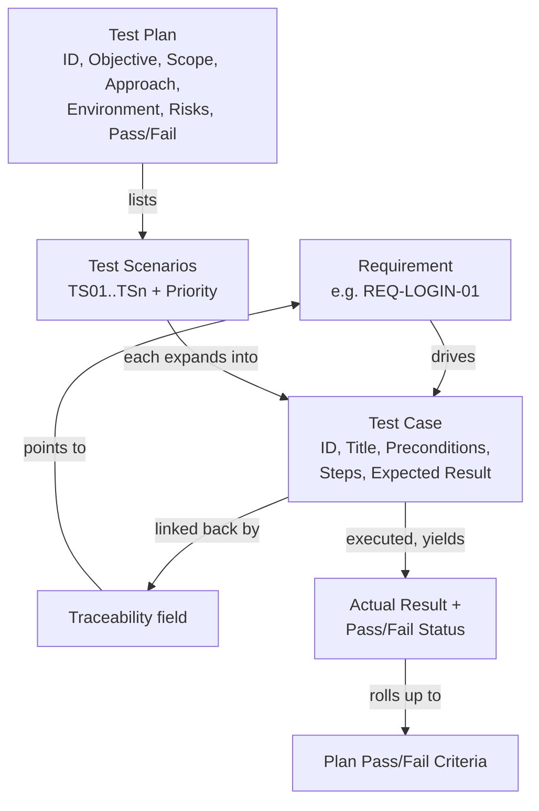

# Writing Test Cases & Test Plans — Fundamentals

## Recall first

Attempt these from memory before reading (answers at the bottom):

1. Name the fields a test case usually includes *before* execution, and the two that are filled in *after*.
2. What is the difference between a test case and a test plan?
3. A test case's instructions depend on the result of a previous test case. Which quality does that violate?

## Overview

A **test case** answers "does this one behaviour work?" and a **test plan** answers "how will we test this whole feature, and how do we decide it passed?". A well-structured test plan plus effective test cases ensure a system is thoroughly verified and validated against requirements; the process helps identify defects, ensure compliance, and confirm the system meets both technical and user expectations (source: m4-testplans). The mental model: a **requirement** drives one or more **test cases**, and a **test plan** bundles the scenarios, environment, risks, and pass/fail rule that govern executing them (source: m4-testplans).

## Detailed explanations

### Anatomy of a test case

A **test case** is a set of conditions or inputs designed to verify whether a system behaves as expected. Each test case usually includes (source: m4-testplans):

- **Test Case ID** — a unique identifier (e.g., TC_01, TC_02).
- **Test Description** (Title) — briefly describes what is being tested.
- **Preconditions** — any requirements or setup needed before execution (e.g., user must be logged in).
- **Test Steps** — step-by-step instructions for execution.
- **Expected Result** — the anticipated outcome if the system functions correctly.
- **Traceability** *(optional)* — a link to the requirement that the test is testing.
- **Priority** *(optional)* — an indicator of the importance of the test.

After execution the test case also includes (source: m4-testplans):

- **Actual Result** — the observed system behaviour after execution.
- **Pass/Fail Status** — whether the test case passed or failed.

The {{c1::Expected Result}} is the overall result after finishing all the steps and is basically the pass/fail criteria for the case; individual steps can each carry their own expected result so the tester knows whether to proceed to the next step (source: m4-testplans).

**Qualities of a good test case** (source: m4-testplans): test cases should be **simple and clear** (instructions precise), **independent** (must not depend on the results of another test case), and **relevant** to actual use cases — including both expected and *not-expected* behaviours.

### Anatomy of a test plan

A **test plan** is a detailed document outlining the overall approach to testing, including scope, objectives, schedule, and responsibilities. A test plan should include (source: m4-testplans):

- **Test Plan ID** — unique identifier for tracking.
- **Objective** — what the test aims to achieve (e.g., validate system performance).
- **Scope** — what features, modules, and integrations will be tested.
- **Test Approach** — methods and techniques used (e.g., manual, automated).
- **Test Environment** — hardware, software, network configurations needed.
- **Test Scenarios** — which tests are going to be executed.
- **Risk Assessment** — potential risks and mitigation strategies.
- **Pass/Fail Criteria** — how success or failure will be determined.

The *Test Approach* field is where you select among the V&V methods catalogued in [16-verification-validation-methods](../16-verification-validation-methods/fundamentals.md) — manual, automated, security, load (source: m4-testplans).

### How scenarios relate to cases

In a test plan the **scenarios are just a list of tests that need to be executed in order for the test plan to pass** (source: m4-testplans). Each scenario (e.g., TS01 "Successful login with valid email and password") is the seed for a full test case; the plan lists them with priorities, while each case spells out steps and expected results.

### Tooling

There are many test-management system tools for creating and managing test plans and test cases (source: m4-testplans). The course examples use **Testomat**, a test-management tool where you create a project, a test suite, and individual test cases from a Description / Prerequisite / Steps+Expected / Expected-result template (source: m4-testplans; source: m4-ex-testcase).

## Concept breakdowns

**Expected Result vs Pass/Fail Criteria.** *Definition (source wording):* the Expected Result "is the overall result after finishing all the steps and is basically the pass/fail criteria" (source: m4-testplans). *Why it matters:* it is the single line that converts observation into a verdict. *Simplest instance:* "User is redirected to /dashboard." *Common confusion:* learners write a vague Expected Result ("login works"), which leaves Pass/Fail to the tester's judgement. State the observable outcome.

**Traceability.** *Definition:* an optional field linking the test to the requirement it tests (source: m4-testplans). *Why it matters:* it proves every requirement is covered and lets you find affected tests when a requirement changes. *Simplest instance:* `REQ-LOGIN-01`. *Common confusion:* treating it as optional paperwork — it is the bridge from [verifying requirements](../06-verifying-requirements/fundamentals.md) to executed tests.

**Independence.** *Definition:* instructions "should be precise and not depend on the results of another test case" (source: m4-testplans). *Why it matters:* a dependent case fails or is skipped whenever its predecessor fails, hiding real defects and breaking parallel execution. *Common confusion:* chaining "use the cart from TC_05" — instead, re-establish state in Preconditions.

**Risk Assessment in a plan.** *Definition:* potential risks and mitigation strategies (source: m4-testplans). *Why it matters:* it surfaces what could make testing unreliable (e.g., environment data not matching production) so you mitigate before, not after. *Simplest instance:* Risk: brittle automated scripts → Mitigation: resilient selectors maintained alongside UI updates (source: m4-testplans).

## How it fits together (diagram)

The plan owns scenarios and the overall pass/fail rule; each scenario expands into a fully specified test case; execution produces Actual Results that roll up against the plan's criteria (source: m4-testplans).

## Real-world use cases & industry applications

- **Web login verification.** The source's worked example tests that a registered user can log in with valid credentials (TC_LOGIN_01) and bundles eight scenarios — valid login, invalid password, invalid email format, blank fields, account lockout, SQL injection, XSS, and the Forgot-Password link — into the TP_LOGIN plan (source: m4-testplans).
- **E-commerce shopping cart.** The exercise validates that clicking "Add to Cart" on www.thebeststore.com adds the item correctly and the cart updates accordingly, authored as test case CART_001 in Testomat (source: m4-ex-testcase).

## Best practices

When creating a test plan (source: m4-testplans):

- **Align with project goals** — ensure testing aligns with business and technical objectives, so effort tracks what matters.
- **Prioritise test coverage** — focus on high-risk and critical system functions first, so the most damaging defects surface earliest.
- **Include both functional and non-functional testing** — test usability, performance, and security, so the system is judged on more than feature correctness.
- **Define entry and exit criteria** — specify when testing starts and ends, so "done" is unambiguous.
- **Automate where possible** — use test-automation tools for efficiency, so repetitive and boundary cases run cheaply and repeatedly.

For test cases: keep them simple, clear, independent, and relevant, covering both expected and not-expected behaviours, which keeps results trustworthy and re-runnable (source: m4-testplans).

## Common pitfalls

- **Vague Expected Result.** "It should work" gives no pass/fail line. *Fix:* state the observable outcome (redirect URL, exact message) (source: m4-testplans).
- **Dependent test cases.** Steps that rely on a previous case's output break independence. *Fix:* re-establish all needed state in Preconditions (source: m4-testplans).
- **Only happy-path coverage.** Testing only success misses error handling. *Fix:* include not-expected behaviours — invalid inputs, lockout, injection (source: m4-testplans).
- **No traceability.** Cases not linked to requirements leave coverage unprovable. *Fix:* fill the Traceability field with the requirement ID (source: m4-testplans).
- **Skipping non-functional checks.** A plan covering only functionality ignores security and load. *Fix:* add security and load approaches as TP_LOGIN does (source: m4-testplans).

## Frequently asked questions

**Are Traceability and Priority required?** No — both are optional, but they help by linking to requirements and letting you filter tests by priority (source: m4-testplans).

**Where does the pass/fail decision live — case or plan?** Both. A case's Expected Result is its pass/fail criteria; the plan has its own Pass/Fail Criteria over all cases. In TP_LOGIN the plan passes only if ALL tests pass with no errors or warnings (source: m4-testplans).

**What goes in Test Steps vs Expected Result?** Steps are the step-by-step actions; the Expected Result is the anticipated outcome. Steps may each carry their own expected result so the tester knows whether to proceed (source: m4-testplans).

**Do I need a tool?** No, but many test-management tools exist; the course uses Testomat for the worked examples (source: m4-testplans; source: m4-ex-testcase).

## References & further reading

- m4-testplans — test case and test plan anatomy, qualities, the TC_LOGIN_01 case, and the TP_LOGIN plan (objectives, scope, approach, environment, TS01–TS08, risks, pass/fail).
- m4-ex-testcase — the "Add to Cart" exercise and the Testomat test-case template.
- Prerequisite methods catalogue: [16-verification-validation-methods](../16-verification-validation-methods/fundamentals.md). Glossary: [references](../../references.md#glossary).

---

## Answers

1. **Before execution:** Test Case ID, Test Description (Title), Preconditions, Test Steps, Expected Result, and optionally Traceability and Priority. **After execution:** Actual Result and Pass/Fail Status (source: m4-testplans).
2. A **test case** is a set of conditions/inputs verifying one expected behaviour; a **test plan** is the detailed document outlining the overall testing approach — scope, objectives, schedule, responsibilities — and bundling scenarios, environment, risks, and pass/fail criteria (source: m4-testplans).
3. **Independence** — instructions must be precise and not depend on the results of another test case (source: m4-testplans).

> Spacing nudge: re-derive the eight test-case/plan fields from memory tomorrow and again in three days — retrieval at lengthening intervals beats re-reading. [OUTSIDE MATERIAL]
