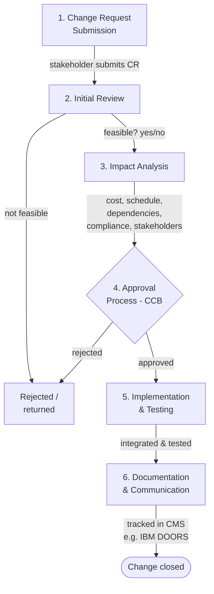

# Change Management & Continuous Validation — Fundamentals

## Recall first

Attempt these from memory before reading (answers at the bottom):

1. What are the five steps of impact analysis?
2. In the change control process, who makes the final decision to approve a change, and at which phase?
3. What does "shift-left testing" mean, and what does it buy you?

## Overview

A system that ships is not a system that stops changing — and an uncontrolled change can silently break something that already worked, violate a regulation, or blow the schedule (source: m4-change). **Change management** ensures that any modification to a system is *evaluated, approved, and documented* to prevent unintended consequences, maintaining system integrity, traceability, and compliance throughout the lifecycle (source: m4-change). The mental model has two halves that meet on every change: a **governance loop** — analyze the impact, get a board to approve, implement, document — and a **validation loop** — continuous, automated testing that runs on every commit so defects surface the moment they are introduced rather than at the end (source: m4-change). The first half asks *should we make this change and what does it touch*; the second asks *did this change break anything* — over and over, cheaply.

## Detailed explanations

### Impact analysis — the 5 steps

**Impact analysis** evaluates how a proposed change affects system performance, cost, schedule, and dependencies; it enables informed decisions by surfacing potential risks and side effects *before* a change is approved (source: m4-change). The five steps, in order (source: m4-change):

1. **Identify change scope** — what components or subsystems are affected?
2. **Assess risks and dependencies** — will the change introduce performance issues or impact other modules?
3. **Estimate cost and schedule impact** — how much time and budget will the change require?
4. **Evaluate compliance and safety risks** — does the change affect regulatory or safety requirements?
5. **Review stakeholder input** — get feedback from engineers, users, and managers (source: m4-change).

The {{c1::impact analysis}} is done first because it prevents costly mistakes by evaluating system-wide effects before approving changes (source: m4-change). Predict before reading: for a UI tweak, which of the five steps would catch an accessibility-compliance problem? (Step 4.)

### Approvals & the change control process — the 6 phases

After impact analysis, the change needs **approval** — and this is *not* done by a lone stakeholder or engineer. Companies have **change control boards or authorities** that approve changes upon review, so only necessary, well-justified, and properly analyzed changes are implemented (source: m4-change). A typical change control process has six phases (source: m4-change):

1. **Change Request Submission** — a stakeholder submits a **Change Request (CR)** with details (e.g., swapping a car-engine component to overcome supply issues).
2. **Initial Review** — the request is evaluated superficially for feasibility: is this possible, yes or no?
3. **Impact Analysis** — engineers assess the impact on cost, schedule, and technical feasibility (the 5 steps above).
4. **Approval Process** — the change is reviewed by a **Change Control Board (CCB)** or relevant authority, which makes the **final decision**.
5. **Implementation & Testing** — if approved, the change is integrated and tested.
6. **Documentation & Communication** — all documentation is updated and stakeholders are notified (source: m4-change).

### Change Control Board & configuration management

The **Change Control Board (CCB)** is the authority inside the company that reviews the impact analysis and makes the final go/no-go decision (source: m4-change). The whole process is tracked with **configuration management software (CMS)**, which maintains system integrity by *preventing unauthorized modifications* and ensuring each change is properly documented (source: m4-change). In big companies, configuration-management tools such as **IBM DOORS** are used to ensure regulatory compliance (source: m4-change). In one line: a structured change-approval process ensures modifications are justified and controlled, and configuration management maintains system integrity, version control, and compliance (source: m4-change). (Requirement-level traceability that DOORS also supports is covered in [07-requirements-management](../07-requirements-management/fundamentals.md), not re-taught here.)

### Change management tools — no single tool fits all

Large-scale change management needs structured processes, collaboration, and traceability, so it is "almost a rule" that industries use change-management software to follow their internal processes (source: m4-changemgmt). The tools cluster by domain (source: m4-changemgmt):

| Domain | Tools |
| :-- | :-- |
| Agile software teams | JIRA, Azure DevOps, GitHub/GitLab (git-based) |
| Complex systems engineering | IBM Engineering Workflow Management (EWM), Windchill, Helix ALM (Perforce) |
| Enterprise IT change control | ServiceNow, BMC Remedy |
| Risk & impact analysis | Ansys ModelCenter, SAP CTS |

They exist in many forms because different industries, teams, and workflows have unique needs — a software team relies on JIRA and GitHub, while an aerospace team needs IBM EWM and Windchill for complex-system traceability (source: m4-changemgmt). The key takeaway: **no single tool fits all** — choose the one that aligns with your process complexity, compliance needs, and collaboration model, and that integrates seamlessly into your existing workflows (source: m4-changemgmt).

### Continuous testing in Agile

**Continuous testing** integrates automated and manual testing into *every phase* of the development lifecycle, rather than treating testing as a discrete end-of-cycle phase; its goal is rapid, ongoing feedback on quality so teams detect and fix defects as soon as they are introduced (source: m4-change). The five main principles (source: m4-change):

| Principle | What it means |
| :-- | :-- |
| **Shift-Left Testing** | Tests (unit, integration, even acceptance) are defined and often automated *before or alongside* code, moving quality checks earlier in the cycle. |
| **Test Automation in CI/CD** | A suite of automated tests (unit, integration, end-to-end, performance, security) runs on every commit, pull request, or nightly build via Continuous Integration / Continuous Deployment pipelines. |
| **"Fail Fast" Feedback** | Immediate reporting of failures prevents defect accumulation, reduces debugging scope, and speeds up resolution. |
| **Environment Consistency** | Test environments are provisioned "as code" (containers, virtual machines) so tests always run against known, reproducible configurations. |
| **Service Virtualization** | When dependent services or hardware aren't yet available, lightweight simulators or mocks stand in, allowing tests to execute without blocking. |

The overarching goal is to identify and resolve defects early to prevent costly rework later (source: m4-change).

### Test types in Agile

Agile uses several test types, layered from smallest to largest scope (source: m4-change):

- **Unit testing** — tests individual components/modules for correctness; typically automated with frameworks like JUnit, PyTest, or Google Test.
- **Integration testing** — tests how components interact; ensures APIs, databases, and third-party services integrate correctly.
- **System testing** — validates the system as a whole against functional and non-functional requirements; includes performance, security, and usability testing.
- **Regression testing** — ensures new changes don't break existing functionality; performed frequently in Agile sprints, with automated regression tests maintaining stability.
- **User acceptance testing (UAT)** — end-users validate whether the system meets real-world needs; manual or automated depending on complexity (source: m4-change).

(The full catalogue of V&V methods and test types lives in [16-verification-validation-methods](../16-verification-validation-methods/fundamentals.md); they are reused here as the pipeline's building blocks.)

### Best practices for continuous testing

Always define acceptance or **behavior-driven (BDD) tests before writing the corresponding code**, then automate tests by layer and purpose (source: m4-change):

| Layer | Purpose | Speed |
| :-- | :-- | :-- |
| Unit Tests | Verify individual functions/modules | Very Fast |
| Integration Tests | Check interactions between components | Fast |
| End-to-End Tests | Validate full user workflows | Slower |
| Performance/Security | Assess non-functional requirements | Varies |

For **each commit**: build the code, run unit tests, execute integration and smoke tests, generate reports, and (optionally) deploy to a staging environment (source: m4-change). Developers integrate small changes often, reducing merge conflicts and ensuring tests validate each incremental update — but while automation covers the bulk, dedicated manual testing sessions sometimes uncover edge cases and usability issues (source: m4-change).

## Concept breakdowns

**Impact analysis vs the change control process.** *Definition:* impact analysis evaluates how a proposed change affects performance, cost, schedule, and dependencies (source: m4-change); the change control process is the full 6-phase workflow from request to documentation (source: m4-change). *Why it matters:* impact analysis is *one phase* (phase 3) *inside* the larger process — it produces the evidence the CCB needs to decide. *Common confusion:* treating "doing an impact analysis" as the whole approval workflow — it is only the analysis step that feeds the board.

**Change Control Board (CCB).** *Definition (source wording):* the change control board or authority inside the company that reviews the change and makes the final decision, ensuring only necessary, well-justified, and properly analyzed changes are implemented (source: m4-change). *Why it matters:* it removes unilateral change — no single stakeholder or engineer approves a change alone. *Simplest instance:* a CR to swap a car-engine component goes to the CCB after impact analysis; the CCB decides go/no-go. *Common confusion:* thinking the engineer who runs the impact analysis also approves it — the CCB does.

**Shift-left testing.** *Definition:* defining and automating tests before or alongside code, moving quality checks earlier in the cycle (source: m4-change). *Why it matters:* it identifies and resolves defects early to prevent costly rework later (source: m4-change). *Simplest instance:* writing a BDD acceptance test before implementing the feature (source: m4-change). *Common confusion:* mistaking shift-left for "test more" — it is about *when* you test (earlier), not just volume.

**Continuous testing vs traditional end-of-cycle testing.** *Definition:* continuous testing runs automated + manual tests in every phase via CI/CD with fail-fast feedback (source: m4-change); traditional testing treats testing as a discrete, end-of-cycle phase (source: m4-change). *Why it matters:* end-of-cycle testing lets defects accumulate until they are expensive; continuous testing catches them per commit. *Common confusion:* equating "we have automated tests" with "continuous testing" — continuous means they run on every commit/PR/build, not occasionally.

## How it fits together (diagram)

The fundamentals diagram is the 6-phase change control process: a change request flows through review, impact analysis, the CCB decision (which can reject), then implementation+testing and documentation.

The diagram shows impact analysis (phase 3) feeding the CCB decision (phase 4); only an approved change reaches implementation+testing and final documentation, with the whole flow tracked in configuration-management software (source: m4-change).

## Real-world use cases & industry applications

- **Payment / e-commerce checkout UI changes** — redesigning a checkout screen (moving the payment-method selector, adding icons) is traced to front-end components, estimated, and risk-assessed in an Impact Analysis Report before CCB approval; the "Submit Payment" button move is the worked exercise (source: m4-change, m4-ex-impact).
- **Automotive supply changes** — a CR to swap a car-engine component to overcome supply issues flows through the change control process (source: m4-change).
- **Aerospace / regulated industries** — use IBM EWM and Windchill for complex-system traceability and IBM DOORS for regulatory compliance (source: m4-changemgmt, m4-change).
- **WhatsApp large-scale change management** — the source points to the WhatsApp case in the lesson video as a real example of managing changes in a large-scale system; the written material does not detail it (source: m4-changemgmt).

## Best practices

- **Run all five impact-analysis steps before approving any change** — buys system-wide visibility and prevents costly mistakes from unseen side effects (source: m4-change).
- **Route every change through a CCB, never a lone approver** — buys that only necessary, well-justified, properly analyzed changes are implemented (source: m4-change).
- **Track every change in configuration-management software** — buys integrity (no unauthorized modifications), version control, and compliance (source: m4-change).
- **Choose a change-management tool that fits your domain and compliance needs** — buys traceability and minimal disruption because no single tool fits all (source: m4-changemgmt).
- **Define BDD/acceptance tests before writing code (shift-left)** — buys early defect detection and prevents costly late rework (source: m4-change).
- **Automate tests by layer and run them on every commit** — buys fast incremental feedback and fewer merge conflicts from small, frequent integration (source: m4-change).
- **Provision test environments "as code"** — buys reproducible runs against known configurations (source: m4-change).

## Common pitfalls

- **Skipping compliance/safety in impact analysis** — *fix:* make step 4 (evaluate compliance and safety risks) mandatory; a UI change can still break accessibility compliance (source: m4-change, m4-ex-impact).
- **Approving on impact analysis alone, bypassing the CCB** — *fix:* impact analysis only *feeds* the CCB decision (phase 4); the board still decides (source: m4-change).
- **Treating testing as an end-of-cycle phase** — *fix:* shift left and run automated tests in CI/CD on every commit for fail-fast feedback (source: m4-change).
- **Forgetting to update automated UI tests before deploying a UI change** — *fix:* tests that reference element positions will fail; update them as part of the change, not after (source: m4-ex-impact, m4-change).
- **Letting defects accumulate to "fix later"** — *fix:* fail fast — immediate failure reporting reduces debugging scope and speeds resolution (source: m4-change).
- **Assuming automation covers everything** — *fix:* keep dedicated manual testing sessions for edge cases and usability issues (source: m4-change).
- **Picking a tool by popularity, not fit** — *fix:* match the tool to process complexity, compliance, and collaboration model (source: m4-changemgmt).

## Frequently asked questions

**Is impact analysis the same as the change control process?** No — impact analysis is one phase (phase 3) inside the 6-phase process; it produces the evidence the CCB uses to decide (source: m4-change).

**Who approves a change?** A Change Control Board (CCB) or relevant authority — not a single stakeholder or engineer (source: m4-change).

**What's the difference between change management here and in topic 07?** [07-requirements-management](../07-requirements-management/README.md) handles change at the *requirement* level (5-phase requirement change process, traceability); this topic handles system-wide impact analysis, tooling, and continuous validation. Don't re-learn traceability types here.

**Is there one best change-management tool?** No — no single tool fits all; pick by domain, compliance needs, and how it integrates with your workflow (source: m4-changemgmt).

**How is continuous testing different from "having tests"?** Continuous testing runs automated (and some manual) tests in *every phase*, on every commit/PR/build, with fail-fast feedback — not as a one-off end-of-cycle activity (source: m4-change).

## References & further reading

- m4-change — *Manage system changes and continuous validation* (5-step impact analysis, payment-app UI example, 6-phase change control process, CMS/IBM DOORS, continuous-testing principles, test types, best practices).
- m4-changemgmt — *Change management* (change-management tools by domain, "no single tool fits all," WhatsApp case pointer).
- m4-ex-impact — *Exercise: Perform impact analysis* ("Submit Payment" button-move impact analysis).
- Cross-topic: requirement-level change → [07-requirements-management](../07-requirements-management/README.md); V&V methods & test types → [16-verification-validation-methods](../16-verification-validation-methods/README.md); test plans/cases → [17-test-plans-cases](../17-test-plans-cases/README.md).
- Glossary: [../../references.md#glossary](../../references.md#glossary).

---

## Answers

1. **The five impact-analysis steps:** (1) Identify change scope, (2) Assess risks and dependencies, (3) Estimate cost and schedule impact, (4) Evaluate compliance and safety risks, (5) Review stakeholder input (source: m4-change).
2. **The Change Control Board (CCB)** makes the final decision, at **phase 4 (Approval Process)** of the change control process — after impact analysis has been done (source: m4-change).
3. **Shift-left testing** means defining and automating tests before or alongside code, moving quality checks earlier in the cycle; it buys early identification and resolution of defects, preventing costly rework later (source: m4-change).

---

> Forgetting-curve nudge: revisit this page within 24 hours, then again in ~3 days and ~1 week — re-attempt the Recall-first questions before re-reading. [OUTSIDE MATERIAL]
