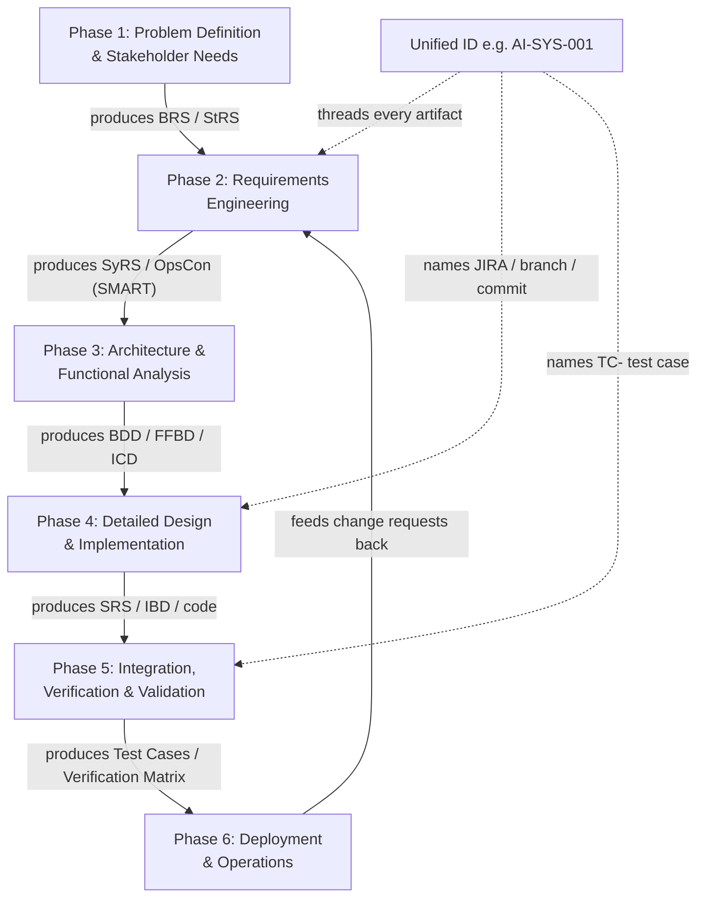

# Agile Systems Engineering Playbook (Capstone) — Fundamentals

## Recall first

Attempt these from memory before reading; answers at the bottom.

1. What single mechanism makes a stakeholder need traceable all the way to a passing test? (Hint: it starts with an ID.)
2. In Agile SE, what happens in **Sprint 0** that does not happen in a delivery sprint?
3. When would you collapse StRS and SyRS into one document instead of maintaining the full ISO 29148 suite?

## Overview

The playbook solves one problem: a full systems-engineering lifecycle produces many artifacts (needs, requirements, models, code, tests) in many tools (JIRA, GitLab, ReqView, SysML), and without discipline these drift apart so no one can answer "which test proves this requirement, which was born from which need?". The solution is a **unified ID system** running across every tool plus an **Agile workflow** that delivers the lifecycle incrementally in sprints — together giving **end-to-end traceability** from need to verified, validated system (source: playbook). This file is a map, not a re-teaching: each concept's home topic is linked where it appears.

## Detailed explanations

### Unified ID system & end-to-end traceability

To maintain end-to-end traceability, the playbook uses **one ID convention across all tools** so an artifact's lineage is readable from its name alone (source: playbook). The naming table:

| Artifact | Naming Convention | Example |
| :--- | :--- | :--- |
| **Requirements** | `[Project]-[Type]-[Number]` | `AI-SYS-001` (System), `AI-USR-012` (User) |
| **JIRA Issues** | `[Type]: [Requirement ID] - [Action]` | `Story: AI-SYS-001 - Implement Data Ingestion` |
| **GitLab Branch** | `feature/[JIRA-ID]-[Short-Description]` | `feature/PROJ-101-data-ingest` |
| **GitLab Commit** | `[JIRA-ID]: [Brief Description]` | `PROJ-101: added validation logic` |
| **Test Cases** | `TC-[Requirement-ID]-[Action]` | `TC-AI-SYS-001-IngestionTest` |

(source: playbook)

The requirement ID is the spine: it appears inside the JIRA title, the branch name, the commit message, and the test-case ID, so a single grep on `AI-SYS-001` surfaces its story, its code, and its test. The traceability rule is concrete: **every JIRA Story must link back to a requirement ID in the SyRS**, and **commit messages must reference the Requirement ID or JIRA ID** (source: playbook). The concept of traceability itself is owned by [topic 07](../07-requirements-management/fundamentals.md); here it is operationalized through naming.

The artifacts live in a fixed **GitLab folder structure** (source: playbook):

- `/docs` — Specifications (StRS, SyRS, SRS) and Interface Control Documents (ICD)
- `/models` — SysML/architecture files (BDDs, IBDs)
- `/src` — Implementation code
- `/tests` — Test plans and automated scripts
- `/mgmt` — Change logs and decision matrices

### Agile workflow integration

Instead of a single "Big Bang" design phase, the playbook spreads SE work across sprint types (source: playbook):

- **{{c1::Sprint 0}}** (Concept/Foundation): define the StRS, a high-level BDD, and an initial SyRS — the architectural runway before feature delivery starts.
- **Delivery Sprints**: each runs the mini-cycle **Analysis → Detailed Design → Build → Unit/Integration Test** for a specific set of requirements.
- **Hardening Sprints**: focus on System Validation and final UAT (User Acceptance Testing).

The iteration model these sprints implement (Agile vs V-Model vs Waterfall) is owned by [topic 03](../03-lifecycle-models/fundamentals.md).

### The six lifecycle phases → artifacts & tools

The operational core: each phase has a purpose, deliverables, and tools (source: playbook). Concepts are linked, not re-taught.

| Phase | Purpose | Deliverables | Tools / notes |
| :-- | :-- | :-- | :-- |
| **1. Problem Definition & Stakeholder Needs** | Understand the "Why"; stakeholder buy-in | **BRS** (Business Requirements), **StRS** (Stakeholder Requirements) | JIRA Epics; GitLab hosts the Markdown. Gate: sign-off on Architecture Vision. Elicitation → [topic 05](../05-requirements-elicitation-analysis/fundamentals.md) |
| **2. Requirements Engineering** | Define "What" the system must do | **SyRS**, **OpsCon** | Apply **SMART** → [topic 06](../06-verifying-requirements/fundamentals.md); **ReqView** → [topic 07](../07-requirements-management/fundamentals.md); JIRA Stories |
| **3. Architecture & Functional Analysis** | High-level structure and logic flow | Architecture model; **ICD** overview | **BDD/FFBD** → [topic 08](../08-sysml-modeling/fundamentals.md); **Trade-off / Decision Matrix** → [topic 12](../12-design-tradeoffs/fundamentals.md), [topic 13](../13-decision-matrix/fundamentals.md); ICD → [topic 14](../14-documenting-architecture/fundamentals.md); Visual Paradigm; frameworks → [topic 11](../11-architecture-frameworks/fundamentals.md) |
| **4. Detailed Design & Implementation** | Implementable blueprints; build | **SRS**, schematics, source code | **IBD/Sequence** → [topic 08](../08-sysml-modeling/fundamentals.md); GitLab CI/CD runs unit tests; branch from JIRA ID |
| **5. Integration, V&V** | Built right (verify) + right system (validate) | **Test Cases**, Test Reports, **Verification Matrix** | Incremental integration → [topic 15](../15-integration-strategies/fundamentals.md); methods → [topic 16](../16-verification-validation-methods/fundamentals.md); test plans → [topic 17](../17-test-plans-cases/fundamentals.md); Testomat. Gate: 100% requirement coverage |
| **6. Deployment & Operations** | Release and maintain performance | User Manuals, Training Material, Maintenance Logs | Migration planning (Blue-Green); monitor uptime/resource use; GitLab CI/CD deploy |

### Governance & scalability

The same playbook scales up or down by **process level** (source: playbook):

- **Minimum Viable (small projects):** combine StRS/SyRS into one document; use JIRA for traceability; focus on Unit and User Acceptance testing.
- **Formal (critical/large projects):** full **ISO 29148** suite; **MBSE** with Cameo/Visual Paradigm; a formal **Change Control Board (CCB)** and bidirectional traceability.

The ISO 29148 document family is owned by [topic 04](../04-se-tools-techniques/fundamentals.md); CCB and impact analysis by [topic 18](../18-change-management-continuous-validation/fundamentals.md).

### Reusable checklists

**Requirement Quality (SMART)** (source: playbook):
- [ ] Specific (no "fast," "responsive")?
- [ ] Measurable (units, quantities)?
- [ ] Testable (can we write a pass/fail case)?

**Change Management (Impact Analysis)** (source: playbook):
- [ ] Scope: which requirements/modules are affected?
- [ ] Risk: does this break existing functionality (Regression)?
- [ ] Traceability: have design, code, and tests been updated?

### Summary of document purposes

| Document | Purpose |
| :--- | :--- |
| **BRS/StRS** | Captures the "Why" and stakeholder vision |
| **SyRS/SRS** | Technical "What" for systems and software |
| **OpsCon** | Describes real-world usage scenarios |
| **ICD** | The "contract" for how subsystems talk to each other |
| **Test Plan** | The overall strategy for proving the system works |

(source: playbook)

## Concept breakdowns

**End-to-end traceability** — *Definition (source wording):* maintaining linkage "across all tools" via a unified ID system so a requirement connects to its JIRA story, code, and test (source: playbook). *Why it matters:* without it, you cannot prove coverage or assess change impact. *Simplest instance:* `AI-SYS-001` appears in the SyRS, the JIRA Story title, the branch, the commit, and `TC-AI-SYS-001-IngestionTest`. *Common confusion:* traceability is not a document — it is the consistent reuse of one ID, enforced by the linking rules.

**Verification matrix** — *Definition:* the artifact in Phase 5 whose success gate is "100% requirement coverage" (source: playbook). *Why it matters:* it is the closure check — every requirement maps to a test that proves it. *Simplest instance:* a table with one row per requirement ID and the TC that verifies it. *Confusion:* coverage of *requirements*, not coverage of *code lines*. Verification methods are owned by [topic 16](../16-verification-validation-methods/fundamentals.md).

**Sprint 0 vs hardening sprint** — *Definition:* Sprint 0 builds the foundation (StRS, high-level BDD, initial SyRS); hardening sprints do System Validation and final UAT (source: playbook). *Why it matters:* they bracket the delivery sprints — runway at the front, validation at the back. *Confusion:* delivery sprints already do unit/integration *verification* internally; hardening adds end-to-end *validation*.

## How it fits together (diagram)

The diagram below shows the six phases and the artifact each emits; the prose above walks each phase.

## Real-world use cases & industry applications

The playbook itself is the worked use case via the **Smart Home AI Security** thread (source: playbook), detailed in [examples.md](examples.md): a need ("feel safe knowing my front door is monitored") becomes requirement `AI-SYS-101`, a JIRA story, a BDD, an ICD (RTSP camera stream), code on `feature/AI-SYS-101-yolo`, test case `TC-AI-SYS-101`, and finally user validation.

## Best practices

- Reuse the **requirement ID as the spine** of JIRA, branch, commit, and test-case names — buys single-grep traceability (source: playbook).
- Run **Sprint 0** before delivery sprints — buys an architectural runway so features don't fork incompatible designs (source: playbook).
- Require **every JIRA Story to link to a SyRS requirement ID** — buys no orphan work (source: playbook).
- Match **process level to project criticality** (Minimum Viable vs Formal) — buys proportionate overhead (source: playbook).
- Gate Phase 5 on **100% requirement coverage in the verification matrix** — buys provable completeness (source: playbook).

## Common pitfalls

- **Inventing per-tool IDs** instead of reusing the requirement ID. Fix: enforce the naming table in CI and code review (source: playbook).
- **Skipping Sprint 0** and starting feature sprints with no StRS/high-level BDD. Fix: treat StRS + high-level BDD + initial SyRS as Sprint 0's definition of done (source: playbook).
- **Confusing verification with validation** in Phase 5. Verification = built right; validation = right system. Fix: keep both — unit/integration verify, hardening/UAT validate (source: playbook).
- **Over-engineering a small project** with the full ISO 29148 suite and a CCB. Fix: drop to Minimum Viable — merge StRS/SyRS, use JIRA for traceability (source: playbook).
- **Writing unmeasurable requirements** ("fast", "responsive"). Fix: run the SMART checklist; demand units and a pass/fail test (source: playbook).

## Frequently asked questions

**Is this Agile or Waterfall?** Agile — work is delivered in Sprint 0 + delivery + hardening sprints, not a single big-bang design phase (source: playbook). The iteration models live in [topic 03](../03-lifecycle-models/fundamentals.md).

**Where do the documents physically live?** In the GitLab repo: specs and ICDs in `/docs`, SysML in `/models`, code in `/src`, tests in `/tests`, change logs and decision matrices in `/mgmt` (source: playbook).

**What's the difference between BRS/StRS and SyRS/SRS?** BRS/StRS capture the "Why" and stakeholder vision; SyRS/SRS are the technical "What" for systems and software (source: playbook).

**When do I need a CCB?** At the Formal process level for critical/large projects, alongside the full ISO 29148 suite and bidirectional traceability (source: playbook). CCB mechanics → [topic 18](../18-change-management-continuous-validation/fundamentals.md).

## References & further reading

- `playbook` — *Agile Systems Engineering Playbook* (the single source for this topic): sections 1 (Foundation), 2 (Lifecycle Phases), 3 (Governance & Scalability), 4 (Smart Home example), and the Document Purposes summary.
- For any concept this playbook references, see its home topic linked inline above. Glossary: [references.md#glossary](../../references.md#glossary).

---

## Answers

1. The **unified ID system** — reusing one requirement ID (e.g. `AI-SYS-001`) inside the JIRA story, GitLab branch/commit, and test-case name, so the lineage is readable across all tools (source: playbook).
2. **Sprint 0** defines the StRS, a high-level BDD, and the initial SyRS — the foundation/runway. Delivery sprints instead run Analysis → Detailed Design → Build → Unit/Integration Test for specific requirements (source: playbook).
3. At the **Minimum Viable** process level for a small project: combine StRS/SyRS into one document and use JIRA for traceability, focusing on unit and user-acceptance testing (source: playbook).

---

> Forgetting-curve nudge: this is the integration map — re-derive the six-phase artifact chain from memory tomorrow, then in 3 days, then in a week. [OUTSIDE MATERIAL]
