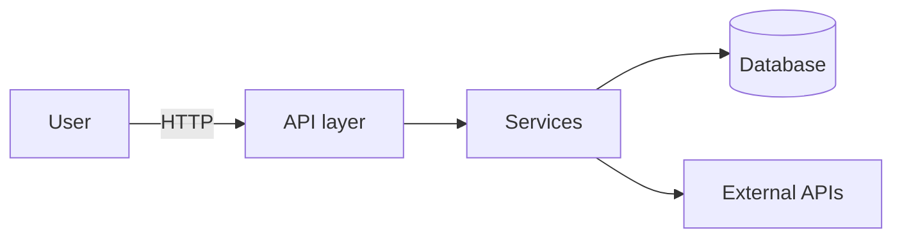
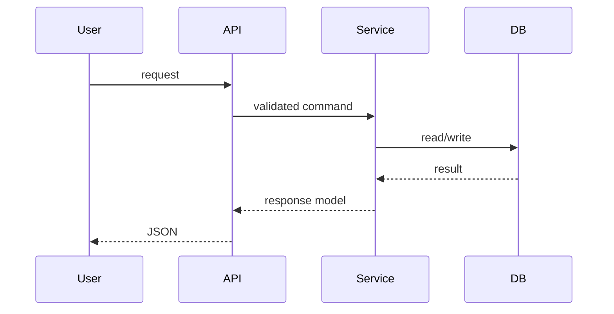

# The Master Playbook — Building a Senior-Engineer AI Coding Agent

> The capstone of the `AI_CODING/_GUIDES/` series. It synthesizes the seven folder guides (Agentic Coding, Context Engineering, AI Agents, Agent Skills, Evals, Testing & QA, AIOps & Observability) into one prioritized set of daily practices, and defines a complete AI-first repository structure — the `.ai/`, `.claude/`, and `.human/` trees. This document gives a one-line purpose for every file and inlines the starter templates for the three required files; a copy-ready scaffold with a template or example for *every* file (plus the wired `.claude/settings.json`) lives in `repo-scaffold/` next to this document.

**The goal this whole system serves:** an AI coding agent that behaves like a senior engineer with persistent context — one that understands the codebase and architecture, holds long-term project memory, knows what's done / in progress / next in a fresh session, and follows consistent standards without being re-told. The mechanism, in one sentence: **the repository, not the chat session, is where understanding and state live** — so humans and agents stay synchronized and lose minimal context across the software lifecycle.

---

## Part 1 — The daily practices

### The six laws (what every folder agreed on)

Read these as the invariants behind every specific tactic below.

1. **The repo is the memory; the session is disposable.** Anything that must survive a session lives in a versioned file — state, decisions, plans, standards, learnings. `/clear` freely; a fresh agent should resume cold from files in one read. (Context Engineering, AI Agents, Agentic Coding)
2. **Verification is the ceiling and the product.** An agent is only as good as the check it can run against its own work. Give every task a runnable, pass/fail signal; verify end-state, not the agent's claim of success. (Agentic Coding, Evals, Testing & QA, AIOps)
3. **Enforce, don't instruct.** Prompt rules decay as context fills; hooks, CI gates, and read-only paths don't. Put must-happen behavior in deterministic mechanisms, not in prose the model can reason around. (Testing & QA, Agent Skills, Context Engineering)
4. **Context is a curated budget, not a container to fill.** Every token competes for attention; models degrade as input grows ("context rot"). Prune ruthlessly, load on demand (progressive disclosure), isolate heavy work in subagents. (Context Engineering, AI Agents)
5. **Match rigor and autonomy to blast radius.** Throwaway → prompt; daily work → plan file; complex/multi-dev → full spec. Single agent by default; multi-agent only on a real trigger. Autonomy scales with reversibility, never with raw capability. (Agentic Coding, AI Agents, AIOps)
6. **The system is the asset, not any session.** Fold every failure back in: a recurring review finding becomes a standards line, agent drift becomes a rule, a good session becomes a skill, a production incident becomes a regression test. The harness compounds; sessions don't. (all seven)

### The daily loop — one unit of work, end to end

This is the explore → plan → code → verify → commit → fold-back loop with the whole series wired in:

1. **Orient (30 seconds).** Fresh session reads the entry point (`AGENTS.md`) → `.ai/project-state.md` (what's done / in progress / next) → the relevant `.ai/` docs the routing table points to. No re-explaining.
2. **Explore in plan mode.** Read-only investigation, or delegate to a subagent so exploration burns a separate context window and returns a summary.
3. **Right-size the plan.** One-sentence diff → skip planning. Daily change → a 1–2 page plan file you *edit* (the edit is the review gate). Complex/multi-session → the spec pipeline (EARS acceptance criteria — a structured "WHEN [event] THE SYSTEM SHALL [behavior]" requirement syntax — with vertical-slice tasks and a human gate per phase). Kill bad designs at the 200-line design-doc stage, not in a working PR.
4. **Write against a target.** Never "implement X" — always "implement X; here are the test cases; run them." For anything testable, TDD with the tamper detector: write failing tests → **commit them** → implement without touching them.
5. **Verify with evidence, not assertion.** Tests, typecheck, build, screenshot diff, or a fresh-context default-FAIL reviewer that verifies by *using* the artifact. Demand the output, the command run, the passing run — reviewing evidence is faster than re-running it.
6. **Commit and update state.** Descriptive commit; update `.ai/project-state.md`; if a decision was made, add a `.ai/decisions/` entry.
7. **Fold back.** If the agent drifted, add a rule or hook. If you explained something a third time, write it down. If a session pattern was good, save it as a skill.

### If you do only five things this week

Ranked by leverage — these are the load-bearing subset of the 70 folder-playbook actions:

1. **Give every task a runnable check.** If you can't name the check, you're the verification loop — fix that before anything else. (The single highest-leverage habit in the entire series.)
2. **Stand up `.ai/project-state.md`** and keep it current — it's what makes a fresh session pick up where the last left off. (See Part 2.)
3. **Keep the entry point tiny**: `AGENTS.md` a ~60-line router into `.ai/`, `CLAUDE.md` importing it (both under a 200-line hard ceiling). Move procedures to skills and must-happen rules to hooks; add the "read relevant docs before starting" routing line.
4. **Install two hooks**: a Stop hook that blocks the turn until checks pass, and a PostToolUse hook that streams test/lint output after edits. Enforcement over instruction.
5. **Start a decision log.** Dated Chose / Why / Rejected entries stop agents from re-proposing designs you already ruled out — precedent, not just facts.

### The next ten (once the five are habitual)

6. **Make TDD tamper-proof and tests read-only for implementers** (permission denies on test paths + shell bypasses; CI check that tests didn't change between the test commit and the fix).
7. **Adopt the placement discipline**: facts → entry point; procedures → skills; guarantees → hooks; isolation → subagents; connectivity → MCP; determinism → scripts.
8. **Read 20 failing traces and count failure categories** before building any eval; write the first *code-graded* eval from the most frequent one.
9. **Wire the failure→regression flywheel**: every confirmed production or eval failure becomes a versioned golden-dataset case on a path-triggered CI gate, so it can't silently return.
10. **Use the retrieval rubric**: agentic grep by default; add a code-trained semantic index past ~1K files; a code-graph tool for "who calls this"; vector RAG only for prose.
11. **Build the ratchet**: one `scripts/check` shared by hooks and CI; add a lint rule for every agent shortcut you catch.
12. **Gate AI-written tests on mutation score, not coverage**, and run the 6-point review checklist starting with "prove it can fail."
13. **Verify end-state, not claims**, in production: read-after-write against the system of record; classify web/tool results before the model trusts them.
14. **Scale deliberately**: `claude --worktree` for parallel sessions and a sandboxed, iteration-capped Ralph loop (a fresh-context `while` loop that drains a ticket queue autonomously) for backlog work — never more agents than you can actually read.
15. **Re-run error analysis and re-audit the harness every 2–4 weeks / every model release** — delete scaffolding newer models no longer need; the eval suite and the rules are living specs, not monuments.

### Continuous rituals

- **Weekly:** prune auto-memory; skim outlier production traces; run the "did I explain anything twice?" pass and codify it.
- **Per model release:** re-audit every harness component ("name the failure it prevents, or delete it"); re-validate judges; re-tune per-family prompts.
- **Per merge:** doc-drift check (code changed → do docs need updating?); regression suite on the golden set.
- **Never:** trust "tests passed" as understanding; run more parallel agents than you can review; let a fix ship without a regression artifact and a trace back to the failure it fixes.

---

## Part 2 — The AI-first repository structure

The design principle: **four layers, each with one job.**

```
repo/
├── AGENTS.md          ← ENTRY POINT. Tiny, vendor-neutral. Routes into .ai/.
├── CLAUDE.md          ← imports AGENTS.md + Claude-specific notes (or symlink)
├── .ai/               ← KNOWLEDGE + STATE layer. Human- and agent-readable.
├── .claude/           ← EXECUTION layer. Harness-native skills/agents/hooks.
└── .human/            ← HUMAN docs. Plain English, diagrams, runbooks.
```

Why the split: `.ai/` is the durable, portable, harness-agnostic brain (it works whether the agent is Claude Code, Codex, or Cursor); `.claude/` is where the *executable* skills, subagents, and hooks actually live because that's what the harness discovers; `.human/` is written for people. The entry point is deliberately tiny and does nothing but route — because every token in it loads on every request.

> **On the `.ai/` vs `.claude/` overlap:** the task brief asks for reusable skills, hooks, commands, and subagents under `.ai/`. Current Claude Code only auto-discovers those under `.claude/`. The reconciliation used here: **author and version** them under `.ai/` (the portable source of truth) and **execute** them from `.claude/` by symlinking `.claude/skills/<name>` → `.ai/skills/<name>` (Claude Code follows symlinks). Symlinking keeps `.ai/` authoritative; if your setup can't symlink, keep the real file in `.claude/` as a fallback — but then `.claude/` owns it. The scaffold ships example skills/agents/hooks under `.ai/`, a wired `.claude/settings.json`, and a README in each folder explaining the mapping.

### `.ai/` — documentation and state for AI agents

| File | One-line purpose |
|---|---|
| `.ai/README.md` | The map: what `.ai/` contains and the routing rule agents follow. |
| `.ai/project-state.md` | **[Required]** Live done / in-progress / next — the cold-start resume file. |
| `.ai/architecture.md` | **[Required]** Terse, agent-facing architecture: components, boundaries, invariants, file pointers. |
| `.ai/coding-standards.md` | **[Required]** Conventions and constraints, ideally each tied to an enforcement mechanism. |
| `.ai/workflow-rules.md` | How agents work in this repo: the loop, rigor rubric, what to do when blocked. |
| `.ai/decisions/` | Decision log (ADR-lite for agents): dated Chose / Why / Rejected, so rejected designs don't return. |
| `.ai/plans/` | Implementation plans, one per unit of work — the reviewable contract before code. |
| `.ai/memory/` | Index (`MEMORY.md`) + on-demand topic files of durable, learned facts. |
| `.ai/checklists/` | Reusable gates: pre-PR, code-review, release. |
| `.ai/prompts/` | Reusable prompt templates (grill-me, research→plan→implement). |
| `.ai/skills/` | Authoring source for reusable skills (execute from `.claude/skills/`). |
| `.ai/agents/` | Authoring source for subagents e.g. a default-FAIL verifier (execute from `.claude/agents/`). |
| `.ai/hooks/` | Hook scripts + a `settings.json` snippet wiring the enforcement gates. |

**Starter templates** for the three required files (compact — full versions in `repo-scaffold/.ai/`):

`project-state.md`:
```markdown
# Project State
_Last updated: [DATE] by [human|agent]. The source of truth for "where are we."_

## Now (in progress)
- [ ] [task] — owner: [name/agent] — [link to plan/branch] — blocked by: [none]

## Next (ready, prioritized)
1. [task] — why now: [reason]

## Done (recent, newest first)
- [DATE] [task] — [commit/PR]

## Known issues / debt
- [issue] — severity: [P?] — [link]

## Open questions for humans
- [question] — needs decision by: [when]
```

`architecture.md`:
```markdown
# Architecture (agent-facing)
_Terse. For humans, see .human/architecture.md. Update when a boundary changes._

## What this system is
[one paragraph]

## Components (name → responsibility → entry file)
- [component] — [what it owns] — `src/...`

## Invariants (never violate)
- [e.g. no business logic in route handlers; all DB access via repositories/]

## Data flow (request lifecycle)
[3–6 bullet steps]

## External dependencies & boundaries
- [service] — [why] — [wrapper/module]
```

`coding-standards.md`:
```markdown
# Coding Standards & Conventions
_Each rule names how it's enforced. Prose-only rules are advisory; prefer hooks/CI._

## Commands
- Test: `[cmd]`   Build: `[cmd]`   After changes: `[lint+typecheck cmd]`

## Language & style
- [rule] — enforced by: [eslint rule / hook / CI job]

## Architecture rules
- Prefer repetition over premature abstraction; extract only after the same shape
  appears 3+ times AND a human asks. — enforced by: review

## Testing
- TDD: failing test → commit → implement without editing tests. — enforced by: [tdd hook]
- Gate on mutation score, not coverage. — enforced by: [CI]

## Protected paths (never edit without human approval)
- `[auth/, payments/, migrations/, tests/]` — enforced by: PreToolUse hook
```

### `.human/` — documentation for developers (plain English)

| File | One-line purpose |
|---|---|
| `.human/README.md` | Landing page: what the project is, where to start. |
| `.human/architecture.md` | Narrative architecture with **Mermaid** diagrams a human can read at a glance. |
| `.human/onboarding.md` | Zero-to-productive guide: setup, first change, how to work with the agents here. |
| `.human/adr/` | Architecture Decision Records — the human-facing "why," dated and numbered. |
| `.human/features/` | Per-feature docs: what it does, how it works, where the code is. |
| `.human/troubleshooting.md` | Symptom → cause → fix for common failure modes. |
| `.human/runbooks/` | Operational procedures: deploy, rollback, incident response. |

**Starter template** for the diagram-bearing architecture doc (full set in `repo-scaffold/.human/`):

`.human/architecture.md`:
````markdown
# Architecture

## System overview


## Request lifecycle


## Components
### [Component] — `src/...`
[What it owns, key decisions, links to the relevant ADR and .ai/architecture.md section.]
````

### How the trees stay in sync (and honest)

- **Single source of truth per fact.** `.ai/architecture.md` (terse, for agents) and `.human/architecture.md` (narrative + diagrams, for people) describe the *same* system at different altitudes — a boundary change updates both, enforced by a doc-drift CI check.
- **State is agent-owned, decisions are human-gated.** Agents keep `project-state.md` current every session; humans own ADRs and the acceptance of decision-log entries.
- **The entry point routes; it doesn't duplicate.** `AGENTS.md` stays ~60 lines and points into `.ai/`; it never becomes the wiki.
- **Every standard names its enforcement.** A rule without a hook or CI gate behind it is a wish; the scaffold ships a wired `.claude/settings.json` (Stop-hook gate, PostToolUse feedback, protected-path guard) so the gates are real as soon as you point them at your project's `scripts/check`.

---

## The one-paragraph summary

Build the harness, not the prompt. Give every task a runnable check, keep all durable state and knowledge in versioned `.ai/` files that a fresh agent reads cold, enforce the non-negotiables with hooks and CI instead of asking nicely, match rigor and autonomy to blast radius, and fold every failure back into a rule, skill, or regression test. Do that, and each session starts where the last ended, the agent works to your standards without being re-told, and humans and AI stay synchronized across the whole lifecycle — which is the entire point.
